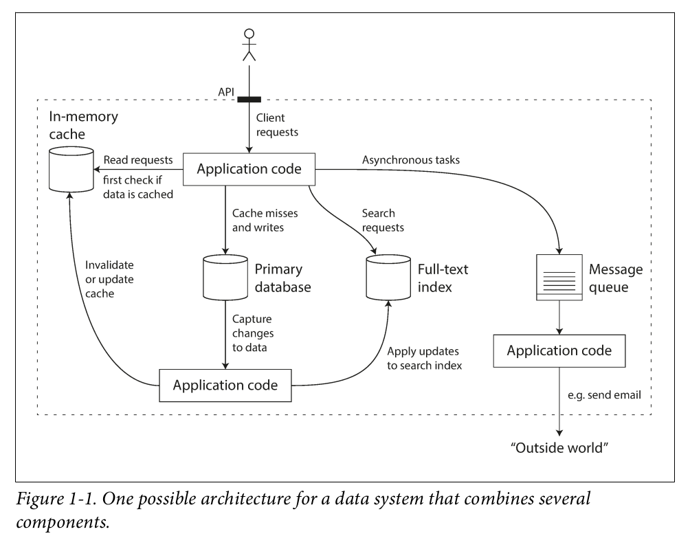

# DDIA - Designing Data-Intesive Applications

# Preface

- CPU clock speeds are barely increasing, but multi-core processors are standard, and networks are getting faster. This means parallelism is only going to increase.

- Many services are now expected to be highly available; extended downtime due to outages or maintenance is becoming increasingly unacceptable.

- “You’re not Google or Amazon. Stop worrying about scale and just use a relational database.” There is truth in that statement: building for scale that you don’t need is wasted effort and may lock you into an inflexible design. In effect, it is a form of premature optimization.

# Chapter 1. Reliable, Scalable, Maintainable

Many applications today are data-intensive, as opposed to compute-intensive. Applications need to:
- Store data so that they, or another application, can find it again later (databases)
- Remember the result of an expensive operation, to speed up reads (caches)
- Allow users to search data by keyword or filter it in various ways (search indexes)
- Send a message to another process, to be handled asynchronously (stream processing)
- Periodically crunch a large amount of accumulated data (batch processing)

A single tool can no longer meet all of its data processing and storage needs. The work is broken down into tasks that can be performed efficiently on a single tool, and those different tools are stitched together using application code.

For example, if you have an application-managed caching layer (using Memcached or similar), or a full-text search server (such as Elasticsearch or Solr) separate from your main database, it is normally the application code’s responsibility to keep those
caches and indexes in sync with the main database.

- **Reliability** The system should continue to work correctly even in the face of adversity
- **Scalability** As the system grows (in data volume, traffic volume, or complexity), there should be reasonable ways of dealing with that growth.

- **Maintainability** Over time, many different people will work on the system, maintaining current behavior and adapting the system to new usecases should be done easily.

System is reliable if it is robust to hardware, software and human erros.

There are situations in which we may choose to sacrifice reliability in order to reduce development cost (e.g., when developing a prototype product for an unproven market) or operational cost (e.g., for a service with a very narrow profit margin)

Scalability is the term we use to describe a system’s ability to cope with increased *load*.
Load can be described with load parameters. E.g:
- requests per second to a web server
- the ratio of reads to writes in a database
- the number of simultaneously active users in a chat room
- the hit rate on a cache, or something else

In a batch processing system such as Hadoop, we usually care about throughput—the number of records we can process per second, or the total time it takes to run a job on a dataset of a certain size.

Latency and response time are often used synonymously, but they are not the same. The response time is what the client sees: besides
the actual time to process the request (the service time), it includes network delays and queueing delays. Latency is the duration that a request is waiting to be handled—during which it is latent, awaiting service.

Common wisdom until recently was to keep your database on a single node (scale up) until scaling cost or high-availability requirements forced you to make it distributed.

An application has to meet various requirements in order to be useful. There are functional requirements (what it should do, such as allowing data to be stored, retrieved, searched, and processed in various ways), and some nonfunctional requirements (general properties like security, reliability, compliance, scalability, compatibility, and maintainability).

# Chapter 2 Data Models and Query Language

Data models shape not only on how the software is written, but also on how we think about the problem that we are solving.
Most applications are built by layering one data model on top of another Each layer hides the complexity of the layers
below it by providing a clean data model.

Data representation drives our system design solution.

Relational model: data is organized into relations (called tables in SQL), where each relation is an unordered collection
of tuples (rows in SQL).

SQL have been here from the 70s. No other storage tech has overthrown it.

NoSQL is the latest attempt to overthrow the relational model’s dominance. NoSQL can be:
- more scalable
- open source
- has special query operations
- much more dynamic and expressive data model than relational databases schema

A common criticism of the SQL data model: if data is stored in relational tables, an awkward **translation layer**
is required between the objects in the application code and the database model of tables, rows, and columns.

MySQL, PostgreSQL added support for structured data types (i.e hold JSON files in cells).

For a data structure like a résumé, which is mostly a self-contained document, a JSON representation can be quite appropriate.
**Document-oriented databases** like MongoDB, RethinkDB, CouchDB, and Espresso, support this data model.

**MapReduce** is a programming model for processing large amounts of data in bulk across many machines, popularized by Google.
