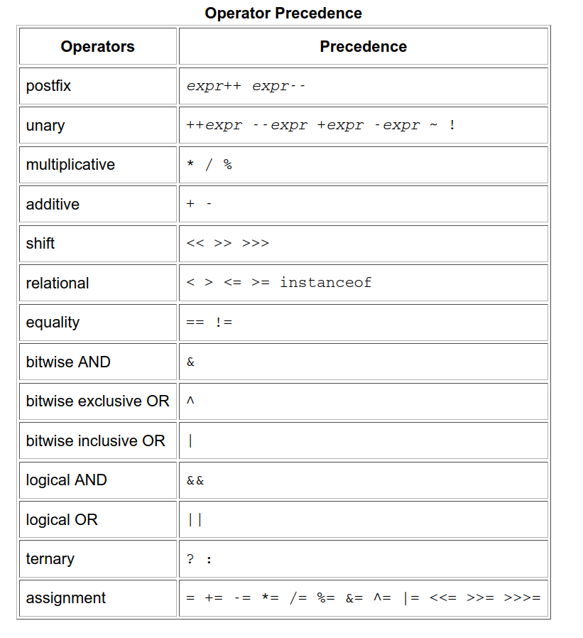
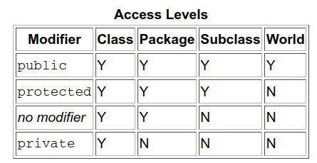

# Java Oracle docs
My notes on official java docs - book can be found in here [The Java Official Oracle Tutorial on Basics.pdf](https://github.com/ngocuong0105/algorithms/blob/main/Readings/Engineering/The%20Java%20Official%20Oracle%20Tutorial%20on%20Basics.pdf). The web tutorial is [here](https://docs.oracle.com/javase/tutorial/index.html).
and is recommended reading source.

##### Table of Contents  
[Chapter 1. Getting Started](#chap1)\
[Chapter 2 OOP Basics in Java](#chap2)\
[Chapter 3 Language Basics](#chap3)\
[Chapter 4 Classes and Objects](#chap4)\
[Chapter 5 Annotations](#chap5)\


<a name="chap1"/></a>

# Chapter 1. Getting Started
Through the Java VM, the Same Application is capable of Running on Multiple Platforms. "Write once run everywhere".
Java has compiler (create ```.class``` bytecode files) + interpreter (Java VM) (runs/interprets bytecode files).

A platform is the hardware or software environment in which a program runs -  Microsoft Windows, Linux, Solaris OS, and Mac OS.

The Java platform has two components:
- The Java Virtual Machine
- The Java Application Programming Interface (API) - libraries, packages


<a name="chap2"/></a>

# Chapter 2 OOP Basics in Java
An object is a software bundle of related state and behavior. Software objects are often used to model the real-world
objects that you find in everyday life. Object state is stored in its fields, object behavior is captured by its methods.

Bundling code into individual software objects provides a number of benefits, including:
- modularity
- information-hiding
- code reuse
- pluggability and debugging ease:

A class is a blueprint or prototype from which objects are created.
Classes of objects you create like Bicycle, Dog etc need not contain a main method as they are not your application.
In the Java programming language, each class is allowed to have one direct superclass, and each superclass has the
potential for an unlimited number of subclasses. Used **extend** keyword

Inheritance provides a powerful and natural mechanism for organizing and structuring your software.

An interface is a contract between a class and the outside world. When a class implements an interface, it promises to
provide the behavior published by that interface.


A package is a namespace for organizing classes and interfaces in a logical manner. Placing your code into packages
makes large software projects easier to manage. Conceptually, you can think of packages as being similar to different
folders on your computer


If your class claims to implement an interface, all methods defined by that interface must appear in its source code
before the class will successfully compile.

<a name="chap3"/></a>

# Chapter 3 Language Basics

Objects store their state in **fields**. Note it is a subset of **variables**.\
The Java programming language defines the following kinds of variables:
- Instance Variables (Non-Static Fields) = "non-static fields = fields declared without the static keyword
- Class Variables (Static Fields)
- Local variables (objects can have temporary fields, method can have temporary local variables).
- Parameters of functions/methods.

## Primitive Data Types:
- byte =  8-bit signed two's complement integer
- short = 16-bit signed two's complement integer
- int = 32-bit signed two's complement integer
- long = 64-bit signed two's complement integer
- float = a single-precision 32-bit IEEE 754 floating point.
- double = a double-precision 64-bit IEEE 754 floating point
- boolean = The boolean data type has only two possible values: true and false.
- char = single 16-bit Unicode character.


## Literals

Don't nee  the**new** keyword when initializing a variable of a primitive type.
A **literal** is the source code representation of a fixed value; literals are represented directly in your code
without requiring computation. As shown below, it's possible to assign a literal to a variable of a primitive type:

```
boolean result = true;
char capitalC = 'C';
byte b = 100;
short s = 10000;
int i = 100000;
```

An integer literal is of type long if it ends with the letter `L` or `l`; otherwise it is of type `int`.

Representation in other number systems:
```
<!-- The prefix 0x indicates hexadecimal and 0b indicates binary -->
// The number 26, in decimal
int decVal = 26;
//  The number 26, in hexadecimal
int hexVal = 0x1a;
// The number 26, in binary
int binVal = 0b11010;
```

The compiler will assign a reasonable default value for fields of the above types; for local variables, a default value
is never assigned. \
A literal is the source code representation of a fixed value. \
An array is a container object that holds a fixed number of values of a single type. The length of an array is
established when the array is created. After creation, its length is fixed.

## Operators




 The only difference is that the prefix version (++result) evaluates to the incremented value, whereas the postfix
 version (result++) evaluates to the original value. If you are just performing a simple increment/decrement, it doesn't
 really matter which version you choose. But if you use this operator in part of a larger expression, the one that you
 choose may make a significant difference.

 ```
class PrePostDemo {
    public static void main(String[] args){
        int i = 3;
        i++;
        // prints 4
        System.out.println(i);
        ++i;

        // prints 5
        System.out.println(i);

        // prints 6
        System.out.println(++i); // i becomes 6 and we print 5

        // prints 6
        System.out.println(i++); // i becomes 7 but prints 6

        // prints 7
        System.out.println(i);
    }
}
 ```

 ## Expressions, Statements, and Blocks

 An expression is a construct made up of variables, operators, and method invocations, which are constructed according
 to the syntax of the language, that evaluates to a single value.

 Statements are roughly equivalent to sentences in natural languages. A statement forms a complete unit of execution:
 assignment, return, any use of `++`, `--`, object creation. These are also called *expression statement*.

A block is a group of zero or more statements between balanced braces and can be used anywhere a single statement is allowed.

The statements inside your source files are generally executed from top to bottom, in the order that they appear.
**Control flow statements**, however, break up the flow of execution by employing decision making, looping, and branching,
enabling your program to conditionally execute particular blocks of code.

This section describes the decision-making statements (`if-then, if-then-else, switch`), the looping statements
(`for, while, do-while`), and the branching statements (`break, continue, return`) supported by the Java programming language.

The difference between `do-while` and while is that `do-while` evaluates its expression at the bottom of the loop instead
of the top. Therefore, the statements within the `do` block are always executed at least once

# Chapter 4 Classes and Objects

Simple class declaration:

```
class MyClass {
    // field, constructor, and 
    // method declarations
}
```
*class body* (the area between the braces) contains:
- constructors for initializing new objects
- declarations for the fields that provide the state of the class and its objects
- methods to implement the behavior of the class and its objects

More sophisticated class declaration:
```
class MyClass extends MySuperClass implements YourInterface {
    // field, constructor, and
    // method declarations
}
```
means that MyClass is a subclass of MySuperClass and that it implements the YourInterface interface.
Additionally you can add `public` or `private` at the very beginning of the class declaration.

## Variables
Variables can be:
- fields (member variables of the class, static or defined in the constructor)
- local variables (variables defined in a method or a block of code)
- parameters (variables in method declaration)

Field declarations are composed of three components, in order:
- Zero or more modifiers, such as public or private.
- The field's type.
- The field's name.
```
public int speed;
```

## Access Modifiers

- `public` modifier—the field is accessible from all classes.
- `private` modifier—the field is accessible only within its own class.

*In the spirit of encapsulation, it is common to **make fields private**.* Then you need to create *getter()* and *setters()*.

```
public class Bicycle {
        
    private int cadence;
    private int gear;
    private int speed;
        
    public Bicycle(int startCadence, int startSpeed, int startGear) {
        gear = startGear;
        cadence = startCadence;
        speed = startSpeed;
    }
        
    public int getCadence() {
        return cadence;
    }
        
    public void setCadence(int newValue) {
        cadence = newValue;
    }
        
    public int getGear() {
        return gear;
    }
        
    public void setGear(int newValue) {
        gear = newValue;
    }
        
    public int getSpeed() {
        return speed;
    }
        
    public void applyBrake(int decrement) {
        speed -= decrement;
    }
        
    public void speedUp(int increment) {
        speed += increment;
    }
}
```

## Defining Methods

**Definition**: Two of the components of a method declaration comprise the method signature—the method's name and the
parameter types.

Example:
```
public double calculateAnswer(double wingSpan, int numberOfEngines,
                              double length, double grossTons) {
    //do the calculation here
}
```
This method has signature:
```
calculateAnswer(double, int, double, double)
```
Method declaration has:
1. Modifiers—such as public, private, and others you will learn about later.
2. The return type—the data type of the value returned by the method, or void if the method does not return a value.
3. The method name—the rules for field names apply to method names as well, but the convention is a little different.
4. The parameter list in parenthesis—a comma-delimited list of input parameters, preceded by their data types, enclosed by parentheses, (). If there are no parameters, you must use empty parentheses.
5. An exception list—to be discussed later.
6. The method body, enclosed between braces—the method's code, including the declaration of local variables, goes here.

Parameters refers to the list of variables in a method declaration. Arguments are the actual values that are passed in when the method is invoked.
__________________________________________
Naming convention for methods

By convention, method names should be a verb in lowercase or a multi-word name that begins with a verb in lowercase,
followed by adjectives, nouns, etc. In multi-word names, the first letter of each of the second and following words
should be capitalized.

## Arbitrary Number of Parameters passed in methods
To use *varargs*, you follow the type of the last parameter by an ellipsis (three dots, ...)
```
public Polygon polygonFrom(Point... corners) {
    int numberOfSides = corners.length;
    double squareOfSide1, lengthOfSide1;
    squareOfSide1 = (corners[1].x - corners[0].x)
                     * (corners[1].x - corners[0].x)
                     + (corners[1].y - corners[0].y)
                     * (corners[1].y - corners[0].y);
    lengthOfSide1 = Math.sqrt(squareOfSide1);

    // more method body code follows that creates and returns a
    // polygon connecting the Points
}
```
Above method allows putting as many as you wish corners each of type `Point`. `corners` is treated like an array.

You will most commonly see varargs with the printing methods; for example, this printf method:
```
public PrintStream printf(String format, Object... args)
System.out.printf("%s: %d, %s%n", name, idnum, address);
```

## Passing arguments to methods

Primitive arguments, such as an int or a double, are passed into methods by value. This means that any changes to the
values of the parameters exist only within the scope of the method. When the method returns, the parameters are gone
and any changes to them are lost.

Reference data type parameters, such as objects, are also passed into methods by value. This means that when the method
returns, the passed-in reference still references the same object as before. However, the values of the object's fields
can be changed in the method, if they have the proper access level.
## Overloading methods
The Java programming language supports overloading methods.\
Java can distinguish between methods with different method signatures.
```
public class DataArtist {
    ...
    public void draw(String s) {
        ...
    }
    public void draw(int i) {
        ...
    }
    public void draw(double f) {
        ...
    }
    public void draw(int i, double f) {
        ...
    }
}
```
You cannot declare more than one method with the same name and the same number and type of arguments, because the compiler cannot tell them apart.

The compiler does not consider return type when differentiating methods, so you cannot declare two methods with the same signature even if they have a different return type.

## Providing Constructors for Your Classes

A class contains constructors that are invoked to create objects from the class blueprint. Constructor declarations look like method declarations—except that they use the name of the class and have no return type.

Example constructors:
```
public Bicycle(int startCadence, int startSpeed, int startGear) {
    gear = startGear;
    cadence = startCadence;
    speed = startSpeed;
}

// create instance by:
Bicycle myBike = new Bicycle(30, 0, 8);

// no argument constructor

public Bicycle() {
    gear = 1;
    cadence = 10;
    speed = 0;
}

// create instance by:
Bicycle yourBike = new Bicycle()
```

You might choose to not add any constructors in your class. The compiler automatically provides a no-argument, default constructor for any class without constructors. This default constructor will call the no-argument constructor of the superclass. In this situation, the compiler will complain if the superclass doesn't have a no-argument constructor so you must verify that it does.

If your class has no explicit superclass, then it has an implicit superclass of `Object`, which does have a no-argument constructor.

You can use access modifiers in a constructor's declaration to control which other classes can call the constructor.

**Note**: If another class cannot call a MyClass constructor, it cannot directly create MyClass objects.

## Creating Objects = Instantiating a class.

```
Point originOne = new Point(23, 94);
```
This statement does 3 things:
1. Declaration: `Point originOne`  is variable declaration that associate a variable name with an object type.
2. Instantiation: The `new` keyword is a Java operator that creates the object.
3. Initialization: The `new` operator is followed by a call to a constructor, which initializes the `new` object.

Use dot '.' operator to access object's fields and methods.

Some object-oriented languages require that you keep track of all the objects you create and that you explicitly destroy
them when they are no longer needed. The Java runtime environment deletes objects when it determines that they are no
longer being used. This process is called garbage collection. An object is eligible for garbage collection when there
are no more references to that object references that are held in a variable are usually dropped when the variable
goes out of scope. Or, you can explicitly drop an object reference by setting the variable to the special value null.
Remember that a program can have multiple references to the same object; all references to an object must be dropped
before the object is eligible for garbage collection.

## Returning a Value from a Method

A method returns to the code that invoked it when it
- completes all the statements in the method
- reaches a return statement
- throws an exception

Any method declared `void` doesn't return a value. You can return values (primitives), classes or interfaces from a method.

When a method uses a class name as its return type, the class of the type of the returned object must be either a
*subclass* of, or the *exact* class of, the return type.

Note: You also can use interface names as return types. In this case, the object returned must implement the specified
interface.

## Using the *this* Keyword
Within an instance method or a constructor, `this` is a reference to the **current** object — the object whose method or
constructor is being called.
____________________________________
Using this with a Field**The most common reason for using the `this` keyword is because a field is shadowed by a method or constructor parameter.

```
public class Point {
    public int x = 0;
    public int y = 0;
        
    //constructor
    public Point(int a, int b) {
        x = a;
        y = b;
    }
}

// shadowing is a harder to read
public class Point {
    public int x = 0;
    public int y = 0;

    //constructor
    public Point(int x, int y) {
        this.x = x;
        this.y = y;
    }
}
```
____________________________________
**Using this with a Constructor**

From within a constructor, you can also use the `this` keyword to call another constructor in the same class. Doing so
is called an **explicit constructor invocation**.

```
public class Rectangle {
    private int x, y;
    private int width, height;
        
    public Rectangle() {
        this(0, 0, 1, 1);
    }
    public Rectangle(int width, int height) {
        this(0, 0, width, height);
    }
    public Rectangle(int x, int y, int width, int height) {
        this.x = x;
        this.y = y;
        this.width = width;
        this.height = height;
    }
    ...
}
```

## Access Control

Access level modifiers determine whether other classes can use a particular field or invoke a particular method.
There are two levels of access control:

- At the top level (classes) — public, or package-private (no explicit modifier).
- At the member (methods, fields, variables) level—public, private, protected, or package-private (no explicit modifier).

A class may be declared with the modifier public, in which case that class is visible to all classes everywhere.
If a class has no modifier (the default, also known as package-private), it is visible only within its own package




General Tips:

- Use the most restrictive access level that makes sense for a particular member. Use `private` unless you have a good reason not to.
- Avoid `public` fields except for constants. Public fields tend to link you to a particular implementation and limit your flexibility in changing your code.

## Understanding Class Members

The `static` keyword to create fields and methods that belong to the class, rather than to an instance of the class.

*When a number of objects are created from the same class blueprint, they each have their own distinct copies of
instance variables*. Sometimes, you want to have variables and methods that are common to all objects. This is
accomplished with the `static` modifier.

The `static` modifier, in combination with the `final` modifier, is also used to define constants. The `final` modifier
indicates that the value of this field cannot change.

```
static final double PI = 3.141592653589793;
```

Constants defined in this way cannot be reassigned, and it is a compile-time error if your program tries to do so.


## Initializing Fields

Provide an initial value for a field in its declaration:

```
public class BedAndBreakfast {

    // initialize to 10
    public static int capacity = 10;

    // initialize to false
    private boolean full = false;
}
```
This works well when the initialization value is available and the initialization can be put on one line. Instance
variables can be initialized in constructors, where error handling or other logic can be used

Note: It is not necessary to declare fields at the beginning of the class definition, although this is the most common practice. It is only necessary that they be declared and initialized before they are used.


To provide the same capability for class variables, the Java programming language includes `static` initialization blocks.


A `static` initialization block is a normal block of code enclosed in braces, `{}`, and preceded by the `static` keyword.
Here is an example:
```
static {
    // whatever code is needed for initialization goes here
}
```


There is an alternative to static blocks — you can write a private static method:
```
class Whatever {
    public static varType myVar = initializeClassVariable();
        
    private static varType initializeClassVariable() {

        // initialization code goes here
    }
}
```
The advantage of private static methods is that they can be reused later if you need to reinitialize the class variable.


You specify a class variable or a class method by using the static keyword in the member's declaration. A member that is
not declared as static is implicitly an instance member. Class variables are shared by all instances of a class and can be
accessed through the class name as well as an instance reference. Instances of a class get their own copy of each instance variable, which must be accessed through an instance reference.
___________________________________________________
**Initializing Instance Fields**

Normally, you would put code to initialize an instance variable in a constructor. There are two alternatives to using a
constructor to initialize instance variables: initializer blocks and final methods.

Initializer block:
```
{
    // whatever code is needed for initialization goes here
}
```
A final method cannot be overridden in a subclass. This is discussed in the lesson on interfaces and inheritance. Here is an example of using a final method for initializing an instance variable:
```
class Whatever {
    private varType myVar = initializeInstanceVariable();
        
    protected final varType initializeInstanceVariable() {

        // initialization code goes here
    }
}
```

## Nested Classes

```
class OuterClass {
    ...
    class InnerClass {
        ...
    }
    static class StaticNestedClass {
        ...
    }
}
```

A nested class is a member of its enclosing class. Non-static nested classes (inner classes) have access to other members
of the enclosing class, even if they are declared private. Static nested classes do not have access to other members of
the enclosing class. As a member of the OuterClass, a nested class can be declared private, public, protected, or
package private. (Recall that outer classes can only be declared public or package private.)


__________________________________
Why Use Nested Classes?
- **It is a way of logically grouping classes that are only used in one place**: If a class is useful to only one other
class, then it is logical to embed it in that class and keep the two together. Nesting such "helper classes" makes their
package more streamlined.
- **It increases encapsulation**: Consider two top-level classes, A and B, where B needs access to members of A that would otherwise be declared private. By hiding class B within class A, A's members can be declared private and B can access
them. In addition, B itself can be hidden from the outside world.
- **It can lead to more readable and maintainable code**: Nesting small classes within top-level classes places the code
closer to where it is used.

Objects that are instances of an inner class exist within an instance of the outer class.

```
class OuterClass {
    ...
    class InnerClass {
        ...
    }
}
```
An instance of InnerClass can exist only within an instance of OuterClass and has direct access to the methods and
fields of its enclosing instance. To create the inner object within the outer object with this syntax:

```
OuterClass outerObject = new OuterClass();
OuterClass.InnerClass innerObject = outerObject.new InnerClass();
```

A static nested class interacts with the instance members of its outer class (and other classes) just like any other top-level class. In effect, a static nested class is behaviorally a top-level class that has been nested in another top-level class for packaging convenience You instantiate a static nested class the same way as a top-level class:
```
StaticNestedClass staticNestedObject = new StaticNestedClass();
```

## Nested classes, local classes, anonymous classes, lambda expressions

[Good stuff](https://docs.oracle.com/javase/tutorial/java/javaOO/nested.html). Used like you use in python to have
*in-place* code.

# Chapter 5 Annotations

*Annotations* =  a form of metadata, provide data about a program that is not part of the program itself.

Annotations have a number of uses, among them:
- Information for the compiler — Annotations can be used by the compiler to detect errors or suppress warnings.
- Compile-time and deployment-time processing — Software tools can process annotation information to generate code,
XML files, and so forth.
- Runtime processing — Some annotations are available to be examined at runtime.

## The Format of an Annotation

 The at sign character `(@)` indicates to the compiler that what follows is an annotation. In the following example, the annotation's name is `Override`:

```
@Override
void mySuperMethod() { ... }
```
```
@Author(
   name = "Benjamin Franklin",
   date = "3/27/2003"
)
class MyClass { ... }
```

Java's annotation just adds metadata, and Python's decorators modify usage of the function. Annotations in Java doesn’t
contain any logic at all*, only some data that can be put as a variable.


## Where Annotations Can Be Used
Annotations can be applied to declarations: declarations of classes, fields, methods, and other program elements.
As of the Java SE 8 release, annotations can also be applied to the use of types. Here are some examples:
```
    Class instance creation expression:

        new @Interned MyObject();

    Type cast:

        myString = (@NonNull String) str;

    implements clause:

        class UnmodifiableList<T> implements
            @Readonly List<@Readonly T> { ... }

    Thrown exception declaration:

        void monitorTemperature() throws
            @Critical TemperatureException { ... }
```
This form of annotation is called a **type annotation**.

Need to go back on this chapter when using annotations cannot learn from reading - [link](https://docs.oracle.com/javase/tutorial/java/annotations/declaring.html).