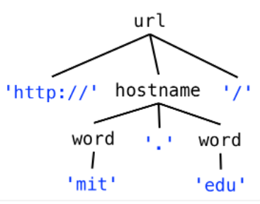
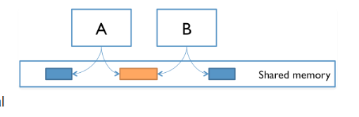
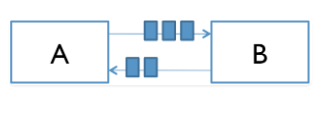
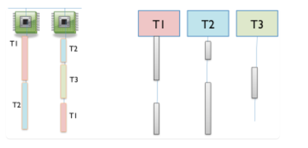
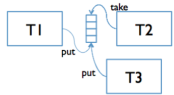
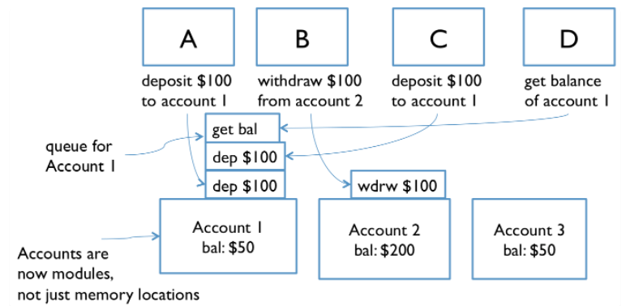
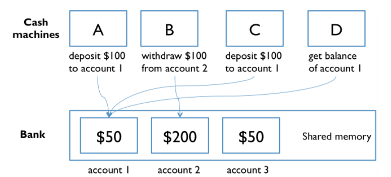
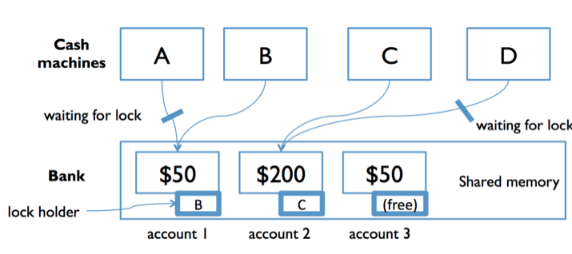
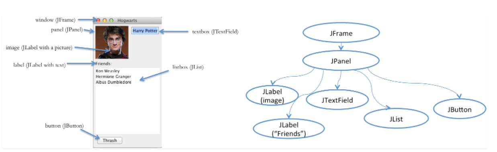

# MIT 6.005 Software construction with Java

- [course link with notes](https://ocw.mit.edu/ans7870/6/6.005/s16/)
- [course link with videos](https://openlearninglibrary.mit.edu/courses/course-v1:MITx+6.005.1x+3T2016/course/)

Personal notes are in each pdf file for first 16 lectures. The plan is to migrate everything here.

# Reading 17: Regular Expressions & Grammars

## Grammars
To describe a sequence of symbols, whether they are bytes, characters, or some other kind of symbol drawn from a fixed
set, we use a compact representation called a **grammar**.

A grammar defines a set of sentences, where each sentence is a sequence of symbols. For example, our grammar for URLs
will specify the set of sentences that are legal URLs in the HTTP protocol.

Example: URL
```
http://mit.edu/
```
A grammar that represents the set of sentences containing only this URL would look like
```
url ::= 'http://mit.edu/'
url ::= 'http://' [a-z]+ '.' [a-z]+  '/' //generalized (regular expression)
```

A grammar is described by a set of **productions** , where each production defines a **nonterminal** .
```
nonterminal ::= expression of terminals, nonterminals, and operators
```
```
url ::= 'http://' hostname '/'
hostname ::= word '.' word
word ::= [a-z]+
```



# Reading 18: Parser Generators

[Link to notes](https://ocw.mit.edu/ans7870/6/6.005/s16/classes/18-parser-generators/)
This chapter uses grammars from before and combines it with parser generator to parse text data. A grammar is a declarative specification for strings and streams, which can be implemented automatically by a parser generator. These specifications are often simpler, more direct, and less likely to be buggy then parsing code written by hand.

#TODO - play around with the [repo](https://github.com/mit6005/sp16-ex18-parser-generators) in the chapter

# Reading 19: Concurrency

Concurrency means multiple computations are happening at the same time.

Example usages:

- Multiple computers in a network
- Multiple applications running on one computer
- Multiple processors in a computer (today, often multiple processor cores on a single chip)

- Web sites must handle multiple simultaneous users.
- Mobile apps need to do some of their processing on servers (“in the cloud”).

## Two Models for Concurrent Programming

1. Shared memory = concurrent modules interact by reading and writing shared objects in memory.
Example: A and B might be two processors (or processor cores) in the same computer, sharing the same physical memory.




2. Message passing = concurrent modules interact by sending messages to each other through a communication channel.
Example: A and B might be a web browser and a web server – A opens a connection to B and asks for a web page, and B sends the web page data back to A.



## Processes, Threads, Time-slicing
The message-passing and shared-memory models are about how concurrent modules communicate. The concurrent modules themselves come in two different kinds: **processes** and **threads**.

A process is an instance of a running program that is isolated from other processes on the same machine:
- has its own private section of the machine’s memory
- has a self-contained execution environment
- has a complete, private set of basic run-time resources
The process abstraction is a **virtual computer** = fresh computer. It makes the program feel like it has the entire machine to itself.

Threads are sometimes called lightweight processes. Threads exist within a process — every process has at least one. Threads share the process's resources, including memory and open files. This makes for efficient, but potentially problematic, communication. Think of it as a place in the program that is being run, plus the stack of method calls that led to that place (so the thread can go back up the stack when it reaches return statements).

When there are more threads than processors, concurrency is simulated by time slicing , which means that the processor switches between threads.




A **race condition** means that the correctness of the program (the satisfaction of post conditions and invariants) depends on the relative timing of events in concurrent computations A and B. When this happens, we say “A is in a race with B.”

Some **interleavings** of events may be OK, in the sense that they are consistent with what a single, nonconcurrent process would produce, but other interleavings produce wrong answers – violating post conditions or invariants.

Concurrency bugs exhibit very poor reproducibility. It’s hard to make them happen the same way twice. Interleaving of instructions or messages depends on the relative timing of events that are strongly influenced by the environment.

## Summary

- Concurrency = multiple computations running simultaneously
- Shared-memory & message-passing paradigms = way to make concurrent modules communicate
- Processes & threads: process is like a virtual computer; thread is like a virtual processor
- Race condition = When correctness of result (post conditions and invariants) depends on the relative timing of events

# Reading 20: Thread Safety

Race condition = multiple threads sharing the same mutable variable without coordinating what they’re doing = threatens
correctness of program as it may depend on timing on the low-level operations.

How to deal with variable access in a **shared-memory concurrency**:

- Confinement = don’t share the variable between threads.
- Immutability = make the shared data immutable.
- Threadsafe data type = encapsulate the shared data in an existing threadsafe data type that does the coordination for you.
- Synchronization = use synchronization to keep the threads from accessing the variable at the same time. Synchronization is what you need to build your own threadsafe data type.

**Definition** A data type or static method is threadsafe if it behaves correctly when used from multiple threads, regardless of how those threads are executed.

Example. `Iterator` is not threadsafe. `Iterator`'s specification says that you can’t modify a collection at the same time as you’re iterating over it. That’s a timing-related precondition put on the caller, and `Iterator` makes no guarantee to behave correctly if you violate it.


- Confinement: not sharing the data.
- Immutability: sharing, but keeping the data immutable.
- Threadsafe data types: storing the shared mutable data in a single threadsafe datatype.


## Strategy 1: Confinement

Example:
```
public class Factorial {

    /**
     * Computes n! and prints it on standard output.
     * @param n must be >= 0
     */
    private static void computeFact(final int n) {
        BigInteger result = new BigInteger("1");
        for (int i = 1; i <= n; ++i) {
            System.out.println("working on fact " + n);
            result = result.multiply(new BigInteger(String.valueOf(i)));
        }
        System.out.println("fact(" + n + ") = " + result);
    }

    public static void main(String[] args) {
        new Thread(new Runnable() { // create a thread using an
            public void run() {     // anonymous Runnable
                computeFact(99);
            }
        }).start();
        computeFact(100);
    }
}
```
Local variables are always thread confined. A local variable is stored in the stack, and each thread has its own stack.
Multiple invocations of the method `computeFact` each with its own private copy of the variable.

In general, static variables are very risky for concurrency - unlike local variables. Example:
```
// is this method threadsafe?
/**
 * @param x integer to test for primeness; requires x > 1
 * @return true if x is prime with high probability
 */
public static boolean isPrime(int x) {
    if (cache.containsKey(x)) return cache.get(x);
    boolean answer = BigInteger.valueOf(x).isProbablePrime(100);
    cache.put(x, answer);
    return answer;
}

private static Map<Integer,Boolean> cache = new HashMap<>();
```

 The `isPrime` method is not safe to call from multiple threads, and its clients may not even realize it. The reason is that the `HashMap` referenced by the static variable cache is shared by all calls to `isPrime()` , and `HashMap` is not threadsafe. If multiple threads mutate the map at the same time, by calling `cache.put()`.


## Strategy 2: Immutability

Immutability tackles the shared-mutable-data cause of a race condition and solves it simply by making the shared data *not mutable*.

*Final* variables are immutable references, so a variable declared final is safe to access from multiple threads. This safety applies only to the variable itself, and we still have to argue that the object the variable points to is immutable.


## Strategy 3: Using Threadsafe Data Types
To have thread safe data type, represent it using thread safe data types.. lolz.
Examples:
- [StringBuffer is] A thread-safe, mutable sequence of characters.
- [StringBuilder is] A mutable sequence of characters. This class provides an API compatible with StringBuffer, but with no guarantee of synchronization.


Aside: This property **serializability**  = for any set of operations executed concurrently, the result (the values and state observable by clients) must be a result given by some sequential ordering of those operations.


# Reading 21: Sockets & Networking

This reading examines client/server communication over the network using the socket abstraction.

Network communication is inherently **concurrent** -> implement them with **thread safety**.

We must also design the **wire** protocol that clients and servers use to communicate, just as we design the operations that clients of an ADT use to work with it. (client of ADT = user of ADT ~ client of a server).

Servers and Clients are just ADT - way of abstracting the concept of networks.

Some of the operations with sockets are blocking : they block the progress of a thread until they can return a result

## Client/server design pattern

In this pattern there are two kinds of processes:
- clients
- servers

Communication between servers/clients:
1. A client initiates the communication by connecting to a server.
2. The client sends requests to the server, and the server sends replies back.
3. Finally, the client disconnects.

A server might handle connections from many clients concurrently, and clients might also connect to multiple servers.

Examples:
- web browsers are clients for web servers
- an email program like Outlook is a client for a mail server

## Network sockets

### IP Addresses
A **network interface is identified** by an IP address .
IPv4 addresses are 32-bit numbers written in four 8-bit parts:
- '73.194.123.40' is the address of a Google web server.


### Hostnames
Hostnames are names that can be translated into IP addresses. A single hostname can map to different IP addresses at different times; and multiple hostnames can map to the same IP address.

```
$ dig +short web.mit.edu
18.9.22.69

$ host google.com
127.12.39.69
```

Translation from hostnames to IP addresses is the job of the Domain Name System ([DNS](https://en.wikipedia.org/wiki/Domain_Name_System)).


### Port numbers
A single server might have multiple server applications that clients wish to connect to, so we need a way to direct
traffic on the same network interface to different processes.

Network interfaces have multiple ports identified by a 16-bit number from 0 (which is reserved, so we effectively start
at 1) to 65535.

A server process binds to a particular port — it is now listening on that port. Clients have to know which port number
the server is listening on.

- Port 22 is the standard SSH port.
- Port 25 is the standard email server port.
- Port 80 is the standard web server port. When you connect to the URL 'http://web.mit.edu' in your web browser, it
connects to 18.9.22.69 on port 80.


### Network sockets
A **socket** represents one end of the connection between client and server.

- A listening socket is used by a server process to wait for connections from remote clients.

- A connected socket can send and receive messages to and from the process on the other end of the connection. It is
identified by both the local IP address and port number plus the remote address and port

You have in Java you have Classes which implement these ADT-s

## I/O

### Buffers
The data that *clients and servers exchange over the network* is sent in chunks (100 MB of a video).
The network chops that chunk up into **packets**, and each packet is routed separately over the network.
At the other end, the receiver reassembles the packets together into a stream of bytes.

the result of this **data transmission** is: the data may already be there when you want to read them, or you may have
to wait for them to arrive and be reassembled.

When data arrive, they go into a **buffer** , an array in memory that holds the data until you read it.


### Streams
The data going into or coming out of a socket is a stream of bytes.
With sockets, remember that the *output* of one process is the *input* of another process. If Alice and Bob have a socket connection, Alice has an output stream that flows to Bob’s input stream, and vice versa.

### Blocking
Blocking means that a thread waits (without doing further work) until an event occurs. We can use this term to describe
 methods and method calls: if a method is a blocking method , then a call to that method can block , waiting until some
 event occurs before it returns to the caller.

Socket input/output streams exhibit blocking behavior:
- When an incoming socket’s buffer is empty, calling read blocks until data are available.
- When the destination socket’s buffer is full, calling write blocks until space is available.

### [All about sockets](https://docs.oracle.com/javase/tutorial/networking/sockets/index.html)
The above link describes everything you need to know about creating server- and client-side sockets and writing to and
reading from their I/O streams.


## Wire protocols
Now that we have our client and server connected up with sockets, what do they pass back and forth over those sockets?

A protocol is a set of messages that can be exchanged by two communicating parties. A wire protocol in particular is a set of messages represented as byte sequences, like `hello world`.


## Designing a wire protocol
When designing a wire protocol, apply the same rules of thumb you use for designing the operations of an abstract data type:

- Keep the number of different messages *small*. It’s better to have a few commands and responses that can be combined
rather than many complex messages.

- Each message should have a well-defined purpose and *coherent* behavior.

- The set of messages must be *adequate* for clients to make the requests they need to make and for servers to deliver
the results.

Just as we demand representation independence from our types, we should aim for **platform-independence** in our
protocols. HTTP can be spoken by any web server and any web browser on any operating system. The protocol doesn’t say
anything about how web pages are stored on disk, how they are prepared or generated by the server, what algorithms the
client will use to render them, etc.

## Testing client/server code
Remember that concurrency is hard to test and debug.

- Separate network code from data structures and algorithms
Most of the ADTs in your client/server program don’t need to rely on networking. Make sure you specify, test, and
implement them as separate components that are safe from bugs, easy to understand, and ready for change — in part
because they don’t involve any networking code.

- Separate socket code from stream code
A function or module that needs to read from and write to a socket may only need access to the input/output streams, not to the socket itself. This design allows you to test the module by connecting it to streams that don’t come from a socket.


# Reading 22: Queues and Message-Passing

Goal: Use message passing (with synchronous queues) instead of shared memory for communication between threads. RAcal we had 2 models for concurrent programming:

- In the shared memory model, concurrent modules interact by reading and writing shared mutable objects in memory.\
Example: Creating multiple threads inside a single Java process is our primary example of shared-memory concurrency.

- In the message passing model, concurrent modules interact by sending immutable messages to one another over a communication channel.\
Example: the client/server pattern, in which clients and servers are concurrent processes, often on different machines, and the communication channel is a network socket.

**In message-passing, concurrent modules interact explicitly , by passing messages through the communication channel, rather than implicitly through mutation of shared data.**

## Message passing with threads
Previously we saw message passing between processes when **clients and servers communicate over network sockets**.
We can also use message passing between threads within the same process, and this design is often preferable to a shared memory design with locks.

**Design**
- Use a synchronized queue for message passing between threads.
- The queue serves the same function as the buffered network communication channel in client/server message passing.

Java provides `BlockingQueue` interface which extends the `queue` ADT and has operations:
- `put(e)` blocks until it can add element e to the end of the queue (if the queue does not have a size bound, put will not block).
- `take()` blocks until it can remove and return the element at the head of the queue, waiting until the queue is non-empty.

These two are luke `add()` and `pop()` but with delays.



```
Analogous to the client/server pattern for message passing over a network is the producer-consumer design pattern for
message passing between threads. Producer threads and consumer threads share a synchronized queue. Producers put data
or requests onto the queue, and consumers remove and process them.
```




## Thread safety arguments with message passing
A thread safety argument with message passing might rely on:

- Existing threadsafe data types for the synchronized queue. This queue is definitely shared and definitely mutable, so
we must ensure it is safe for concurrency.

- Immutability of messages or data that might be accessible to multiple threads at the same time.

- Confinement of data to individual producer/consumer threads. Local variables used by one producer or consumer are not
visible to other threads, which only communicate with one another using messages in the queue.

- Confinement of mutable messages or data that are sent over the queue but will only be accessible to one thread at a
time. This argument must be carefully articulated and implemented. But if one module drops all references to some mutable
data like a hot potato as soon as it puts them onto a queue to be delivered to another thread, only one thread will
have access to those data at a time, precluding concurrent access.


## Summary
Rather than synchronize with locks, message passing systems synchronize on a shared communication channel,
e.g. a stream or a queue.\
Threads communicating with blocking queues is a useful pattern for message passing within a single process.


# Reading 23: Locks and Synchronization

Recall we enumerated four strategies for making code safe for concurrency :

- Confinement : don’t share data between threads.
- Immutability : make the shared data immutable.
- Use existing threadsafe data types : use a data type that does the coordination for you.
- Synchronization : prevent threads from accessing the shared data at the same time.


## Synchronization
**The correctness of a concurrent program should not depend on accidents of timing.**

Race conditions caused by concurrent manipulation of shared mutable data are disastrous bugs -
We need a way for concurrent modules that share memory to **synchronize** with each other.

```
Locks are one synchronization technique.
```
 A lock is an abstraction that allows at most one thread to own it at a time. Holding a lock is how one thread tells other threads: “I’m changing this thing, don’t touch it right now.”

 Locks have two operations:
 - `acquire` = allows a thread to take ownership of a lock.
 - `release`= allows another thread to take ownership of it.

Example of shared memory concurrency was a bank with cash machines.


The bank has several cash machines, all of which can read and write the same account objects in memory - need coordination

To solve this problem with locks, we can add a lock that protects each bank account. Now, before they can access or update an account balance, cash machines must first acquire the lock on that account.


**Deadlock** occurs when concurrent modules are stuck waiting for each other to do something. A deadlock may involve more than two modules: the signal feature of deadlock is a **cycle of dependencies**, e.g. A is waiting for B which is waiting for C which is waiting for A.

# Reading 24: Graphical User Interfaces

Design patterns in software architecture of GUI software:

- the view tree, which is a central feature in the architecture of every important GUI toolkit;
- the model-view-controller pattern, which separates input, output, and data;
- the listener pattern, which is essential to decoupling the model from the view and controller.

## View Tree

Graphical user interfaces are composed of view objects, each of which occupies a certain portion of the screen, generally a rectangular area called its bounding box.

The view tree = Views are arranged into a hierarchy of containment, in which some views contain other views. Typical containers are windows, panels, and toolbars.



Responsibilities in a typical GUI:

- **Output**  Views are responsible for displaying themselves, and the view tree directs the display process. GUIs change their output by mutating the view tree.
- **Input** Views can have input handlers, and the view tree controls how mouse and keyboard input is processed.
- **Layout** The view tree controls how the views are laid out on the screen, i.e. how their bounding boxes are assigned. An automatic layout algorithm automatically calculates positions and sizes of views.


## Input Handling

Input handled in GUI is different than the way we handle it in parsers and servers:

```
while (true) {
    read mouse click
    if (clicked on Thrash button) doThrash();
    else if (clicked on textbox) doPlaceCursor();
    else if (clicked on a name in the listbox) doSelectItem();
    ...
}
```
Above approach would not be modular and additive.

GUIs exploit the spatial separation provided by the view tree to provide functional separation as well. Mouse clicks and keyboard events are distributed around the view tree, depending on where they occur.

GUI input event handling is an instance of the **Listener pattern (also known as Publish-Subscribe)**.

In the **Listener pattern**:

- An event source generates a stream of discrete events, which correspond to state transitions in the source.
- One or more listeners register interest (subscribe) to the stream of events, providing a function to be called when a new event occurs.

When an event occurs, the event source distributes it to all subscribed listeners, by calling their callback methods.

Control flow:

- A top-level event loop reads input from mouse and keyboard.
- For each input event, it finds the right view in the tree (by looking at the x,y position of the mouse) and sends the event to that view’s listeners.
- Each listener does its thing (which might involve e.g. modifying objects in the view tree), and then returns immediately to the event loop.

*Separation of concerns – output handled by views, and input handled by listeners.*


The Listener pattern = The observer pattern is a software design pattern in which an object, named the subject, maintains a list of its dependents, called observers, and notifies them automatically of any state changes, usually by calling one of their methods.

It is mainly used for implementing distributed event handling systems, in "event driven" software. In those systems, the subject is usually named a "stream of events" or "stream source of events", while the observers are called "sinks of events".

## Separating Frontend from Backend

 The backend represents the data and logic that the user interface is showing and editing.

 The **Model-View-Controller pattern** separates the user interface frontend from the application backend, by putting backend code into the model and frontend code into the view and controller. MVC also separates input from output; the controller is supposed to handle input, and the view is supposed to handle output.

- The **model** is responsible for maintaining application-specific data and providing access to that data. A model must also notify its clients when there are changes to its data, so that dependent views can update their displays, and dependent controllers can respond appropriately. Models do this notification using the listener pattern, in which interested views and controllers register themselves as listeners for change events generated by the model.

- View objects are responsible for output. The view queries the model for data and draws the data on the screen. It listens for changes from the model so that it can update the screen to reflect those changes.

- The controller handles the input. It receives keyboard and mouse events, and instructs the model to change accordingly.

# Summary

- The view tree organizes the screen into a tree of nested rectangles, and it is used in dispatching input events as well as displaying output.

- The Listener pattern sends a stream of events (like mouse or keyboard events, or button action events) to registered listeners.

- The Model-View-Controller pattern separates responsibilities: model=data, view=output, controller=input.**