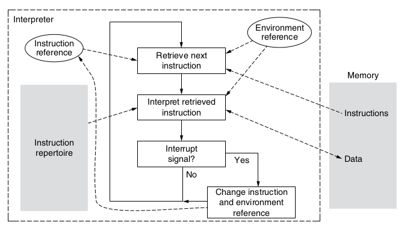
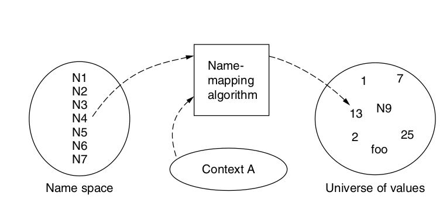
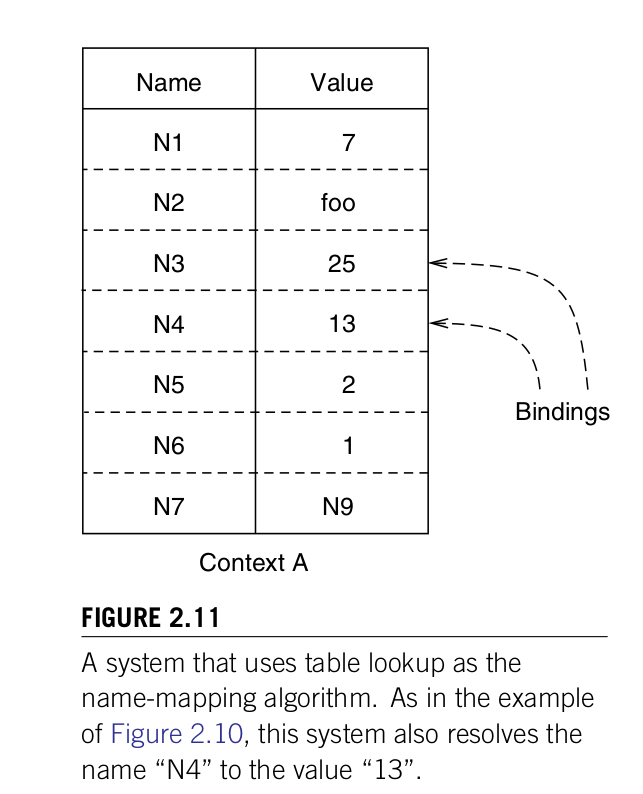
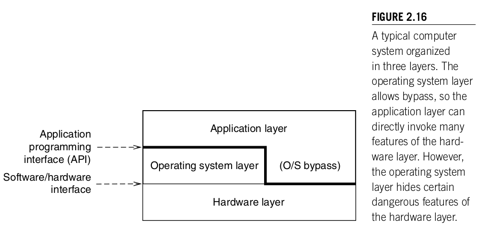
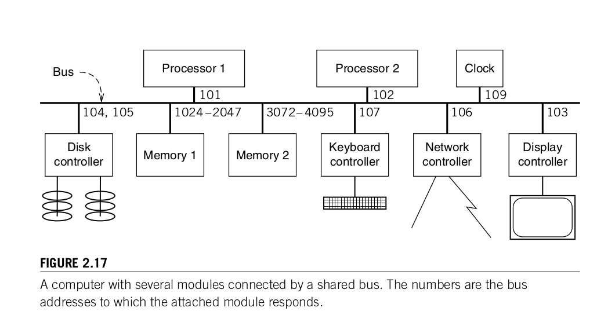
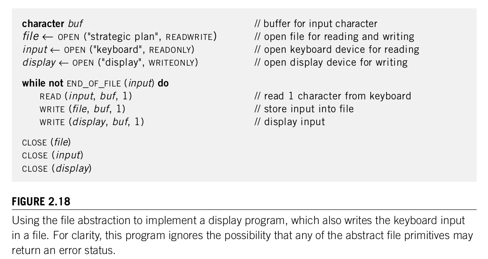
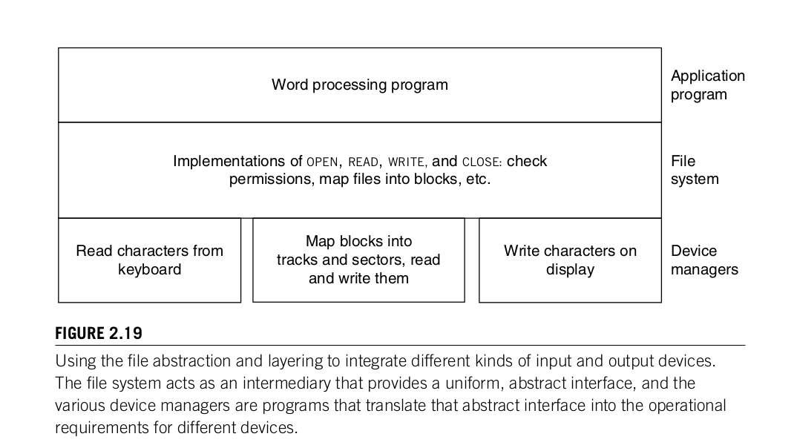
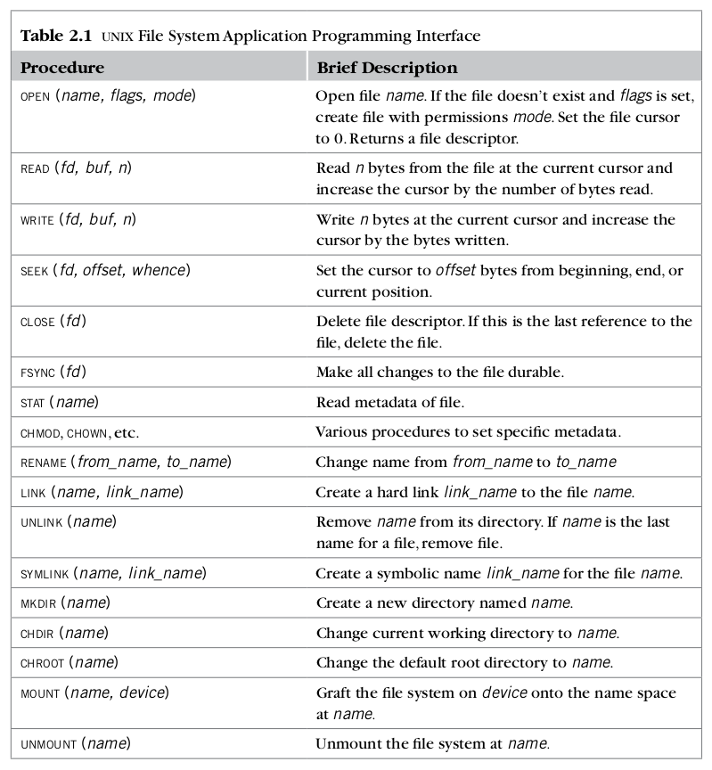
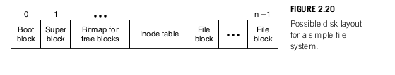
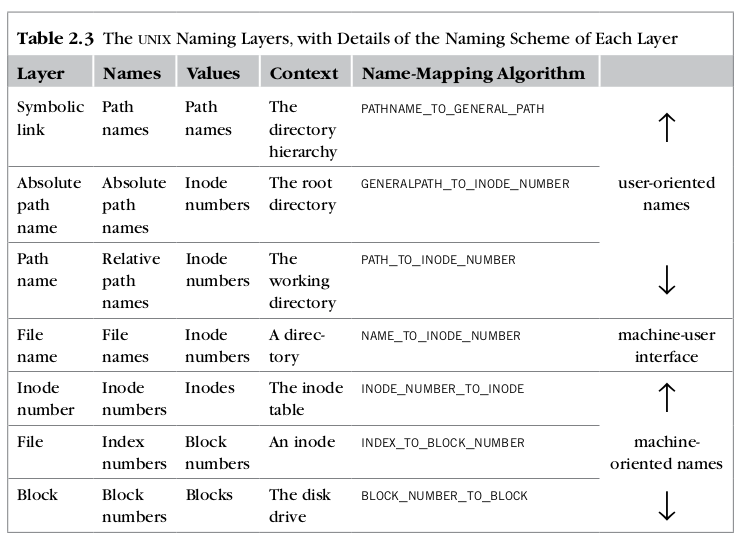

# MIT 6.033 - Computer System Engineering

My notes on this [class](https://ocw.mit.edu/courses/6-033-computer-system-engineering-spring-2018/) contains mainly
summary of the book used in the class - [Principles of Computer System Design: An Introduction](https://github.com/ngocuong0105/algorithms/tree/main/Readings/Engineering).

##### Table of Contents  
[Chapter 1 Systems](#chap1)  
[Chapter 2 Elements of Computer System Organization](#chap2)


<a name="chap1"/></a>

# Chapter 1 Systems

## Overview
**"Systems perspective"** is  a way of thinking about systems that is global and encompassing rather than focused on
particular issues. We study computer systems so we care about the systems perspective.

Designers of Computer systems/applications want their system satisfy:

- fault tolerance
- coordination of concurrent activities
- geographically separated but linked data
- vast quantities of stored information
- protection from mistakes and intentional attacks
- interactions with many people

Design principles are not immutable laws, but rather guidelines that capture wisdom and experience and that can help a
designer avoid making mistakes.

Software is linguistic constructs for describing computational processes (in the spirit of SICP).\
Hardware is physical constructs for realizing computations.\

Common Problems of any kind of systems (computer, engineering, modelling, transport):
The problems can  be divided into four categories:
- emergent properties
- propagation of effects  
- incommensurate scaling
- trade-offs

**Emergent properties** are properties that are not evident in the individual components of a system, but show up when
combining those components, so they might also be called surprises.

An unalterable fact of life: some things turn up only when a system is built.

**Propagation of effects** = What looks at first to be a small disruption or a local change can have effects that reach
from one end of a system to the other. An important requirement in most system designs is to limit the impact of failures.
Folk wisdom characterizes propagation of effects as: "There are no small changes in a large system”.

**Incommensurate scaling** (non proportional scaling) = as a system increases in size or speed, not all parts of it
follow the same scaling rules, so things stop working.

Different parts of the system exhibit different orders of growth, e.g.databases are hard to scale.

**Trade-offs** The general model of a trade-off begins with the observation that there is a limited amount of some form
of goodness in the universe, and the design challenge is first to maximize that goodness, second to avoid wasting it,
and third to allocate it to the places where it will help the most

One common form of trade-off is sometimes called the waterbed effect: pushing down on a problem at one point causes
another problem to pop up somewhere else.


**Example** of trade-offs problem. In binary classification you classify a set of two things and often you cannot take
direct measurements. So you take proxies. Occasionally your model misclassifies something. By adjusting parameters of
the proxy, the designer may be able to reduce one class of mistakes (e.g for a spam filter, legitimate messages marked as spam)
 but only at the cost of increasing some other class of mistakes (for the spam filter, spam marked as legitimate messages).

*What is a System?*
- Informal definition. A complex unity formed of many often diverse parts subject to a common plan or serving a common purpose.
- Formal Definition. A system is a set of interconnected components that has an expected behavior observed at the interface with its environment.

**Example**. Underlying idea of a system divides everything into 2 groups: those under discussion and those not under
discussion. Under discussion = parts of the system, not under discussion = those that are not are part of the environment.
The solar system as consisting of the sun, planets, asteroids, and comets. The environment of the solar system is the rest of the universe.

There are always interactions between a system and its environment; these interactions are the *interface* between the
system and the environment.

## Complexity
Complexity has no unified measure. We can use 5 signs of complexity:

- Large number of components
- Large number of interconnections
- Many irregularities
- A long description
- A team of designers, implementers, or maintainers

The presence of only one or two of the signs may not make a compelling case for complexity.

1. A primary source of complexity is just the list of requirements for a system. Each requirement on its own could be
simple, but many requirements lead to many interactions in the system and complexity rises quickly (often multiplicative in number of requirements).


```
____________ Principle of escalating complexity ____________
Adding a requirement increases complexity out of proportion.
```

As the number of requirements grows, so can the number of exceptions and thus the complications.

Problems arising from more requirements: \
Many requirements -> need for generality,  need to counteract the effects of incommensurate scaling, need to answer requirement changes

- Need for generality = applying to a variety of circumstances.
The designer need to decide whether the generality is actually WANTED.

Example. An automobile with four independent steering wheels, each controlling one tire, offers some kind of ultimate in
generality, almost all of which is unwanted.

Unwanted generality also contributes to complexity indirectly: users of a system with excessive generality will adopt
styles of usage that simplify and suppress generality that they do not need. Different users may adopt different styles
and then discover that they cannot easily exchange ideas with one another.

```
_________________ Avoid excessive generality _________________

    If it’s good for everything, it’s good for nothing.
```

**There is a tension between exceptions and generality**. Don't want to have too general functions but want general enough
to capture enough exceptions (minimize number of exceptions).


- Need to counteract incommensurate scaling. On a 4 bit computer you would probably be able to write code in 0-s and 1-s,
on a 64 bit you need more complicated tool. (when requirements change we need to do that)

- Meet requirement changes. Usually we make local changes (sometimes called as PATCHES) which can bring side effects,
introduce bugs, etc. *There are no LOCAL changes in a Large System.*

2. Another source of complexity is Maintaining High Utilization.


```
_________________ The law of diminishing returns _________________
The more one improves some measure of goodness, the more effort the next improvement will require.
```

The more completely one tries to use a scarce resource, the greater the complexity of the strategies for use, allocation, and distribution.

Example:A rarely used street intersection requires no traffic control beyond a rule that the car on the right has the
right-of-way. As usage increases, one must apply progressively more complex measures: stop signs, then traffic lights,
then marked turning lanes with multiphase lights, then vehicle sensors to control the lights.

## Coping with complexity

Common techniques for coping with complexity:
- modularity
- abstraction,
- layering
- hierarchy

Modularity follows divide and conquer strategy.

Sketch proof that modularity reduces debug time:
Suppose we have a large system of N statements and
```
BugCount ~ N
DebugTime ~ N x BugCount ~ N**2 ( assuming we need N time to find and fix each bug)
```
Suppose we have N/K modules each with K statements
```
BugCount (for each module )~ N/K
DebugTime ~ (time to fix bug) x (bugs in single module) x (#modules)(N/K) x (N/K) x K = N**2/K
```

Advantages:
- Separating your code in K modules reduces debug time with a factor of K.
- Work separately on modules/ ready for change/ no need to completely rebuild everything

Disadvantages:
- Need to get modularity right from the beginning. One you use a certain interface by multiple modules changing the
interface would require changes in all modules using it.
```
______________ The unyielding foundations rule ______________
It is easier to change a module than to change the modularity.
```

*Modularity in the Computer Industry*. In the 1960s, computer systems were a vertically integrated industry. IBM­ provided  
top-to-bottom systems and support, offering processors, memory, ­storage, operating systems, applications, sales, and maintenance.
By the 1990s, the industry had transformed into a horizontally organized one in which Intel sells processors, Micron sells memory,
Seagate sells disks, Microsoft sells operating systems, Adobe sells text and image applications..

The reason behind this phenomenon is modularity in action! Companies doing a lot of stuff had to modularize their work to
control complexity. Thus the market got open to companies to focus on certain parts only and to become best in it.

In general market economy is characterized by modularity - you have different parts interacting with each other through
the universal interface - **money**.

An important assumption in above sketch proof of how modularity reduces debug time is that each bug requires looking only
one module (often not tru in practice). To have this assumption hold we need **Abstraction**.\
Abstraction = no propagation of effects from one module to another. The best ways to divide system into modules usually
follow natural or effective boundaries. Enforce abstraction using walls between modules to limit the errors due to propagation of
side effects.
```
______________ The robustness principle ______________
    Be tolerant of inputs and strict on outputs.
```
The robustness principle message is to suppress, rather than propagate or even amplify, noise or errors that show up in
the interfaces between modules. It is a key idea in mass production. Rather than creating components which fit exactly
their parent components engineers define tolerances for components and design
each component to mate with any other component that was within its specified tolerance. (Digital Systems work like that
when sending messages(bits)). Henry Ford "In mass production there are no fitters".
This principle is in **tension** with another one:
```
_____________________ The safety margin principle _____________________
Keep track of the distance to the cliff, or you may fall over the edge.
```
When inputs are not close to their specified values, that is usually an indication that something is starting to go wrong.
For this reason, it is important to track and report out-of-tolerance inputs.

Carefully designed systems blend the two ideas: accept any reasonable input but report any input that is beginning to drift
out of tolerance so that it may be repaired before it becomes completely unusable.

**Layering** = one way to do abstraction = reduce number of connections among modules.
General rule in layering =  a module of a given layer interacts only with its peers in the same
layer and with the modules of the next higher and next lower layers.\
Example. An Interpreter for a high-level language is implemented using a lower-level,more machine-oriented language.\
Example. Computers have several layers. Lowest layer consists of gates and memory cells, upon which is built layer of
processor and memory. On top of it is built operating system layer which augments the processor and memory layer.
Finally Application program executes in the OS.\

**Hierarchy** = another way to reduce interconnections and separate modules in specialized way og multiple
hierarchies = multiple trees which interact with each other only through the roots!

*Names Make Connections*.  Abstraction, Modularizing, Hierarchy, layering provide ways of dividing things up. We need
a way of connecting those modules. In digital systems, the primary connection method is that one module names another
module that it intends to use. Designers choose implementation of connecting different modules - called **binding**.
Names allow postponing of decisions, easy replacement of one module with a better one, and sharing of modules.

One way to delay binding is just to name a feature rather than implementing it = **Wishful thinking**. Using a name to
delay or allow changing a binding is called indirection, and it is the basis of a design principle:
```
_______________ Decouple modules with indirection ________________
               Indirection supports replaceability.
```


## Computer Systems vs Other Systems

■ The complexity of a computer system is not limited by physical laws.
■ The rate of change of computer system technology is unprecedented.


Why Computer Technology has Improved Exponentially with Time?\
If indeed the rate at which we can improve our technology is proportional to the
quality of the technology itself, we can express this idea as:
```
d(technology)/dt = K * technology
which has an exponential solution,
technology = e^(K-t)
```
Computer engineering is one of the few engineering fields where doing work produces additional work
and more areas for improvement. If you build a bridge you are usually done. If you build a package/software
then you could build other packages/software on top of it. \
Technology improvement often is non-proportional for different components in the system.
```
________________ The incommensurate scaling rule ________________
Changing any system parameter by a factor of 10 usually requires a new design.
```

Example. A civil (or aeronautical) engineer almost always ends up designing something that is only a little different
from some previous bridge (laws of physics do not change). Software engineers constantly need to develope new versions
of their product and redesign things (laws of physics do not apply, imagination is the limit).


## Coping with complexity II

Modularity, Abstraction, Hierarchy, Layering is not enough to control complexity. It practice it is simply hard to choose
what is the right level of modularity/abstraction/ right hierarchy and layering to use in your system. You need to have
worked with previous systems to be better at making these judgement calls.

An additional technique to cope with complexity is called **iteration**. \
The essence of iteration is to start by building a simple, working system that meets only a modest subset of the
requirements and then evolve that system in small steps to gradually encompass more and more of the full set of requirements.\
Example. Piece of software identified as "release 5.4”= the vendor is using iteration.\
```
________________________ Design for iteration ________________________
You won’t get it right the first time, so make it easy to change.
```
Take small steps, document assumptions so that you can iterate over your codebase.

## Summary
- Abstractions and layering are particular ways to build on modularity.
- Modularity reduces complexity because it controls propagation effects.
- Modularity reduces complexity because it assembles a number of smaller elements into a single larger element.
- Hierarchy reduces complexity because it cuts down on the number of interconnections between elements.
- Hierarchy reduces complexity because it enforces a structure on the interconnections between elements.
- Naming is a fundamental mechanism for interconnecting and replacing modules.
- Clients and services and virtualization are two ways of enforcing modularity.
- Networks are built on a foundation of modularity.
- In fault tolerance, the module is the unit that limits the extent of failure.
- Atomicity is an exceptionally robust form of modularity that the designer can exploit to obtain consistency.
- Finally, protection of information involves further strengthening of modular walls.


<a name="chap2"/></a>

# Chapter 2 Elements of Computer System Organization

Computer System Components fall into 3 abstraction categories:
- the memory
- the interpreter
- the communication link

These three provide hardware abstractions and means to organize hardware structures. System designers build layers on
top of this fundamental base, rather than creating new abstractions. For example personal computer or a network server
develop highly refined forms of the same 3 abstractions.

For the user:
- use the memory in the form of an organized file or database system
- us the interpreter in the form of a word processor or a high-level programming language
- us the communication link in the form of instant messaging or the World Wide Web.

## Memory ~ Storage
All memory devices fit into a model that has two operations:
- write (name, value)
- value <- read (name)

Memory can be *volatile* (depends on power supply) and *non-volatile* (with or without power supply retrieves the same values in read and writes). Volatility measures *durability* of a storage = the length of time it remembers.

Naming convention: the term memory meant random-access volatile memory and the term storage was used for non-volatile memory.

We want two properties for a memory - **Read/Write Coherence and Atomicity**:
- read/write coherence = the result of reading memory cell is always the same as the most recent write to the cell
- atomicity = read or write to a cell should give the same result to the just before/after read or write to a cell

These 2 seem obvious that should hold but when you have *concurrency, remote storage, large values stored in multiple cells, replicated storage* - any of these can make it a challenge to keep the two properties true.

Memory latency = time to complete a read or a write = access time.

RAM (random access memory) is memory with low latency -> accessing random memory cell has equal latency (chips).\
Optical disks (HDD, SSD, CD, DVD) are magnetic disk devices are memory devices involving mechanical movement. It has to circle around to access memory cells - much slower but useful for storing larger chunks of memory (storage).

Naming convention for RAM -> *READ* and  *WRITE*, for Disk/non-volatile memory -> *GET* and *PUT*.

Name of a memory cell == geometric coordinates/address on the physical storage location.


## Interpreters - perform actions and computation on the computer
As with memory, interpreters can be complicated physical manifestations but
we abstract out it using three components:
- instruction reference = tells the interpreter where to find its next instruction
- repertoire = set of actions the interpreter is ready to perform
- environment reference = tells the interpreter where to find its current state and perform action



Interpreters are usually organized in layers. The lowest layer is usually a hardware engine that has a fairly primitive repertoire of instructions, and successive layers provide an increasingly rich or specialized repertoire.

Human user generating request

```
Human user generating requests
-------------------------------------
Calendar program clicking with mouse
-------------------------------------
Java Interpreter
-------------------------------------
Hardware
```

## Communication Links
A communication link provides a way for information to move between physically
separated components. Data abstraction type with operations:
- SEND(link_name, outgoing_message_buffer)
- RECEIVE(link_name, incoming_message_buffer)

*outgoing_message_buffer* identifies the message to be sent through the communication link identified with  *link_name* (e.g. a wire).

## Naming in Computer Systems
Computer systems use names in many ways in their construction, configuration, and operation, e.g.memory addresses, link names, processor registers. We approach names from an object point of view: the computer system manipulates objects. An object may be structured, which means that it uses other objects as components. For one object to use another as a component we have two options:
- create a copy of the component object and include the copy in the using
object (use by **value**), or
- choose a name for the component object and include just that name in the using object (use by **reference**). The component object is said to export the name.
Passed by value - prevents unwanted modification of objects. Passed by reference allows different object to share a component object.

Decoupling one object from another by using a name as an intermediary is known
as **indirection**. Deciding on the correspondence between a name and an object is an example of **binding**.


## The Naming Model
A system designer creates a *naming scheme* that consists of 3 components:
- name space = an alphabet of symbols + syntax rules that specify acceptable names
- name-mapping algorithm associates names to all possible universe of values
- universe of values contain values = may be an object, or it may be another name from either the original name space or from a different name space.

The interpreter that encounters the name runs the name-mapping algorithm of
the appropriate naming scheme. The name-mapping algorithm is usually controlled by an additional parameter, known as a **context**.



There could be more than one context. When there is more than one context, Then the interpreter may tell the resolver which one it should use or the resolver may use a default context. We can summarize the naming model by defining the following conceptual operation on names:
```
value ← resolve (name, context)
```
The variable `context` tells resolve which context to use. That variable contains a name known as a *context reference*.

Apart from resolve we add 4 other operations:
```
- status <- BIND(name, value, context)
- status <- UNBIND(name, contest)
- list <- ENUMERATE(context)
- result <- COMPARE(name1, name2)
```
A successful call to `bind` , `resolve` will return the new `value` for `name`. \
a successful call to `unbind` , `resolve` will no longer return
that `value` for `name` .\
The `bind` and `unbind` operations allow the use of names to make connections between objects and change those connections later.\
An `enumerate` operation, which returns a list of all the names that can be resolved in context.\

Naming schemes define rules uniqueness of name-to-value mappings. Some naming schemes have a rule that a name must map to exactly one value in a given context and a value must have only one name.\

Frequent name-mapping algorithms:
- Table lookup
- Recursive lookup
- Multiple lookup

Some naming schemes have a rule that a name must map to exactly
one value in a given context and a value must have only one name.\
Binding a new name to a value consists of adding that {name ,value } pair to the table.

### Table lookup name-map algo



For each context there is one such table with different bindings.

Example: A telephone book is a table-lookup context that binds names of people and organizations to telephone numbers.

Example: Memory cells are named with the numbers called addresses, and the name-to-value mapping is accomplished by wiring.

Example: Small integers name the registers of a processor. The value is the register itself, and the mapping from name to value is accomplished by wiring.

### Context References
When a program interpreter encounters a name in an object, someone must supply a context reference so that the name-mapping algorithm can know which context it should use to resolve the name.

A *default context reference* is one that the resolver supplies,whereas an *explicit context reference* is one that comes packaged.

Default- supplied by the resolver
- Constant built in to the resolver
- Variable from the current environment

Explicit: supplied by the object
- Per object
- Per name (qualified name

### Recursive name resolution name-mapping algo.

Examples:
```
Least significant component ------   Explicit context reference
ginger                      ------          pedantic.edu.
emacs                       ------          /usr/bin
problem set 1               ------    Macintosh hd:projects:CSE 491
first paragraph             ------    Chapter 2, section 2, part 3
Paragraph 1 pedantic.edu.   ------ part 3 of section 2 of chapter 2
```

The recursive aspect of this description is that the explicit context reference is itself a path name that must be resolved.

In a typical design, the resolver uses one of two default context references:
- A special context reference, known as the **root**, that is built in to the resolver. The root is an example of a universal name space. A path name that the resolver can resolve with recursion that ends at the root context is known as an **absolute path name**.
- The path name of yet another default context. A path name that is resolved by looking up its most significant component in yet another context is known as a ­**relative path name**.

### Naming network
Path names can also be thought of as identifying objects that are organized in what is called a* naming network*.

The file system of a computer operating system is usually organized as a *naming network*, with directories acting as contexts.

It is common in file systems to encounter implementation-driven restrictions on the shape of the naming network, for example, requiring that the contexts be organized in a naming hierarchy with the root acting as the base of the tree.


### Multiple Lookup: Searching through Layered Contexts

The third algo for name-mapping algorithms. The idea of multiple lookup is to abandon the notion of a single, default context and instead resolve the name by systematically trying several different contexts. A scheme is needed to decide which resolution to use.

A common scheme is *search path*, which is nothing more than a specific list of contexts to be tried, in order. The name resolver tries to resolve the name using the first context in the list. If it gets a not-found result, it tries the next context, and so on.


Rather than allowing an arbitrary list of contexts, a naming scheme may
require that contexts be arranged in nested layers. In a set of layered contexts, the *scope* of a name is the range of layers in which
the name is bound to the same object. A name that is bound only in the outermost layer, and is always bound to the same object, independent of the current context layer, is known as a *global* name.

### Comparing Names
As mentioned earlier, one more operation is sometimes applied to names:
```
result ← compare (name1, name2)
```

Questions of invoker of `compare` function:
1. Are the two names the same?
2. Are the two names bound to the same value?
3. If the value or values are actually the identifiers of storage containers, such as memory cells or disk sectors, are the contents of the storage containers the same?

The LISP language provides three comparison operators, named `eq` (which compares the bindings of its named arguments), `equ` (which compares the values of its named arguments), and `equals` (which recursively compares entire data structures).


## Organizing computer systems with names and layers

The bottom layer consists of hardware components, such as processors, memories, and communication links. The middle layer consists of a collection of software modules, called the operating system that abstract these hardware resources into a convenient application program
ming interface (API). The top layer consists of software that implements application - specific functions, such as a word processor, payroll program, computer game, or Web browser.




The exact division of labor between the hardware layer and the software layers is an engineering **trade-off** . In principle, every software module can be implemented in hardware. Similarly, most hardware modules can also be implemented in software, except for a few foundational components such as transistors and wires.


The operating system layer usually exhibits an interesting phenomenon that we might call **layer bypass**. Rather than completely hiding the lower, hardware layer, an operating system usually hides only a few features of the hardware layer -dangerous instructions.

### Example - A Hardware Layer: The Bus

The hardware layer of a typical computer is constructed of modules that directly implement low-level versions of the three fundamental abstractions. The processor modules interpret programs, the random access memory modules store both programs and data, and the input/output (I/O) modules implement communication links to the world outside the computer.

Modules are plug into the shared **bus**, which is a highly specialized communication link used to `SEND` messages to other modules.



Features of the bus design:
- *set of wires* = comprising address, data, and control lines that connect to a **bus interface** on each module.
- because the bus is shared we need *a set of rules*, called the bus
**arbitration protocol**, for deciding which module may send or receive a message at any particular time.
- *the bus ­arbiter*, a circuit or a tiny interpreter that chooses which of several competing modules can use the bus.
- *broadcast link*, which means that every module attached to the bus hears every message. Since most messages are actually intended for just one module, a field of the message called the *bus address *identifies the intended recipient.
- **bus interface** of each module configures *bus address*.


Murphy's law: *"If you design it so that it can be assembled wrong, someone will assemble it wrong."*


```
___________________ The principle of least surprise ___________________
People are part of the system. The design should match the user’s experience, expectations, and mental models.
```

**Check what is Direct memory address (DMA). memory-mapped I/O.**

### Example A Software Layer: The File Abstraction
The middle and higher layers of a computer system are usually   implemented as software modules. consider the *file*, a high-level version of the memory abstraction.


A file has two key properties:
- It is **durable**. Information, once stored, will remain intact through system shut
downs and can be retrieved later, perhaps weeks or months later.
- It has a **name**. The name of a file allows users and programs to store ­information in such a way that they can find and use it again at a later time.

The system layer implements files using modules from the hardware layer.






## Case Study: UNIX File System

Unix API(Application programming interface):
A program can create a file with a user-chosen name, read and write the file’s ­content, and set and get a file’s metadata. Example metadata include the time of last modification, the user ID of the file’s owner, and access permissions for other users. To organize their files, users can group them in directories with user-chosen names, creating a naming network.



UNIX divides and conquers the naming network into layers:


What is a Unix file?
-- abstraction: sequential stream of bytes
-- system calls: read(), write(), open(), close(), seek()

Disks are organized as collections of "blocks".

### The Block Layer
At the bottom layer the unix file system names some physical device such as a magnetic disk, flash disk, or magnetic
tape that can store data durably. The storage on such a device is divided into fixed-size units, called **blocks** (in algorithms we call the words). Often words are has 4 bytes size.

In the bottom naming layer, a storage io device can be viewed as a context that binds block numbers to physical blocks.
```
procedure block _ number _ to _ block (integer b) returns block
    return device[b] // device refers to some particular physical device
```



- super block contains info about the block itself (size of the file systems;s disk in blocks)
- bitmap block to keep track of free blocks (when we allocate new block of memory get it from there).

### The File Layer

Users need to store data larger than one block size - UNIX file system introduces layer for **files**.

- A file is a linear array of bytes of arbitrary length.
- The UNIX file system creates an index node, or `inode` for short, as a container for metadata about the file.
```
structure inode
    integer block_numbers[N]
    integer size
    // the numbers of the blocks that constitute the file
    // the size of the file in bytes
```
Name-mapping algo
```
procedure index _ to _ block _ number (inode instance i, integer index) returns integer
    return i.block_numbers[index]
```
For larger files the name-mapping algo is more complicated cannot just use a dictionary like above.\
Recall how are files organized?
- disk is a gigantic array of blocks (Random Access Machine)
- blocks are a single, fixed size
- file is defined by table of indices corresponding to logical position of its blocks.


```
This defines a file:

	block offset in file F =
	--------------------------------
	|     block 34                 |	     0
	--------------------------------
	|     block 722                |	     1
	--------------------------------
	|     block 1072               |	     2
	--------------------------------
	|     block 6                  |	     3
	--------------------------------
	|     block 377                |	     4
	--------------------------------
	|     block 771                |	     5
	--------------------------------
	|     block 7                  |	     6
	--------------------------------
	|     block 83                 |	     7
	--------------------------------
	|     block 212                |	     8
	--------------------------------
	|     block 433                |	     9
	--------------------------------
	|     block 812                |	     single
	--------------------------------
	|     block 96                 |	     double
	--------------------------------
	|     block 531                |	     triple
	--------------------------------
	|  permissions, ownership, etc |
```

Example: If blocks are 4096 bytes long, the 11033rd byte in the file is:
stored in `F[11033//4096] = block 1072` and is the `11033 % 4096 = 2841` byte of this block.\
How large the above file could be?
```
block number = 		4 bytes
block size = 		4096 bytes
# direct blocks = 		10
# single indirect blocks =	1
# double indirect blocks =	1
# triple indirect blocks =	1

implies

(10) directly accessible blocks +
(4096 / 4) single indirectly addressable blocks +
(4096 / 4)^2 double indirectly addressable blocks +
(4096 / 4)^3 triple indirectly addressable blocks =

1,074,791,434 addressable blocks * 4096 bytes/block =

4,402,345,713,664 addressable bytes within a single file
```

### The Inode Number Layer

Instead of passing `inodes` themselves around, it would be more convenient to name them and pass their names around.

```
procedure inode _ number _ to _ inode (integer inode_number) returns inode
    return inode_table[inode_number]
```
where inode_table is an object that is stored at a fixed location on the storage device (e.g., at the beginning).
The name-mapping algorithm for inode_table just returns the starting block number of the table.

### The File Name Layer

The unix file system deals with this problem by inserting a naming layer whose sole purpose is to hide the metadata of
file management. People do not need to keep in mind about inode numbers and storage addresses.

In the unix file system, a directory is a context containing a set of bindings between character-string names and inode
numbers. To create a file, the unix file system allocates an inode, initializes its metadata, and binds the proposed
name to that inode in some directory.

To record whether an inode is for a directory or a file, the inode structure becomes:

```
structure inode
    integer block_numbers[N] // the numbers of the blocks that constitute the file
    integer size // the size of the file in bytes
    integer type // type of file: regular file, directory
```

### The Path Name Layer

Having all files in a single directory makes it hard for users to keep track of large numbers of files.
To allow arbitrary groupings of user files, the unix file system permits users to create named directories = `paths`.
To go from this layer to the inode layer:

```
procedure path _ to _ inode _ number (character string path, integer dir) returns integer
    if ( plain _ name (path)) // in unix is whether path has a slash '/'
        return name _ to _ inode _ number (path, dir)
    else
        dir ← lookup ( first (path), dir)
        path ← rest (path)
        return path _ to _ inode _ number (path, dir)
```

### Links = shortcuts

To refer to files in directories other than the current working directory still requires
typing long names. For example, while we are working in the directory "projects”—
after calling `chdir` ("projects") —we might have to refer often to the file "Mail/inbox/
new-assignment”. To address this annoyance, the unix file system supports synonyms
known as links. In the example, we might want to create a link for this file in the cur rent working directory, "projects”. Invoking the link procedure with the following
arguments:
```
link("Mail/inbox/new-assignment", "assignment")
```
makes "assignment" a synonym for "Mail/inbox/new-assignment" in "projects", if "assignment” doesn’t exist yet. (If it
does, link will return an error saying "assignment”already exists.

Use `unlink(filename)`,indicating to the file system that the name `filename` is no longer in use. unlink removes the
binding of `filename` to its `inode` number from the directory that contains.

**Deletion**
Now that links have been added, when a process asks to delete a name, there may still be names in other directories
bound to the file, in which case the file shouldn’t be deleted. The `UNIX` file system deletes a file when a process
removes the last binding for a file. Add reference count:
```
structure inode
    integer block_numbers[N]
    integer size
    integer type
    integer refcnt
```


To ensure that the unix naming network is a directed graph without cycles, the unix file system forbids links to
directories. Cannot copy a folder in itself error. If there were cycles we would increase ref count when we create e a
folder within the same folder and when we delete we would not delete the folder as the ref count > 0.


### The Absolute Path Name Layer

The unix system provides each user with a personal directory, called a user’s `home directory`.


All layers in one picture:


### The Symbolic Link Layer
To allow users to name files on other disks, the unix file system supports an operation
to attach new disks to the name space. A user can choose the name under which each
device is attached: for example, the procedure:

```
mount("/dev/fd1", "/flash")
```

grafts the directory tree stored on the physical device named "/dev/fd1" onto the
directory "/flash". `mounts` do not survive a shutdown: after a reboot, the user has to explicitly remount the devices. `DOS` approach (Windows) has devices named by fixed one-character names (e.g., “C:”).

With mounted file systems naming inodes on different drives becomes more complicated. Every inode
number has a default context: the disk on which it is located. Thus, there is no way
for a directory entry on one disk to bind to an inode number on a different disk.
Two to solve this problem
- make inodes unique across all disks
- create synonyms for files on other disks in a different way.

The unix system chooses the second approach by using indirect names called
`symbolic` or `soft links`, which bind a file name to another file name. Hard to to keep
inode numbers universally unique, small in size, and fast to resolve.
The UNIX file system implements the procedure symlink by allowing the type field of an inode to be a `symlink` , which tells whether the blocks associated with the inode contain data or a path name:
```
structure inode
    integer block_numbers[N]
    integer size
    integer type // Type of inode: regular file, directory, symbolic link
    integer refcnt
```
If the type field has value symlink , then the data in the array `blocks[i]` actually contains the characters of a path
name rather than a set of inode numbers. This brings definition:

- soft link is an example of an indirect name: binds a name to another name in the same name space
- hard link binds a name to an inode number

### Implementing the File System API
#TODO Chapter 2.5.11 in the book - discuss implementation of `OPEN` and `WRITE`.

### Naming layers in UNIX system all in one



Much of the power of the unix object naming scheme comes from its layers of naming. The general design technique has been to introduce for each problem another layer of naming, an application of the principle **decouple modules with indirection**.


Aside:
- shell is the command INTERPRETER in a UNIX System - compile `.sh` files
- terminal is a wrapper program that runs a shell and allows us to enter commands (`ls`, `rm`, `rmdir`)
- “/bin” names programs
- “/etc” names configuration files
- “/dev” names input/output devices
- “/usr” (rather than the root itself) names user directories

# Chapter 3. The Design of Naming Schemes

Names are the glue that connects modules -> the properties of the naming schemes can significantly affect the impact of modularity on a system.

## Modular sharing
Connecting modules by name provides great flexibility, but it introduces a hazard = how would you handle different **contexts**?
Modular sharing means that one can use a shared module by name without knowing the names of the modules it uses. Lack of modular sharing shows up in the form of name conflict, in which for some reason two or more different values compete for the binding of the same name in the same context.

Keeping track of contexts and using indirect references (perhaps by using file system directories as contexts) is commonplace, but it is a bit ad hoc (Java). Python has `closures` which connects each procedure definition with the naming context in which it was defined.


## Metadata
The name of an object and the context reference that should be associated with it are two examples of a class of information called metadata—information that is useful to know about an object but that cannot be found inside the object itself A common, though not universal, property of metadata is that it is information about an object that may be changed without changing the object itself.

## Addresses: Names that Locate Objects
In a computer system, an **address** is the name of a physical location or of a virtual location that maps to a physical
location. Computer systems are constructed of real physical objects, so they abound in examples of addresses: register numbers, physical and virtual memory addresses, processor numbers, disk sector numbers, removable media volume numbers, I/O channel numbers, communication link identifiers,network attachment point addresses, pixel positions on a display—the list seem sendless.


## Case Study: The Uniform Resource Locator (URL)
The Web has two layers of naming: an upper layer that is user-friendly, and a lower layer that is substantially more
mechanical. In order to retrieve a page in the World Wide Web, you need its URL.

Recall:

client = an entity that originates a request message)
server = an entity that responds to a client’s request)
protocol = an agreement on what messages to send and how to interpret their contents.


### Interpretation of the URL

The URL carries its own complete, explicit context reference.
Example. The name-mapping algorithm for a URL`http://web.pedantic.edu/Alice/www/home.html` is:
1. The browser extracts the part before the colon (here, `http`), considers it to be
the name of a network protocol to use, and resolves that name to a protocol handler using a table-lookup context stored in the browser. The remaining steps describe the ­interpretation for the
case of the hypertext transfer protocol (`http`) handler.
2. The browser takes the part between the `//` and the following `/` (in our example, that would be `web.pedantic.edu`) and asks the **Internet Domain Name System (DNS)** to resolve it. The value that DNS returns is an Internet address.
3. The browser opens a connection to the server at that Internet address, using the protocol found in step 1, and as one of the first steps of that protocol it sends the remaining part of the URL,` /Alice/www/home.html`, to the server.
4. The server looks for a file in its file system that has that path name.
5. If the name resolution of step 4 is successful, the server sends the file with that path
name to the client. The client transforms the file into a page suitable for display.