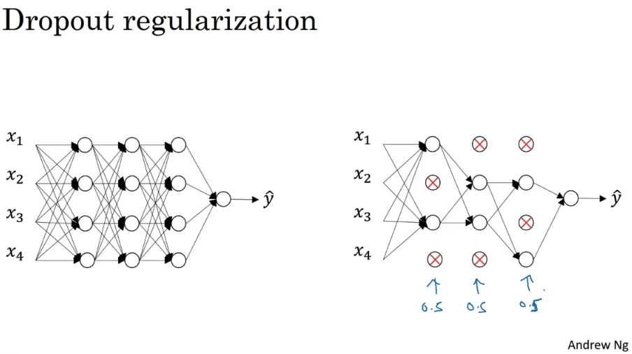
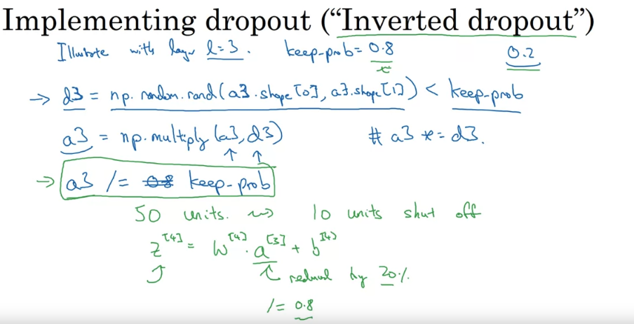
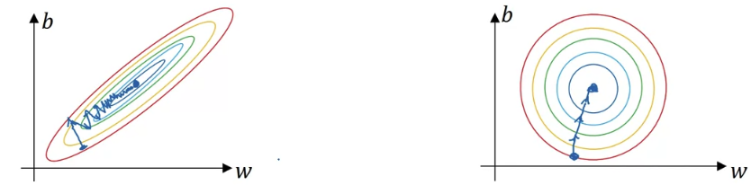
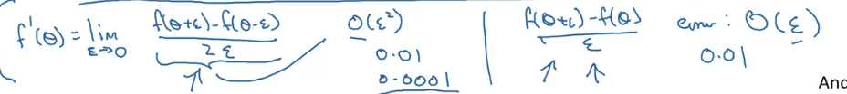
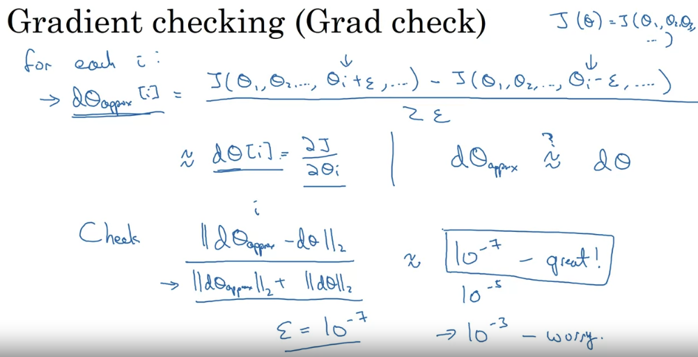

[Andrew Ng's course](https://www.coursera.org/learn/deep-neural-network?specialization=deep-learning#syllabus)


# ML Setup

Applied ML is a highly iterative process. Idea -> Code -> Experiment -> Idea -> Code -> Experiment -> ...

You need setup to that. You need to be able to run experiments quickly.

Train/Validation/Test sets split

Privious era was 60/20/20 or 70/30 (train/test split)

This is fine when you have 100-1000-10000 data points

But now when you have big data 1M+, then you might need less test set. You use the test set to evaluate of how well your model is doing on unseen data. Say you need 10,000 test data points for test. If you have 1M data points, then you can use 99/1 split.


**Aim to have yur validation and test set coming from the same distribution.**

# Bias/Variance

Say we have the task is to classify images of dogs. This is a task human are almot perfect (optimal error is neary 0 percent)

- Train set error: 1 %
- Dev set error: 11 % 
High variance/overfitting

- Train set: 15%
- Dev set error: 16%
High bias/underfitting, because these errors are much larger than the base error.

## Recipe

1. Ask yourself: "Does your model have high bias?" If yes, you need more complicated network (bigger network, train longer, different NN architecture). Try to get tird of this problem first.
2. What is my dev/validation performance. Am I overfitting? If yes, get more data, regularization, different NN architecture.

In DL era, there is less talk about bias-variance tradeoff. 
- Making a bigger network usually decreases bias and as long as you regularize, you would not hurt variance (Need more computational time).
- Training with more data would usually decrease variance and not hurt bias.

# Regularization
L1 model, makes the model more sparse. L2 model, makes the model more smooth.

L2 regularization results in weight decay. The weights would slowly decrease.

If you do not have regularization, then your Loss would decrease monotonically as you increase the number of iterations

## Dropout regularization

Randomly eliminate a random set of nodes in each layer. It randomly shuts down some neurons in each iteration. The dropped neurons don't contribute to the training in both the forward and backward propagations of the iteration. When you shut some neurons down, you actually modify your model. The idea behind drop-out is that at each iteration, you train a different model that uses only a subset of your neurons. With dropout, your neurons thus become less sensitive to the activation of one other specific neuron, because that other neuron might be shut down at any time. 




Drop out would decrese the expected values of the activations of each node. So you need to increase the weights to compensate for that. So you need to increase the weights by a factor of 1/(1-p) where p is the probability of dropout. **Inverted dropout**



The layers with more neurons would have higher dropout rate.

At test time, you do not use dropout. You use the whole network.


Dropout forces a neural network to learn more robust features that are useful in conjunction with many different random subsets of the other neurons. Dropout roughly doubles the number of iterations required to converge.

Say node A in layer L depends on nodes B,C,D in layaer $L-1$. Dropping nodes in layer $L-1$ would make node A spread out evenly its dependence on nodes B,C,D. It would not put all the weight in one of those.

# Normalizing data

substract mean + divide by $\sigma$

Why do we need normalizing?

If x1 and x2 are in different scales, then the weights $w1$ and $w2$ would be very different the cost function would be elongated in one direction (stretched cost function). So the gradient descent would take longer to converge.



# Vanishing / Exploding gradients

Problem of the DEEP networks.

Say we have an indetity activation function $g(z) = z$ and $b^{l}=0$ for all laeyers. Then:

$\hat{y} = W^{L}W^{L-1}...W^{1}X$. Then the derivatives could increase exponentially or decrease exponentially. 

# Weight Initialization

This can be important to tackle the vanishing/exploding gradients problem.

$z = w_1x_1 +...+w_nx_n $

The larger $n$, the smaller $w_i$ you want to have.

For Relu activation people often initialize with $W = np.random.randn(shape) * np.sqrt(2/n^{[l-1]})$

## Gradient Checking

Gradient estimation:

$\frac{dJ}{d\theta} = \frac{J(\theta + \epsilon) - J(\theta - \epsilon)}{2\epsilon}$ is better than $\frac{J(\theta + \epsilon) - J(\theta)}{\epsilon}$




Using these gradient estimation formulas, you can check if your backpropagation is correct.




[He et.al 2015](https://arxiv.org/abs/1502.01852s) initialization


```python
def initialize_parameters_he(layers_dims):
    """
    Arguments:
    layer_dims -- python array (list) containing the size of each layer.
    
    Returns:
    parameters -- python dictionary containing your parameters "W1", "b1", ..., "WL", "bL":
                    W1 -- weight matrix of shape (layers_dims[1], layers_dims[0])
                    b1 -- bias vector of shape (layers_dims[1], 1)
                    ...
                    WL -- weight matrix of shape (layers_dims[L], layers_dims[L-1])
                    bL -- bias vector of shape (layers_dims[L], 1)
    """
    
    np.random.seed(3)
    parameters = {}
    L = len(layers_dims) - 1 # integer representing the number of layers
     
    for l in range(1, L + 1):
        parameters['W' + str(l)] = np.random.randn(layers_dims[l], layers_dims[l-1])*np.sqrt(2/layers_dims[l-1]) # small weights to start with, normal distribution is better than uniform to avoid the extremes, most points in the center where the derivative is larger - see sigmoid function.
        parameters['b' + str(l)] = np.zeros((layers_dims[l],1))
    return parameters

```

# Optimization Algorithms