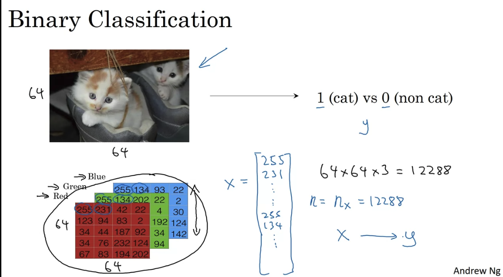
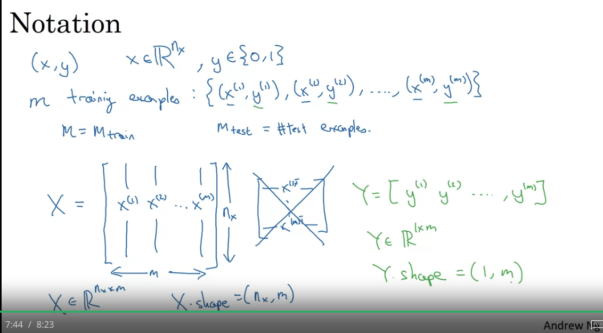

[Coursera course by Andrew Ng](https://www.coursera.org/learn/neural-networks-deep-learning?specialization=deep-learning)

This is a course part of the [Deep Learning Specialization](https://www.coursera.org/specializations/deep-learning#courses)

# Intro to DL

ReLU = Rectified Linear Unit: $max(0,wx+b)$

Hidden Layers of a neural network learn more complex patterns in your data. The magic of NN is that you do not need to learn explicitly what are these patters.

Every hidden layer is a complex function of the input layer.

## Applications of different DL

- Standard NN, Feed Forward NN: Home prices, Ad prediction
- CNN: images
- RNN: sequential data (audie, NLP, language, translation), temporal component


Structured data = tabular

Unstructured data = text, images, audio,

## Why DL is taking off now?


When data is small, the rank of ML/DL algos depends much on your skills on modelling and architecture building. When data is big, usually NN are better.


Innocations:
- More data
- faster computation (CPU, GPU...)
- better algorithms

Sigmoid activation function to RELU the computation is much faster, Relu has gradient 1 for positive values, sigmoid can have gradient close to 0.

# Logistic Regression as a Neural Network

Binary classification of an image - flatten all pixels into one vector




In NN the design matrix would have dimension $nxm$ - it is easier that way (transposed of ML design matrix)



**Logistic regression is just applying sigmoid function to the linear model, $\hat{y} = \sigma(wx+b)$ and using logistic loss function.**


Note in logistic regression we predict $\hat{y} = \sigma(wx+b)$ which represents a probability between 0 and 1. We use the ogistic losss function so that we have a convex cost function. No matter where you initialize, you would reach the global minimum.

**Logistic loss = - Log likelihood**

## Gradient Descent

$w = w-\alpha J'(w)$, where J is the loss function


The gradient is equal to the slope of the tangent function. Math derivation:

Say for $f(x)$ you want to find the tangent line $ax+b$ at point $x_1$

Then $f(x_1) = ax_1+b$ must have one solution. Take derivative of both sides:

$a=f'(x_1)$

Note that at each step we go to the opposite direction of the derivative with a step size of $\alpha$. By the graph above you can see how we slowly go to the optimum value. You can use also only the sign of the derivative. But using the derivative itslef gives you smaller stepsize when you are closer to the optimum value.


Derivative = slope = change in $f$/ change in $x$ = how much $f$ would change if you change $x$ by a little bit. In the picure above if you nudge $a$ by 0.001, then $f$ changes by 0.003

## Computation Graph

NN are organised in terms of:
- forward propagation: compute output of NN
- backward propagation: compute gradient of the loss function with respect to parameters

The computation graph organises these two steps.


Backprogation is just an application of the chain rule.

Changing $v$ by 0.001, $J$ changes by 0.003, hence $dJ/dv = 3$. When you change $a$ by 0.001, $J$ changes by 0.003, hence $dJ/da = 3$. But also changing $a$ changes $v$ which changes $J$. $dJ/da = dJ/dv dv/da$. This is the chain rule.


**Logistic regression computational graph**

$a=\hat{y}$ below

Goal is to compute $dJ/dw$, $dJ/db$, $dJ/dz$, $dJ/da$, where the first two are the gradients of the loss function with respect to the parameters, and the last two are the gradients of the loss function with respect to the intermediate variables.


One step gradient descent for logistic regression gradient descent:


## Vectorization

Great speedups. Instead of looping over all examples, you can do the computation in one go.


**Broadcasting in Python**

Broadcasting copies automatically the vector to the right shape. For example:
 
```python
np.array([1,2,3,4]) + 100 = np.array([101,102,103,104])
np.array([1,2,3,4],[5,6,7,8]) + 100 = np.array([101,102,103,104],[105,106,107,108])
```


$3x4$ matrix division by $1x4$ vector gives $3x4$ matrx


**NOTE on vectors**
Use:
```python
np.random.rand(5,1) # shape is (5,1) - column vector
```

Do not use:
```python
np.random.rand(5) # shape is (5,) - that is nothing
```

Tip:
- add assert statements to check the shape of the vectors
```python
asser (w.shape == (n,1))
```

**Remember:**
- the sigmoid function and its gradient $\sigma'(x)=\sigma(x)*(1-\sigma(x))$
- image2vector is commonly used in deep learning
- np.reshape is widely used. In the future, you'll see that keeping your matrix/vector dimensions straight will go toward eliminating a lot of bugs. 
- numpy has efficient built-in functions
- broadcasting is extremely useful


# Neural Networks Basics

**For one training sample:**

One hidden-layer NN = Two layer NN (inpuut layer is not ussually counted)

First layer: $z^{[1]} = Wx + b$, $a^{[1]} = \sigma(z^{[1]})$

Second layer: $z^{[2]} = Wa^{[1]} + b$, $a^{[2]} = \sigma(z^{[2]})$

Assume we have $n_x$ input features, $n_h$ hidden units, $n_y$ output units. Then the dimensions of the matrices are: $W^{[1]}$ is $n_h$ x $n_x$, $b^{[1]}$ is $n_h$ x $1$, $W^{[2]}$ is $n_y$ x $n_h$, $b^{[2]}$ is $n_y x 1$.

**For multiple training sample:**


This shows why we have the design matrix X dimensions to be dimension x training_samples (mxn)

## Activation functions

- sigmoid: $\sigma(z) = \frac{1}{1+e^{-z}}$ goes between 0 and 1
- tanh: $\tanh(z) = \frac{e^z-e^{-z}}{e^z+e^{-z}}$ goes between -1 and 1
- ReLU: $a = max(0,z)$
- leaky ReLU = $max(0.01z,z)$
tanh would make your hidden layers have mean around 0.

Andrew Ng: "tanhh is almost always better than sigmoid function, except for the output layer where you have to predict 0 or 1. In that case, sigmoid is better. I almost never use sigmoid function as activation function in hidden layers."

**Downside of both sigmoid and tanh is that if $z$ is large than the derivative/slope is almost equal to 0 (vanishing gradient).**


**ReLU has derivate 1 when z is positive and 0 when it is negative. If $z=0$ then the derivative is not defined (which does not happen in practice)**


Rule of thumb: "ReLU is the default activation function to use if you don't know what activation function to use for hidden layers. For output layer, sigmoid for binary classification, sigmoid for multi-class classification, and no activation for regression."

Leaky ReLU is used when you have a lot of negative values in $z$ and you want to avoid the "dead neurons" problem. But in practice ReLU is used more often.

ReLU is used more often than tanh because the slope is very different than 0 for positive values of $z$ and NN learns much faster.

**Sigmoid is almost never used for hidden layers**

**ReLU is the most common activation function**

You need linear activation function for the output layer for regression problems. Otherwise, on hidden layers there is no point using linear activation function because the NN would be just a linear function (compozition of linear functions is linear).

## Derivatives of activation functions

- sigmoid: $\sigma'(z) = \sigma(z)*(1-\sigma(z))$, derivative at 0 is $1/4$
- tanh: $\tanh'(z) = 1 - \tanh^2(z)$, $z = 0$, then $tanh'(z) = 1$


## Gradient descent in NN with 1 higden layer


**NN require random initialization of the weights. If they are all 0-s then all activation functions in one layer would be the same values.**

Initialization when using sigmoid on tanh it might be better to initailize wth random values which are smaller (for large z the derivative vanishes)