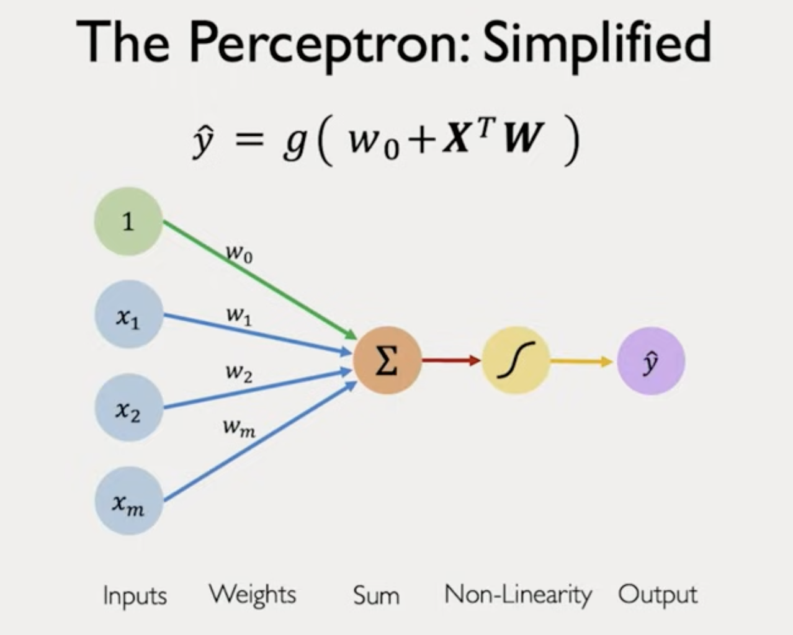
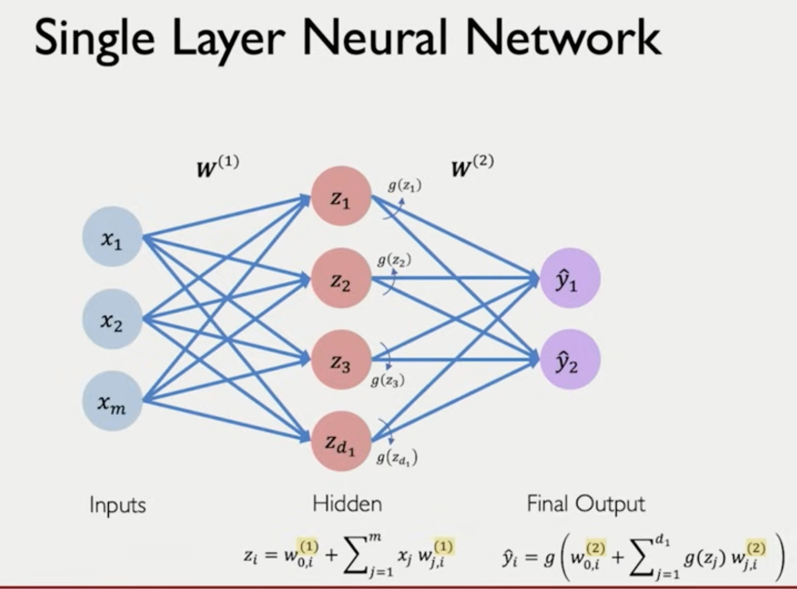
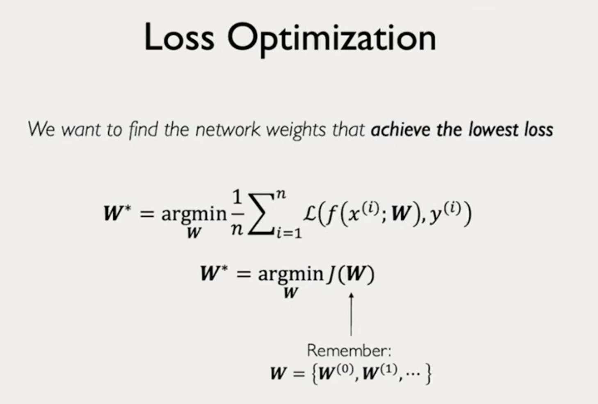
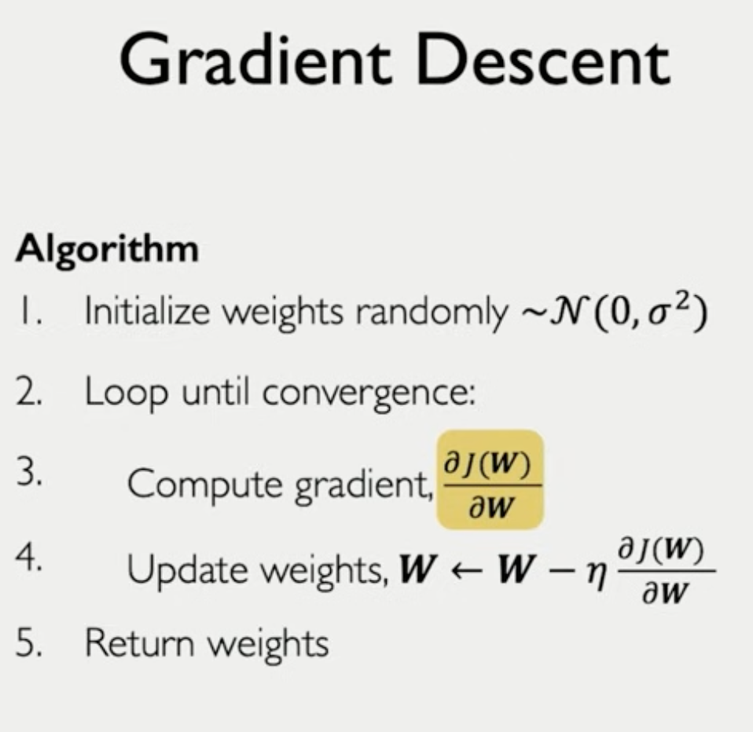
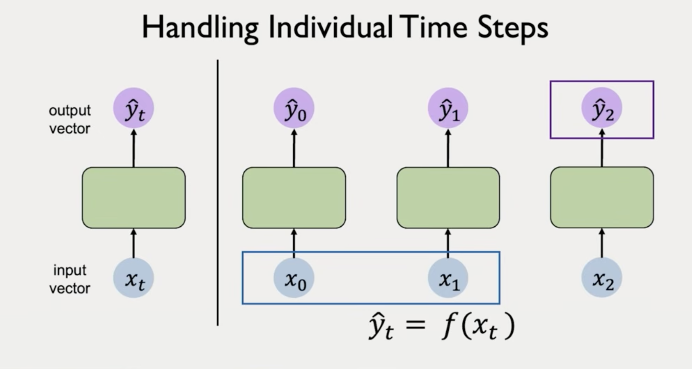
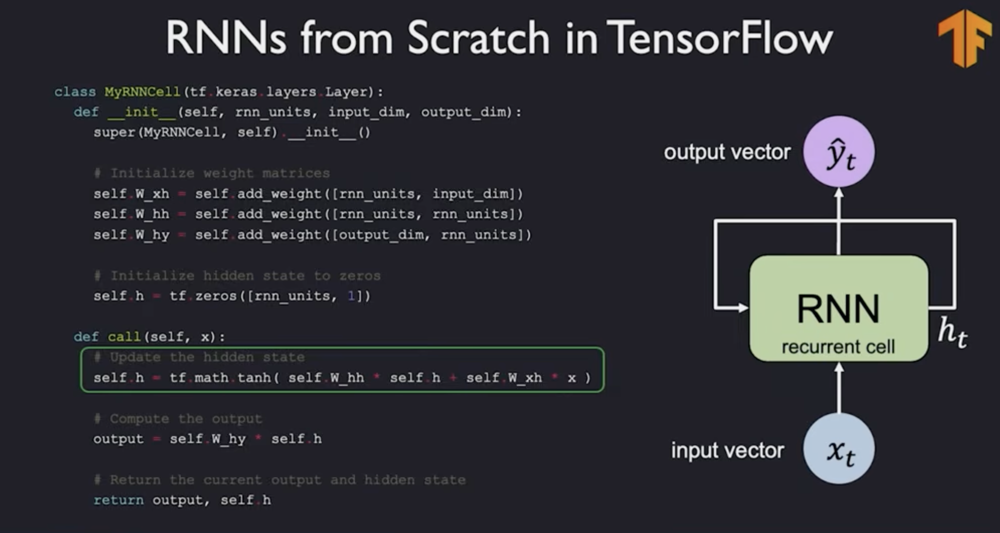
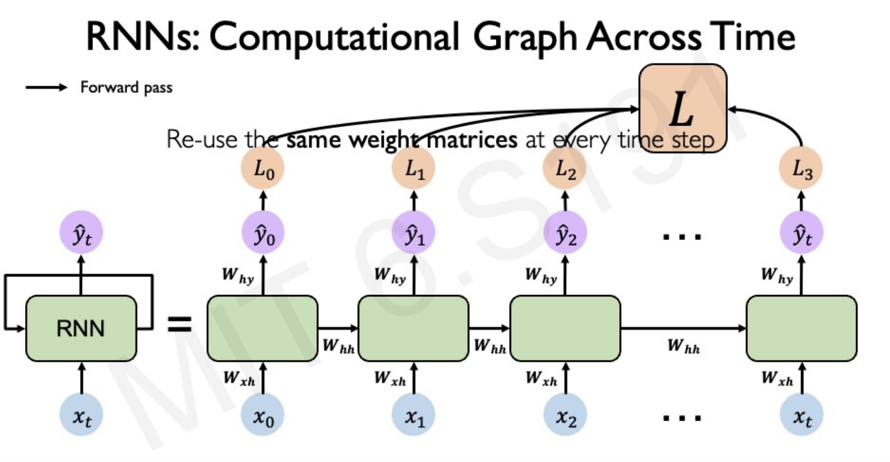
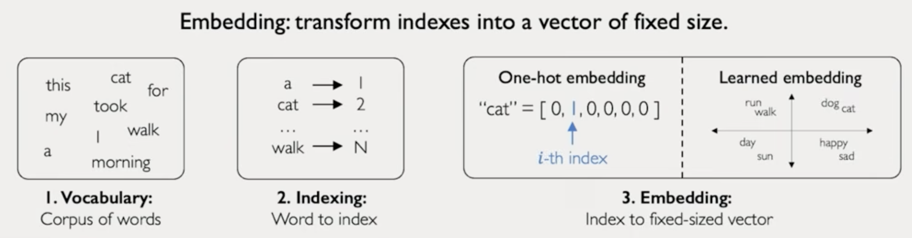
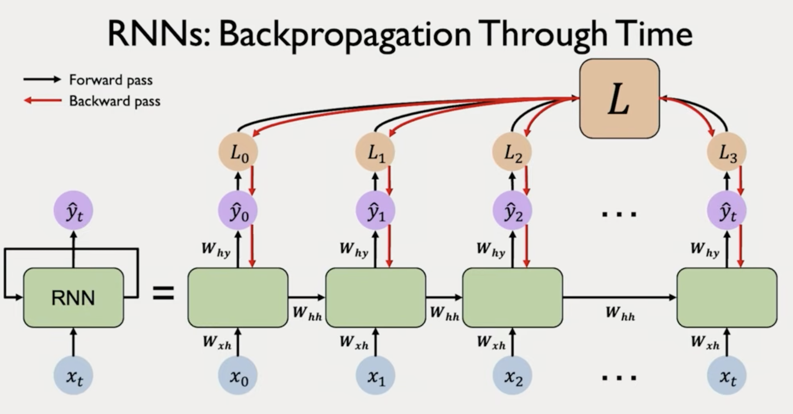
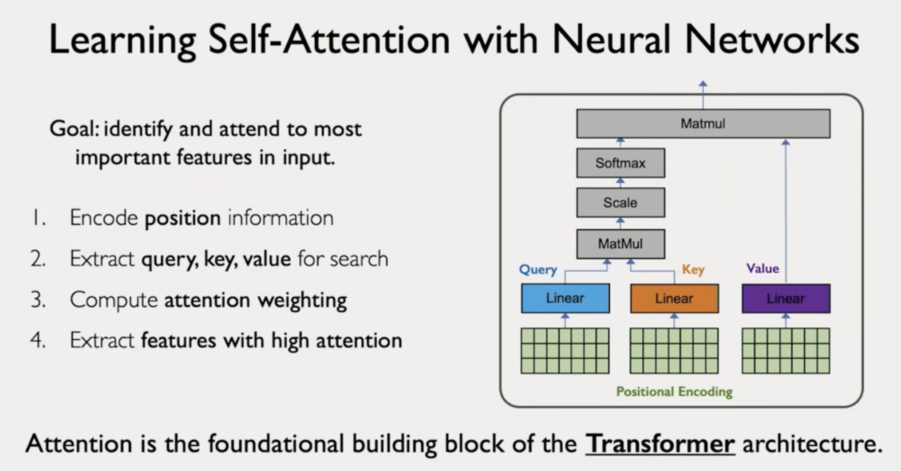

# 6.S191 | MIT Introduction to Deep Learning

- [Official Website](https://introtodeeplearning.com/)
- [GitHub Repo](https://github.com/MITDeepLearning/introtodeeplearning/tree/master)

# Key words
perceptron,feed forward neural network, activation function, weights and bias, sigmoid, relu, hyperbolic, gradient descent, stochastic gradient descent, backpropagation, chain rule, learning rates, adam, adaptive learning rates, overshoot or stuck at local minimum, overfitting, regularization, dropout, early stopping, sequence modeling, rnn, hidden states in rnn?, backpropagation through time, embedding = vectorization, exploding/vanishing gradient, transformer, attention is all you need, 

# Lecture 1: Introduction

Deep Fake vide of Obama. MIT created 2 minutes deep video of OObama saying Welcome to MIT class. In 2020 ot costed 15K $

Intelligence - the ability process information in order to inform some future decision or action

Artificial Intelligence - make computers be able to learn to apply this process.

Machine Learning is a subset of Artificial Intelligence.

Make computers learn and execute tasks from the given data.

## Why Deep Learning

Classical ML works by defining features. For example in image detection we would start defining lines, edges, curves ,eyes, noses, face. We need to define the features from low level to high level. We can't detect faces directly. We built composite features. **Feature Engineering**.

DL automates the process of **feature engineering**. DL has been around for a long time (decades). Why it became popular now?
- More data
- Compute power
- Libraries like tensorflow, pytorch

## The perceptron: Forward propagation

- single neuron
- input vector $x$
- Linear sum using weights and a bias term
- non-linear activation function: sigmoid (good for probabilities), ReLu (piecewise linear, non linear at 0), hyperbolic function

The point of the activation function is to introduce a non-linearity because real data in real world is heavily non-linear.

$\hat{y} = g(w_{0} + x^{T}w)$ 

**dot product, add bias, apply non-linearity**

## Layer

## Deep network

Has many hidden layers

## Loss

Empirical Loss

Loss function = Cost function = Objective function

Cross entropy loss, difference between probabilities. For Binary predictions.

Mean Squared Errors, difference between us functions. For real number predictions.

Our goal is to find a network that minimizes the loss on the given dataset.

Goal is to find all weights.

## Loss optimization

## Gradient Descent

Randomly initialize our weights. Randomly pick a point in our landscape (loss function). Compute the gradient and take the opposite direction of the gradient. Note this is **local optimization**. We go with a small step opposite to the gradient direction. Choosing learning rate = step size.

How do we compute the gradient? the process of computing the gradient is called **backpropagation**.

Derivatives, chain rule

Neural networks are extremely complex functions with complex loss landscapes.

## Learning rate

You don't want to set it too small, because you will be stuck in local minimum.

You don't want it to be too large as you will overshoot and diverge.

### Adaptive Learning Rates

Change the learning rate depending on the landscape
- how fast you are learning
- how steep

## Stochastic Gradient Descent

GD computes the gradient over the entire dataset which can be computationally expensive.

SGD chooses a subset of the data to estimate the gradient

Mini batch Gradient Descent (choose a batch of B data points) to calculate the gradient

Larger batches means you can trust your gradient more and you can use larger learning rate.

If you use 32 data points you can parallelize gradient computation over 32 processors.

## Overfitting

## Regularization

To avoid overfitting.

### Dropout

sets some activation neurons to 0. Forces the network to learn a different pathway. Very power technique as it makes the model that does not rely too much on a fixed set of weights.

Dropout nodes would not have any update, no gradient to compute.

### Early stopping

Stop the training model early.

Training loss always go down.

**In practice you can start plotting this curve and decide when to early stop!**

Ideal Difference between train and test dataset is to be 0. Then you will not know when to stop. This usually happens in Large Language Models. The dataset is so big that the model itself finds it hard to memorize. So the difference between train and test will be almost always 0.

**Language models usually does not the classical overfitting problems.**

# Lecture 2: Recurrent Neural Networks, Transformers, and Attention

## Deep Sequence Modeling

How do we model time series or sequential data in Neural Networks?

**Naive**. We can have our standard feed-forward neural network and put input output $(x_0,y_0),(x_1,y_2)...(x_t,y_t)$

This approach does not take the sequence info, taking past history into the future.

## RNN - Recurrent Neural Networks

We will pass sequentially **hidden state** of the network. Hidden state is a vector that is passed.

## Sequence Modeling Requirements

- Handle **variable-length** sequences. Sentences can be short or long. It is not fixed like image where it had high vs width pixels length
- Handle **long-term** dependency. You can short or long term dependency. Something at the very beginning might dictate the end of the sequence
- Maintain information about **order**
- **Share parameters** across sequence

RNNs can handle the above requirements - though it needs a few upgrades. RNN are in the core of Sequence Modeling

These requirements show why Sequence modeling is rich and complex.

## Example. Predict the next word.

1. We need to represent language to a neural network. We need to vectorize the words as numbers.
- Encode language to neural network
- Embedding: transforming words to vectors
- Vocabulary -> Indexing -> Embedding (one-hot-embedding)

EMBEDDING = VECTORIZATION of words

learned embedding = lower dimensional representation of language

## Backpropagation through time.

Carry partial derivatives from errors late in the sequence to the very beginning. You will have to multiply matrices multiple times and multiply derivatives many times.

- if there are many values > 1 you might have **exploding gradient**
- if there are many values < 1 you might have **vanishing gradient**

This problem exists in very deep feed forward neural networks. Having many layers mean you will multiply the partial derivatives many time.

### Unstable gradients makes it hard to lear long term dependencies.

We cannot pass information from late time steps into initial time steps to promote/update the weights.

Current research upgrades RNN-s to be able to tackle this.

## LSTM, GRU

Ides: use **gates** to selectively add and remove information passed through hidden states. LSTM (long-short term memory) network uses gate cells to pass information throughout many time steps

## Limitations of RNNs

- slow, no parallelization - need to compute derivatives sequentially
- rnn state (hidden state $h_{t}$) is of fixed size. Encoding bottleneck - we have cap on the information we can keep.
- not long term memory

time-step by time-step processing.. brings this bottleneck

Can we eliminate the need for recurrence? Squash all inputs into one vector and put it into one network. The naive approach does not work because it does not carry any time information. We've destroyed any notion of order.

**Idea:** Can we define a way to identify the import parts of a sequence and model out the 

Paper: [Attention is all you need](https://arxiv.org/pdf/1706.03762)

This landmark paper defines what is a transformer.

**GPT:** The T stands for transformer.

Attention: when we look at an image we do not go pixel by pixel and look which are the parts that we attend to.

Finding the most important pixels is just a simple search.s

### Transformers core idea

Goal: Search and attend to the most important features in an input.

1. Encode input (positional encoding) - didn't go into many details into that
2. Compute query, key, value. Use three weight matrices to get each of those. {key:value} are features
3. Compute similarity between query and all keys (dot product divided by scaling)
4. Compute **attention weighting**
5. Extract values from important features

Attention is the building block of transformers.

Self-attention to handle sequence modeling

Self-attention is the basis of many larne language models.

