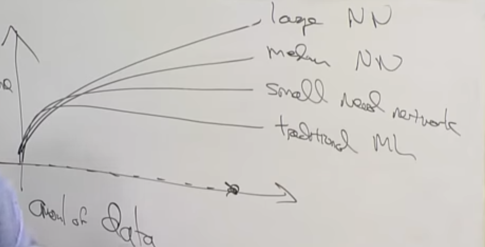
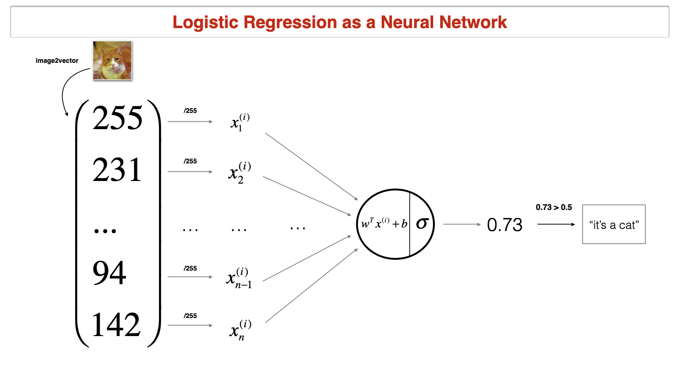
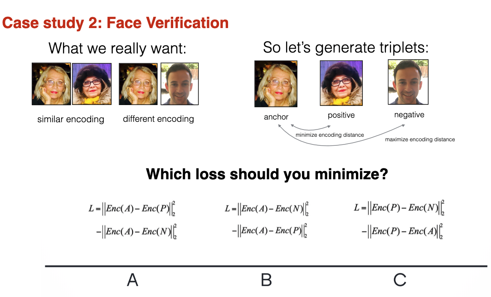
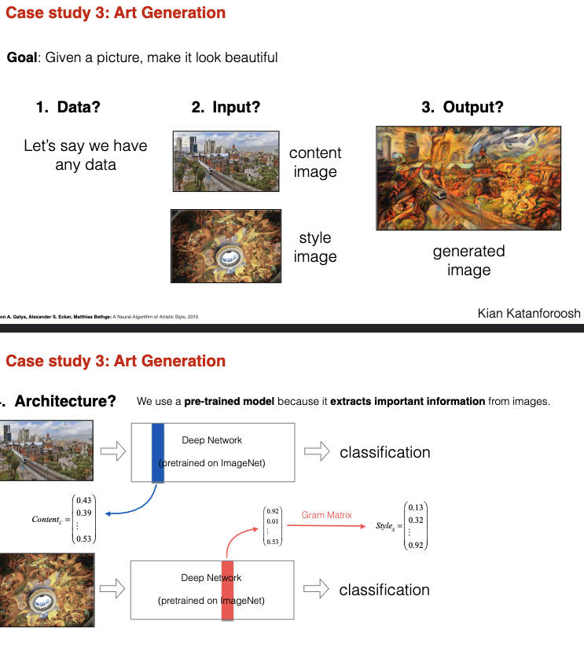
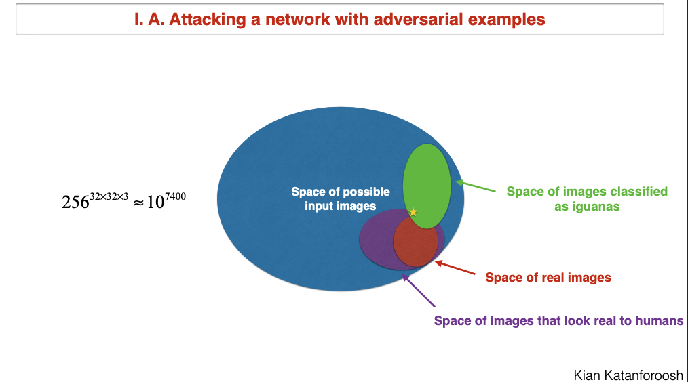
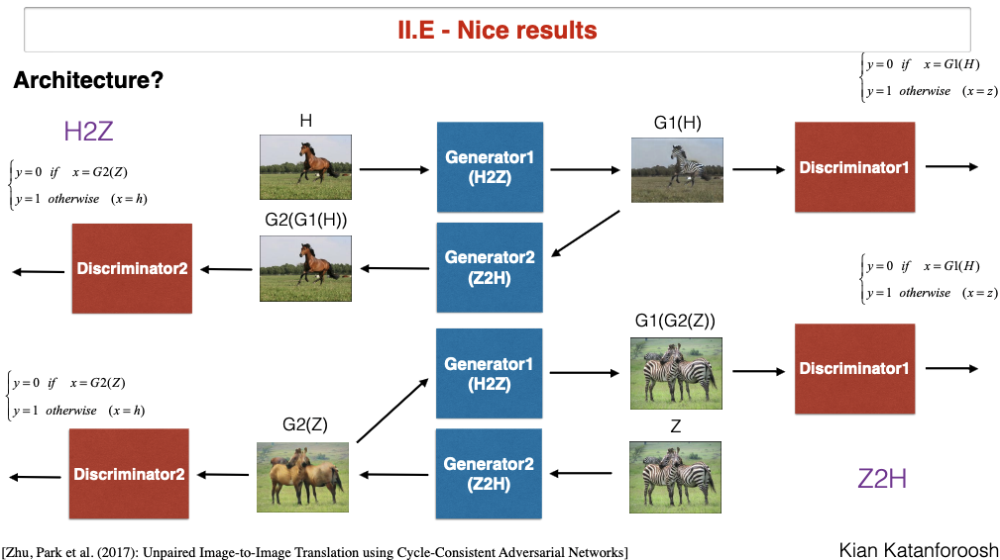

[Stanford DL course](https://www.youtube.com/playlist?list=PLoROMvodv4rOABXSygHTsbvUz4G_YQhOb)

[Syllabus](http://cs230.stanford.edu/syllabus/)

This course is youtube videos + coursera videos. Youtube has deeper insights and coursera is for practice and fundamentals.

# Key messages
- In deep learning, feature learning replaces feature engineering
- Traditional ML performance **platues** at some point and cannnot utilize more data. For NN we have not reached that point yet.
- ML,DL is all about approximating/learning a function.
- Model = Architecture + Parameters
- Gradient evaluated at particular point = slope of the tangent at particular point
- Gradient checking (e.g if the signs changes often) is a good way to see if your optimization of the loss function is divergent.
- Backprogation is just an application of the chain rule.
- ReLU is the most common activation function
- Sigmoid is almost never used for hidden layers, tanh is almost always better choice
- NN require random initialization

# Lecture 1 Deep Learning overview

Deep Learning and Neural Network are almost the same thing. DL is the popular brand word.

Traditional ML performance **platues** at some point and cannnot utilize more data. For NN we have not reached that point yet.



**Fundamental courses:**

- CS229 (ML most mathematical)
- CS299A (Applied ML least mathematical and easiest)
- CS230 (a bit in between, focuses on DL)

Finish C1M1, C1M2 (chap 1 module 2).


# Lecture 2: Deep Learning Intuition

ML,DL is all about approximating/learning a function.

**Model = Architecture + Parameters**

The goal of ML/DL is to find the best parameters for the model.

Example:



**Each hidden layer encodes information from previous layer. E.g in convolutional neural network, each layer encodes more and more complex features. **


## Case study 1: Day and Night classification

**Deep Learning Project choices:**


The problem of clasifying a cat needed 10,000 images. Is the next problem easier or harder? Depending  on the task you want to solve you would know based on past projets how many data point you need.

- train/test split 80/20 is good for 10k images. If I had 1M images I would choose 98/2 split. Test data is to gauge how well the model is doing on real unseen data. You ask yourself how many data points I need to tell my model is doing good (dawn, sunset, sunrise, evening, morning)
- bias you want balanced dataset in train and test
- resolution of images (the smaller the better for computation. 32x32 is better than 400x400) Choose the smallest resolution that human can have perfect performance. If you had unlimited computational power you would choose the highest resolution.


## Case study 2: Face verification

- architecture: encode each image using a DL and then compute distance functions
- In face verification, we have used an encoder network to learn a lower
dimensional representation (called “encoding”) for a set of data by
training the network to focus on non-noisy signals.
- **Triplet loss** is a loss function where an (anchor) input is compared to a
positive input and a negative input. The distance from the anchor input to
the positive input is minimized, whereas the distance from the anchor input
to the negative input is maximized.





## Case study 3: Art generation
- Do not train model, just optimize the cost function by changing pixels (goal is to generate image)
Kian Katanforoosh
- In the neural style transfer algorithm proposed by Gatys et al., you optimize
image pixels rather than model parameters. Model parameters are
pretrained and non-trainable.
- You leverage the “knowledge” of a pretrained model to extract the content
of a content image and the style of a style image
- ImageNet
- Take gradient of loss function with respect to the pixels $x$.




## Case study 4: Trigger word detection (Alexa)

- Your data collection strategy is critical to the success of your project. (If
applicable) Don’t hesitate to get out of the building.
- You can gain insights on your labelling strategy by using a human experiment


# Lecture 3 - Full-Cycle Deep Learning Projects

1. Select problem (e.g. supervised learning)
2. Get data (need to be very strategic in that)
3. Design model
4. Train model (iterative process with point 2 and 3)
5. Test model
6. Deploy
7. Maintain

Five points when selecting a project:
- interest
- data availability
- domain knowledge
- feasibility
- Usefulness

First goal when starting to build a ML system is to get a baseline as fast as possible. Then iterate on that. That is steps 1-5 should be done within a couple of days.

ML developement is an iterative process. Before you start working on it it is difficult to know what are the hard problems you need to tackle

**Tips:**
- keep clear notes on experiments runs
- generally when you have to make choice between multiple options - go with the simpler one first
- in real projects often data change over time. Non-ML models are more robust, ML models often need to be retrained.

edge deployment vs cloud deployment

# Lecture 4 - Adversarial Attacks / GANs

**Discovery: Several ML models, including state-of-the-art neural networks are vulnerable to adversarial examples.**

[Szegedy et al. (2013): Intriguing properties of neural networks]

[Ian J. Goodfellow, Jonathon Shlens & Christian Szegedy (2015): Explaining and harnessing adversarial examples]

## Attacking a network with adversarial examples

What are examples of Adversarial attacks?

Given a network pretrained on ImageNet, find an input image that is not a iguana but will be classified as iguana.

Attack:

1. Start with some image that is not iguana.
2. Use pretrained NN and output a vector of probabilities (cat, dog, iguana..)
3. Compute Loss.
4. Take gradient of loss wrt to the pixels. (backpropagation, need to have access to the model, parameters, layers etc.)
5. Change the image pixels.


You can see that chaning with very little the pixels in the image you can fool the network that the cat is an iguana.



## Defense against a network with adversarial examples

1. Add a SafetyNet - one more NN that will detect adversarial examples. (but it can be fooled as well) [Yuan et al. (2017): Adversarial Examples: Attacks and Defenses for Deep Learning]
2. Train on corrrectly labelled adversarial examples. Generate adversarial examples and train on them.


## Why are NN vulnarable to adversarial examples?

[Adversarial Examples: Attacks and Defenses for Deep Learning](https://arxiv.org/pdf/1712.07107.pdf)

You'd think that NN are vulnaraalbe because they are too complex and overfit the data. But it turns out that the linearity part of the network is the problem.

$y = xw+b$

It is easy to create $x^{*}=x+\epsilon$ which would produce massively different y.

**Fast Gradient Sign Method** is a method to create quickly adversarial examples.

## GAN - Generative Adversarial Networks

The word adversarial is used in different meaning here. In GANs it means that there are two networks that are competing with each other.

GAN-s are networks that generate images that mimic the distribution of the real images/data.

### G/D game

Generator (is what we want to train and generate fake images),

Disriminator


G wants to fool D. D catches fake images. In the beginning it would be very good at catching fake images. But G will learn to generate better images. G and D are trained together.

Min-max trick of chaning the loss function

Saturating cost vs non-saturating cost 

If D does not improve G cannot improve. You can see D as an upper bound on G.


```python
for num_iterations:
    for k in range(k_steps):
        update D
    update G
```

Tips for training GAN-s:
- modify loss function
- keep D up-to-date with respect to G (k update for G and 1 update for D)
- Virtual Batchnorm
- one-sided label smoothing


CycleGAN

image with horses, generate same image with zebra.

Loss function contains all losses from normal gans + cycle loss. 


