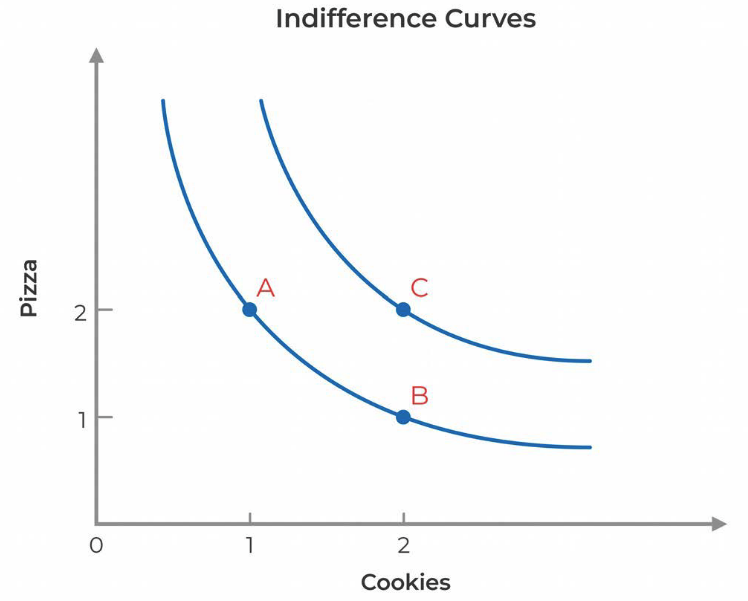
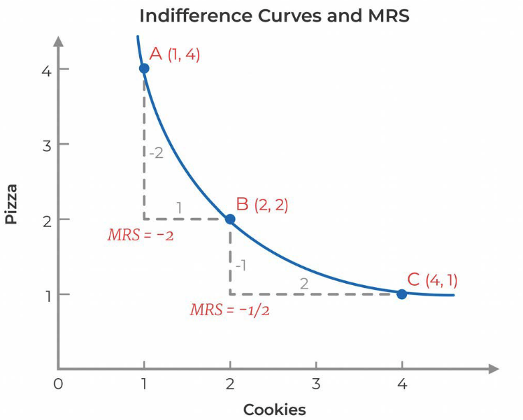

# MIT 14.01 Principles of Microeconomics

# Lecture 1: Introduction and Supply & Demand

I nthis course we understand microeconomics in three ways:
- intuitively
- graphically
- mathematically

## What is microeconomics?

- Microeconomics is a study of how individuals and firms make decisions in a world of **scarcity**.
- Microeconomics = series of constrained optimization exercises
- Microeconomics is a constraied optimization problem
- One of the most important concepts of microeconomics is **OPPORTUNITY COST**
- Every action or inaction has a cost in that you could have done something else instead
- Nothing is free in microeconomics. Everything has a opportunity cost
- Economics is a social science, models are not necessarily 100% correct, but are pretty good.
- Adam Smith is the father of economics
- His book is called the wealth of nations (1776)
- Adam Smith did not use any maths in the book just words but he captured all concepts
- e.g. the 'water and diamond' paradox. Water is way more important than diamonds. It is the building block of our civilization.  First thing you look for in a new planet is water. But water is cheaper than diamond. Why? Supply of water is infinite, diamond is not!
- where supply and demand meet is the market equillibrium
- Positive analysis is the study of things are
- Normative analysis is the study of things should be
- Economics in its core is a right wing science. It is about how the market knows best.
- Adam Smith invisible hand view is that consumers and firms serving their own best interest will do what is best for society. This is the base view of why capilatism works
- 'best for society' defined as most stuff are produced and consumed
- The magic of capitalism. Everybody does the best in their own interest, without caring about anybody else will end up yilding the largest possible productive economy

Why you would not let everything to be decided by the market? I.e. Why allowing people to sell kidney on ebay might be a bad idea?
- Market Failures, fraud, imperfect info
- Inequality (only rich people will have healthy kidney)
- Behavioral Econ, people make mistakes, they might have all the info but still make the wrong decision

# Lecture 2. Preferences and Utility Functions 

**Where does the supply and demand curve come from?**

- Demand curve comes from how consumers make choices
- Supply curve comes from how firms make production decisions

**Utility maximization model**
- This model contains: preferences and budget contraint
- Each model assumptions:
- we have preference assumtions:
    - completeness, you always know what you want. You cannot say I don't know. You can say I am indifferent between two things
    - transitivity, I like a to b and b to c then I prefer a to c
    - non satiation, assuming more is better than less

**Indifference curves**
I am indifferent to having
- 2 pizzas and 1 cookie
- 1 pizza and 2 cookies
- but I strinctly prefer 2 pizzas and 2 cookies
- an indifference curve contain all points to which I am indifferent

Properties of indifference curves:
1. Consumers always prefer higher curves
2. All curves are downward sloping, otherwise non satiations will be violated
3. No two curves cross: transitivity will be violated
4. There is a unique cruve between each set of indifferent points, oterwise completeness will be violated (you cannot know how you feel)

**Utility function**
- Utility function is a way to rank consumer choices
- Marginal Utility is the derivative of the utility function
    - Marginal thinking turns out to simplify economics a lot
    - It is way easier to ask Doyou want the next cookie, than asking how many cookies do you want?
- Principle: utility functions must have diminishing marginal utility (diminishing marginal returns)
- marginal utility is always positive, the more the happier

- Indifference curves are not concave to the origin (proof using diminishing marginal uttility). as you increase the cookies and decrease pizza, you are 
willing to give up more cookies to get another slice of pizza
- MRS = marginal rate of substitution = $delta pizza/delta cookie = -MU_cookie/ MU_pizza$ is the amount of pizza you are willing to give up for an extra cookie, the ratio are flipped. MU_cookie is how much do I want the next cookie, the more I like it the more pizza I'm willing to give
- Example with Utility function = $sqrt(P*C)$

## Example – Pricing of different sizes of goods

Starbucks tall coffee for $2.25 and the next one for 70 more cents. McDonald – Small is $1.22 but for 50 more cents you can double the size. Why do they give twice as much for much less than twice as much money? Its all about diminishing MU, you’re desperate for the first soda on a hot day, but not twice as much for the next glass. Those prices reflect market’s reaction to diminishing MU. If you think about demand and supply, the demand for 1st 16 ounces is higher than the demand for the 2nd 16 ounces, but the cost to produce the drink is the same. Since the demand for the next 16 ounces doesn’t shift twice as much, you can only charge 50 cents for the next 16 ounces. Price increments get smaller because of diminishing MU.

**However**, say you buy breakfast cereal in bulk from costco. Then every day the cereal will be my first cereal and will have high utility to me. There is some diminishin but it is much less. Buing in bulk is much cheaper than buying every day a cereal so why does the market does not factor out the small diminishing return of eating a cereal?

This is related to packaging costs, but also buing in bulk from costco for many things is not much cheaper than buying seperately from supermarkets.
Buing in bulk is cheaper but it is not as nearly as chaper as the staqrbucks and mcdonalds example. When utility diminishess less then they do not want to charge much less for multiple packages. Here we have the factor of parishable and non-parishable goods. When it is parishable then it has diminishing return when it is non-parishable you can 'reset' the utility.