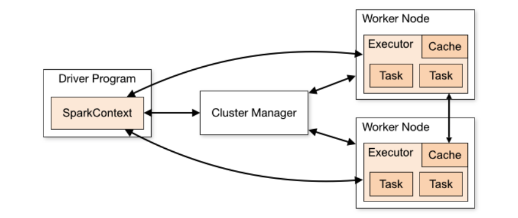

# Pyspark


[Notebook](https://drive.google.com/file/d/1Dz5x9OPOYFs0nczzfeR7QBNY_tbB11v8/view?usp=drive_link)

PySpark is a Python API that allows you to use the power of Apache Spark - fast & scalable big data processing system.
- you write Python code
- PySpark lets tat code run on many computers at once (a "cluster")
- analyze, process and transform huge datasets that would not fit on a single computer's memory
- distributed processing - distribute the data in multiple computers and splits up the work
- supports Pandas like code + SQL queries

# Optimizations


- cache initialized data. Whenever you reuse a dataframe in a for loop 
```python
 
```


# PySpark

Example spark configs:

    spark.executor.memory: 28g
    spark.executor.memoryOverhead: 8g
    spark.executor.cores: 4
    spark.executor.instances: 256 # total number of executors, not needed if using dynamic allocation
    spark.dynamicAllocation.initialExecutors: 64
    spark.dynamicAllocation.minExecutors: 64
    spark.dynamicAllocation.maxExecutors: 256
    spark.driver.memory: 28g # DRIVER!

- spark is a distributed computing framework that allows you to work with large datasets across a cluster of machines/computers
- **worker node** is typically one physical or virtual computer in the cluster
- **driver node** is the main process that coordinates the execution of tasks across the cluster. It is responsible for creating the SparkContext, which is the entry point to using Spark.
- spark executor is a **process** that runs on each worker node in the cluster and is responsible for executing tasks and managing resources. Like a separate Python interpreter that runs on the worker node.
- node can have multiple executors running on it.
- each executor has its own memory and CPU resources allocated to it, which are used to execute tasks in **parallel**.
- **executor.cores**: each executor can have multiple cores (i.e threads) that can execute tasks **concurrently**.
- **executor instances (spark.executor.instances)**: total number of executors (processes) launched on all worker nodes in the cluster.


**Why to choose dynamic allocation?**
- Variable Input Size
- Fluctuating Resource Needs - joins, groupby-s, aggregating and exploding data
- shared, multi-user cluster : release executors when idle so others can use those resources
- cost optimization, not paying for idle resources
- long-running applications, your job scales up and down depending on activity

**When NOT to Use Dynamic Allocation**
- Your resource needs are steady and predictable (and you’re on a dedicated cluster).
- Very short jobs or jobs with very short "bursts" of high demand (executor startup delays can hurt performance).
- You depend on RDD caching across all executors (since dynamic allocation can kill executors, losing cached data).

Driver and Workers:


