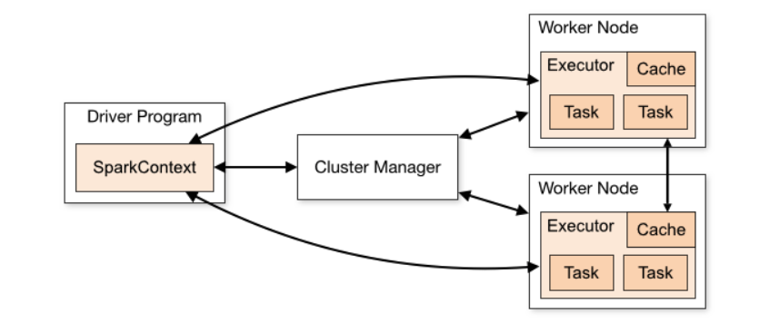

# Spark

**Terminology**
- node = computer (VM, physical machine)
- cluster = group of nodes
- executor = process that runs on a node
- driver = main process that coordinates the execution of tasks across the cluster

**Abstractions**

- every spark application consists of a **driver** program that runs the user's main function and runs a set of **executor** processes in *parallel* on a cluster
- RDD = resilient distributed dataset. This is the main *abstraction* that Spark provides. It is a collection of objects that can be ran in parrallel across a cluster
- Users may ask Sprk to **persis** and RDD in memory
- RDDs automatically recover from node failures
- 2nd *abstraction* that Spark provides is **shared variables** that can be used in parallel operations. There are 2 types of shared variables: **broadcast variables** (shared among all nodes) and **accumulators** (sums,counts)


**RDD Operations**

- RDDs support two types of operations: transformations, which create a new dataset from an existing one, and actions, which return a value to the driver program after running a computation on the dataset. 
- All transformations in Spark are **lazy**
- By default, each transformed RDD may be recomputed each time you run an action on it. However, you may also persist an RDD in memory using the **persist (or cache)** method
- **Shuffle Write** is the amount of data executors had to write to other executors so the other executor could read.
- **Shuffle Read** is the amount of data executors read that was provided by another executor


**Shuffling**
- Shuffling is the process where data is redistributed across different executors (nodes/machines) in the Spark cluster — usually because it needs to group data differently than it was originally stored.
- groupBy, distinct, reduceByKey, sortBy reaarange the data so lal records with the same key (join key) end up on the same partition/executor.
- In ideal cases (no task failures, no data loss, perfect partitioning), **Shuffle Write ≈ Shuffle Read.**


# PySpark

## Properties

- To start a spark session you need to pass a SparkConf file in the SparkContext

**Driver**

- spark.driver.memory = 16g Memory for the driver process (the "main program")
- spark.driver.cores = 4 Number of CPU cores for the driver process

**Executor**
- spark.executor.memory = 28g. Amount of memory for each executor process.
- spark.executor.cores = 4 Number of CPU cores for each executor. Each core can handle up to 7g data in memory
- spark.cores.max = 36. total number of cores in the cluster. So you can have 9 executors with 4 cores each
- spark.executor.instances 0. Static executors to launch. 0 means not set—dynamic allocation will control.

**Executor Dynamic Allocation**
- spark.dynamicAllocation.enabled = true. Let spark dynamically allocate executors based on workload
- spark.dynamicAllocation.maxExecutors = 9 Max number of executors Spark will request dynamically.
spark.dynamicAllocation.executorAllocationRatio
- spark.dynamicAllocation.executorAllocationRatio = 0.8. Allocate fraction of the estimated required executors. Controls aggressiveness to avoid overloading the cluster.
Say you have 100 tasks and an executer on averages executes 4 tasks. So we will need 25 tasks. If we set ratio 0.8, spark will allocate 0.8*25=20 executors

**SQL**
- spark.sql.autoBroadcastJoinThreshold = 134217728 (128MB). If a table is smaller than this, Spark will broadcast it to avoid shuffles in joins.
- spark.sql.shuffle.partitions = 200. After a shuffle operation (e.g join, groupby) Spark will output the data in chunks (number of output partitions)
- Too low number, some executors will be overloaded with large partitions, leadint to slow or skewed jobs or even OOM errors
- Too high number, will lead to scheduling overhead and many small tasks, increasing job time
- A good value is usually 2–4 × total executor cores in your cluster, but it depends on **data size and job characteristics.**

[Notebook](https://drive.google.com/file/d/1Dz5x9OPOYFs0nczzfeR7QBNY_tbB11v8/view?usp=drive_link)

PySpark is a Python API that allows you to use the power of Apache Spark - fast & scalable big data processing system.
- you write Python code
- PySpark lets tat code run on many computers at once (a "cluster")
- analyze, process and transform huge datasets that would not fit on a single computer's memory
- distributed processing - distribute the data in multiple computers and splits up the work
- supports Pandas like code + SQL queries

# Optimizations


- cache initialized data. Whenever you reuse a dataframe in a for loop 
```python
 
```


# PySpark

Example spark configs:

    spark.executor.memory: 28g
    spark.executor.memoryOverhead: 8g
    spark.executor.cores: 4
    spark.executor.instances: 256 # total number of executors, not needed if using dynamic allocation
    spark.dynamicAllocation.initialExecutors: 64
    spark.dynamicAllocation.minExecutors: 64
    spark.dynamicAllocation.maxExecutors: 256
    spark.driver.memory: 28g # DRIVER!

- spark is a distributed computing framework that allows you to work with large datasets across a cluster of machines/computers
- **worker node** is typically one physical or virtual computer in the cluster
- **driver node** is the main process that coordinates the execution of tasks across the cluster. It is responsible for creating the SparkContext, which is the entry point to using Spark.
- spark executor is a **process** that runs on each worker node in the cluster and is responsible for executing tasks and managing resources. Like a separate Python interpreter that runs on the worker node.
- node can have multiple executors running on it.
- each executor has its own memory and CPU resources allocated to it, which are used to execute tasks in **parallel**.
- **executor.cores**: each executor can have multiple cores (i.e threads) that can execute tasks **concurrently**.
- **executor instances (spark.executor.instances)**: total number of executors (processes) launched on all worker nodes in the clust
- If using dynamic allocation, leave spark.executor.instances unset or set min/max via:
```
spark.dynamicAllocation.enabled=true
spark.dynamicAllocation.minExecutors
spark.dynamicAllocation.maxExecutors
```


**Why to choose dynamic allocation?**
- Variable Input Size
- Fluctuating Resource Needs - joins, groupby-s, aggregating and exploding data
- shared, multi-user cluster : release executors when idle so others can use those resources
- cost optimization, not paying for idle resources
- long-running applications, your job scales up and down depending on activity

**When NOT to Use Dynamic Allocation**
- Your resource needs are steady and predictable (and you’re on a dedicated cluster).
- Very short jobs or jobs with very short "bursts" of high demand (executor startup delays can hurt performance).
- You depend on RDD caching across all executors (since dynamic allocation can kill executors, losing cached data).

Driver and Workers:




# Example optimization

Hey! After some experiment runs I've updated and chose these spark parameters

        spark.executor.memory: 28g
        spark.executor.memoryOverhead: 3g
        spark.executor.cores: 4
        spark.dynamicAllocation.initialExecutors: 8
        spark.dynamicAllocation.minExecutors: 8
        spark.dynamicAllocation.maxExecutors: 32
        spark.driver.memory: 28g
Run log

Run time 360 seconds, cost 1.41$ (previously it was 7$)

CPU average usage by the whole Pod is~30-40%. I won't decrease more the amount of executors since 8 to 32 dynamically allocated is already low compared to other jobs in this service.

Memory average usage by the whole Pod is 50-65% - this is ok since we want some room left

I use dynamic number of executors instead of fixed since CAPI has variable size input (as we onboard/churn clients num conversions can change a lot, matches data also depends a lot on the quality of the conversion client send to us which can vary over time). Also there are a few joins/groupbys in the DQS job that require variate amount of resources

Spark recommends memoryOverhead of executor to be about 6-10% of the container size = spark.executor.memory + spark.executor.memoryOverhead. I chose ~10% to be on the safe size


# Spark Monitoring

