# MIT 6.046J - Design and Analysis of Algorithms

Lecture [notes](https://ocw.mit.edu/courses/6-046j-design-and-analysis-of-algorithms-spring-2015/). All notes + your marks in one place [here](https://github.com/ngocuong0105/dendron-wiki/blob/main/vault/assets/files/Engineering/Lectures/Design%20and%20Analysis%20of%20Algorithms%20MIT.pdf)


Lecture [videos](https://www.youtube.com/watch?v=2P-yW7LQr08&list=PLUl4u3cNGP6317WaSNfmCvGym2ucw3oGp)


**Overview of course:**
- Divide and Conquer (Merge Sort classic example, Fast Fourier transform, algorithm for convex hull, van Emde Boas trees)
- Amortized analysis, random algos, quick select,quick sort skip lists, perfect and universal hashing
- Optimization (greedy (Dijkstra), dynamic programming, shortest paths)
- Network Flow (network, capacities, max flow - min cut problem)
- Linear Programming
- Intractability (polynomial vs exponential time problems, approximation problems)
- Synchronous, Asynchronous algos, Cryptography, Cache

# Lecture 1. Interval Scheduling

*Very similar problems can have very different complexity*. Wiki problem [definition](https://en.wikipedia.org/wiki/Interval_scheduling#Group_Interval_Scheduling_Decision).

Polynomial: Shortest path between two vertices. O(V**2)

NP: Determine if a graph has Hamiltonian cycle: Given a directed graph find a simple cycle that contain each vertex V.

NP-complete are the hardest problems in NP. Solve a NP-complete in polynomial time, then you can solve all NP problems.

---

Given an array of intervals `[(s1,f1), (s2,f2) ... ]` - left closed, right opened. Select the maximum number of non-overlapping intervals.
This problem should not be confused with meeting rooms [problem](https://leetcode.com/problems/meeting-rooms-ii/) where we find minimum
conference rooms needed (time with max overlap). The latter is line sweep.

**Claim** We can solve this problem using a greedy algorithm.

**Definition** A greedy algorithm is a myopic algorithm that processes the input one piece at a time with no apparent look ahead.

Non-working greedy heuristics:
- pick shortest intervals
- pick intervals with least amount of overlaps. Counter example:

```
---- ---- ---- ----
  ----- ---- ----
  -----      ----
  -----      ----
  -----      ----
```
Working greedy heuristic:
- pick earliest finish time

*"Proof by intimidation, proof because the lecturer said so"*

**Proof by induction**

Claim: Given a list of intervals `L`, greedy algorithm with earliest finish time produces `k*` intervals, where `k*` is maximum

Induction on `k*`! Induction on the number of optimal intervals.

1. Base case `k* = 1`. Any interval can be picked up.
2. Suppose claim holds for `k*` and we are given a list of intervals whose optimal schedule has `k*+1` intervals $(s_1,f_1), ... (s_{k*+1},f_{k*+1})$

Run our greedy algo and get intervals $(a_1,b_1), ... (a_{k},b_{k})$. $k$ and $k*$ are not comparable, yet. By construction $b_1 <= f_1$. Thus $S = (a_1,b_1), ... (s_{k*+1},f_{k*+1})$ is another optimal solution of size $k*+1$. Let $L'$ be the set of intervals where $s_i > b_2$. $S$ is optimal for $L$ then $S' =  (s_2,f_2)... (s_{k*+1},f_{k*+1})$ is optimal solution of $L'$ and has size $k$. By initial hypothesis we run greedy on $L'$ and produce
$(a_2,b_2), ... (a_{k},b_{k})$ of size $k-1$. Then $k-1 = k*$ and proves the when we run greedy and get $(a_1,b_1), ... (a_{k},b_{k})$ is also optimal solution.


---

Problem. Weighted interval scheduling. Each interval has a weight $w_i$. Find a schedule with maximum total weight.

*Greedy does not work here, need to use DP*

$O(n^2), O(nlogn)$

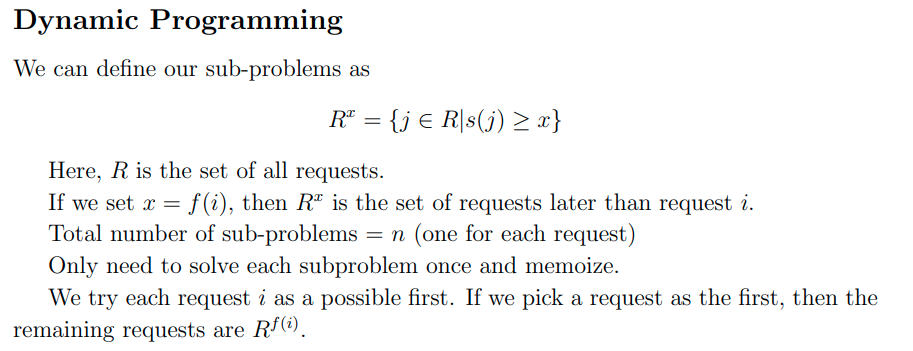

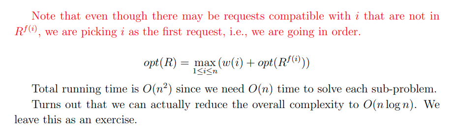

---

NP-complete problem. Generalization of the problem considers $k > 1$ machines/resources.Here the goal is to find $k$ compatible subsets whose union is the largest. First example had k = 1.

In an upgraded version of the problem, the intervals are partitioned into groups. A subset of intervals is compatible if no two intervals overlap.

# Lecture 2. Divide & Conquer: Convex Hull, Median Finding

Divide and Conquer Paradigm: Given a problem of size $n$:
1. Divide it into $a$ subproblems of size $n/b$ where $b > 1$ so that your subproblems have smaller size.
2. Solve each subproblem recursively
3. Combine solutions of subproblems into overall solution (this is where the smarts of the algo is).

Run-time: $T(n) = aT(n/b) + MergeWork$. Often to compute $T(n)$ you can use **Master Theorem**.

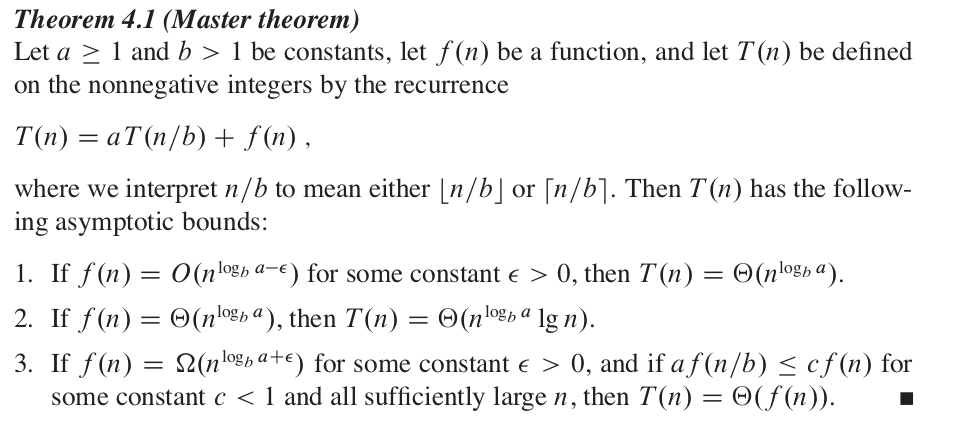

---

**Convex Hull Problem**

Given $n$ points in a plane $S = \{ (x_i,y_i) | i = 1, 2, ..., n\}$ assume no two have the same $x$ coordinate and no two have the same $y$ coordinate and no three line on the same line. The convex hull is the smallest polygon which contains all points in $S$.

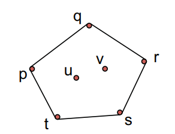

Simple algorithm:
- For each pair of points draw a line.
- This line separates the plane in two half-planes.
- Check if all points lie in one side on the half-plane. If yes, this line is part of the convex hull (we call it a segment of the convex hull), otherwise it is not a segment.

Run-time: $O(n^2)$ pairs of points, $O(n)$ to test $= O(n^3)$ runtime.

Divide and Conquer algo:

1. Sort the points by x coordinates.
2. For input set $S$, divide into left half $A$ and right half $B$ by $x$ coordinates.
3. Compute convex hull for $A$ and for $B$.
4. Combine solutions.

**Obvious algorithm** looks at all $a_i, b_j$ pairs and takes $T(n) = 2T(n/2) + O(n^2) = O(n^2)$ runtime


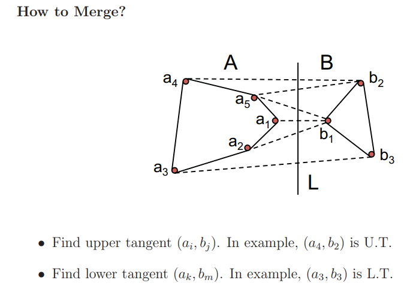

Find upper, and lower tangent using two finger and a string algorithm. Compute intercept of the vertical line and all $(a,b)$ points. Algo [demo](https://youtu.be/EzeYI7p9MjU?list=PLUl4u3cNGP6317WaSNfmCvGym2ucw3oGp&t=2161).

*Merge step:*
After you find the tangents $(a_i,b_j)$ and $(a_k,b_m)$ you link $a_i$ to $b_j$ go down all $b-s$ till you see $b_m$, then link to $a_k$ then go up through all $a-s$ till you see $a_i$.

**Run time**

$T(n) = 2*T(n/2) + O(n) = O(nlogn)$

Other Convex Hull solutions:

- [dbabichev](https://flykiller.github.io/patterns/geometry) chain multiplication?


---

**Median Finding Algorithm**

It is just quick-select algo. Randomized pivot point has $O(n)$ expected run time and $O(n^2)$ worse case. Smart pivot point is a deterministic algo (groups of 5 elements, median of medians)  has $O(n)$ worse case time. See CLRS for detailed algo (deterministic) $O(n)$ time to find median.

# Lecture 3. Divide & Conquer: Fast Fourier Transform

Polynomial of order $n-1$ $A(x) = a_0 + a_1x + a_2x^2 + ... + a_{n-1}x^{n-1}$

Operations on polynomial:
- evaluation $A(x_0) = ?$. Use **Horner's rule** to do it in $O(n)$. $A(x) = a_o + x(a_1 + x(a_2 + ... (xa_{n-1})))$ - $n$ multiplications and additions
- addition $O(n)$
- multiplication $A(x)*B(x) = C(x)$, The coefficients of $C$ are $c_k = \sum_{j = 0}^{k} a_jb_{k-j}$ and that takes $O(k)$ time, so in total brute force multiplication of polynomials takes $O(n^2)$ run time.

Polynomial multiplication is the same as doing **convolution** between vectors.
```
u = [1 1 1];
v =  [1 1 0 0 0 1 1];
1  1  1 -> 1
   1  1 1 -> 2
      1 1 1 -> 2
conv(u,v) =  [1     2     2     1     0     1     2     2     1]
```
$u$ moves as a filter through $v$. Think convolutional neural networks! In polynomial multiplication $a = u, b = v$

**Polynomial representation**
- coefficient vector = $(a_0,a_1 ... a_{n-1})$
- roots $r_0, r_1, ..., r_n$ (allowing multiplicity). $A(x) = c(x-r_0)(x-r_1)..(x-r_{n-1})$
- samples/points (x_k,y_k) for $k = 0, 1 .. ,n-1$ for $A(x_k) = y_k$ has unique solution by the Fundamental Theorem in Algebra

By FTA $n-roots$ allowing multiplicity define uniquely the polynomial.

root representation is not good. Hard to go from polynomial to root representation. Addition is also very hard. Multiplication is easy.


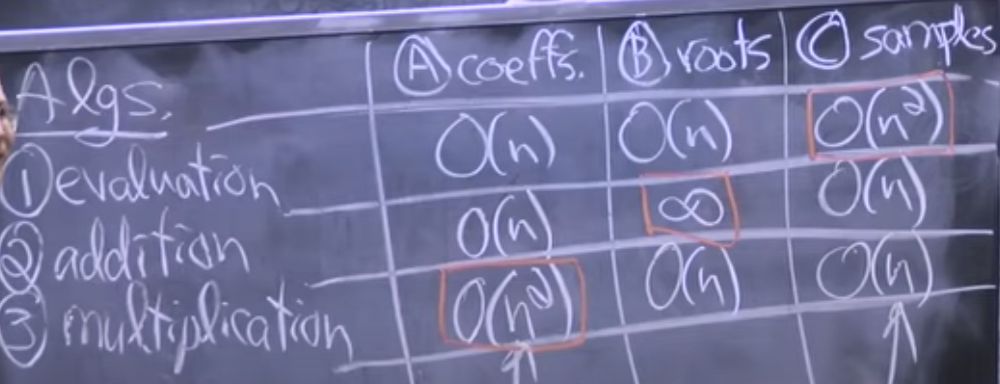

No representation is perfect! Our aim is to convert from coefficient to sample representation in $O(nlogn)$ time using Fourier transform.

*Coefficient repr -> Samples repr* can be done in $O(n^2)$ trivially

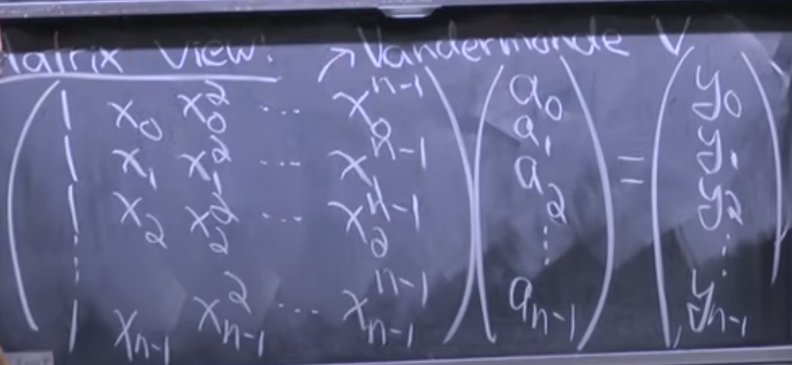

- $V * A$ gets you the sample representation on $O(n^2)$
- Samples to coefficients ($V$ and $y$ are known how would you find $a$):
  - [Gaussian elimination](https://en.wikipedia.org/wiki/Gaussian_elimination) $O(n^3)$
  - Multiply by inverse $V^{-1} * y$ - $O(n^2)$ computing inverse once and use for free.

**Divide & Conquer Algorithm**

We have coefficient representation and want to get samples in $O(nlogn)$ time.

$A(x) = (a_0,a_1,a_2...a_{n-1})$

1. Divide into even and odd coefficients.

$A_{even} = \sum_{k=0}^{n/2} a_{2k}x^{k} = (a_0,a_2...)$

$A_{odd} = \sum_{k=0}^{n/2} a_{2k+1}x^{k} = (a_1,a_3...)$

2. Conquer: Recursively compute $A_{even}(z)$ and $A_{odd}(z)$ for $z \in \{x^2: x\in X\}$

3. Combine: $A(x) = A_{even}(x^2) + xA_{odd}(x^2)$

*Run time*

$T(n,|X|) = 2*T(n/2,|X|) + O(n+|X|))$


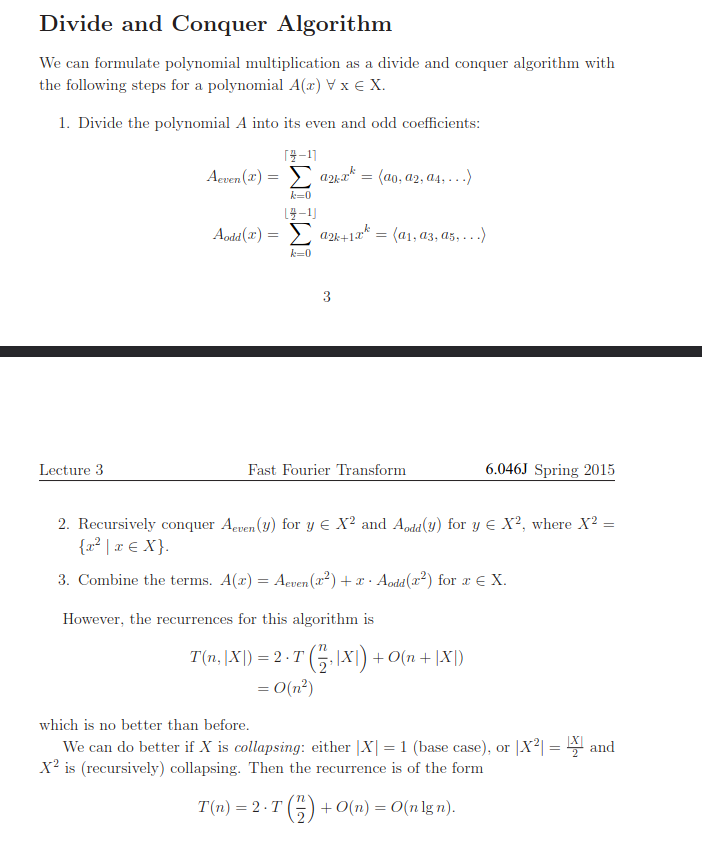

To get **collapsing** set $X$:

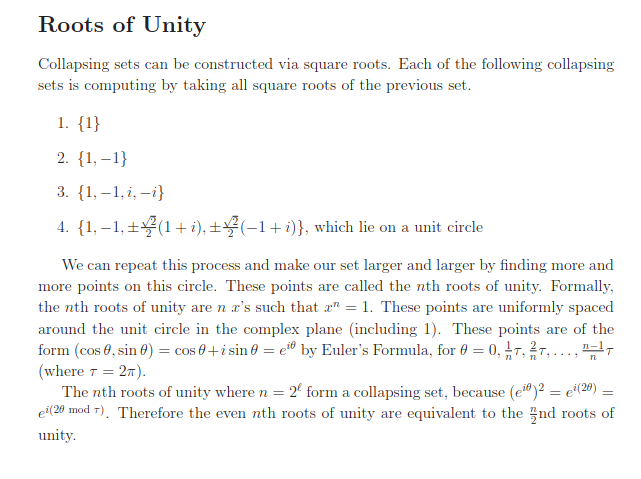

[dbabichev](https://flykiller.github.io/patterns/number%20theory) FFT implementation.

`np.convolve` is much slower as it does not use FFT. `scipy` has convolve function and uses FFT.

# Lecture 4. Divide & Conquer: van Emde Boas Trees

Emde Boas Tree.

**Goal**: Maintain $n$ elements among $\{ 0, 1, ... u-1\}$ subject to insert, delete, successor (given a value I want to know the next greater value in the set). We know how to do all these in $O(logn)$ time using balance BST-s (AVL, Red-Black). Emde Boas Trees can doo these in $O(loglog[u] )$ which is an exponential improvement.

**Intuition:** Binary search on the levels of the tree where the number of levels is $log(u)$

Can we do better than $O(log(n)))$ and does not depend on the universe of numbers $\{ 0, 1, ... u-1\}$? **No.**

In each of previous tree data structures, where we do stuff dynamically, at least one important operation took $O(log(n)))$ time, either worst case or amortized. In fact, because each of these data structures bases its decisions on comparing keys, the $O(nlog(n)))$ lower bound for sorting tells us that at least one operation will have to take $O(log(n)))$ time. Why? If we could perform both the INSERT and EXTRACT-MIN
operations in o.lg n/ time, then we could sort $n$ keys in $o(nlog(n)))$ time by first performing $n$ INSERT operations, followed by $n$ EXTRACT-MIN operations.


First attempt to store an array of size $n$ with elements among the set $\{ 0, 1, ... u-1\}$:

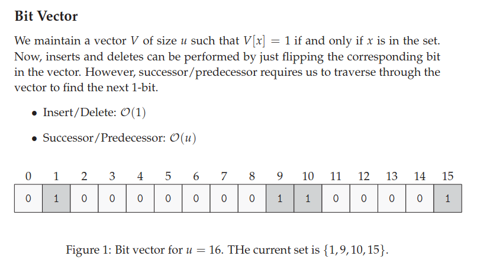

Insert and Delete are constant, Successor is linear.

Second attempt:

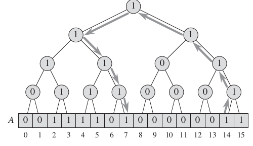


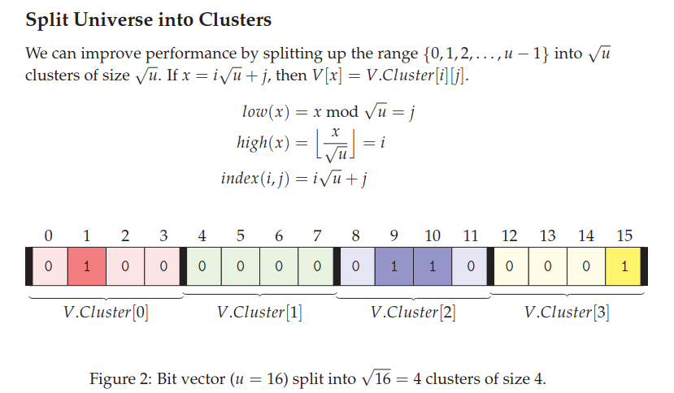

Think each cluster as a binary tree built bottom up using the OR operation. All roots of the different clusters will be a 'summary' vector. As this vector will tell you if there is a one in each of the clusters.

Insert is constant - need to change the value in the clusters and mark in the summary vector.

Successor is:

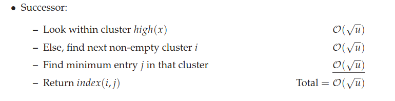


We have not yet improved the runtime complexity. Van Emde Boas is to create clusters which are recursive and depend on other clusters.

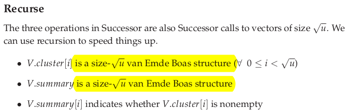


Code implementation details look at the lecture and your notes [here](https://github.com/ngocuong0105/dendron-wiki/blob/main/vault/assets/files/lecture4_emde_boas.pdf).

# Lecture 5: Amortization

So far learning fancy cool data structures. This lecture is on fancy cool techniques of computing complexity of data structures.

Amortized analysis is used to compute complexity of **data structures**. It computes the total run time of a data structure given $n$ executed operations. Amortized analysis is not used in computing run time of algorithms.

**Table doubling**

That's how dynamic arrays work in Python.

Assume a table of size $m$. We will double the size of the table whenever it is full. For $n$ insertions the total running time is:

$O(2^0 + 2^1  + ... 2^{log(n)}) = O(n)$. Thus amortized (i.e.) per insertion it is $O(n)/n = O(1)$.

**Techniques of amortized analysis:**

- aggregate method
- accounting method
- potential method

All these method give upper bounds to the actual cost of all operations = amortized cost.

**Aggregate method**

This is what we did in table doubling. Added total cost of $n$ operations then divided by $n$.
NB: Often when you have a data structure with total of $n$ insert and delete operations you can just think of $n$ insert operations because each element can be deleted at most the number of times it has been inserted.

**Accounting method**

Store credit bank account which should always be **non-negative**. When you do an operation you pay for the operation and can deposit money in you account.

Example. Table Doubling.

- If insertion does not trigger table doubling: I would pay 1 coin for the insertion plus c coin deposit.
- If insertion trigger table doubling: I can pay from the bank account to cover the table doubling.

- amortized cost for table doubling when the table becomes of size $2*n$ is $O(n) - c * n/2 = O(1)$ for chosen large enough $c$. When table doubles from $n$ to $2n$, only last $n/2$ places have coins.

- amortized runtime per insertion $1+c = O(1)$


Aside. Table expansion and contraction have insert and delete operations in $O(1)$ amortized if:
- table doubling when table is full
- table contraction by a halve when there are $m/4$ elements in the table of size $m$

To prove this is indeed $O(1)$ amortized you need the Potential method.

**Potential method**

Define a *potential (energy) function* $\Phi$ which maps each data structure $D_i$ to a nonnegative integer. Check CLRS for more details and proof of Table doubling and halving is $O(1)$.

# Lecture 6: Randomized Algorithms

Randomized algorithm is one that generates a random number $r$ and makes decisions on $r$'s value.

On same input and on different execution randomized algos may:
- run a different number of steps
- produce different output

Two types of random algos:
- Monte Carlo - runs in polynomial time always output is correct with **high probability**
- Las Vegas - runs in **expected** polynomial time output is always correct

**Monte Carlo = probably correct**
**Las Vegas = probably fast**

Monte Carlo is for estimation stuff to get almost correct values.

Las Vegas example is quick sort - $O(nlog(n))$ expected time. 'Almost sorted' does not make sense.


**Problem. Matrix Product Checker**

Given $nx$n$ matrices $A, B, C$ the goal is to check if $A$ x $B=C$. We use randomized algo so that we do not checkout the full multiplication.

**Freivalds' algorithm**

Procedure:

1. Generate an $n × 1$ random $0/1$ vector $r$ .
2. Compute $P = A × (Br) - Cr$
3. Output "Yes" if $P = ( 0 , 0 , … , 0 )$; "No," otherwise.


If $A × B = C$ , then the algorithm always returns "Yes". If $A × B \neq C$ then the probability that the algorithm returns "Yes" is less than or equal to one half.

By iterating the algorithm $k$ times and returning "Yes" only if all iterations yield "Yes", a runtime of $O(k n^2)$ and error probability of $<= 1/2^k$ is achieved.

*Proof that $P($false negatives$) \leq 1/2$*. Idea is for every bad $r$ which does not catch that $AB - C \neq 0$ we create a good $r$ and have 1-1 mapping. See your [notes](https://github.com/ngocuong0105/dendron-wiki/blob/main/vault/assets/files/Engineering/Design%20and%20Analysis%20of%20Algorithms%20MIT.pdf).


**Paranoid Quick Sort**

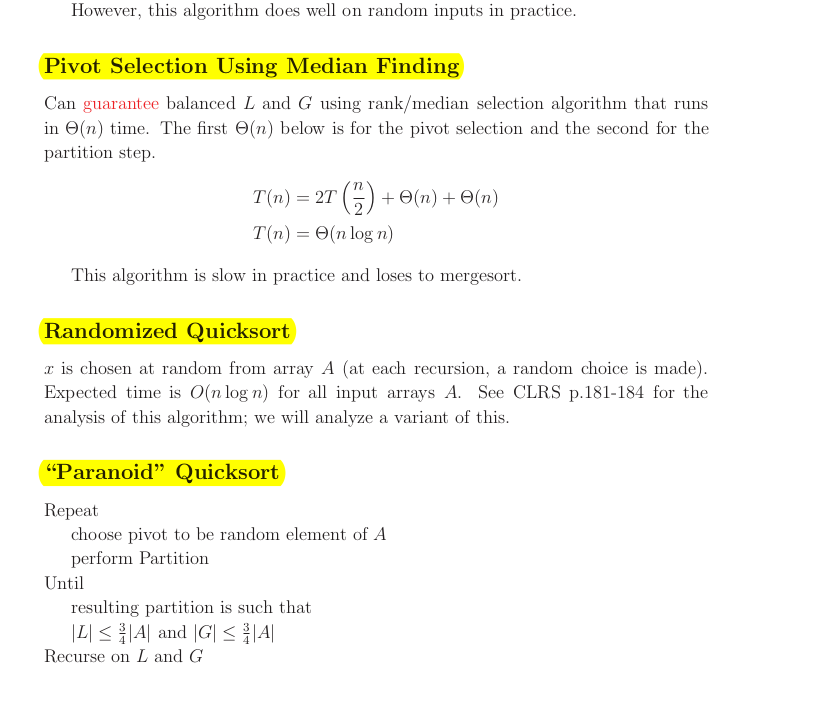

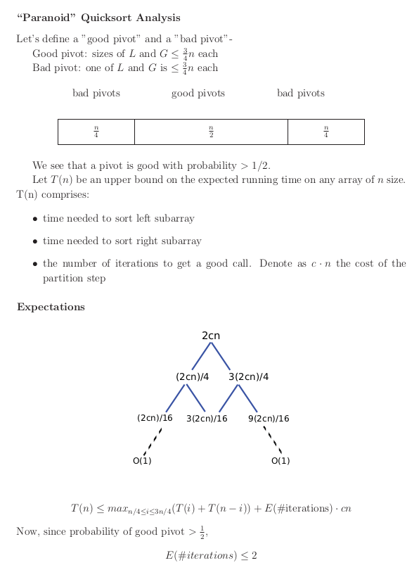

Paranoid Quick sort is probably fast with expected running time $O(nlog(n))$.

# Lecture 7 Randomization: Skip Lists

 A skip list a **probabilistic** data structure that allows $O(log(n))$ search, insert, delete within a set of $n$ elements. It maintains a linked list hierarchy of subsequences with each successive subsequence skipping over fewer elements than the previous one. In the example below we insert 80.

Comparing with treap and red-black tree which has the same function and performance, the code length of Skiplist can be comparatively short and the idea behind Skiplists is just simple linked lists.

 

Design a skip list, [leetcode](https://leetcode.com/problems/design-skiplist/).

**Motivation for skip lists.**

Step 1. Linked list - search is $O(n)$

Step 2. Sorted Linked list - search is still $O(n)$

Step 3. Two sorted Linked list, where the second one is a subsequence (express line) and skips elements.

Step 4. Add $log(n)$ layers of linked lists

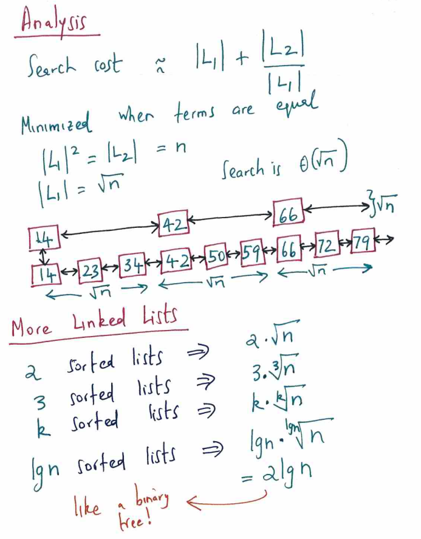


- Insert is randomized using a fair coin
- Search and Delete are deterministic


**Why skip lists are good?**

**Warm-up Lemma,** The number of levels in $n-$element skip list is $O(log(n))$ with high probability, that is as $n$ grows we the probability converges to 1. This is stronger than having expected running times stuff where you have no guarantees of how likely the worst case is.

With this lemma we can say thing like:
- number of levels in the skip list is at most $2log(n)$ with $90\%$ probability
- at most $4log(n)$ with $99.9\%$ probability etc

**Proof.**
$P(>= clog(n) levels) = P($some element got $>=clog(n)$ promotions $) = (1/2)^{clog(n)} \leq \dfrac{n}{n^c} = \dfrac{1}{n^{c-1}}$


**Search**

Theorem.  Any search in $n$-element skip list costs $O(log(n))$

Steps:
1. We track the search moves **backwards**
2. Backwards search makes up and left moves each with probability 1/2
3. Number of ups is less than number of levels  $\leq c(log(n))$ with high probability
4. The BUM: Total number of moves = number of coin flips until you get $c(log(n))$ heads (up moves)

Claim: Number of coin flips until we see $c(log(n))$ heads is $O(log(n))$ with high probability.

We need to proof that for to see $clog(n)$ heads, there exist a constant $d$ such that if $Y$ is a random vairable counting the number of heads after $dlog(n)$ coin flips then $P(Y < clog(n)) = \dfrac{1}{n^{\alpha}}$. Idea is to use [Chernoff bound](https://en.wikipedia.org/wiki/Chernoff_boundhttps://en.wikipedia.org/wiki/Chernoff_bound).

# Lecture 8: Randomization: Universal & Perfect Hashing

**Buzz words:** Hashing with chaining, open addressing, load factor $n/m$, Simple Uniform Hashing assumption, Hash functions, linear probing, quadratic probing, universal hashing, perfect hashing

**Dictionary problem.** Abstract Data Type (Math definition, interface):
- maintain a dynamic set of items
- each item has a key, item is a key value pair
- insert(item)
- delete(item)
- search(key)

Goal is to run all 3 operations in $O(1)$ expected time (amortized).

In MIT 6.001- [[engineering.MIT.Introduction to algorithms]] you saw hashing with chaining and open addressing. you proved that the insert, delete and search take $O(1+\dfrac{n}{m})$, where n is the number of elements you have in the table and m is the number of slots (table size, number of buckets). So as long as you chose $m = O(n)$ (you can keep that dynamically using  table doubling and shrinking) you would have $O(1)$ operations.

However, you **assumed** that you have **simple uniform hashing**. That is your keys are mapped at each slot of the table with probability $O(\dfrac{1}{m})$ So you had to choose a smart hashing function that would map your keys uniformly. However you want, a hashing function that work work well no matter what the keys are. That is in the worst case scenario for the keys you still want $O(1)$ operations. Our analysis in MIT 6.001 considered average case scenario, where for random keys we would have simple uniform hashing.

Want to avoid the assumption that the keys are random.

**Universal Hashing**

Works for dynamic sets - allows insert and delete
- choose $h$ randomly from a hash family $H$.
- assume $H$ ti be universal hash family:
  - for all keys $k,k'$: $P(h(k)=h(k')) \leq \dfrac{1}{m}$, probability over choosing $h$.

You can prove using indicator variables that $E($number of keys hashing to the same place as $k_i) \leq 1+n/m$

*Dot product hash family*
- assume $m$ m is prime
- assume $u = m^r$ for integer $r$
- view key $k$ in base $m$, $k = (k_0,k_1, .. k_{r-1})$
- for a key $a = (a_0, .. a_{r-1})$ define $h_a(k) = (a \times k) \mod m$ (dot product)

$H = \{h_a| a \in 0...u-1\}$. To choose random $h_a$ choose a random $a$.

Another universal hashing family:


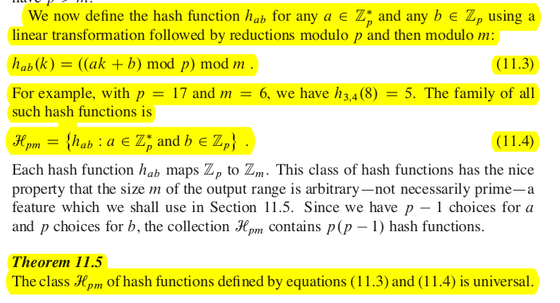

We achieved $O(1)$ expected time for all operations.

**Perfect Hashing**

This works for static keys and support search only. It is perfect hashing because it achieves $O(1)$ search worst case, that is keys are stored perfectly with no collisions.

- polynomial build time with high probability
- worst case $O(1)$ run time
- worst case memory $O(n)$

Idea: Use 2-level hashing.

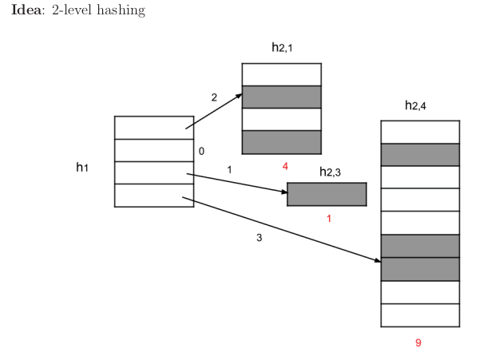


# Lecture 9: Augmentation. Range Trees


**Easy Tree Augmentation.**

The goal here is to store $x.f$ at each node $x$, which is a function of the node, namely $f($subtree rooted at $x)$. If $x.f$ is computable **locally** from its children then updates take $O(h)$ runtime where h is the height of the tree. To update $x.f$, we need to walk up the tree to the root.

**Order-statistic trees.**

ADT (interface of the data structure):
- insert(x), delete(x), successor(x)
- rank(x)
- select(i): find me the element of rank i

Want all of these in $O(log(n))$


We can implement the above ADT using easy tree augmentation on AVL trees (or 2-3 trees or any balance BST) to store subtree size: $f($subtree$)$ = $#$ of nodes in it.

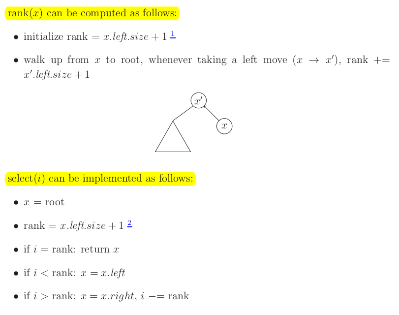

NB: Need to choose augmentation functions which can be maintained easier such as subtree size. Above we could thing to store the rank of each node (rank and select would be very easy). However if you insert elements it would be $O(n)$, e.g. if you insert a minimum element you need to update all node ranks.


#TODO Finger Search Trees (this is tree augmentation on 2-3 threes)


**Range Trees**

Solves the problem orthogonal range search.

Suppose we have $n$ points in a $d$-dimension space. We would like a data structure that supports range query on these points: find all the points in a give axis-aligned box. An axis-aligned box is simply an interval in 1D, a rectangle in 2D, and a cube in 3D.

Goal is to run in $O(log^d(n) + ($ output size $))$.

NB: Our data structure would be static and support only search points in box query.

**1D case**

We have array `[a_1,a_2...a_n]` and for a query `search(x,y)` we want to output all numbers in the array which are in the interval `[x,y)`. Simple solution is to use sorted array and then do binary searches in $O(log(n))$.

Sorted arrays are inefficient for insertion and deletion. For a dynamic data structure that supports range queries such as AVL, Red-Black trees.

However, neither of the above approaches generalizes to high dimensions.

**1D range trees**

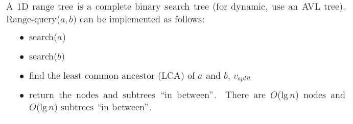

That is like doing rightful rank for node $a$ and left rank for node $b$.

**Analysis.** $O(lg n)$ to implicitly represent the answer (showing just the roots). $O(lg n + k)$ to output all k answers. $O(lg n)$ to report k via subtree size augmentation.

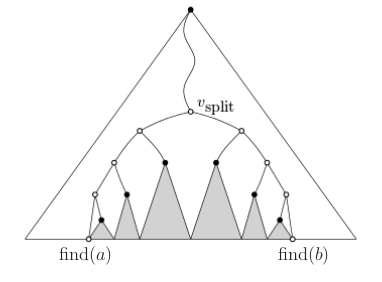

**2D range trees**

Create a 1D range tree on the x coordinates. Do a search to find $O(lg(n))$ nodes which satisfy the interval provided by the $x$ coordinate. **Data Augmentation**: for each of these trees we store another range tree on the y coordinate. So we have dictionary with keys being the nodes of the first range tree, and values is range tree by the y coordinate. There is lots of data duplication. Then you do a little search on the $y-coordinate range tree$. Run time $O(log^2(n))$

Space complexity is $O(n lg n)$. The primary subtree is $O(n)$. Each point is dupli­cated up to $O(lg n)$ times in secondary subtrees, one per ancestor.

*Aside*

Range trees are used in database searches. For example if you have 4 columns in a database and you do searches like col1 should be inside one interval col2 in another interval, etc. range trees would allow fast queries. This is called indexing in database columns.


# Lecture 10: Dynamic Programming. Advanced DP

We consider 3 problems:

- longest palindromic subsequence
- optimal binary search tree
- alternating coin game

**DP steps**:
1. Determine Subspace of problems
2. Define Recursive relation based on optimal solutions of subproblem
3. Compute value of an optimal solution (bottom-up, top down)
4. Construct optimal solution from computed information (typically involves some backtracing)

**Longest Palindromic Sequence**
Given a string $s$ find the longest subsequence which is a palindrome (not necessarily contiguous).

*Solution*
```python
# O(n**2)
def solve(s):
    @cache
    def dp(i,j):
      if i == j: return 1
      elif  i > j: return 0
      if s[i] == s[j]: return 2 + dp(i+1,j-1)
      return max(dp(i+1,j),dp(i,j-1))
```

Run time = Number of subproblems * Time per subproblem (assumes lookup is $O(1)$)

If you use arrays for lookup you would have constant access, in hash tables you get it constant amortized (collisions).


**Optimal Binary Search Trees**

Given keys $K_1, K_2 ... K_n$, where $K_1 < .. < K_n$ WLOG $K_i = i$. There are many different BST-s with these set of keys.
We assign weights for each of these keys $W_1,W_2 ... W_n$. You can think that the weights are probabilities of searching each of the keys (search probabilities). Find/construct a BST that minimizes:

$\sum W \times ($ depth $(K_i)  + 1)$.

The root has depth 0. Application: needs a structure which would minimize the expected search cost.


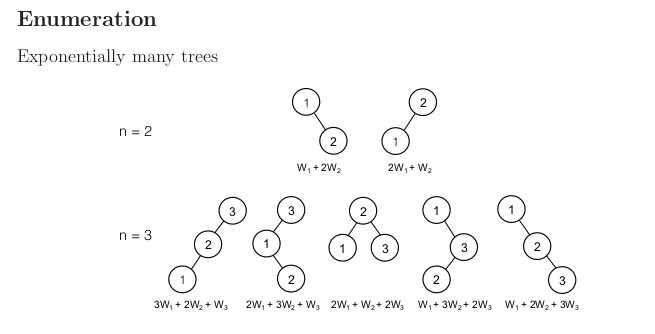


Before doing DP, try greedy!

We choose the root $K_r$ to be the key with largest weight. Then you know which nodes are on the left and which on the right. Continue do greedy approach in recursive fashion. But this does not work:

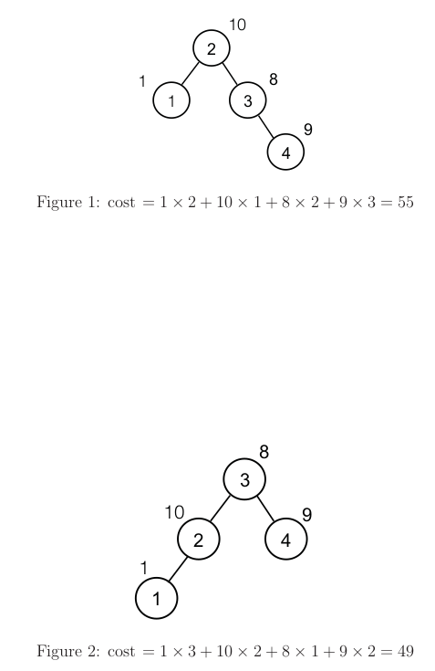


**DP solution**

Subproblem space $e(i,j) =$ cost of optimal BST on $K_i, K_{i+1} ... K_j$

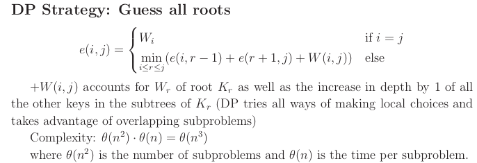


**Alternating Coin Gamse**

Row of $n$ coins of values $V_1, ... , V_n$, where $n$ is even. In each turn, a player selects either the first or last coin from the row, removes it, and receives the value of the coin

The first player never looses (win or equal)! He can make it so that he pick all values on odd indices or on even indices, depending which sum gives the larger sum.


How to maximize the amount of money won assuming you move first?

Subproblem space: $V(i,j)$ is the max value we can definitely win if it is *our* turn and only conis $V_i .. V_j$


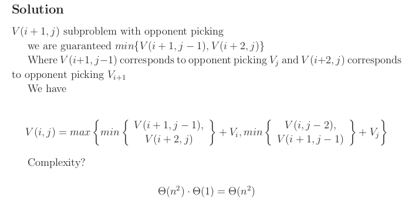

[leetcode](https://leetcode.com/problems/stone-game/)


# Lecture 11. Dynamic Programming. All-Pairs Shortest Paths

Two types of shortest path problems:

- single source (from one source $s$ find the shortest path to all vertices $v \in V$)
- all pairs shortest path

The problem with one source and one destination cannot be solved faster than the single source shortest path, so when you solve it you would use the single source shortest path solutions such as Dijkstra and Bellman Ford.

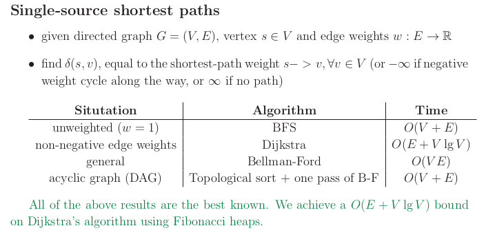

Note that Dijkstra works only for non-negative weights. It is a type of **greedy algorithm**.

Bellman Ford works for general graphs. It is a DP algo.


**APSP = All pairs shortest path**

One way to solve this problem is to run $V$ times Dijkstra or Bellman Ford.


DP First attempt.

If your subproblem space is $dp[u][v]$ that is shortest path from $u$ to $v$, then you would not have a DAG subproblem space! Enter an infinite recursion when trying to resolve your subproblems.

Natural improvement of subspace is $dp[u][v][m] = $ weight of shortest path from $u$ to $v$ $\leq m $ edges.

Below are the 5 steps of DP thinking from Eric:


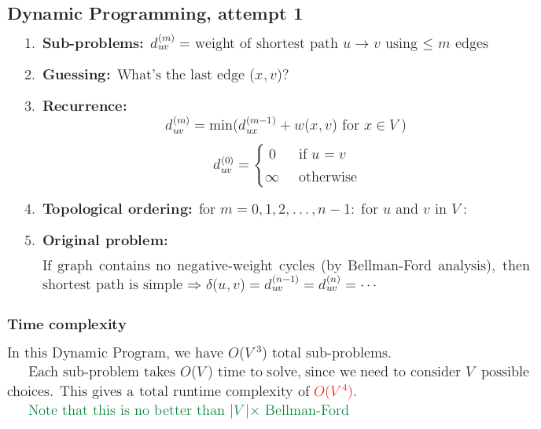

```python
# Bottom-up via relaxation steps
for m = 1 to n by 1
  for u in V
    for v in V
      for x in V # this is the min step
        if duv > dux + dxv # can put wxv too
            duv = dux + dxv
```

Runtime is $O(V^4)$, which is the same as running $V$ time Bellman Ford.


**Matrix Multiplication**

Given $n \times n$ matrices $A$ and $B$ compute their product $C = A \times B$.

- $O(n^3)$ standard algo
- O(n^{2.807}) via Strassen

Matrix multiplication is the same as the above recurrence relation

$c_ij = \sum_k a_{ik} \dot b_{kj}$ is similar to $d_{uv} = min(d_ux + w(x,v))$ for $x \in V$

Define the summation operand to be a min, and the multiplication operand to be $+$.

We can **redefine** the DP problem using Matrix multiplication language.

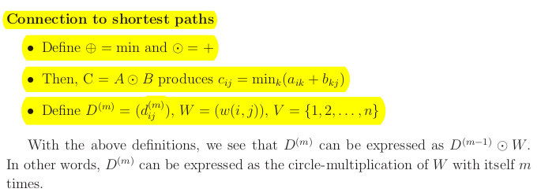

The shortest distance matrix we want to compute $D^m$ equals $W^m$ where the powers is defined in circle land.

All pairs shortest path problem requires computing $W^n$ in circle land. Single matrix multiplication is $n^3$, hence total complexity is $O(V^4)$ - same algo as above just expressed in another language. However with matrix multiplication you can use **repeated squaring** trick and get running time $O(n^3lgn)$.


**Floyd-Warshall**

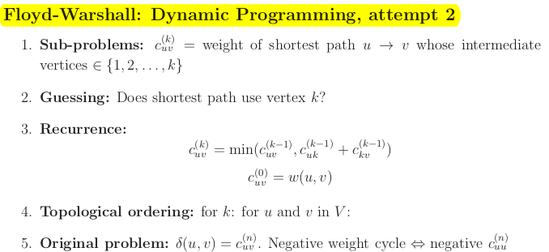

```python
C = (w(u, v))
for k = 1 to n by 1
  for u in V
    for v in V
      if c uv > c uk + c kv
        c uv = c uk + c kv

```

Run time $O(V^3)$

**Jonhson's algorithm**

Idea is to do graph re-weighting so that we have nonnegative weights and run Dijkstra. Shortest paths are preserved.


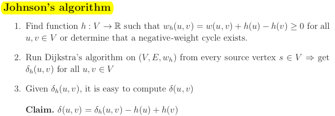

*How to find a function* $h$?

You want to find $h$ which satisfies $h(v) - h(u) \leq w(u,v)$ for all $(u,v) \in V$. This is called a **system of difference constraints**. 

**Theorem.** If there is a negative-weight cycle, there there exist **no** solution to the above system.


**Theorem.** If $(V, E, w)$ has no negative-weight cycle, then we can find a solution to the difference constraints.

**Proof by example.** Add new vertex (source) $s$ and connect it to any other vertex and add 0 weights. Compute single source shortest path from $s$ and get $dist[s][v]$ for every $v \in V$. This is your function $f$. Prooved by triangle inequality.

**Time complexity**

1. The first step involves running Bellman-Ford from s, which takes $O(V E)$ time. We also pay a pre-processing cost to re-weight all the edges $(O(E))$.

2. We then run Dijkstra’s algorithm from each of the $V$ vertices in the graph; the
total time complexity of this step is $O(V E + V 2 lg V )$

3. We then need to re-weight the shortest paths for each pair; this takes $O(V^2)$ time.


The total running time of this algorithm is $O(V E + V^2 lg V)$.

# Lecture 12: Greedy Algorithms. Minimum Spanning Tree

- Prim's algorithm
- Kruskal's algorithm

Recall that a greedy algorithm repeatedly makes a locally best choice or decision, but ignores the effects of the future.

**Minimum spanning tree problem.**

A *spanning tree* of a graph $G$ is a subset of the edges of $G$ that form a tree and include all vertices of $G$. Given an undirected graph $G = (V, E)$ and edge weights $W : E → R$, find a spanning tree $T$ of minimum weight sum $\sum w(e)$. We take some edges of the graph, hit all vertices and minimize the weight sum.


**Properties of a greedy algorithm:**

- Optimal Substructure: the optimal solution to a problem incorporates the optimal solution to subproblem(s)
- Greedy choice property: locally optimal choices lead to a globally optimal solution

In DP you would do guessing, unlike greedy where you are greedy and take the best local option.

**Lemma 1.** If $T'$ is a minimum spanning tree of $G/e$, then $T' \cup {e}$ is an MST of $G$.

*Contract edge $e$ - idea*. This is to combine two nodes into one and solve the smaller problem.

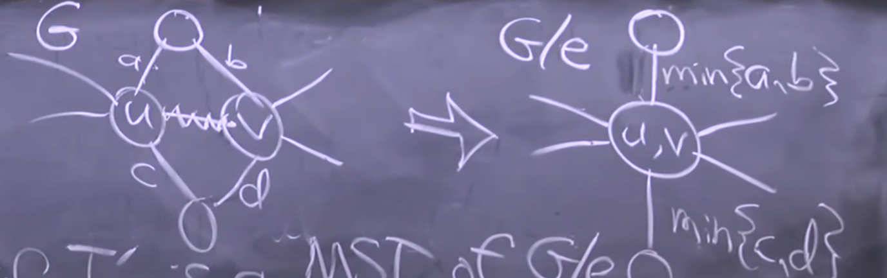

The statement can be used as the basis for a dynamic programming algorithm, in which we guess an edge that belongs to the MST, retract the edge, and recurse. At the end, we decontract the edge and add e to the MST. The lemma proves correctness of the algo but it would be exponential. At each step you guess one random edge of all possible edges.

**We need an intelligent way to choose edge $e$**.


**Lemma 2** (Greedy-Choice Property for MST). For any **cut** $(S, V \ S)$ in a graph $G = (V, E, w)$, any least-weight crossing edge $e = {u, v}$ with $u \in S$ and $v \in S$ is in some MST of $G$.

**This lema is your golden ticket to use greedy algo.**


**Prim's algorithm**

It is Dijkstra like.

Idea is to start with one vertex $s$. This is your initial cut $s$ vs the rest.

```Python
def dist(a,b):
    return abs(a[0]-b[0]) + abs(a[1]-b[1])
h = [(0,0)] # dist,s
edges = {s:float('inf') for s in range(len(points))}
edges[0] = 0
parent = {}
visited = set() # keeps track of your cut, in Dijkstra you do not need that
while h:
    d,s = heappop(h)
    visited.add(s)
    for u in range(len(points)):
        if u not in visited and dist(points[u],points[s]) < edges[u]:
            edges[u] = dist(points[u],points[s])
            parent[u] = s
            heappush(h,(edges[u],u))
# edges has the weights of the MST tree
```
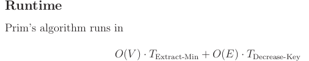

Runtime just like Dijkstra.

**Kruskal's Algoritm**

Kruskal constructs an MST by taking the globally lowest-weight edge and contracting it.

```
sort the edges in nondecreasing weights
for edge in edges:
     add edges consecutively to the DSU in this order (keep tree)
```
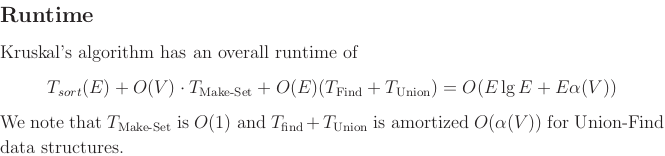

# Lecture 13: Incremental Improvement. Max Flow, Min Cut

All about **Ford-Fulkerson** max-flow algorithm and Max Flow - Min Cut Theorem.

## Flow network

Definition. A flow network is a directed graph $G = (V, E)$ with two distinguished vertices: a source $s$ and a sink $t$. Each edge $(u, v) \in E$ has a nonnegative capacity $c(u, v)$. If $(u, v) ∉ E$,
then $c(u, v) = 0$.


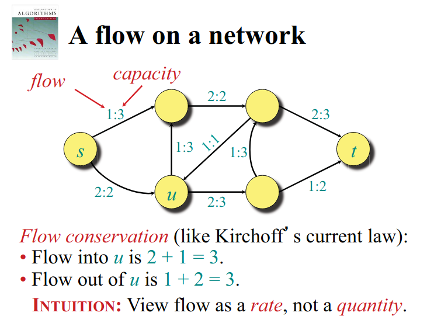

**Maximum-flow problem** Given a flow network $G$, fund a flow of maximum vale on $G$ = max flow rate you can send from source to the sink.

**Net Flow**

A net flow on $G$ is a function $f: V \times V -> R$ satisfying:
- capacity constraint: for all $u,v \in V$: $f(u,v) \leq c(u,v)$
- skew symmetry: for all $u,v \in V: f(u,v) = -f(v,u)$
- flow conservation: for all $u \in V - \{s, t\}$: $\sum f(u,v) = 0$

**Definition** The **value** of a flow $f$, denoted by $|f|$ is given by $|f| = \sum_{v \in V} f(s,v) = f(s,V)$

We use *implicit* summation notation. Example for writing flow conservation:

$f(u,V) = 0$ for all $u \in V - \{s,t\}$.

**Theorem** The value of a flow satisfies: $|f| = f(V,t)$, what goes out of the source equals what enters the sink.
**Proof.**

$|f| = f(s,V) = f(V,V) - f(V-s,V) = 0 + f(V,V-s) = f(V,t) + f(V,V-s-t) = f(V,t)$ (last step by conservation law)


**Cuts**

Definition. A cut $(S, T)$ of a flow network $G = (V, E)$ is a partition of $V$ such that $s ∈ S$ and $t ∈ T$. If $f$ is a flow on $G$, then the flow across the cut is $f(S, T)$.

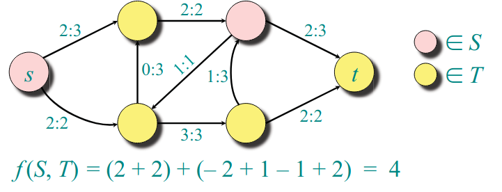

**Lemma** For any flow and any cut $(S,T)$ we have $|f| = f(S,T)$
**Proof**  $f(S,T) = f(S,V) - f(S,S) = f(S,V) = f(s,V) + f(S-s,V) = f(s,V) = |f|$

You've got a flow, the flow of the value is the flow value of the cut, as long as you have the source in one place of the cut and the sink on the other part of the cut.


Note $f(S-s,V) = 0$ because $S$ does not contain $t$ and we use flow conservation.

**Definition** The capacity of a cut $(S,T)$ is $c(S,T)$

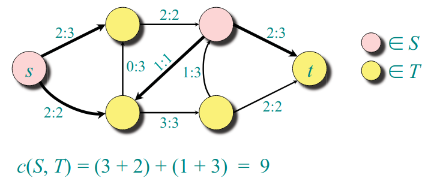

Upper bound on the maximum flow value:
**Theorem**. The value of any flow is bounded above by the capacity of any cut.

Residual network points you where in the network you have free capacities to put flow through. It has the same vertices as the original graph but different edges.

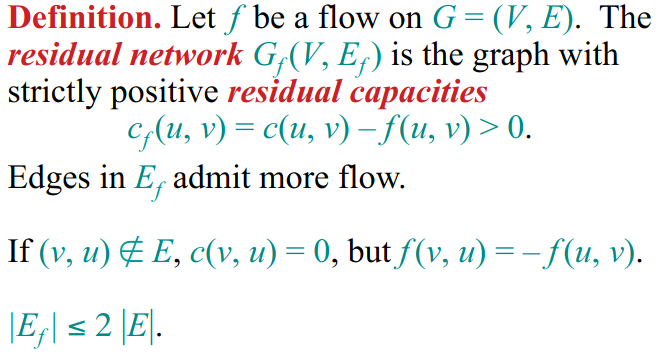

Last two lines above say that your residual network might introduce extra edges which are not in the original network. Residual networks depend on the flow $f$.

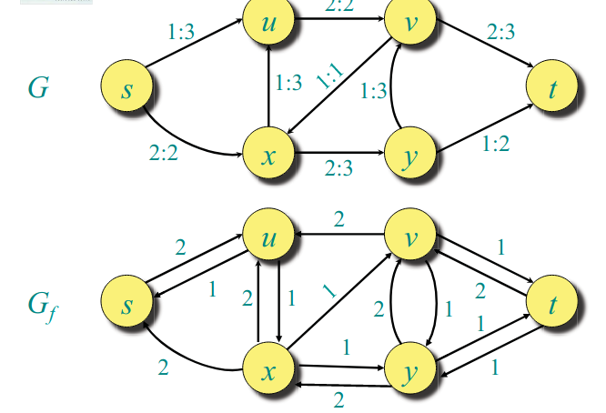

**Definition** Any path from $s$ to $t$ in $G_f$ is an augmenting path in $G$ with respect to $f$. If you have an augmenting path your flow $f$ is not a maximum flow. The flow value can be increased along an augmenting path $p$ by $c_f(p) = min(c_f(u,v)) $ for $(u,v) \in p$

Your augmenting path tells you which edges in the original graph $G$ with your flow $f$ how you change the values on the augmenting path.
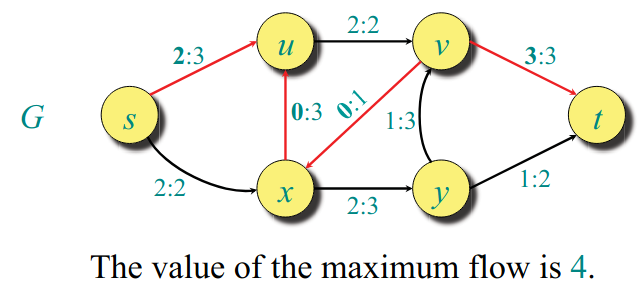


# Lecture 14: Incremental Improvement. Matching
**Max-flow, min-cut theorem**

Theorem. The following are equivalent:
1. $|f| = c(S, T)$ for some cut $(S, T)$.
2. f is a maximum flow.
3. f admits no augmenting paths.

Ford-Fulkerson max-flow algo.

```
initialize f(u,v) = 9 for all u,v in V
while an augmenting path in G wrt f exists:
  do augment f by c_f(p)
```

To prove correctness of Ford-Fulkerson we need to prove that 3 implies 2.

We will rove the theorem by proving 3 implies 1, 1 implies 2 and 2 implies 3.

**1 implies 2**. $|f| \leq c(S,T)$ for any cut. The assumption that $|f| = c(S,T)$ shows $f$ is a maximum flow as it cannot be increased.

**2 implies 3**. If there was an augmenting path then the flow value could be increased, hence contradicts that $f$ is a maximum flow.

**1 implies 3** [proof](https://youtu.be/8C_T4iTzPCU?list=PLUl4u3cNGP6317WaSNfmCvGym2ucw3oGp&t=1496)


Ford Fulkerson depends a lot on which augmenting paths you choose every time. Depending on the the order of your Edges, the DFS would choose different augmenting paths. Some of them would have residual flows which are super small and on each augmentation you would add very small flow.

If you do BFS augmenting path search (assuming each edge is of weight 1)  then augmentation is proven to be $O(VE)$, hence the final run time of the algo is O(VE(V+E))

**Baseball elimination**

A team survives if it has the largest number of wins. Given a table of standings we want to know which teams still have a chance of surviving.

Check the [notes](https://github.com/ngocuong0105/dendron-wiki/blob/main/vault/assets/files/Engineering/Lectures/Design%20and%20Analysis%20of%20Algorithms%20MIT.pdf)
 for this example.


# Lecture 15: Linear Programming. LP, reductions, Simplex.

You can formulate the max flow problem as an LP problem. LP is more general than Max Flow.

Linear programming (LP) is a method to achieve the optimum outcome under some requirements represented by linear relationships.


LP is polynomial time solvable. Integer LP is NP hard (that is we add extra constraint that the $x$ variables are integers).

In general, the **standard form** of LP consists of

• Variables: $x = (x_1 , x_2 , . . . , x_d)^T$

• Objective function: $c · x$

• Inequalities (constraints): $Ax ≤ b$, where $A$ is a $n × d$ matrix

and we maximize the objective function subject to the constraints and $x ≥ 0$.


The natural LP formulation of a problem may not result in the standard LP form. Do these transformations:

- Minimize an objective function: Negate the coefficients and maximize.
- Variable xj does not have a non-negativity constraint: Replace $x_j$ with
$x'_j − x''_j$, and $x'_j$ , $x'_j,x''_j ≥ 0$.
- Equality constraints: Split into two different constraints; $x = b$ into $x ≤ b, x ≥
b$.
- Greater than or equal to constraints: Negate the coefficients, and translate to less than or equal to constraint.

**Linear Programming Duality**

Gives you a certificate of optimality. If I get a solution of the LP problem, I can get a certificate that it is the optimal one (only if indeed it is the optimal one).

For every **primal** LP problem in the form of:
```
Maximize c · x
Subject to Ax ≤ b, x ≥ 0,
```
there exists an equivalent **dual** LP problem

```
Minimize b · y
Subject to A^T y ≥ c, y ≥ 0.
```

The max-flow min-cut theorem can be proven by formulating the max-flow problem as the primal LP problem.


**Maximum Flow**
Given $G(V, E)$, the capacity $c(e)$ for each $e \in E$, the source $s$, and the sink $t$:

Maximize $\sum_{\text{over v}}f(s, v)$

Subject to $f(u, v) = −f (v, u) ∀u, v ∈ V$ skew symmetry

$f(u, v) = 0 ∀u ∈ V − \{s, t\}$ conservation 

$v∈V f (u, v) ≤ c(u, v) ∀u, v ∈ V$ capacity.

LP could be used for multi-commodity problems.

**Shortest Paths**

Given $G(V, E)$, weights $w(e)$ for each $e ∈ E$, and the source $s$, we want to find the shortet paths from s to all $v \in V$, denoted $d(v)$.

```
Maximize \sum_{v∈V}d(v)

Subject to d(v) − d(u) ≤ w(u,v) ∀u, v ∈ V -  triangular inequality

d(s) = 0.
```

Note the maximization above, so all distances don’t end up being zero. In the inequalities constrins I have minimim already.

**LP Algorithms**

1. Simplex algorithm
2. Ellipsoid algorithm
3. Interior Point Method

**Simplex**
The simplex algorithm works well in practice, but runs in ex­ ponential time in the worst case. Steps:

• Represent LP in “slack” form. 

• Convert one slack form into an equivalent slack form, while likely increasing the
value of the objective function, and ensuring that the value does not decrease.

• Repeat until the optimal solution becomes apparent.

Slackness is a measure of how tight are our constriants. See Lecture notes for example of algo.

At each step of the simplex algo, you increase the objective value, while maintaining correctness of constraints.

In general, simplex algorithm is guaranteed to converge in $(n+m)$ choose $m$,  iterations where $n$ is the number of variables, and $n + m$ is the number of constraints.

# Lecture 16. Complexity: P, NP, NP-completeness, Reductions

**P**

$P = \{ \text{problems solvable in polynomial times } O(n^{O(1)}) \}$

**NP**

$NP = $ {decision problems (answer is yes or no) solvable in nondeterministic polynomial time} 

Nondeterministic refers to the fact that a solution can be guessed out of polynomially many options in O(1) time. If any guess is a YES instance, then the nondeterministic algorithm will make that guess. NP is biased towards YES.

**P vs NP**

Does being able to quickly recognize if a solution is correct, means that you can quickly solve the problem?

If yes, then $P = NP$


Sudoku is NP-complete when generalized to a $n × n$ grid. 

[youtube](https://www.youtube.com/watch?v=YX40hbAHx3s)

|**Example NP problem. 3SAT**

SAT = satisfiability

AT is satisfiability problem - say you have Boolean expression written using only AND, OR, NOT, variables, and parentheses. The SAT problem is: given the expression, is there some assignment of TRUE and FALSE values to the variables that will make the entire expression true?

SAT3 problem is a special case of SAT problem, where Boolean expression should be divided to clauses,such that every clause contains of three literals.

Given a boolean formula of the form $(x_1 ∨ x_3 ∨ x_{6}^{not} ) ∧ (x_2 ∨ x_3 ∨ x_7 ) ∧ . . .$ where $∨$ is `and` and $∧$ is `or`. Can you set the variables $x_1, x_2...$ such that the boolean formula results in True (satisfiable).

This is NP problem beacuse:
- guess x_1 = T or F
- guess x_2 = T or F

If the answer to the SAT3 problem is YES, you can start guessing and then you can check in polynomial time (polynomial verification) if the answer from the guesses is a YES.

NP problems allow you to check the answers in polynomial time.

$NP = $ {decision problems with poly-size certificates and poly-time verifiers for YES outputs}

**NP-complete**

$X$ is NP-complete if $X \in NP$ \intersect $NP$-hard.

$X$ is NP-hard if every problem $Y\in NP$ reduces to $X$. X is NP-hard if it is at least as hard as all NP-problems.


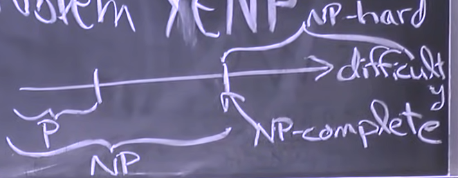

How to prove X is NP-complete.
1. Show $X \in NP$ (come up with polynomial verification)
2. Show $X \in NP-hard$ by reducint from known NP-complete problem from Y to X.

**Super Mario Brothers**

We show that Super Mario Brothers is NP-hard by giving a reduction from 3SAT.

**Dimensional Matching (3DM)**

Definition 3. 3DM: Given disjoint sets $X, Y$ , and $Z$, each of $n$ elements and triples $T ⊆ X × Y × Z$ is there a subset $S ⊆ T$ such that each element $∈ X ∪ Y ∪ Z$ is in
exactly one triplet $s ∈ S$?

3DM is NP. Given a certificate, which lists a candidate list of triples, a verifier can check that each triple belongs to T and every element of X ∪ Y ∪ Z is in one triple.

3DM is also NP-complete, via a reduction from 3SAT.


**Subset Sum**

Definition 4. Subset Sum Given $n$ integers $A = {a1 , a2 , . . . , an }$ and a target sum $t$, is there a subset $S ⊆ A$ such that

$\sum S = t$

Lectures reduce this problem to 3DM and prove it is NP-complete and NP-weakly hard


**Partition**

Definition 4. Subset Sum Given $n$ integers $A = {a1 , a2 , . . . , an }$ and a target sum $t$, is there a subset $S ⊆ A$ such that

$\sum S = \sum A/2$

reduce it to Subset Sum problem (harday direction) and prove it is NP-complete


# Lecture 17. Complexity: Approximation Algorithms

Consider optimization problems. Instead of finding the right answer we approximate the optimal answer.

Definition. An algoithm for a problem of size $n$ has an approximation ratio $\rho(n)$ if for any input, the algo produces a solution with cost $c$ s.t. $max(C/C_{opt},C/C_{opt} \leq \rho(n))$ where $C_{opt}$ is the cost of the optimal algorithm.

We take the max because the optimization problem can be maximization or minimization.

This says we are a factor of $\rho(n)$ from an optimal solutions.

Definition. An approximation scheme that takes as input \$eps > 0$ and produces a solution such that $C = (1 + \eps)C_{opt}$ for any fixed $\eps$, is a $(1 + \eps)$-approximation algorithm.

$O(n^{2/\eps})$ if PTAS is polynomial time approximation scheme.


$O(n/\eps})$ if FPTAS is fuly polynomial time approximation scheme.


**Vertex Cover**

For an undirected graph $G$ find a smallest subset of vertices such that all edges are covered. An edge is covered if one of its endpoints is in the subset of vertices. (NP-complete)


Heuristics:
- pick maximum degree vertex
- pick random edge $(u,v)$, then remove all incident edges to $u,v$

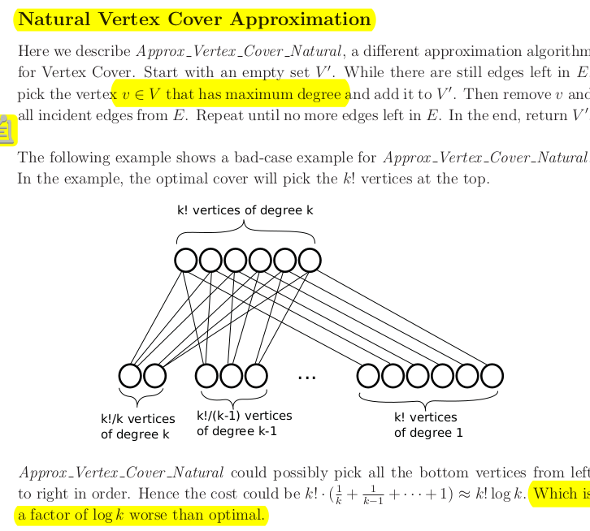


- pick random edge $(u,v)$, then remove all incident edges to $u,v$ is a factor of 2 apart from the optimal solution. All edges we pick are disjoint and if the number of edges we pick in the end is A, then the number of vertices is 2A.

**Set Cover**
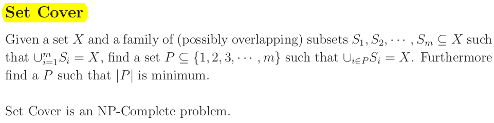


Heuristic: pick subset which covers the most uncovered elements.

Algo:

Start by initializing the set $P$ to the empty set. While there are still ele­ments in $X,4 pick the largest set $S_i$ and add $i$ to $P$. Then remove all elements in
$S_i$ from $X$ and all other subsets $S_j$ . Repeat until there are no more elements in $X$.

Claim: This is a $(ln(n)+1)$-approximation algorithm (where $n = |X|$).


**Partition**

Given a set of elements, split it into two subsets and minimize the max of the sums of the two subsets. This is an NP-Complete problem.

Partition [problem](https://en.wikipedia.org/wiki/Partition_problem)

Multiway partition [problem](https://en.wikipedia.org/wiki/Multiway_number_partitioning#Dynamic_programming_solution)


Approximation algo.

Phase 1. For smaller subset of size $m<n$ find optimal solution using brute force $O(2^m)$. You get two subsets $A'$ and $B'$. 

Phase 2. For the rest of the elements add greedily one by one.

If m = $(1/ \eps$) then this is $(1+\eps)$-approximation algo.


# Lecture 18. Complexity: Fixed-Parameter Algorithms

Last 3 lectures:

Pick any two:
1. solve hard problems
2. solve them fast (poly-time)
3. exact solution

**Idea:** Aim for exact algorithm, but confine exponential depedence to a parameter.

**Parameter**: A parameter is a nonnegative integer k(x) where x is the problem
input. The parameter is a measure of how tough is the problem you are solving.

**Parameterized Problem:** A parameterized problem is simply the problem plus
the parameter or the problem as seen with respect to the parameter.

**Goal:** Algo is polynomial in problem size $n$, exponential in parameter $k$.

**$k-$Vertex Cover Problem**
Given a graph $G = (V,E)$ and non-negative integer $k$. Question: is there a vertex cover $S\in V$ of size not greater than $k$

This is a decision problem for Vertex Cover and is also NP-hard.

Obvious choice of parameter is $k$. (natural parameter)

**Brute force**

Try all $n$ choose $k$ subsets of $k$ vertices., test each for coverage. Running time is $O(EV^{k})$

exponent depends on $k$ this is slow. I cannot say that for any fixed $k$ the algo is quadratic for example.

**Fixed Parameter Tractability**

A parameterized problem is fixed-parameter tractable (FPT) if there is an algorithm
with running time $≤ f (k) · n^{O(1)}$ , such that $f : N → N$ (non negative) and $k$ is the parameter, and the $O(1)$ degree of the polynomial is independent of $k$ and $n$.


Question: Why $f(k) · n^{O(1)}$ and not $f(k) + n^{O(1)}$?
Theorem: $∃f(k)·n^c$ algorithm iff $∃f'(k) + n^{c'}$


$k-$vertex cover problem is FPT:

- pick random edge $e = (u,v)$
- either $u$ or $v$ or both is in the subset $S$
- guess each one:
  - add $u$ to $S$, delete u an all incident edges from G, recurse with $k' = k-1$
  - do the same but with $v$ instead of $u$
  - return the $OR$ of the two outcomes

Recursion tree: 
```
                (n,k)
      (n-1,k-1)       (n-1,k-1)
(n-2,k-2) (n-2,k-2) (n-2,k-2) (n-2,k-2)
```

base case when $k=0$ return true if no edges, else false. At each node we do $O(n)$ work to delete incident edges. The total runtime is $O(2^k(|V|+|E|))$ 

**Kernalization** is a polynomial time algorithm that converts an input $(x, k)$ into a small and equivalent input $(x', k')$. Equivalent means that the answer I get in the end are the same. We want $|x'| \leq f(k)$. The algo you run on the smaller input would not depend on $n$ anymore, your problem size depends on $f(k)$, hence your running time is O(kernalization) + O(run on smaller input) = $O(n^c) + O(f(k))$.

**Theorem** Aproblem is FPT iff there exists a kernelization.

Kernelize -> FPT is trivial.
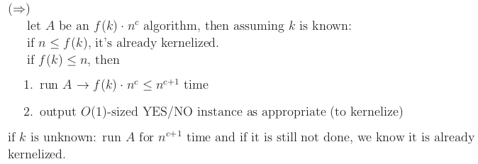

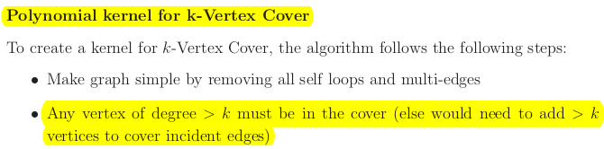
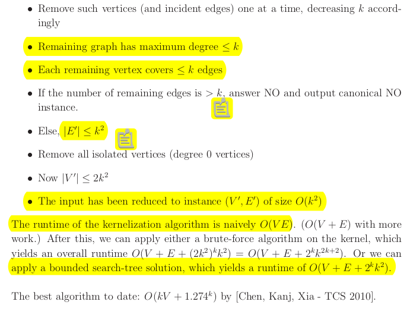

# Lecture 19. Synchronous Distributed Algorithms: Symmetry-Breaking. Shortest-Paths Spanning Trees


What are Distributed Algorithms?

Algorithms that run on networked processors, or on multiprocessors that share memory.

Most computing is on distributed systems.

Difficulties:
- concurrent activities
- uncertainty of timing

You have a different way of framework for thinking about problems here. You cannot just solve graph problems the usaul way you do, e.g. storing everything in adjacency list or matrix. All nodes are similar and you are allowed to send messages. By sending messages across the network you solve algos.

We consider two distributed computing models:
• Synchronous distributed algorithms:
  - Leader Election
  - Maximal Independent Set
  - Breadth-First Spanning Trees
  - Shortest Paths Trees
• Asynchronous distributed algorithms:
  - Breadth-First Spanning Trees
  - Shortest Paths Trees

**Distributed Network**

Based on an undirected graph $G= (V,E)$ associate:
- a *process* with each graph vertex 
- two directed *communication channels* with each edge

Processes at nodes communicating using messages.

Each process has output ports, input ports that connect to communication channels.

Select a **leader** node in a distributed system.

Theorem 2: Let $G = (V, E)$ be an $n$-vertex clique. Then there is an algorithm consisting of deterministic processes with UIDs that is guaranteed to elect a leader in $G$. The algorithm takes only 1 round and uses only $n^2$ point-to-point messages.

• Algorithm:
- Everyone sends its UID on all its output ports, and collects UIDs received on all its input ports.
- The process with the maximum UID elects itself the leader.

**Maximal Independent Set**

Problem: Select a subset $S$ of the nodes, so that they form a Maximal Independent Set.

- Independent: No two neighbors are both in the set.
- Maximal: We can’t add any more nodes without violating independence.

Need not be globally maximum, you just need to have local independence. Can have more than one MIS sets.

**Distributed MIS?**

You have a graph representing the distributed system. The problem of finding an MIS in distributed system is not the same as gather all nodes and edges and run algo. Here each node should know if it is in the MIS or not using messages.

Assume:
- No UIDs
- Processes know a good upper bound on $n$.

Require:
- Compute an MIS $S$ of the entire network graph.
- Each process in $S$ should output **in**, others output **out**.


**Luby’s MIS Algorithm**

• Executes in 2-round phases.

• Initially all nodes are active.

• At each phase, some active nodes decide to be in, others decide to be out, algorithm continues to the next phase with a smaller graph.

• Repeat until all nodes have decided.

• Behavior of active node $u$ at phase $ph$:

• Round 1:
- Choose a random value $r$ in $1,2, … , n^5$ , send it to all neighbors.
- Receive values from all active neighbors.
- If $r$ is strictly greater than all received values, then join the MIS, output in.

• Round 2:
– If you joined the MIS, announce it in messages to all (active) neighbors.
– If you receive such an announcement, decide not to join the MIS, output out.
– If you decided one way or the other at this phase, become inactive.


**Termination**

• With probability 1, Luby’s MIS algorithm eventually terminates.

• **Theorem 7**: With probability at least $1 - 1/n$, all nodes decide within $4logn$ phases.

• Proof uses a lemma similar to before: 
• Lemma 8: With probability at least $1 - 1/n^2$ , in each phase 1, ... , $4logn$ , all nodes choose different random values.

• So we can essentially pretend that, in each phase, all the random numbers chosen are differet.

• Key idea: Show the graph gets sufficiently “smaller” in each phase.

• Lemma 9: For each phase ph, the expected number of edges that
are live (connect two active nodes) at the end of the phase is at
most half the number that were live at the beginning of the phase.

**Formal proof with probability bounds and expectation in slides. Animation of Luby algo in slides.**

**Breath-First Spanning Trees**

That's the tree you get from BFS.

• New problem, new setting.

• Assume graph G = (V, E) is connected.

• V includes a distinguished vertex $v_0$ , which will be theorigin (root) of the BFS tree.

• Generally, processes have no knowledge about the graph.

• Processes have UIDs.
- Each process knows its own UID.
- $i_0$ is the UID of the root $v_0$ .
- Process with UID io knows it is located at the root.

• We may assume (WLOG) that processes know the UIDs of their neighbors, and know which input and output ports are connected to each neighbor.

• Algorithms will be deterministic (or nondeterministic), but not randomized.

**Output**: Each process $i != i_0$ should output parent $j$, meaning that $j$’s vertex is the parent of $i$’s vertex in the BFS tree.

Very similar strategy to standard BFS just need to add te sending and hearing messages part.


**Termination**

• Q: How can processes learn when the BFS tree is completed?

• If they knew an upper bound on diam, then they could simply wait until that number of rounds have passed.

• Q: What if they don’t know anything about the graph?

When a subtree finishes propagate upwards that you are done, this starts from the leaves and goes upward. Need to send information up on the tree.

Need to send info upwards the tree.