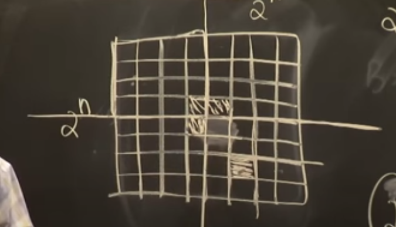

# MIT 6.S095 - Programming for the Puzzled

Lecture [videos](https://www.youtube.com/watch?v=14UlXIZzwE4&list=PLUl4u3cNGP62QumaaZtCCjkID-NgqrleA&index=1&ab_channel=MITOpenCourseWare)

Lecture [notes](https://ocw.mit.edu/courses/6-s095-programming-for-the-puzzled-january-iap-2018/)

# Puzzle 1. You Will All Conform. Trick

Array of people and they have caps on their head. These caps can be forward or backward.

0, 1, 2, 3, 4, 5, 6

F, B, F, F, B, B, F

We want all caps to conform, that is all are forward or all are backward. Possible operations: You can say to a person "
Flip your cap". Or you can say "People from position from 2 to 3 flip your caps". Find minimum number of operations given
an array of people with caps.

---

Simple solution is just to count forward and backward intervals

```Python
arr = ['F','B','F','F','B','F','F']

def solve(arr):
    forward, backward = [],[]
    i = 0
    while i < len(arr):
        j = i+1
        while j < len(arr) and arr[j] == arr[i]:
            j += 1
        if arr[i] == 'F': forward.append([i,j])
        else: backward.append([i,j])
    return min(len(forward),len(backward))
```

---
First person in line gives up what set of commands you will say to the people. For example if arr[0] = 'F', then you would say to all 'B-s' to flip their caps.

```Python

def please_all_conform(arr):
    arr.append('END')
    for i in range(1,len(arr)):
        if arr[i] != arr[i-1]:
            if caps[i] != caps[0]:
                print(f'Please people in positions {i}', end = '')
            else:
                print(f' through {i - 1} flip your caps!')

```

'Nuances with how you solve a problem and how you code it.'

# Puzzle 2. The Best Time to Party. Line Sweep

Celebrities come at a party at particular times (intervals). When should you go to the party to max out the number of celebrities you will meet.

```
[('Beyonce',6,7), ('Taylor',7,9), ...]
```
Closed intervals on the left and open on the right.

Simple solution. Check all hours (starts and ends) and check how many intervals contain it. Depends on granularity of time

```Python
def solve(intervals):
    start = min([intervals[i][0] for i in range(len(intervals))])
    end = max([intervals[i][1] for i in range(len(intervals))])
    times = set(starts + ends)
    res = 0
    for t in range(start,end+1):
        res = max(res,count(t),intervals)
    return res

def count(t):
    return sum([ s <= t < e for s,e  in intervals])

```
---
'Lots of repeated computation = redundancy. Often you could reduce this redundancy by computing things incrementally.'

The only times that are interesting is when celebrities come and leave

The only time the result could change is if a celebrity enters or leaves.

Line sweep solution.  Relies on the fact that the result would change only when you reach an event.

```Python
def solve(intervals):
    events = []
    for s,e in events:
        events.append((s,1))
        events.append((e,0))
    events.sort()
    res,curr = 0,0
    for time,is_start in events:
        if is_start:
            curr += 1
        else:
            curr -= 1
        res = max(res,curr)
    return res
```


# Puzzle 3: You Can Read Minds. Encoding Information

Given a deck of 52 cards. William takes 5 cards at random and shows to Devas 4 of them. Devas uses an algorithm to determine the 5th card. He uses the info from the 4 cards he sees to guess the fifth card.


Show 4 cards, 5th card could be 1 of 48.

How many bits of information can 4 cards show? Use the order of the 4 cards gets you $4! = 24$. We have just 24 bits of information but have to encode 48. Ordering just uses the numbers on the cards, we need to use the suits.

**Strategy:**
First card will give away the suit. By pigeonhole principle out of 5 cards there would be 2 with the same suits. The other 3 cards would give away the distance from the first card thinking in circular/modular computation.

**Example:** We pick King Diamond, A Diamond, 2 Spade, 3 Clubs, 5 Hearts.

William will hide the Ace and present  K, 2, 3, 5.

Devadas sees King of Diamond, hence the  hidden card is a diamond. 2,3,5 is the first permutation, hence the hidden card is 1 distance away from the Kind, that is and Ace.

Why this strategy works? The first card is the pivot card giving away the suit, hence there are 12 cards remaining that could possibly be the hidden card. we have 3 cards left t encode the 12 cards. Because we measure distance only in clockwise direction we are covered.


Is it possible to pick 4 random cards, hide one of it and encode it using the rest 3.

[Article](https://codegolf.stackexchange.com/questions/165390/professor-at-mit-can-read-minds)


# Puzzle 4: Please Do Break the Crystal. Strategy + Flip problem statement

**Problem statement:**

You are given two identical crystal balls and you have access to a building with n floors labeled
from 1 to 128.

You know that there exists a floor f where $0 <= f <= 128$ such that any egg dropped at a floor higher
than f will break, and any egg dropped at or below floor f will not break.

In each move, you may take an unbroken egg and drop it from any floor x (where $1 <= x <= 128$). If
the egg breaks, you can no longer use it. However, if the egg does not break, you may reuse it in
future moves.

Return the minimum number of moves that you need to determine with certainty what the value of f is.

Links to problem: [medium](https://leetcode.com/problems/egg-drop-with-2-eggs-and-n-floors/) with two balls only.

[hard](https://leetcode.com/problems/super-egg-drop/)
with arbitrary number of balls.


## Thinking

Binary search strategy - begin with first drop at 64. Worse case is if it breaks and then we have to do \[1,63\] = 63 drops more: total 64 drops.

Improvement: Use smaller interval - drop from 16, 32, 48, 64...
Worse case if it breaks at 128 and we have to do 128/16 + 15 = 23 total drops

Even better: be around square root.
Strategy start dropping first ball at floors:  $k, 2k, 3k, .... n//k * k$
Worse case is if the first drop does not break until the end.
Total drops = $n/k + k-1$. Goal is to minimize this function.

Take derivative and set to 0 -> $k = sqrt(n)$
Total worse number of drops is $2sqrt(n)-1$

So using this strategy of throwing on equal interval range $k, 2k ,...$
best is to choose k = sqrt(n) and total worse case is $2sqrt(n)-1$

However even more optimal strategy is to have decreasing intervals.
They should get smaller as the problem gets easier.

**Math Solution:**
Suppose least number of worse case throws is $x$.
Then the highest floor from which you can drop first egg is from floor $x$. If you drop it from floor
$x+1$ and it breaks then you'd have $x+1$ throws in total

Second drop can be highest from $x + x-1$. If you drop it from x+x, then your worse case would be $>=$
if the egg breaks from second drop + try drops from x+1..2x-1 -> total: $2 + x-1 = x+1$

Similarly kth drop should be from drop $x + (x-1) + (x-2) .. + (x-k+1)$.

Total number of drops would be: x + (x-1) + (x-2) + ... + 1 >= n
x(x+1)/2 >= n

NB: MIT solution does not give the most optimal one. It assumes equal intervals for 2 balls and for the general case.

**Another Math Solution:**

Reverse engineer problem
Given T moves and 2 balls find how many floors I can cover
Find smallest T with which we can cover n floors

For k balls:

```math
f(T,k) = 1 + f(T-1,k-1) + f(T-1,k)
f(T,2) = 1 + f(T-1,1) + f(T-1,2)
f(T,2) = 1 + T-1 + f(T-1,2)
f(T,2) = T + f(T-1,2)
f(T,2) = T + T-1 + T-2 + ... 1
f(T,2) = T*(T+1)/2
```
The above solution gives you O(nk) coding solution to the problem.

Remark

Moreover, it can be shown that $f(T,k)=C^{1}_{T}+⋯+C^{k}_{T}$ and using this information, problem can be solved
in $O(k log n)$, using binary search.

# Problem 5 & 6: Keep those queens apart. Backtracking (Recursion)

These two lectures consider the 8-queens problem. Lecture 5 gives overview and iterative solution of the
problem. Lecture 6 gives recursive/backtracking solution.

Example. Find greatest common divisor.

Euclid's algorithm.

```Python
def iterative_gcd(m, n):
    while n > 0:
        m, n = n, m % n
    return m

def recursive_gcd(m, n):
    if m % n == 0: return n
    return recursive_gcd(n, m%n)
```


*'You always get intuition about the problem by shrinking it and looking at small cases.'*


Given $n$x$n$ board return the number of different ways we put $n$ queens on the board. [link](https://leetcode.com/problems/n-queens-ii/)

**Solution**
Represent a board using just an array where $j$-th element shows on which row we have a queen in column $j$. Exploit the fact there can be at most one queen in a single column.
```Python
class Solution:
    def totalNQueens(self, n: int) -> int:
        def is_safe(i,j,board):
            if i in board: return False
            for col in range(j):
                if abs(col-j)==abs(i-board[col]): return False
            return True
        def backtrack(j):
            nonlocal res
            if j == n:
                res += 1
                return
            for i in range(n):
                if is_safe(i,j,board): # pruning
                    board[j] = i
                    backtrack(j+1)
                    board[j] = None
        res,board = 0,[None]*n
        backtrack(0)
        return res
```

There is no closed form solution depending on $n$.

# Problem 7: Tile that Courtyard, Please. Divide and Conquer (Recursion).

**Problem.** Consider a $2^n$x$2^n$ courtyard and $L$-shaped tiles (three square-tiles). Can you fill it in with $L$-tiles perfectly? No, total number of squares is $2^{2n}$ and is not divisible by 3. Then we change the problem and put a ban on one of the squares in the courtyard. Total number of squares is $2^{2n}-1$ which is divisible by 3.

Divide and Conquer **Solution:**



There is always a perfect tiling of the courtyard!


```Python
#Programming for the Puzzled -- Srini Devadas
#Tile that Courtyard, Please
#Given n in a 2^n x 2^n checkyard with a missing square at position (r, c), 
#find tiling of yard with trominoes (L-shaped dominoes).
#This version works directly on the given grid, and does NOT make copies
#of the grid for recursive calls.

EMPTYPIECE = -1


#This procedure is the main engine of recursive algorithm
#nextPiece is the number of next available tromino piece
#The origin coordinates of the yard are given by originR and originC
def recursiveTile(yard, size, originR, originC, rMiss, cMiss, nextPiece):

    #quadrant of missing square: 0 (upper left), 1 (upper right),
    #                            2 (lower left), 3 (lower right)
    quadMiss = 2*(rMiss >= size//2) + (cMiss >= size//2)
    
    #base case of 2x2 yard
    if size == 2: 
        piecePos = [(0,0), (0,1), (1,0), (1,1)]
        piecePos.pop(quadMiss)
        for (r, c) in piecePos:
            yard[originR + r][originC + c] = nextPiece
        nextPiece = nextPiece + 1
        return nextPiece

    #recurse on each quadrant
    
    for quad in range(4):
        #Each quadrant has a different origin
        #Quadrant 0 has origin (0, 0), Quadrant 1 has origin (0, size//2)
        #Quadrant 2 has origin (size//2, 0), Quadrant 3 has origin (size//2, size//2)
        shiftR = size//2 * (quad >= 2)
        shiftC = size//2 * (quad % 2 == 1)
        if quad == quadMiss:
            #Pass the new origin and the shifted rMiss and cMiss
            nextPiece = recursiveTile(yard, size//2, originR + shiftR,\
                originC + shiftC, rMiss - shiftR, cMiss - shiftC, nextPiece)

        else:
            #The missing square is different for each of the other 3 quadrants
            newrMiss = (size//2 - 1) * (quad < 2)
            newcMiss = (size//2 - 1) * (quad % 2 == 0)
            nextPiece = recursiveTile(yard, size//2, originR + shiftR,\
                            originC + shiftC, newrMiss, newcMiss, nextPiece)


    #place center tromino
    centerPos = [(r + size//2 - 1, c + size//2 - 1)
                 for (r,c) in [(0,0), (0,1), (1,0), (1,1)]]
    centerPos.pop(quadMiss)
    for (r,c) in centerPos: # assign tile to 3 center squares
        yard[originR + r][originC + c] = nextPiece
    nextPiece = nextPiece + 1

    return nextPiece

#This procedure is a wrapper for recursiveTile that does all the work
def tileMissingYard(n, rMiss, cMiss):
    #Initialize yard, this is the only memory that will be modified!
    yard = [[EMPTYPIECE for i in range(2**n)]
            for j in range(2**n)] 
    recursiveTile(yard, 2**n, 0, 0, rMiss, cMiss, 0)
    return yard

#This procedure prints a given tiled yard using letters for tiles
def printYard(yard):
    for i in range(len(yard)):
        row = ''
        for j in range(len(yard[0])):
            if yard[i][j] != EMPTYPIECE:
                row += chr((yard[i][j] % 26) + ord('A'))
            else:
                row += ' '
        print (row)


printYard(tileMissingYard(3, 4, 6))
printYard(tileMissingYard(4, 5, 7))
```