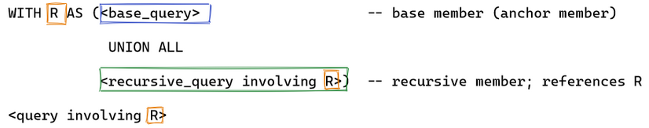
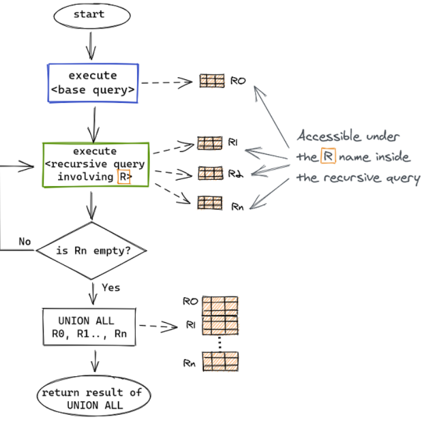
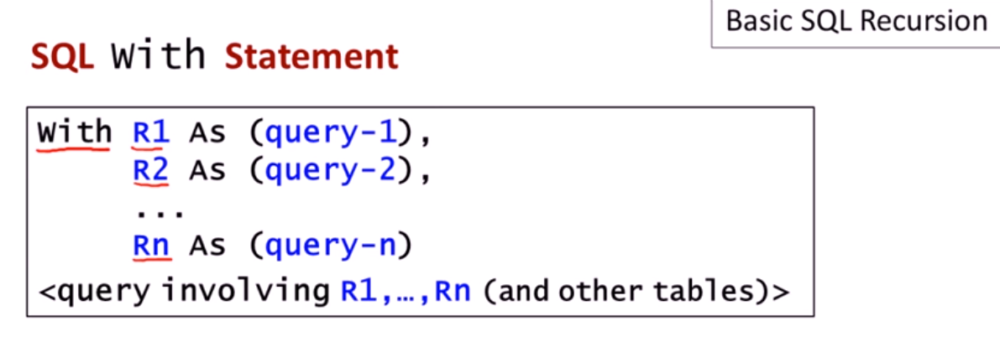
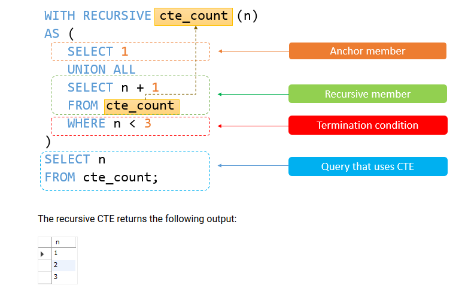
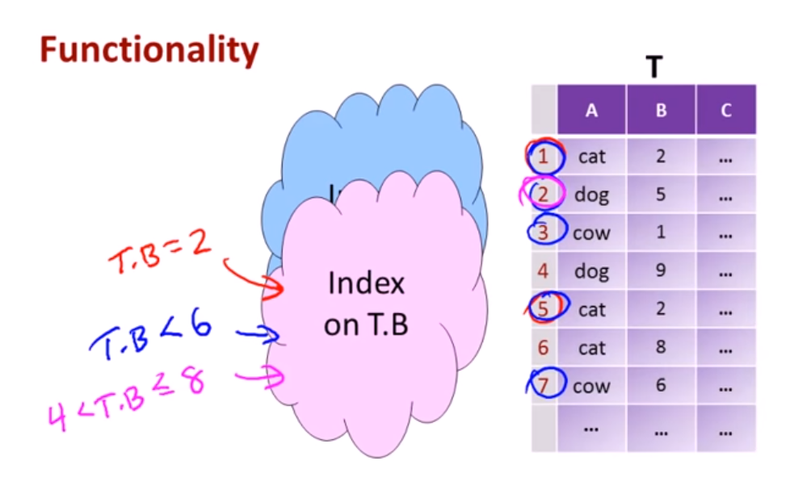
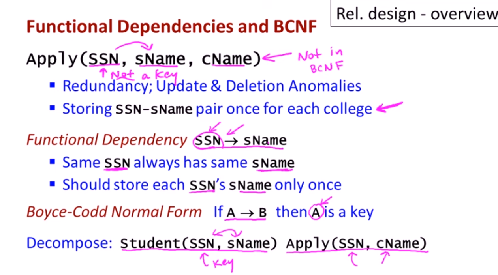
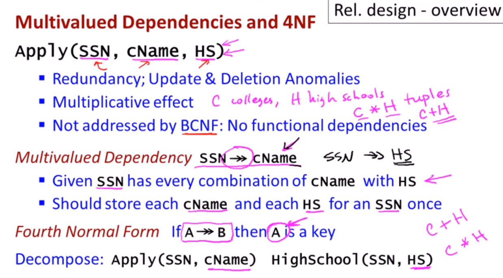

Most notes here are from [Stanford lectures](https://www.youtube.com/watch?v=Yceqbp_DKbA&list=PL9ysvtVnryGpnIj9rcIqNDxakUn6v72Hm&index=103) and leetcode.
# Buzzwords
relational algebra, relational data model, relational database, DBMS (database management system), PostgreSQL, MySQL, declarative, power of set theory, projection, persistent data (outlives program), schema (type) vs data(variables), DDL (data definition language) used to set up schema, DML (data manipulation language = query language), database = set of named relations, relation = table, columns = attributes of relation, rows = tuple, schema = structural description of relations in database, ACID properties, select = project operator, cross product, join, inner, outer, left, right, union, join = cross product + where, CTE = common table expression, subquery, normalization, denormalization, sharding, shards, transactions

- SQL is declarative - you say "what" you want but not how you want it
- SQL is not "Turing complete" = computationally universal (can do all stuff)
- basic SQL cannot run unbounded computations (no for loops)

# Code snippets

- join
```sql
select *
from table1 t1
left join table2 t2
on t1.id = t2.id

select *
from t1
left join t2 using(product_id)
```

- no full outer join in MySQL. Emulate it by:
```sql
SELECT * FROM t1
LEFT JOIN t2 ON t1.id = t2.id
UNION
SELECT * FROM t1
RIGHT JOIN t2 ON t1.id = t2.id
```
- join on operations [leetcode](https://leetcode.com/problems/leetflex-banned-accounts/)
```
sometimes is smart to do joins on operations/conditions
join on t1.id = t2.id-1
```
- **join is just a cross product with where statements**

- conditional statement case when else end
```sql
select
(case
    when condition1 then result1
    when condition2 then result2
    when conditionN then resultN
    else result # else can be dropped too
end) as field
from table
```

- if conditional statement
```sql
select if(condition, true_val, false_val) as field
from table
```

- least, greatest to take min,max of a row [leetcode](https://leetcode.com/problems/number-of-calls-between-two-persons/)
```sql
select least(from_id,to_id) as person1, greatest(from_id,to_id) as person2,
        count(*) as call_count, sum(duration) as total_duration
from calls
group by person1,person2
```

- partition by [leetcode](https://leetcode.com/problems/find-the-quiet-students-in-all-exams/discuss/1414605/Become-the-Master-of-Partition-By)

- window question [leetcode](https://leetcode.com/problems/biggest-window-between-visits/)

- date operations
```sql
select datediff(date1,date2) as diff,
        month(date1) as month,
        date_add('2018-05-01',INTERVAL 1 DAY) as next_day,
        dayofweek('2007-02-03') as day_of_week # 1 to 7 (1 and 7 are weekend)
        dayofyear('2007-02-03') as day_of_week,
        to_days('2008-01-01') as date_number,
        date_format(date,'%d/%m/%Y') as formatted_date,
        least('2018-12-31',date),
        greatest(d1,d2)
```

- subquery in select statement example [leetcode](https://leetcode.com/problems/percentage-of-users-attended-a-contest/)
```sql
select contest_id, round(count(*)/(select count(*) from users)*100,2) as percentage
from register
group by contest_id
order by percentage desc, contest_id asc
```
- where clauses
```sql
where field in ('string', 'string1')
where a = 6 or a = 9
where low < a and a < high
```

- not in operator with null values CAREFUL [stackoverflow](https://stackoverflow.com/questions/129077/null-values-inside-not-in-clause) [leetcode](https://leetcode.com/problems/tree-node/submissions/)
[584](https://leetcode.com/problems/find-customer-referee/)
```
MySQL uses three-valued logic -- TRUE, FALSE and UNKNOWN. Anything compared to NULL evaluates to the third value: UNKNOWN. That “anything” includes NULL itself! That’s why MySQL provides the IS NULL and IS NOT NULL operators to specifically check for NULL.
```


- filling in null values - use the IS operator

```sql
case
when field is null then 0 # field = 0 would not work
else field end
```

```sql
IFNULL(field, 0) AS field
```

- delete
```sql
DELETE FROM table_name WHERE condition;
```

- substring
```sql
 SELECT SUBSTRING('SQL Tutorial', 1, 3) AS ExtractString;

```

- union, union all
```sql
t1
union
t2 # duplicates are removed

t1
union all
t2 # duplicates are stacked
```
- with statement [leetcode](https://leetcode.com/problems/the-number-of-seniors-and-juniors-to-join-the-company/)
Basic SQL cannot express unbounded computations. WITH construct is available in SQL without recursion. But this is the construct used to ADD recursion in SQL. CTE = common table expression. WITH is like a function in SQL

```sql
with R1 as (query 1),
     R2 as (query 2),
     ...
     CTE as (query),
     
 <query involving all R1, R2 ..Rn, CTE + other tables> # return this last query
```

- recursion
```sql
WITH RECURSIVE cte_name AS (
    cte_query_definition (the anchor member)

    UNION ALL
 
    cte_query_definition (the recursive member) # often need where statement to stop
)
 
 
SELECT *
FROM   cte_name;
```




- between
```sql
SELECT column_name(s)
FROM table_name
WHERE column_name BETWEEN value1 AND value2;
```


- functions in SQL [leetcode](https://leetcode.com/problems/nth-highest-salary/)
```sql
CREATE FUNCTION getNthHighestSalary(N INT) RETURNS INT
BEGIN
  RETURN (
      # Write your MySQL query statement below.

  );
END
```

-limit + offset [leetcode](https://leetcode.com/problems/nth-highest-salary/)
```sql
SELECT
    column_list
FROM
    table1
ORDER BY column_list
LIMIT row_count OFFSET offset;

# The LIMIT row_count determines the number of rows (row_count) returned by the query.
# The OFFSET offset clause skips the offset rows before beginning to return the rows.
# OFFSET is optional
```

- rank in over(partition by)
```sql
RANK ( ) OVER ( [ partition_by_clause ] order_by_clause )  

ProductID   Name                   LocationID   Quantity Rank  
----------- ---------------------- ------------ -------- ----  
494         Paint - Silver         3            49       1  
495         Paint - Blue           3            49       1  
493         Paint - Red            3            41       3  
496         Paint - Yellow         3            30       4
```
- dense rank [leetcode](https://leetcode.com/problems/department-top-three-salaries/)
```sql
DENSE_RANK ( ) OVER ( [ <partition_by_clause> ] < order_by_clause > )  
ProductID   Name                               LocationID Quantity Rank  
----------- ---------------------------------- ---------- -------- -----  
494         Paint - Silver                     3          49       1  
495         Paint - Blue                       3          49       1  
493         Paint - Red                        3          41       2  
496         Paint - Yellow                     3          30       3  
```

- cumulative total
```sql
SELECT Id, StudentName,  StudentAge,
SUM (StudentAge) OVER (ORDER BY Id) AS RunningAgeTotal
FROM Students
```

- rolling sum/average
```sql
select visited_on, 
            sum(amount) over(order by visited_on rows between 6 preceding and current row) as amount,
            avg(amount) over(order by visited_on rows between 6 preceding and current row) as average_amount
from customer
```

- window functions
    - sum, avg, first, lead, lag, rank, dense_rank

- lag window function

```sql
select *, lag(purchase_date) over(partition by user_id order by purchase_date) as previous_date
from purchases
```

- lead, window function for value in the next row
```sql
SELECT dept_id, last_name, salary,
LEAD (salary,1) OVER (ORDER BY salary) AS next_highest_salary
FROM employees;
```

- to get island values (group of equal consecutive values in a column) use rank- rank trick, [leetcode](https://leetcode.com/problems/longest-winning-streak/)

- CAST to datatypes
```sql
-- For Sql server
SELECT CAST(25.65 AS int);
/*
CAST(<value_to_cast> AS <data_type_to_cast_to>)
*/
``

- index column
```sql
CREATE INDEX [index name] ON [table name] ( [column name] )
```
-transactions
```sql
BEGIN TRANSACTION
BEGIN TRY

UPDATE HESAP SET BAKIYE = BAKIYE - 1000
WHERE Name='Name' AND Surname='Surname'

UPDATE HESAP SET BAKIYE = BAKIYE + 1000
WHERE Name='Name' AND Surname='Surname'

COMMIT
END TRY
BEGIN CATCH
ROLLBACK
END CATCH
```


## SQL recursion
Basic SQL cannot express unbounded computations.

Table: ParentOf
```
Parent |  Child
Sue    |  Mary
Bob    |  Mary
Fred   |  Bob
Jane   |  Bob
```
Tasks: Find Parent, Grandparent (two instances of ParentOf), Grand-grand parent(three instances of ParentOf)
Note you need recursion

`With` construct exists in SQL by itself. It often used to have recursion in SQL.

{width: 600px}


each relation R is the result of its corresponding query. Final result of the master LAST query. Can thing of `AS` to be an
assignment for the realtions

We can specify recursive statements using the `Recursive` keyword after `With`
```sql
WITH RECURSIVE cte_name AS (
    initial_query  -- anchor member
    UNION ALL
    recursive_query -- recursive member that references to the CTE name
)
SELECT * FROM cte_name;
```

```sql
WITH RECURSIVE cte_count (n)
AS (
      SELECT 1
      UNION ALL # might enter infinite loop, careful
      SELECT n + 1
      FROM cte_count
      WHERE n < 3
    )
SELECT n
FROM cte_count;
```
{width: 600px}


- generate consecutive numbers
```sql
WITH RECURSIVE seq AS (
    SELECT 0 AS value UNION ALL SELECT value + 1 FROM seq WHERE value < 100
    )

SELECT * FROM seq;
```

## SQL indexing
[Stanford Lecture](https://www.youtube.com/watch?v=Y7Qlc7f_u0o)


Index column B and you can ask questions such as show me the rows where elements in column B belong to certain interval
is going to be faster.

{width: 600px}


Users don't access indexes! They are used underneath by the query execution engine.


Underlying data structures = type of indexes:
- hash allows only concrete checks such as table.A = val **O(1)**
- B+ trees allows checks such as table.A = val, v1 < table.A <= v2 **O(log(n))**
- R+ trees

No indexes is **O(n)** time
Many DBMS's build indexes automatically on `PRIMARY KEY` (and sometimes `UNIQUE`) attributes.

Examples:
```sql
select student_id
from student
where student_name = 'Kuny' and gpa > 3.9
```
- index on student_name (hash-based index)
- index on gpa (tree-based)
- index on (student_name,gpa)

```sql
select s_name, c_name
from student, apply
where student.s_id = apply.s_id
```
- no indexing is `O(m*n)`
- index student.s_id -> `O(n)`
- index apply.s_id -> `O(m)`

Downsides of indexes:
- extra space (persistent data structure stored underneath the database) = marginal downside (ok-ish)
- index created = medium downside/initialization can be slow
- index maintenance, can offset benefits. If we modify often the const of maintaining the indexes (re-initialization)
can be quite expensive. If you do lots of writes and less reads better not use indexes.

```sql
create index your_index_name on your_table_name(your_column_name) using HASH;
or
create index your_index_name on your_table_name(your_column_name) using BTREE;
```

The best way to improve the performance of SELECT operations is to create indexes on one or more of the columns that are tested in the query. The index entries act like pointers to the table rows, allowing the query to quickly determine which rows match a condition in the WHERE clause, and retrieve the other column values for those rows. All MySQL data types can be indexed.
Indexes are used to find rows with specific column values quickly. Without an index, MySQL must begin with the first row
and then read through the entire table to find the relevant rows.

- index columns used in `WHERE` clauses


**Column Indexes**
The most common type of index involves a single column, storing copies of the values from that column in a data structure, allowing fast lookups for the rows with the corresponding column values. The B-tree data structure lets the index quickly find a specific value, a set of values, or a range of values, corresponding to operators such as` =, >, ≤, BETWEEN, IN,` and so on, in a `WHERE` clause.

## Database design
[Design by decomposition](https://www.youtube.com/watch?v=DFnAakJ4FDg&list=PL9ysvtVnryGpnIj9rcIqNDxakUn6v72Hm&index=31)
- start with 'mega' relations containing everything
- decompose into smaller, better relations with same info
- can do decomosition automatically
**Final set of relations satisfies normal form** (normalization of a database) = no redundant data, updates are easier to be made.

Denormalised database example:
```sql
Apply(SSN, student_name, college_name, high_school, city, hobby)
```
*Apply* is a table with all columns (ssn = social security number) stored in one place.
To record Ann with SSN = 123 from Sofia, studied at SMG and 125, plays tennis and trumpet and applied at Stanford, Berkeley, MIT
we need 12 different rows! Studied at SMG will be repeated 6 times, applied at MIT will be repeated 4 times.
**Redundancy** in the database.

Normalised database:
```
Student(SSN, student_name)
Apply(SSN, college_name)
HighSchool(SSN, high_school)
Located(high_school, city)
Hobbies(SSN, hobby)
```
Decide how to normalize your database by looking for:
- functional dependencies
- multivalued dependencies

*Buzz word* If you see Functional Dependency  use Boyce-Codd Normal Form (decompose your table)

{width: 600px}

*Buzz word* If you see multivalued Dependency  use Boyce-Codd Normal Form (decompose your table)

{width: 600px}


# Problems
[1285](https://leetcode.com/problems/find-the-start-and-end-number-of-continuous-ranges/)
[177](https://leetcode.com/problems/nth-highest-salary/)
[571](https://leetcode.com/problems/find-median-given-frequency-of-numbers/submissions/)
[1709](https://leetcode.com/problems/biggest-window-between-visits/)
[1270](https://leetcode.com/problems/all-people-report-to-the-given-manager/)
[1613](https://leetcode.com/problems/find-the-missing-ids/)
[569](https://leetcode.com/problems/median-employee-salary/)
[608](https://leetcode.com/problems/tree-node/submissions/)
[2308](https://leetcode.com/problems/arrange-table-by-gender/)
[2228](https://leetcode.com/problems/users-with-two-purchases-within-seven-days/)
[1285](https://leetcode.com/problems/find-the-start-and-end-number-of-continuous-ranges/submissions/)