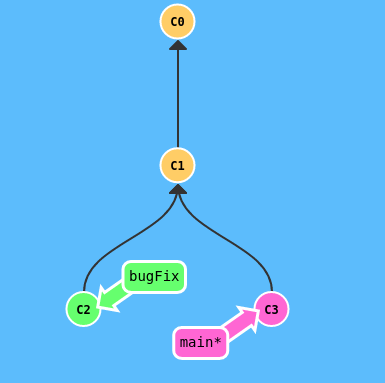
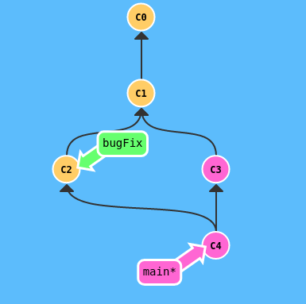
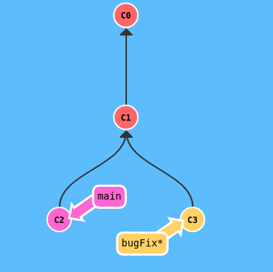
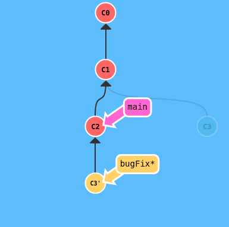
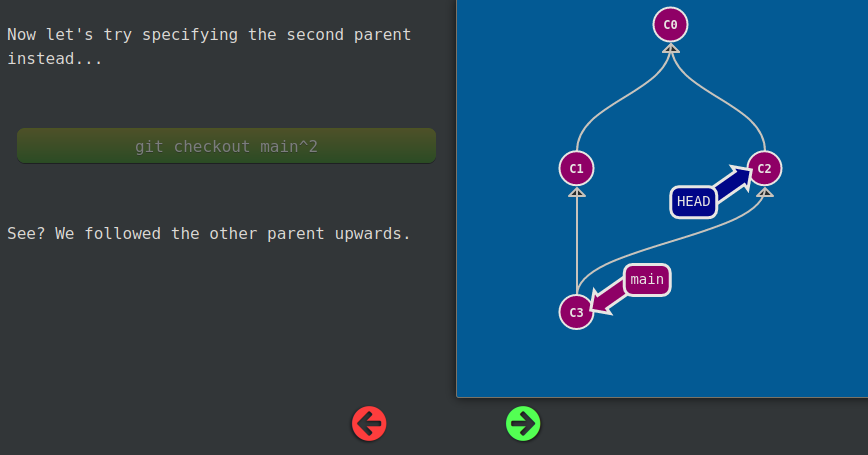
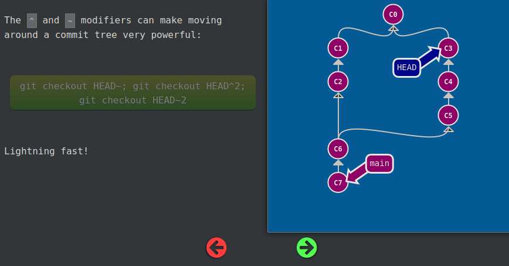
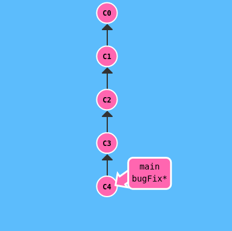
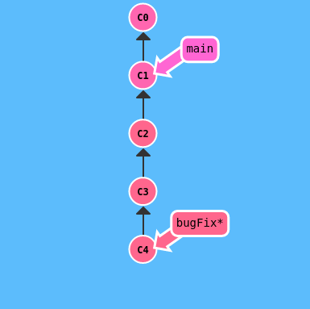
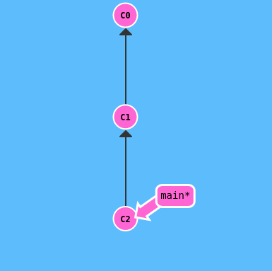
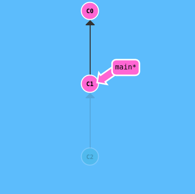

My notes on [Learn Git Branching](https://learngitbranching.js.org/).


# Commits and branches

A **commit** in a git repository records a snapshot of all the (tracked) files in your directory. It's like a giant copy and paste, but even better!

**commit = snapshot of the project = lightweight safe of project state** 

Commits can be visually represented as nodes.

- create a commit
```s
git commit -m 'commit message'
```

**Branches = pointer to a specific commit**

*'branch early, and branch often'*

Branches are super lightweight and have no storage/memory overhead

Branches are pointers. To get yourself to a branch you need to *checkout* there

- create a new branch
```s
git branch new_branch
```

- go to the branch
```s
git checkout new_branch
```

- shortcut
```s
git checkout -b new_branch
```

# Merge

**Merge** = combining work from two different branches together.

Merging in Git creates a special commit that has two unique parents.






Above we merge bugFix into main and main contains all the work.

- merge
```s
git checkout -b bugFix
git commit -m 'Blah'
git checkout main
git merge bugFix
```

# Rebase

The second way of combining work between branches is **rebasing**. Rebasing essentially takes a set of commits, "copies" them, and plops them down somewhere else.

Rebasing makes a nice linear sqauce of commits. Commit log of the repo will be cleaner.






Here we have two branches yet again; note that the bugFix branch is currently selected (note the asterisk)

We would like to move our work from bugFix directly onto the work from main. That way it would look like these two features were developed sequentially, when in reality they were developed in parallel.


C3 still exists, and the rebase creates a copy C3'
- **rebase**
```s
git checkout -b bugFix
git commit -m 'Blah'
git checkout main
git commit
git checkout bugFix
git rebase main
```


- interactive rebase (can squash commits)
```s
git rebase -i main
```


# HEAD

**HEAD** is the symbolic name for the currently checked out commit -- it's essentially what commit you're working on top of.

HEAD is hiding underneath our work on the repo/branches.

HEAD normally point to the branch you are currently working on

**Detaching** HEAD just means attaching it to a commit instead of a branch.

Example: on main branch with one commit:

HEAD -> main -> C1

`git checkout C1 ` makes HEAD ->  C1


To checkout to a commit you need to use its hash (C1)

To see commits hashes:
```s
git log
```

# Moving around git

OPERATORS `^ ~`

Specifying commits by their hash isn't the most convenient thing ever, which is why Git has relative refs

saying **main^** is equivalent to "the first parent of main
- go to parent commit
```s
git checkout main^
```

You can also reference HEAD as a relative ref
```s
git checkout HEAD^
```
- go to previous commit, if current commit is C4, the one below will go to C0
```s
git checkout HEAD~4
```

**Advanced moving when there is a merge**





# Branch forcing

One of the most common ways I use relative refs is to move branches around. You can directly r**eassign a branch to a commit** with the -f option

```s
git branch -f main HEAD~3
```






# Reversing changes in Git

`git reset` reverses changes by moving a branch reference backwards in time to an older commit. In this sense you can think of it as "rewriting history;" `git reset`will move a branch backwards as if the commit had never been made in the first place.






```s
git reset HEAD~1
```

reset does not work for remote branches. Need to use

```s
git revert HEAD
```


# Moving Work Around

You know how to move around the source tree using reference operators `^ ~`.

The next concept we're going to cover is "moving work around" -- in other words, it's a way for developers to say "I want this work here and that work there"

- ** pick**
```s
git cherry-pick <Commit1><Commit2>
```

says that you would like to copy a series of commits below your current location (HEAD).

- **interactive rebase**

```s
git rebase -i branch_name
```

Your current HEAD would copy from branch_name and do a rebase.

In interactive rebase you can **reorder, omit, squash, change commit messages**.

alternatively using references:

```s
git rebase -i HEAD~3
```

Juggle commits: Say you want to make changes to an older commit but still keep the order. 

Trick: Interactive rebase, then reorder, then make changes, reorder again.   


# Git Tags

Branches are easily mutated, often temporary, and always changing. You can move them around and refer to different commits. We use **tags** to permanently mark historical points in your project's history - major releases and big merges.

Tags never move, even if you create new commits.

```s
git tag v1 commit_hash
```

tags serve as an anchor point:

```s
git checkout v1
```

**git describe**

Because tags serve as such great "anchors" in the codebase, git has a command to describe where you are relative to the closest "anchor" (aka tag). And that command is called git describe

```s
git describe <ref>
```

Where `<ref>` is anything git can resolve into a commit. If you don't specify a ref, git just uses where you're checked out right now (`HEAD`).

The output of the command looks like:

`<tag>_<numCommits>_g<hash>`

Where `tag` is the closest ancestor tag in history, `numCommits` is how many commits away that tag is, and `<hash>` is the hash of the commit being described.

# Git Remotes

Git remotes are actually just copies of your repository on another computer. You can typically talk to this other computer through the Internet, which allows you to transfer commits back and forth.
- remotes serve as a great backup
- remotes make coding social

- create local copy of remote repositories
```
git clone
```
on your local you iwll have branches: `main` and `origin/main` (the remote branch)

Remote branches reflect the state of remote repositories

Remote branches have the special property that when you check them out, you are put into detached `HEAD` mode. **Git does this on purpose because you can't work on these branches directly.**


```
git fetch
```
git fetch performs two main steps, and two main steps:
- downloads the commits that the remote has but are missing from our local
- updates where our remote branches point

NB: fetch does **not** update branches

To reflect those changes  -- once you have new commits available locally you can do git merge `o/main`


These two steps are incorporated in
```
git pull
```

