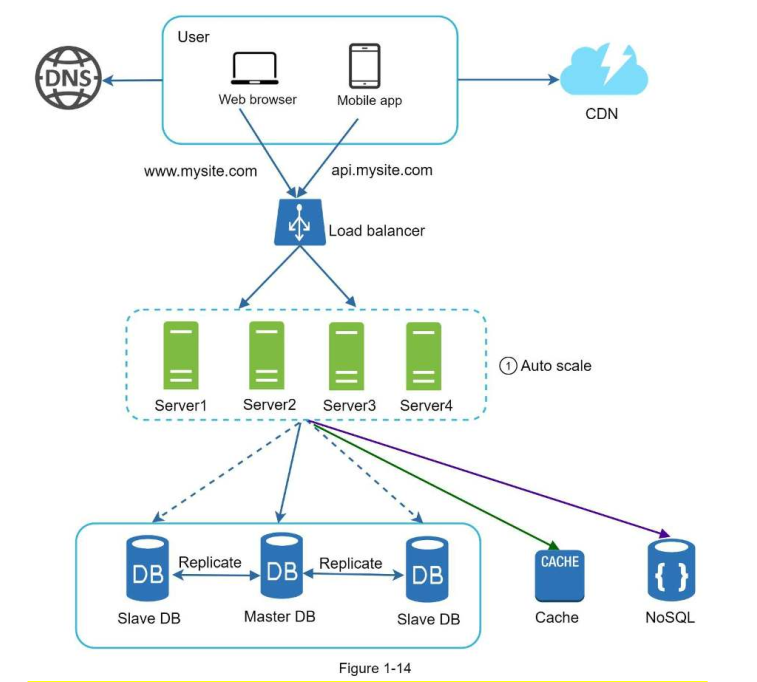

# Resources

- [System Design Interview An Insider’s Guide by Alex Xu ](https://github.com/mukul96/System-Design-AlexXu/blob/master/System%20Design%20Interview%20An%20Insider%E2%80%99s%20Guide%20by%20Alex%20Xu%20(z-lib.org).pdf)
- [Notes on Alex Xu Book](https://imaginary-basket-cbb.notion.site/System-Design-Interview-By-Alex-Xu-Book-Summary-17d97a868610804dbaf7e81fa7582caa)
- [System Design Primer](https://github.com/donnemartin/system-design-primer)
- [Grokking the System Design Interview github notes](https://github.com/Jeevan-kumar-Raj/Grokking-System-Design)
- drawing tool [escalidraw](https://excalidraw.com/)
- [TechLead overview](https://www.youtube.com/watch?v=WV2Ed1QTst8)
- [Blog on System Design topics](https://www.systemdesignacademy.com/), one of its articles was liked by William (IMO best competitor)


*Strategy prep*
- read this notes
- Anki notes and questions (you have an app)
- System Design Primer github repo
- System Design Interview insider book

*Tackle the problem by doing it just like you would at work.*

A 4-step process for effective system design interview:

**1. Understand the problem and establish design scope**

Goal: Gather requirements and clarify assumptions. WRITE THEM DOWN.
Never start start designing before understanding **requirements**.

Example questions: Product question -> technical question
```
DESIGN QUESTIONS
```
**Feature/Functional requirements**
- What are the required features for the system? -> Main **functionalities**?
- Who are my clients (external, internal, quants, mobile, web, international)?
- How are they going to use it? -> What **services** clients want to run? (determine API-s functions)
- Have we built this service before, or I am building it for the first time?
- What do we want to optimize with our design -> Determine logging metrics

**Non-functional requirements**
- How many users are there? -> Horizontal vs Vertical Scalability
- Whats the traffic volume, DAU? -> Single Server setup or MultiServer Setup?
- Internal or External or Global system? -> Do we need high availability?
- Available or Consistent data storage? -> Determine tradeoff in CAP theorem
- How fast do we want to answer requests? -> Latency vs Consistency?
- How many requests per second do we expect?
- What is the scale of the system? Is it built for a startup or a big company with a large user base? -> Scalability?
- Scale of the system such as requests per second (**RPS**), requests types, data written per second, data read per second)
- Automatic scaling? The addition/deletion of servers should be automatic based on traffic?
```
DATA QUESTIONS
```
- What are the **I/O** of the system? **Data Flow**
- **Data Volumes**(if need horizontal scaling use consistent hashing)
- What **type of data** would I need to store? Just text, or images videos? Static Dynamic content?
- What is the expected **read to write ratio**, read or write oriented.? (Master-Master, or Master-Slave database)
- If we need to horizontally scale do we have **evenly distributed data**? Celebrity problem?
- How long we need to keep the data?
- If we do historical loads how much back in time should they be?
- What's the distribution of accessing data? Is a long tail one (suitable for caching popular content).
- Do we need to our data store to be agile? Change and process in real time?
- On-prem or in the cloud?
- What are my endpoints of different parts what APIs would I need?
```
Implementation questions
```
- Building from scratch? Can we use Third-Party API-s.
- Can we leverage some of the existing cloud infrastructures provided by Amazon, Google, or Microsoft?

**2. Propose high-level design and engage interviewer**

Goal: Propose blueprint of initial design. Ask for feedback.

"Does that seem like a sensible strategy?"

Tasks:
- Do back-of-the-envelope calculations to evaluate if your blueprint fits the scale constraints
Commonly asked back-of-the-envelope estimations: QPS, peak QPS, storage, cache, number of servers
QPS = queries per second. 1 day ~ 80,000 seconds
- Draw box diagrams with key components (Clients (user) mobile/web), APIs, web servers, data stores, cache, CDN, message queue.


**3. Design deep dive**
Once you agree with your interviewer on the blueprint, go into details on each component. *Design the most critical components first.* This part is specific to the interview and interviewer.

**4. Wrap up**
Interviewer asks follow up questions. Or you can do some further discussion.
Topics:
- Monitoring your solution (analytics to decide whether the solution is good).
- Performance optimization - e.g do we need multi data center setup using clouod provider
- Identify system bottlenecks and discuss potential improvements
- **Recap your design**
- Error cases (server failure, network loss, etc.) are interesting to talk about.
- Operation issues are worth mentioning. How do you monitor metrics and error logs?
- Scale the design - load balancer, horizontal scaling, caching, database sharding
- Discuss trade-offs:
```
Performance vs scalability
Latency vs throughput
Availability vs consistency
```
## General tips
- gather requirement and write them down (don't be afraid to ask stupid questions)
- start with simplest possible setup (single server, single database, single storage)
- iterate, improve crucial parts (database (sharding,replication); storage(AWS S3, replicated buckets); load balancer)
- make improvements on more important parts first (database usually goes down before server)


## Horizontal scaling improvements
CCARRF
- loose consistency
- loose complexity
- win availability
- win reliability
- win redundancy
- win failover (no SPOF)

## Buzz words
horizontal, vertical scaling, availability, failover, reliability, redundancy, consistency, maintainability, load balancer, message queue, asynchronism, workers, data streaming services, database partitioning (split incoming data into different databases based on data rule e.g a-n, n-z), database replication (master-slaves, master-master), sharding, synchronization, parallel computing, SHA code, cache, CDN, Availability Zones (Data Centers), SQL = relational, NoSQL = non relational databases, celebrity problem (in data bases), reads >> writes usually (use cache), volatile memory = temporary memory, memcache (caching SQL) = @cache in python, MongoDB = document database, DynamoDB = key-value store, stateless vs stateful web tier, user session data, VPS(Virtual Private Server) = your own ubunto (EC2 instance) vs shared hosts, hypervisors, sharded database (shards), normalized and de-normalized databases, high cohesion low coupling (scale independently), single point of failure SPOF, Disk slower than In-memory database slower than In-memory cache, ACID properties of a relational database, Transaction, CAP theorem, PACELC theorem (high availability=data replication -> tradeoff between consistency and latency) BLOB (binary large object), BLOB cache, TTL, weak/eventual/strong consistency, cache-aside, cache write-through, cache-write-through, cache-write-back, cache-refresh-ahead, distributed system, multi-server setup, micro-services, database transaction, begin->select-> commit/rollback

# Youtube

[Harvard Scalability lecture](https://www.youtube.com/watch?v=-W9F__D3oY4)

When looking for host providers:
- FTP vs SFTP (secured file transfer protocol)
- VPS (virtual private server) vs shared hosts(many users use same server)
- VPS are your EC2 instances in AWS (your own ubunto) safe from other users but still susceptible to the provider
- VPS uses hypervisors. A hypervisor, also known as a virtual machine monitor or VMM, is software that creates and runs virtual machines (VMs).

Load balancer strategies to balance:
- based on work load, least busy servers take the work
- dedicated servers for specific jobs (html server, Python server etc.)
- job i is taken by server i % N (problem might not have uniformly distributed workload)

Load balancer problem? Single Point of Failure.
- buy 2 load balancers (pretty expensive 100k)

RAID technology is a virtualization of data memory - data many disks put into "one" and keep copy/backups to be safe.

Stateless architecture to have easier horizontal scaling on the web tier. Keep session data in NoSQL/SQL database shared by all servers (SPOF), better replicate it.

MySQL caches queries, the same query running more than once is cached.
memcache is like @cache in Python

Database replication - Master-Master, Master Slaves

Database partitioning - partition incoming data using some rule (a-n, n-z) and split into different databases


[Tech lead](https://www.youtube.com/watch?v=REB_eGHK_P4)

Load balancing help to distribute traffic to many different servers. Helps scalability, latency, throughput.

NGINX is a load balancing software service.
Can do DNS load balancing. Make the DNS returns you different ip addresses for same domain distributing to different servers.

Throughput is a measure of how many units of information a system can process in a given amount of time.

Caching - e.b often you'd hitting the database (reads) you need to setup cache.
Cache services Memcached, Redis, Cassandra

CDN-s store static data, global network which caches your content.

In interview might be asked to design a database schema:
- what are the primary keys
- what are your indecies

Indecies in a database make it fast - no need to do linear search in WHERE clause, indecing gives you random access.
Indexing your table improves the joins - nee to index the column on which you join.

Database optimizations:

- replication (master slaves) 
- indexing

Scaling stuff:
- Webservers - use load balancers to do horizontal scaling
- Image server - CDN, cache
- Database server - cache, replication (solves reads)
- Database server writes - Sharding

Sharding your database (database partitioning) - horizontal (split rows) and vertical (split different columns) sharding
Each shard goes to different server.

You don't want to scale too early and put optimization in the begining.

[Clement System Design interview example](https://www.youtube.com/watch?v=q0KGYwNbf-0)


# Databases

## Differences between SQL and NoSQL
### Storage
- SQL: store data in tables.
- NoSQL: have different data storage models.

### Schema
- SQL
  - Each record conforms to a fixed schema.
  - Schema can be altered, but it requires modifying the whole database.
- NoSQL:
  - Schemas are dynamic.

### Querying
- SQL
  - Use SQL (structured query language) for defining and manipulating the data.
- NoSQL
  - Queries are focused on a collection of documents.
  - UnQL (unstructured query language).
  - Different databases have different syntax.

### Scalability
- SQL
  - Vertically scalable (by increasing the horsepower: memory, CPU, etc) and expensive.
  - Horizontally scalable (across multiple servers); but it can be challenging and time-consuming.
- NoSQL
  - Horizontablly scalable (by adding more servers) and cheap.

### ACID
- Atomicity, consistency, isolation, durability
- SQL
  - ACID compliant
  - Data reliability
  - Gurantee of transactions
- NoSQL
  - Most sacrifice ACID compliance for performance and scalability.

## Which one to use?
### SQL
- Ensure ACID compliance.
  - Reduce anomalies.
  - Protect database integrity.
- Data is structured and unchanging.

### NoSQL
- Data has little or no structure.
- Make the most of cloud computing and storage.
  - Cloud-based storage requires data to be easily spread across multiple servers to scale up.
- Rapid development.
  - Frequent updates to the data structure.

**Reasons for SQL:**

- Structured data
- Strict schema
- Relational data
- Need for complex joins
- Transactions
- Clear patterns for scaling
- More established: developers, community, code, tools, etc
- Lookups by index are very fast

**Reasons for NoSQL:**

- Semi-structured data
- Dynamic or flexible schema
- Non-relational data
- No need for complex joins
- Store many TB (or PB) of data
- Very data intensive workload
- Very high throughput for IOPS

## Common types of NoSQL
### Key-value stores
- Array of key-value pairs. The "key" is an attribute name.
- Redis, Vodemort, Dynamo.

### Document databases
- KeyValue, but values are documents.
- Documents are grouped in collections.
- Each document can have an entirely different structure.
- CouchDB, MongoDB , Dynamo

### Wide-column / columnar databases
- Column families - containers for rows.
- No need to know all the columns up front.
- Each row can have different number of columns.
- Cassandra, HBase.

### Graph database
- Data is stored in graph structures
  - Nodes: entities
  - Properties: information about the entities
  - Lines: connections between the entities
- Neo4J, InfiniteGraph


# System Design Interview - An Insider Guide

## Chapter 1 - Scale from zero to million users

This chapter discusses the process of scaling from a single web server to an architecture with:
User, DNS, CDN, Load Balancer, Web tier (Stateless servers), Data Tier (Sharded Databases + Replication), Cache,
NoSQL database to keep user session data (stateless servers), message queue, logging and metric tools, Data Centers for
international coverage.

• Keep web tier stateless \
• Build redundancy at every tier \
• Cache data as much as you can \
• Support multiple data centers \
• Host static assets in CDN \
• Scale your data tier by sharding \
• Split tiers into individual services \
• Monitor your system and use automation tools




System Design : https://bit.ly/41PTaAp  
Winning System Design Case Studies: https://tinyurl.com/yfvyrjn7  
Github : https://shorturl.at/hlow0  
ML System Design Series : https://rb.gy/dd8dfe  
Design Google Drive : https://bit.ly/3uXdQZ7  
Design Messenger App : https://bit.ly/3DoAAXi  
Design Instagram : https://bit.ly/3BFeHlh  
Design Twitter : https://bit.ly/3qIG9Ih  
Design Robinhood : https://bit.ly/3BFeHlh  
Design Swiggy: https://bit.ly/3BFeHlh  
Design CashApp : https://bit.ly/3BFeHlh  
Design Kayak: https://bit.ly/3DoAAXi  
Design Paytm : https://bit.ly/3qIG9Ih  
Design ESPN Streaming : https://bit.ly/3qIG9Ih  
Design Agoda : https://bit.ly/3xP078x  
Design Razorpay : https://bit.ly/3xP078x  
Design Apple Music : https://bit.ly/3xP078x  
Design CricHD: https://bit.ly/3xP078x  
Design Alibaba: https://bit.ly/3xP078x  
Design Substack: https://bit.ly/3xP078x  
Design TrueCaller: https://shorturl.at/pzABN  
Design Stock exchange Design System: https://shorturl.at/svCK1  
Design Distributed Cache : https://shorturl.at/fjBV6  
Design Twilio : https://shorturl.at/uDJP7  
Design Google Docs : https://tinyurl.com/mr4d9v83  
Design Doordash : https://tinyurl.com/27nh5s7s  
Design MS Docs : https://tinyurl.com/9fpa8jpc  
Design Zomato : https://tinyurl.com/566t34ph  
Design Linkedin : https://bit.ly/3OjXy7c  
Design Google Maps : https://bit.ly/3BDdTwn  
Design Telegram : https://bit.ly/42N5LW2  
Design Snapchat : https://bit.ly/3pRP3pW  
Design One Drive : https://bit.ly/438bAwZ  
Design Quora : https://bit.ly/3FeD9dL  
Design Tinder : https://bit.ly/3Mcyj3X  
Design TikTok : https://bit.ly/3UUlKxP  
Design Netflix : https://bit.ly/3GrAUG1  
Design Uber : https://bit.ly/3fyvnlT  
Design Youtube : https://bit.ly/3dFyvvy  
Design Reddit : https://bit.ly/3OgGJrL  
Design Facebook’s Newsfeed : https://bit.ly/3RldaW7  
Design Amazon Prime Video : https://bit.ly/3hVpWP4  
Design Dropbox : https://bit.ly/3SnhncU  
Design Yelp: https://bit.ly/3E7IgO5  
Design Whatspp : https://bit.ly/3M2GOhP  