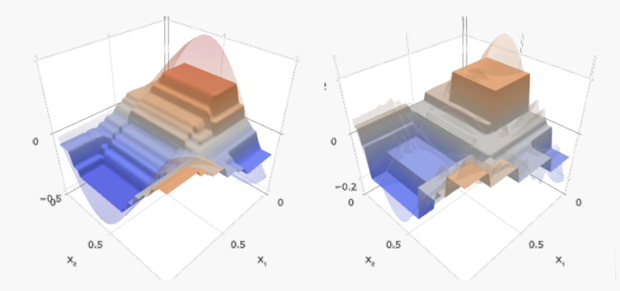
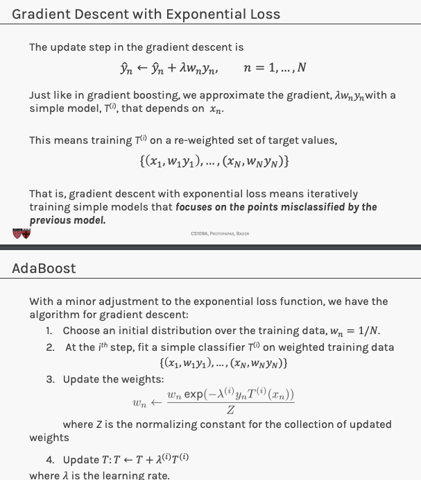
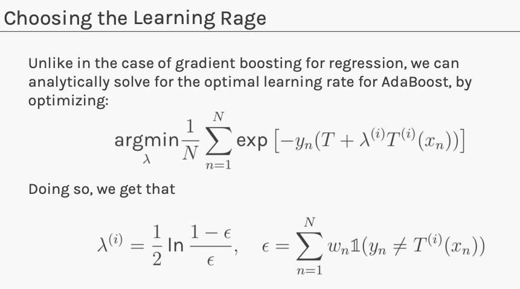

To learn a decision tree model, we take a greedy approach:
1. Start with an empty decision tree (undivided
feature space)
2. Choose the ‘optimal’ predictor on which to split and
choose the ‘optimal’ threshold value for splitting by
applying a splitting criterion
3. Recurse on on each new node until stopping
condition is met
For classification, we label each region in the model
with the label of the class to which the plurality of the
points within the region belong.


For regression you need:
- pure nodes (no two leaves with same value, e.g lemons)
- Output in $\R$ usually the average of the training points contained in the region


The learning algorithms for decision trees in regression tasks is:
1. Start with an empty decision tree (undivided feature space) 
2. Choose a predictor $j$ on which to split and choose a threshold value $t_j$ for splitting such that the weighted average MSE of the new regions as smallest possible:

$argmin_{j,t_j} (\dfrac{N_{1}}{N}) MSE(R_{1}) + \dfrac{N_2}{N}MSE(R_2)$

where $N_i$ is the number of training points in $R_i$ and $N$ is the number of points in $R$.
3. Recurse on on each new node until **stopping condition** is met

Stop conditions:
- max depth
- minimum number of points in each region
- compute purity gain and stop when the gain is less than some pre-defined threshold

$Gain(R) = MSE(R) - (\dfrac{N_{1}}{N}) MSE(R_{1}) - \dfrac{N_2}{N}MSE(R_2)$ 

***See section feature importance*

## Expressiveness of DT

Classification trees approximate boundaries in the feature space that separate classes. 

**Regression trees = composition and linear combinations of step functions.**

Regression trees split the feature space into parts where each is a constant value.




To capture a complex decision boundary (or to approximate a complex function), we
need to use a large tree (since each time we can only make axis aligned splits). Large trees have large variance and overfit.

## Bagging

Adjust for the high variance using **bagging**. Run multiple times DT and average out the results.

The same idea can be applied to high variance models:
1. (Bootstrap) we generate multiple samples of training
data, via bootstrapping. We train a full decision tree on
each sample of data.
2. (Aggregate) for a given input, we output the averaged
outputs of all the models for that input.

For classification - use voting.

Bagging = Boostrap + Aggregating

Note that bagging enjoys the benefits of
1. High expressiveness - by using full trees each model is able to approximate complex functions and decision boundaries.
2. Low variance - averaging the prediction of all the models reduces the variance in the final prediction, assuming that we choose a sufficiently large number of trees.

Drawback of bagging (and other ensemble methods) is that the averaged model is not interpretable.

# Out-of-bag error

The bootstrap step in Bagging has small out of bag sample (with replacement sampling) To compute OOB error:


1. Find all models (or trees, in the case of a random forest) that are not trained by the OOB instance.
2. Take the majority vote(average for regressions) of these models' result for the OOB instance, compare it to the true value of the OOB instance.
3. Compile the OOB error for all instances in the OOB dataset. Average out OOBs.

## Random forests

In practice, the ensembles of trees in Bagging tend to be highly correlated.

Suppose we have an extremely strong predictor, $x_j$ , in the training set amongst moderate predictors. Then the greedy learning algorithm ensures that most of the
models in the ensemble will choose to split on $x_j$ in early iterations.

That is, each tree in the ensemble is **identically distributed**, with the expected output of the averaged model the same as the expected output of any one of the trees.

**Bagging improvement**. The variance of the mean $B$ identical but not independent decision trees $X_1 ... X_B$ is $\dfrac{1}{B^2}(\sum var(X_i) + \sum_{i!=j} cov(X_i,X_j)) = \dfrac{1}{B}\sigma^2+\dfrac{B-1}{B}\rho\sigma^2 = \rho\sigma^2 + \dfrac{1-\rho}{B}\sigma^2$, where $\rho$ is pairwise correlation. 

The larger $B$ the lower variance. As $B → \infty$,bagging variance is bounded by correlation term.

**Random Forest** is a modified form of bagging that creates ensembles of independent decision trees.

To de-correlate the trees, we:
1. train each tree on a separate bootstrap sample of the full training set (same as in bagging)
2. for each tree, at each split, we randomly select a set of J predictors from the full set of predictors. From amongst the $J$ predictors, we select the optimal predictor and the optimal corresponding threshold for the split. [random subspace method](https://en.wikipedia.org/wiki/Random_subspace_method) reduces correlation between estimators.
3. ensemble all trees using average/majority function

Random forest models have multiple hyper-parameters to tune:
1. the number of predictors to randomly select at
each split
2. the total number of trees in the ensemble
3. the minimum leaf node size

Tuning random forests:

Using out-of-bag errors, training and cross validation can be done in a single sequence - we cease training once the out-of-bag error stabilizes.

**Weak spot of RF:**

When the number of predictors is large, but the number of relevant predictors is small, random forests can perform poorly.

In each split, the chances of selected a relevant predictor will be low and hence most trees in the ensemble will be weak models.

**On number of trees in enseble algo**

Increasing the number of trees in the ensemble generally does not increase the risk of overfitting. Again, by decomposing the generalization error in terms of bias and variance, we see that increasing the number of trees produces a model that is at least as robust as a single tree.

However, if the number of trees is too large, then the trees in the ensemble may become more correlated, increase the variance.

**Variable importance for RF**

Record the prediction accuracy on the oob samples for each tree.
- Randomly permute the data for column $j$ in the oob samples the record the accuracy again (make it unmeaningful).
- The decrease in accuracy as a result of this permuting is averaged over all trees, and is used as a measure of the importance of variable $j$ in the random forest. 

**Xgboost** has an implementation of random forests [link](https://xgboost.readthedocs.io/en/stable/tutorials/rf.html).

# Gradient Boosting

Random forests and boosted trees are really the same models; the difference arises from how we train them.

By increasing the number of trees $B$ and reducing the pairwise correlation $\rho$ we try to reduce the variance of the model. 

Rather than reducing variance, we can aim to reduce bias of simple trees and make them more **expressive**. Boosting is another ensemble method which achieves that.

Add weak models $T_{i}$ additively and iteratively to ensemble a linear combination $T = \sum w_{i}T_{i}$  whis is expressive.


Each simple model $T_i$ we add to our ensemble model $T$, models the errors of the previous version of $T$.

Note that gradient boosting has a tuning parameter, $\lambda$ - step size(learning rate). 

Goal is to minimize objective function, computationally you compute partial derivatives set them to 0 and compute the stationary point. If the objective function is convex, then the stationary point is the min.


Subtracting a $\lambda$ multiple of the gradient from $x$, moves $x$ in the opposite direction of the gradient (hence towards the **steepest decline**) by a step of size $\lambda$. 


Choosing $\lambda$
- if $\lambda$ is a constant, then tune through cross validation
- variable learning rate $\lambda = g(|f'(x)|)$, function of the gradient of $f(x)$. Around the optimum, when the gradient is small, the learning rate should be small


# XGBoost

[Tutorial](https://xgboost.readthedocs.io/en/latest/tutorials/model.html)

XGBoost is a more regularized form of Gradient Boosting. XGBoost uses advanced regularization (L1 & L2), which improves model generalization capabilities. XGBoost delivers high performance as compared to Gradient Boosting. 

Extreme grading boosting refers to pushing the limits of computation rather than modelling approach.

Our model is written in the form:

$\hat{y}_i = \sum_{k=1}^{K} f_{k}(x_{i}), f_k \in F$

where $K$ is the number of trees, $f_{k}$ is a function in the functional space $F$, and $F$ is the set of all possible CARTs.

The objective fundtion is given by:

$obj(\theta) = \sum l(y_i,\hat{y}_i) + \sum \omega(f_{k})$ where $\omega(f_k)$ is the complexity of the tree $f_k$ (regularization)


We add the trees $f_k$ additevely/iteratively. For example we learn $f_{t}$ by optimizing:


One important advantage of this definition is that the value of the objective function only depends on $g_i$ and $h_i$. This is how XGBoost support custom loss functions. 
We can optimize every loss function, including logistic regression and pairwise ranking, using exactly the same solver that takes $g_i$ and $h_i$ and as input!

Later they define $f_t(x)$ using $w_q(x)$ which are the scores= predictions in each leaf. So the goal becomes to find the best splits and the best scores in each leaf.

**Remember** that our goal is to learn $f_t()$ at learning step $t$.


**Model Complexity**

Xgboost regularization term tries to minimize the number of leaves in tree as wells as the sum of scores in all leaves.

SCORE of a leaf = prediction of a leaf!!! I read the definition from the paper and this is what it means. Also it can be seen in the tutorial as well as confirmed in [stackexchange](https://stats.stackexchange.com/questions/351872/understanding-regularization-in-xgboost)

Essesntially the final prediction is the sum of predictions/scores of all different trees and xgboost wants to have small contribution by each of the trees. It penalizes when one tree have large prediction.


## XGBoost paper
[Paper](https://drive.google.com/file/d/1wFl7VZuxz1_yPL8p3XNTNLfqNO2_h3EQ/view?usp=share_link)

**Model definition**


The regularized term balances between:
- number of leaves in each tree $T$, the smaller number the larger values in each leaf
- the sum of values in each leaf, the smaller the better (we do not want a tree which has very largerge values)


Tree boosting has been shown to give state-of-the-art resutls on many standard classification benchmarks. XGBoost is a scalable machine learning system for tree boosting.

This is how we compute the gain of a node:


XGBoost  major contributions:
- highly scalable parallel end-to-end tree boosting system
- regularized learning objective (regularization term is L2 on the leaf scores,i.e. gains). Regularization term in decision trees/boosting trees is measuring  what is the minimum amount of gain that would reduce the loss by the same amount
- novel sparsity-aware algorithm for nan-values (learn all non-nans, then try put nans on left and on right, chooses whatever gives better gain)
- weighted quantile sketch for effiecient proposal calculation (this is algo for the first step in approximate split finding). One of the key problems in tree learning is to find the best split threshold.

**Control overfitting**
When you observe high training accuracy, but low test accuracy, it is likely that you encountered overfitting problem.

There are in general two ways that you can control overfitting in XGBoost:

- The first way is to directly control model complexity.
    - This includes max_depth, min_child_weight and gamma.
    - max_depth, min_samples_leaf, min_samples_split in DecisionTreeClassifier in SkLearn (if you have just 1 sample in a leaf or split obviously you are overfitting)
- The second way is to add randomness to make training robust to noise.
    - This includes subsample and colsample_bytree.
    - You can also reduce stepsize eta. Remember to increase num_round when you do so.

## Implementation resources

- [Scikit-Learn API](https://xgboost.readthedocs.io/en/stable/python/python_api.html)
- [XGBoost parameter](https://xgboost.readthedocs.io/en/stable/parameter.html)
- [Hyper parameter tuning (Bayesian)](https://www.kaggle.com/code/prashant111/a-guide-on-xgboost-hyperparameters-tuning/notebook)


**Limitation of additive tree learning.**

Since it is intractable to enumerate all possible tree structures, we add one split at a time. This approach works well most of the time, but there are some edge cases that fail due to this approach. For those edge cases, training results in a degenerate model because we consider only one feature dimension at a time. 

**NOTE!!!!**

[Xgboost order of features MATTERS](https://beverly-wang0005.medium.com/pitfall-of-xgboost-order-of-features-e651628ab3b7)


## Can Gradient Boosting Learn Simple Arithmetic? 

[Article](https://forecastegy.com/posts/can-gradient-boosting-learn-simple-arithmetic/)

See if xgboost can learn simple arithmetic: addition, subtraction, multiplication, division between 2 random variables.

- Learns well addition and subtraction, but not multiplication and division.
-  need any random disturbance, e.g., some noise or subsample=0.8 would help to kick it off the equilibrium and to start learning.
- need to add some noise in the data to make it learn multiplication and division
- if you know there is a strong interaction you need to explicitly add it as a feature, so that your model does not struggle to find thresholds and splits to capture the interaction.

*"But it's a nice example of data with "perfect symmetry" with unstable balance. With such perfect dataset, when the algorithm is looking for a split, say in variable X1, the sums of residuals at each x1 location of it WRT X2 are always zero, thus it cannot find any split and is only able to approximate the total average."*


# LightGBM
[Paper](https://proceedings.neurips.cc/paper_files/paper/2017/file/6449f44a102fde848669bdd9eb6b76fa-Paper.pdf)


# Catboost


# Adaboost

Connect gradient boosting for regression to a boosting algorithm often used for classification.

Unfortunately error function is not differentiable!

$Error = \dfrac{1}{N} \sum I(y_n != \hat{y}_n)$

Replace the error function with a differentiable function that is a good indicator of classification error. Exponential loss:

$ExpLoss = \dfrac{1}{N} \sum exp(y_n \hat{y}_n)$






# Implemetations

There are few implementations on boosting:
- XGBoost: An efficient Gradient Boosting Decision 
- LGBM: Light Gradient Boosted Machines. It is a library for training GBMs developed by Microsoft, and it competes with XGBoost 
- CatBoost: A new library for Gradient Boosting Decision Trees, offering appropriate handling of categorical features


# Feature importance

[Article](https://towardsdatascience.com/decision-trees-explained-entropy-information-gain-gini-index-ccp-pruning-4d78070db36c) that explains how enthropy, information gain and decision splits are computed and chosen.

This is a measure of how much each feature contributes to the model. It is all about coming up with a **Variable selection criterion**.

Decision trees use a top-down, greedy method called recursive binary splitting. Starting from the top, they split the data into two at each step, creating branches. It's called "greedy" because it picks the best split at each step without thinking ahead for the overall tree.


```
Information gain of a node =  Entropy(parent) - Entropy(children)
```

```
Information gain of a node =  f(parent) - f(children) 
```

`f` is a measure of impurity.

`Entropy(node)` measures the impurity of a node. A node with only 1 class is pure and has entropy 0. A node with 50% of each class has entropy 1.

`Entropy(children)` would be computed using weighted average of the entropies of each child node.