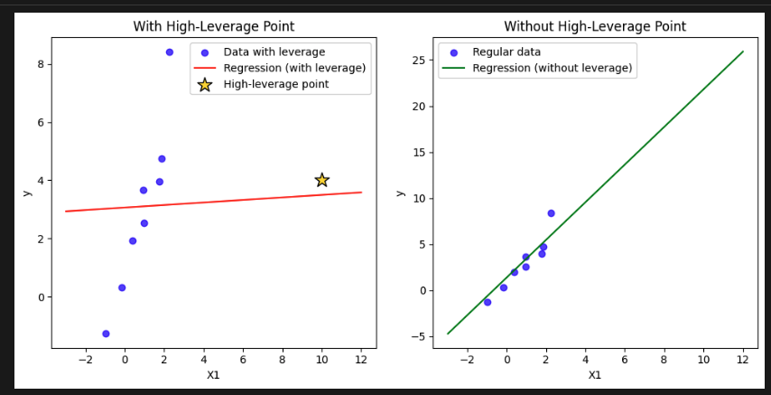
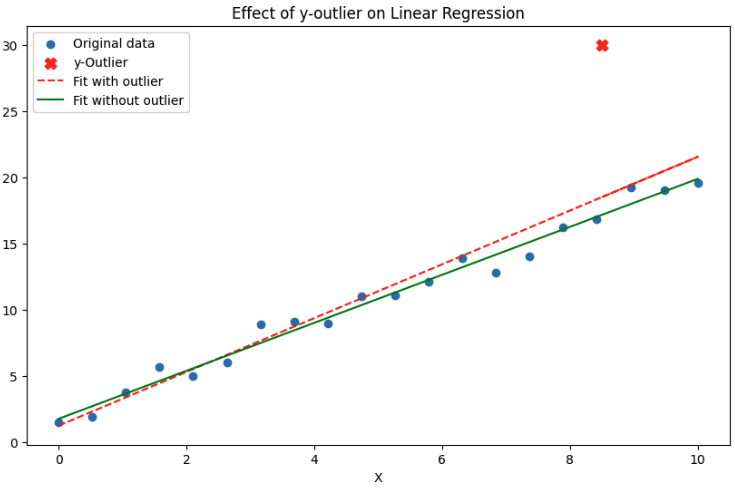
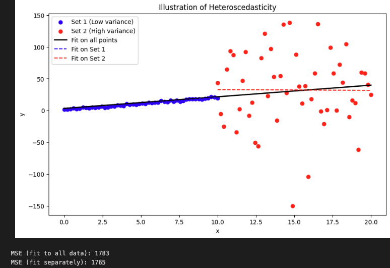

Here I discuss how violation of linear regression assumptions affect model explainability and foresting performance.
It is a practical guide on the caveats of the Linear Model and how to deal with them - particularly useful in forecasting-focused
settings like Kaggle. It is assumed the reader is familiar with the mathematics behind the model.

Linear model's assumptions are:
- The target variable is linear in the predictor variables. Violation is also known for mispecified model
- The errors are normally distributed, independent, and homoscedastic (constant variance).
- The errors are independent of the features (no endogeneity).
- The features are not multi-collinear (not highly correlated).


# Multi-Collinear Features

- **Multicolinearity affects model interpretability and not so much forecasting performance.**

Experiment:
- Run LR `y ~ x1`
- Run LR `y ~ x1+x2`, where these two are highly correlated

Results
```
Uncorrelated features correlation:

Uncorrelated case model summary:
                            OLS Regression Results                            
==============================================================================
Dep. Variable:                      y   R-squared:                       0.929
Model:                            OLS   Adj. R-squared:                  0.928
Method:                 Least Squares   F-statistic:                     1275.
Date:                Tue, 08 Jul 2025   Prob (F-statistic):           5.50e-58
Time:                        08:19:04   Log-Likelihood:                -78.314
No. Observations:                 100   AIC:                             160.6
Df Residuals:                      98   BIC:                             165.8
Df Model:                           1                                         
Covariance Type:            nonrobust                                         
==============================================================================
                 coef    std err          t      P>|t|      [0.025      0.975]
------------------------------------------------------------------------------
const          5.0443      0.054     93.689      0.000       4.937       5.151
X1             2.1139      0.059     35.712      0.000       1.996       2.231
==============================================================================
Omnibus:                        3.154   Durbin-Watson:                   2.216
Prob(Omnibus):                  0.207   Jarque-Bera (JB):                3.133
Skew:                           0.105   Prob(JB):                        0.209
Kurtosis:                       3.841   Cond. No.                         1.16
==============================================================================

Notes:
[1] Standard Errors assume that the covariance matrix of the errors is correctly specified.

Highly correlated features correlation:
          X1        X2
X1  1.000000  0.999931
X2  0.999931  1.000000

Highly correlated case model summary:
                            OLS Regression Results                            
==============================================================================
Dep. Variable:                      y   R-squared:                       0.939
Model:                            OLS   Adj. R-squared:                  0.938
Method:                 Least Squares   F-statistic:                     751.5
Date:                Tue, 08 Jul 2025   Prob (F-statistic):           9.10e-60
Time:                        08:19:04   Log-Likelihood:                -63.278
No. Observations:                 100   AIC:                             132.6
Df Residuals:                      97   BIC:                             140.4
Df Model:                           2                                         
Covariance Type:            nonrobust                                         
==============================================================================
                 coef    std err          t      P>|t|      [0.025      0.975]
------------------------------------------------------------------------------
const          4.9343      0.047    105.551      0.000       4.842       5.027
X1             6.8089      4.486      1.518      0.132      -2.095      15.713
X2            -4.7588      4.475     -1.064      0.290     -13.639       4.122
==============================================================================
Omnibus:                        0.401   Durbin-Watson:                   2.118
Prob(Omnibus):                  0.818   Jarque-Bera (JB):                0.103
Skew:                          -0.034   Prob(JB):                        0.950
Kurtosis:                       3.141   Cond. No.                         174.
==============================================================================

Notes:
[1] Standard Errors assume that the covariance matrix of the errors is correctly specified.
```

**Insights:**
- Forecasts of both model are good and in practice you don't need to drop the correlated features if you care about forecasts
- Remember that the forecast $\hat{y}$ is the orthogonal projection of the real value y on the subspace spanned by the design matrix $X$. If the deign matrix has correlated features there are multiple ways to express the same $\hat{y}$. Hence different values for the $\hat{beta}$ would give the same forecast.  
- When there are correlated features you will see large variance in the beta estimates, also mathematically $var(\hat{beta})=(XX^{T})^{-1}\sigma$ will just be very large when the inside matrix is not positive definite.
- large beta variance, means low t-statistic, which means high p-value
- hence with correlated features the model is not interpretable but the sum is good forecasts.


**The Geometry**
- When two variables are highly correlated, they both almost point in the same “direction” in the predictor space.
- The model tries to allocate credit (and adjust slope) between them for explaining changes in y.
- Many combinations of coefficients can fit the same plane equally well.
         
**Effect on Model Fit** 

- The overall plane/surface that regression fits (ŷ = intercept + b1*X1 + b2*X2) can still be the same, though b1 and b2 may be weird or unintuitive (like 378 and -377). Forecasts are still good.
- The regression is “sure” about the sum effect, but not about the individual effects.
     
**Unstaple coefficients**
- Opposite signs and very large in absolute values to offset each other.
- For forecasting, this generally does not hurt test-set predictive performance as long as your train/test data comes from the same distribution and the correlation patterns are stable. It can, however, make your model more sensitive to changes in the feature distribution ("unstable predictions" with changing data).

# High Leverage Points

- identify outliers in the design matrix $X$ (not in target variable $y$)
- Property of: Only the feature/design matrix X  
- Definition: Measures how far an observation's x-values are from the mean of all x-values, i.e., how "unusual" its X-row is.
- Mathematically: The diagonal elements $h_i$ of the “hat” matrix $H=X(X^TX)^{-1}X^T$.
- Note: Leverage is completely independent of $y$.
     
- outliers in the design matrix $X$ can lead to the picture below:
- if a row $x_i$ deviates from the mean of $X$ it will have large leverage and pull the regression line



NOTE:  In regression, leverage is a property of observations (rows, i.e. data points), not of features (columns, variables). 
- You need to check rows that are with high leverage not features/columns!

```python
# Model Spec
# Generate 8 normal data points
X1 = np.random.normal(0, 1, 8)
X2 = np.random.normal(0, 1, 8)
y = 2*X1 + 3*X2 + np.random.normal(0, 0.5, 8)

# Add a high-leverage point (extreme X1)
X1_leverage = np.append(X1, 10)
X2_leverage = np.append(X2, 1)
y_leverage = np.append(y, 4)
```

**Results**

```
Model with leveraged point
                            OLS Regression Results                            
==============================================================================
Dep. Variable:                      y   R-squared:                       0.526
Model:                            OLS   Adj. R-squared:                  0.368
Method:                 Least Squares   F-statistic:                     3.328
Date:                Tue, 08 Jul 2025   Prob (F-statistic):              0.107
Time:                        09:31:52   Log-Likelihood:                -18.040
No. Observations:                   9   AIC:                             42.08
Df Residuals:                       6   BIC:                             42.67
Df Model:                           2                                         
Covariance Type:            nonrobust                                         
==============================================================================
                 coef    std err          t      P>|t|      [0.025      0.975]
------------------------------------------------------------------------------
const          1.0550      1.093      0.965      0.372      -1.620       3.730
X1             0.0434      0.282      0.154      0.883      -0.647       0.734
X2             3.9627      1.857      2.134      0.077      -0.580       8.505
==============================================================================
Omnibus:                        0.114   Durbin-Watson:                   1.807
Prob(Omnibus):                  0.944   Jarque-Bera (JB):                0.321
Skew:                           0.113   Prob(JB):                        0.852
Kurtosis:                       2.103   Cond. No.                         9.95
==============================================================================

Notes:
[1] Standard Errors assume that the covariance matrix of the errors is correctly specified.


Model without leveraged point
                            OLS Regression Results                            
==============================================================================
Dep. Variable:                      y   R-squared:                       0.972
Model:                            OLS   Adj. R-squared:                  0.961
Method:                 Least Squares   F-statistic:                     88.04
Date:                Tue, 08 Jul 2025   Prob (F-statistic):           0.000127
Time:                        09:31:52   Log-Likelihood:                -5.0804
No. Observations:                   8   AIC:                             16.16
Df Residuals:                       5   BIC:                             16.40
Df Model:                           2                                         
Covariance Type:            nonrobust                                         
==============================================================================
                 coef    std err          t      P>|t|      [0.025      0.975]
------------------------------------------------------------------------------
const          0.2898      0.299      0.968      0.377      -0.480       1.059
X1             2.0443      0.233      8.772      0.000       1.445       2.643
X2             2.1176      0.528      4.008      0.010       0.759       3.476
==============================================================================
Omnibus:                        3.584   Durbin-Watson:                   2.783
Prob(Omnibus):                  0.167   Jarque-Bera (JB):                1.223
Skew:                          -0.958   Prob(JB):                        0.543
Kurtosis:                       3.002   Cond. No.                         4.46
==============================================================================

Notes:
[1] Standard Errors assume that the covariance matrix of the errors is correctly specified.
```

# Residuals and Cook's Distance

- identify outliers in target variable $y$
- Studentised residuals and cook's distance use leverage and residual error to find outliers in $y$




# Homo or Hetero
- Homoscedacity is the assumption that residuals are with equal variance. 

<details>
<summary> <b>CODE</b> </summary>

```python
import numpy as np
import matplotlib.pyplot as plt
from sklearn.linear_model import LinearRegression
from sklearn.metrics import mean_squared_error

def generate_data(seed=42, n1=50, n2=50):
    np.random.seed(seed)
    x1 = np.linspace(0, 10, n1)
    y1 = 2 * x1 + 1 + np.random.normal(0, 1, n1)
    x2 = np.linspace(10, 20, n2)
    y2 = 2 * x2 + 1 + np.random.normal(0, 69, n2) # High variance, Different mean
    return x1, y1, x2, y2

def fit_single_model(x, y):
    model = LinearRegression().fit(x.reshape(-1, 1), y)
    y_pred = model.predict(x.reshape(-1, 1))
    return model, y_pred

def fit_two_models(x1, y1, x2, y2):
    model1 = LinearRegression().fit(x1.reshape(-1, 1), y1)
    y1_pred = model1.predict(x1.reshape(-1, 1))
    model2 = LinearRegression().fit(x2.reshape(-1, 1), y2)
    y2_pred = model2.predict(x2.reshape(-1, 1))
    return model1, y1_pred, model2, y2_pred

def plot_results(x1, y1, x2, y2, X_all, y_pred_all, y1_pred, y2_pred):
    plt.figure(figsize=(10, 6))
    plt.scatter(x1, y1, label='Set 1 (Low variance)', color='blue')
    plt.scatter(x2, y2, label='Set 2 (High variance)', color='red')
    plt.plot(X_all, y_pred_all, label='Fit on all points', color='black', linewidth=2)
    plt.plot(x1, y1_pred, label='Fit on Set 1', color='blue', linestyle='--')
    plt.plot(x2, y2_pred, label='Fit on Set 2', color='red', linestyle='--')
    plt.legend()
    plt.xlabel('x')
    plt.ylabel('y')
    plt.title('Illustration of Heteroscedasticity')
    plt.show()

def calculate_mse(y_true, y_pred):
    return mean_squared_error(y_true, y_pred)

def main():
    # Generate data
    x1, y1, x2, y2 = generate_data()
    X_all = np.concatenate([x1, x2]).reshape(-1, 1)
    y_all = np.concatenate([y1, y2])

    # Fit models
    model_all, y_pred_all = fit_single_model(np.concatenate([x1, x2]), y_all)
    model1, y1_pred, model2, y2_pred = fit_two_models(x1, y1, x2, y2)

    # Plot
    plot_results(x1, y1, x2, y2, np.concatenate([x1, x2]), y_pred_all, y1_pred, y2_pred)

    # MSE calculations
    mse_all = calculate_mse(y_all, y_pred_all)
    y_sep_pred = np.concatenate([y1_pred, y2_pred])
    mse_sep = calculate_mse(y_all, y_sep_pred)

    print("MSE (fit to all data):", round(mse_all))
    print("MSE (fit separately):", round(mse_sep))


main()
```
</details>

It reduces a bit the forecasting accuracy.




<details>
<summary> <b>Summary of the results:</b> </summary>

```
=== Regression summary: All Data ===
                            OLS Regression Results                            
==============================================================================
Dep. Variable:                      y   R-squared:                       0.059
Model:                            OLS   Adj. R-squared:                  0.050
Method:                 Least Squares   F-statistic:                     6.194
Date:                Thu, 10 Jul 2025   Prob (F-statistic):             0.0145
Time:                        08:37:53   Log-Likelihood:                -516.21
No. Observations:                 100   AIC:                             1036.
Df Residuals:                      98   BIC:                             1042.
Df Model:                           1                                         
Covariance Type:            nonrobust                                         
==============================================================================
                 coef    std err          t      P>|t|      [0.025      0.975]
------------------------------------------------------------------------------
const          3.2053      8.499      0.377      0.707     -13.661      20.072
x1             1.8295      0.735      2.489      0.015       0.371       3.288
==============================================================================
Omnibus:                       21.818   Durbin-Watson:                   2.191
Prob(Omnibus):                  0.000   Jarque-Bera (JB):               73.588
Skew:                          -0.605   Prob(JB):                     1.05e-16
Kurtosis:                       7.025   Cond. No.                         23.2
==============================================================================

Notes:
[1] Standard Errors assume that the covariance matrix of the errors is correctly specified.

=== Regression summary: Set 1 (Low variance) ===
                            OLS Regression Results                            
==============================================================================
Dep. Variable:                      y   R-squared:                       0.975
Model:                            OLS   Adj. R-squared:                  0.975
Method:                 Least Squares   F-statistic:                     1903.
Date:                Thu, 10 Jul 2025   Prob (F-statistic):           2.81e-40
Time:                        08:37:53   Log-Likelihood:                -66.142
No. Observations:                  50   AIC:                             136.3
Df Residuals:                      48   BIC:                             140.1
Df Model:                           1                                         
Covariance Type:            nonrobust                                         
==============================================================================
                 coef    std err          t      P>|t|      [0.025      0.975]
------------------------------------------------------------------------------
const          1.0644      0.258      4.120      0.000       0.545       1.584
x1             1.9420      0.045     43.622      0.000       1.853       2.032
==============================================================================
Omnibus:                        0.453   Durbin-Watson:                   1.942
Prob(Omnibus):                  0.798   Jarque-Bera (JB):                0.608
Skew:                           0.156   Prob(JB):                        0.738
Kurtosis:                       2.559   Cond. No.                         11.7
==============================================================================

Notes:
[1] Standard Errors assume that the covariance matrix of the errors is correctly specified.

=== Regression summary: Set 2 (High variance) ===
                            OLS Regression Results                            
==============================================================================
Dep. Variable:                      y   R-squared:                       0.000
Model:                            OLS   Adj. R-squared:                 -0.021
Method:                 Least Squares   F-statistic:                  0.001247
Date:                Thu, 10 Jul 2025   Prob (F-statistic):              0.972
Time:                        08:37:53   Log-Likelihood:                -275.16
No. Observations:                  50   AIC:                             554.3
Df Residuals:                      48   BIC:                             558.1
Df Model:                           1                                         
Covariance Type:            nonrobust                                         
==============================================================================
                 coef    std err          t      P>|t|      [0.025      0.975]
------------------------------------------------------------------------------
const         33.7690     44.502      0.759      0.452     -55.707     123.245
x1            -0.1028      2.911     -0.035      0.972      -5.956       5.751
==============================================================================
Omnibus:                        4.219   Durbin-Watson:                   2.211
Prob(Omnibus):                  0.121   Jarque-Bera (JB):                3.105
Skew:                          -0.535   Prob(JB):                        0.212
Kurtosis:                       3.587   Cond. No.                         79.7
==============================================================================

Notes:
[1] Standard Errors assume that the covariance matrix of the errors is correctly specified.
```
</details>

These results show how when you fit one for all it has low $R^2$ mainly due to the large errors by high variance data. You will miss the signal in the low variance data (p-value for x1 is higher in the fit all model).

# Loss Function, Likelihood, Pearson Correlation

- Under normality and homoscedasticity assumptions, the OLS loss function is equivalent to the negative log-likelihood of the Gaussian distribution.
- Also it is equivalent to the Pearson correlation coefficient between the predicted and actual values.


# Independent Errors Assumption

- The assumption that the errors are independent of each other.
- statsmodels has a fix for p-values and varaince estimae (still fits normal OLS) but gives different summary results. 

```python
X_const = sm.add_constant(x)
ols_model = sm.OLS(y_ar1, X_const).fit()
robust_model = ols_model.get_robustcov_results(cov_type='HAC', maxlags=1)
```


# Computation and Optimization

- $X(X^{T}X)^{-1} y$ is $O(p^3) + O(p^{2}*n)$ run time (matrix inversion is $O(p^3)$)
- Using Gram-Schimdt + QR decomposition is $O(p^2*n)$
- Gram-Smidth is doing regression on each feature one by one, orthogonally projecting the residuals onto the next feature.
- Your book "Elements of Statistical Learning" has the exact algo.

#TODO check how to implement Gram-Schmidt in numpy/scipy.

I tested in practice, the Gram-schidt was slower, though.


<details>
<summary> <b>CODE</b> </summary>

```python
iimport numpy as np
import time
from numpy.linalg import inv, solve
from scipy.linalg import qr

# Function for normal equation (direct inversion)
def normal_equation(X, y):
    XtX = X.T @ X
    Xty = X.T @ y
    beta = inv(XtX) @ Xty
    return beta

# Function for QR decomposition
def qr_solution(X, y):
    Q, R = qr(X, mode='economic')
    beta = solve(R, Q.T @ y)
    return beta

# Simulation parameters
n = 50000   # number of samples (can increase for stress testing)
p = 200    # number of features

np.random.seed(0)
X = np.random.randn(n, p)
y = np.random.randn(n)

# Run and time the normal equation
start = time.time()
beta_normal = normal_equation(X, y)
time_normal = time.time() - start
print(f"Normal Equation Time: {time_normal:.4f} seconds")

# Run and time the QR decomposition
start = time.time()
beta_qr = qr_solution(X, y)
time_qr = time.time() - start
print(f"QR Decomposition Time: {time_qr:.4f} seconds")

# Check the difference in solution (should be very small!)
diff = np.linalg.norm(beta_normal - beta_qr) # sum(abs(diff))^(0.5)
print(f"L2 norm of difference between solutions: {diff:.2e}")

# Output
'''
Normal Equation Time: 0.0389 seconds
QR Decomposition Time: 0.5719 seconds
L2 norm of difference between solutions: 5.85e-16
'''
```
</details>