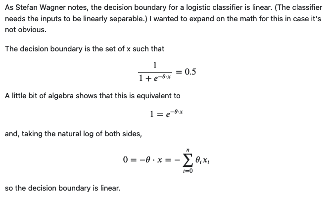
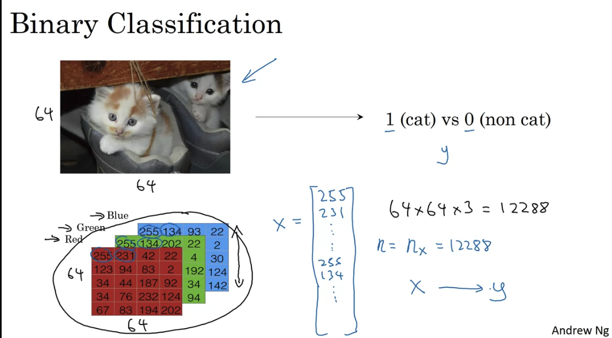
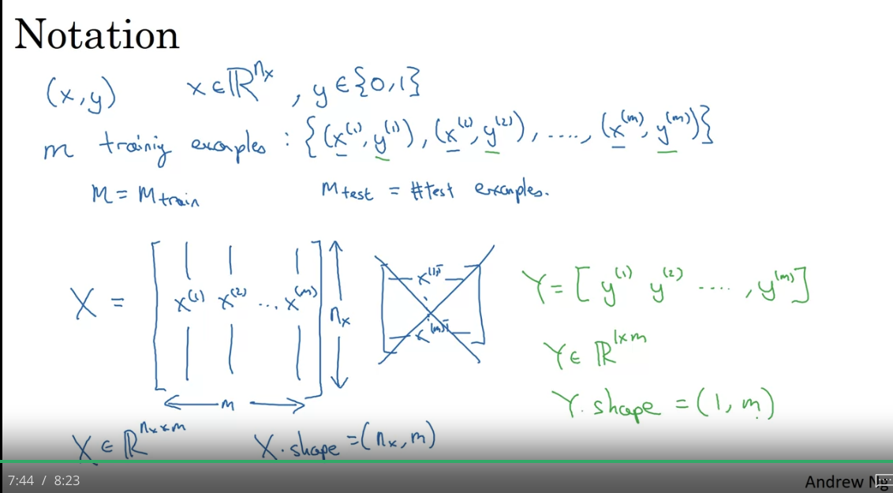
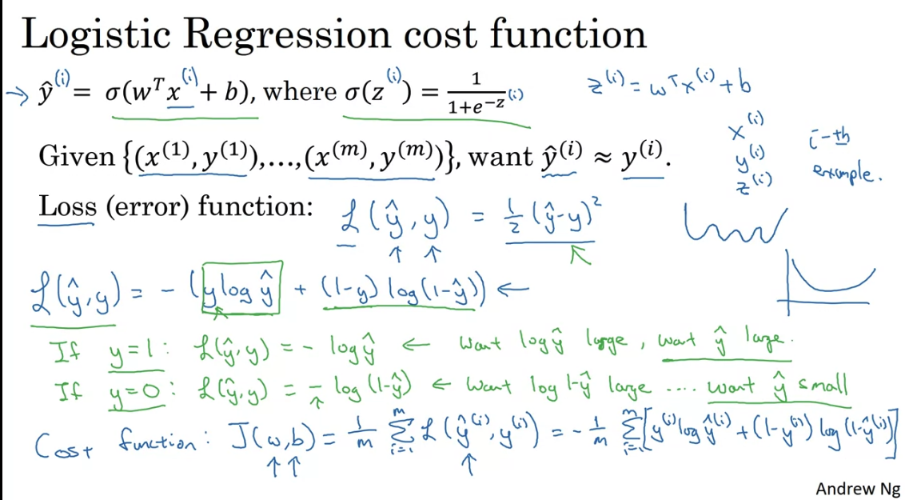

# Logistic regression

Logistic regression is actually a **classification method**.

**Logistic loss = - Log likelihood**

The decision boundary of logistic regression is always a straight line. Logistic regression is considered a **generalized linear model**. Linear regression expresses the log-odds in terms of a linear function of the inputs $x$. Log-odds is a way to compute the probability of classifying as 0 or 1.

## Linear decision boundary

# Logistic Regression as a Neural Network

Binary classification of an image - flatten all pixels into one vector

In NN the design matrix would have dimension $nxm$ - it is easier that way (transposed of ML design matrix)

**Logistic regression is just applying sigmoid function to the linear model, $\hat{y} = \sigma(wx+b)$ and using logistic loss function.**

Note in logistic regression we predict $\hat{y} = \sigma(wx+b)$ which represents a probability between 0 and 1. We use the ogistic losss function so that we have a convex cost function. No matter where you initialize, you would reach the global minimum.

