[Stanford DL course](https://www.youtube.com/playlist?list=PLoROMvodv4rOABXSygHTsbvUz4G_YQhOb)

[Syllabus](http://cs230.stanford.edu/syllabus/)

This course is youtube videos + coursera videos. Youtube has deeper insights and coursera is for practice and fundamentals.

# Key messages
- In deep learning, feature learning replaces feature engineering
- Traditional ML performance **platues** at some point and cannnot utilize more data. For NN we have not reached that point yet.
- ML,DL is all about approximating/learning a function.
- Model = Architecture + Parameters

# Lecture 1 Deep Learning overview

Deep Learning and Neural Network are almost the same thing. DL is the popular brand word.

Traditional ML performance **platues** at some point and cannnot utilize more data. For NN we have not reached that point yet.

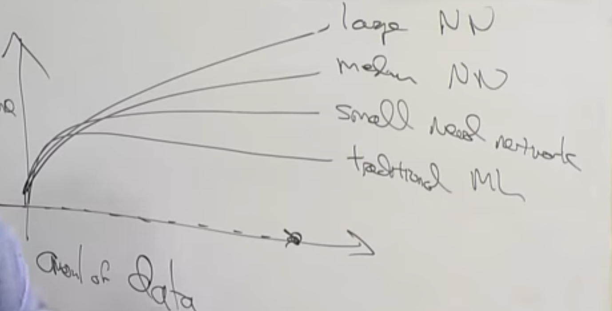

**Fundamental courses:**

- CS229 (ML most mathematical)
- CS299A (Applied ML least mathematical and easiest)
- CS230 (a bit in between, focuses on DL)

Finish C1M1, C1M2 (chap 1 module 2).

# Lecture 2: Deep Learning Intuition

ML,DL is all about approximating/learning a function.

**Model = Architecture + Parameters**

The goal of ML/DL is to find the best parameters for the model.

Example:

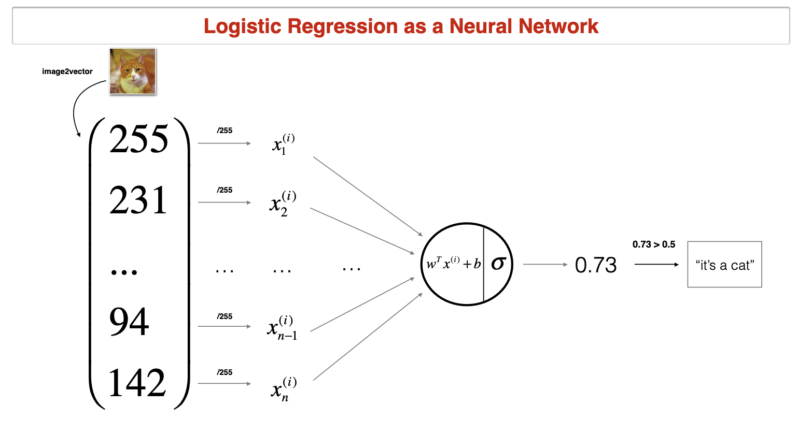

**Each hidden layer encodes information from previous layer. E.g in convolutional neural network, each layer encodes more and more complex features. **

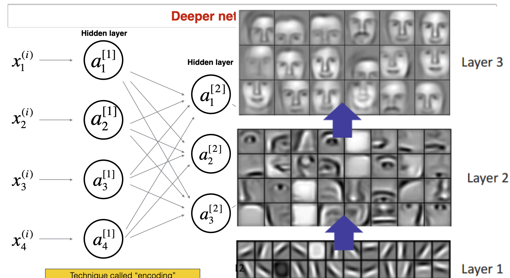

## Case study 1: Day and Night classification

**Deep Learning Project choices:**

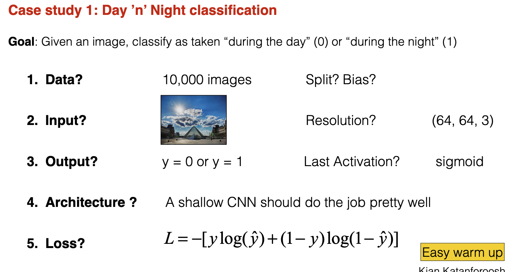

The problem of clasifying a cat needed 10,000 images. Is the next problem easier or harder? Depending  on the task you want to solve you would know based on past projets how many data point you need.

- train/test split 80/20 is good for 10k images. If I had 1M images I would choose 98/2 split. Test data is to gauge how well the model is doing on real unseen data. You ask yourself how many data points I need to tell my model is doing good (dawn, sunset, sunrise, evening, morning)
- bias you want balanced dataset in train and test
- resolution of images (the smaller the better for computation. 32x32 is better than 400x400) Choose the smallest resolution that human can have perfect performance. If you had unlimited computational power you would choose the highest resolution.

## Case study 2: Face verification

- architecture: encode each image using a DL and then compute distance functions
- In face verification, we have used an encoder network to learn a lower
dimensional representation (called “encoding”) for a set of data by
training the network to focus on non-noisy signals.
- **Triplet loss** is a loss function where an (anchor) input is compared to a
positive input and a negative input. The distance from the anchor input to
the positive input is minimized, whereas the distance from the anchor input
to the negative input is maximized.

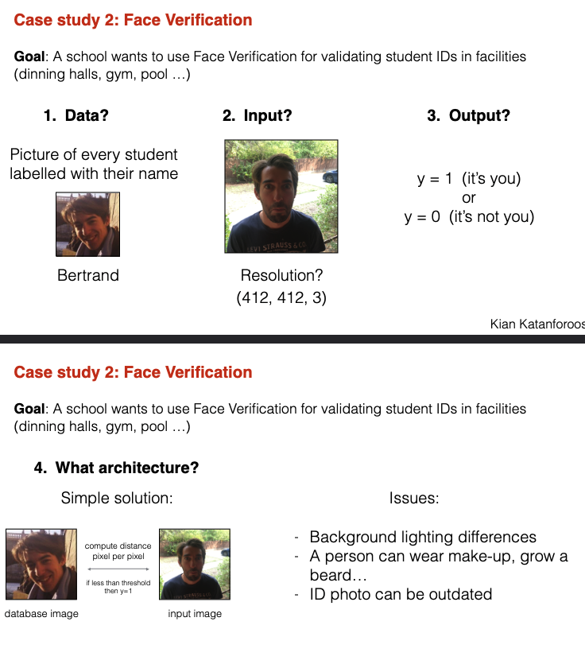

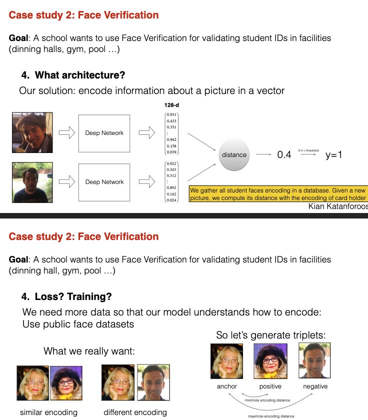

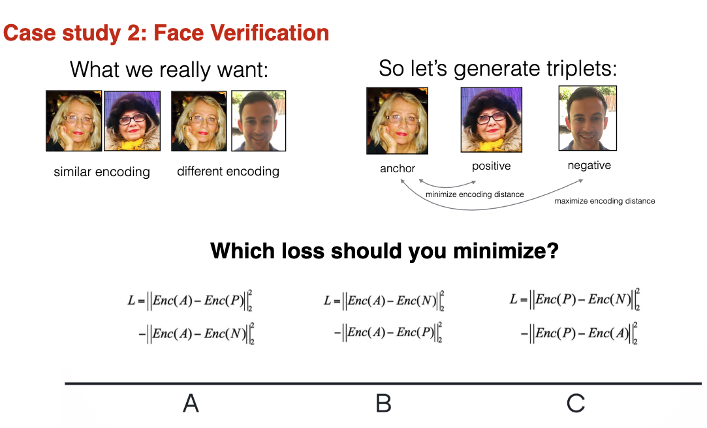

## Case study 3: Art generation
- Do not train model, just optimize the cost function by changing pixels (goal is to generate image)
Kian Katanforoosh
- In the neural style transfer algorithm proposed by Gatys et al., you optimize
image pixels rather than model parameters. Model parameters are
pretrained and non-trainable.
- You leverage the “knowledge” of a pretrained model to extract the content
of a content image and the style of a style image
- ImageNet

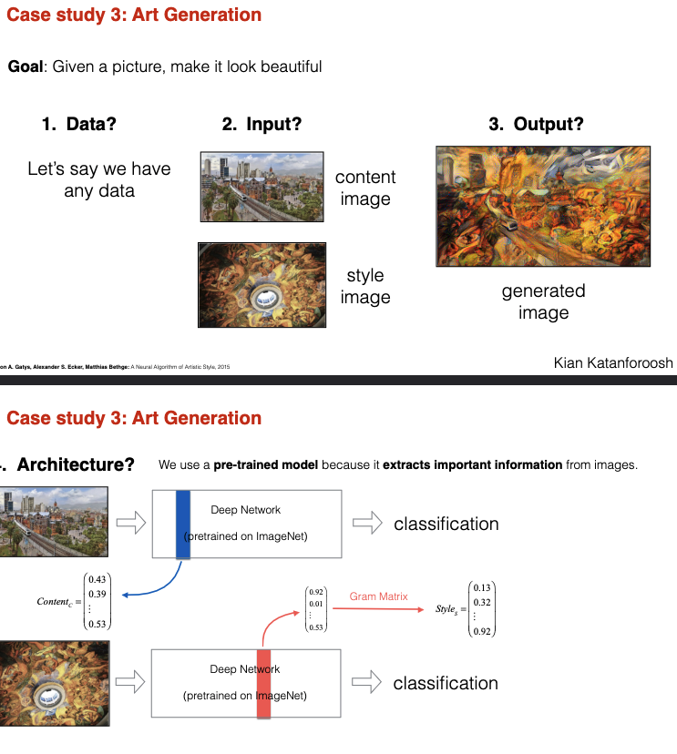

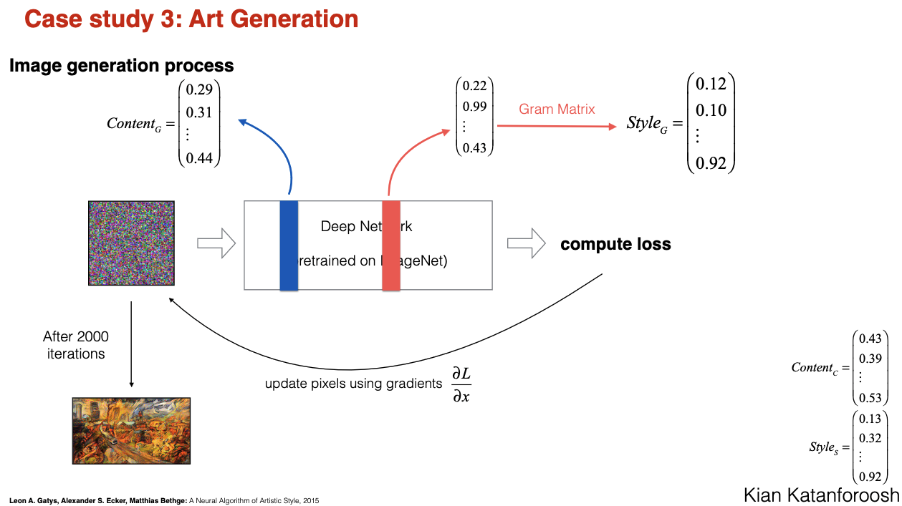

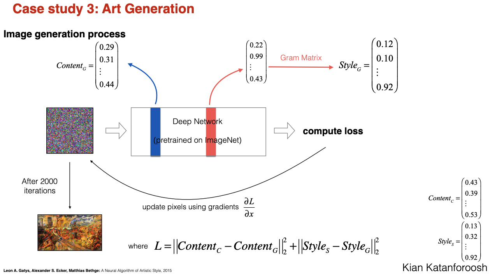

# Case study 4: Trigger word detection (Alexa)

- Your data collection strategy is critical to the success of your project. (If
applicable) Don’t hesitate to get out of the building.
- You can gain insights on your labelling strategy by using a human experiment

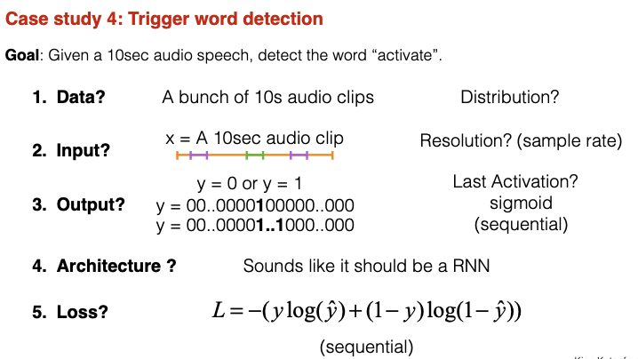

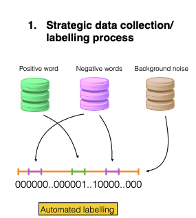