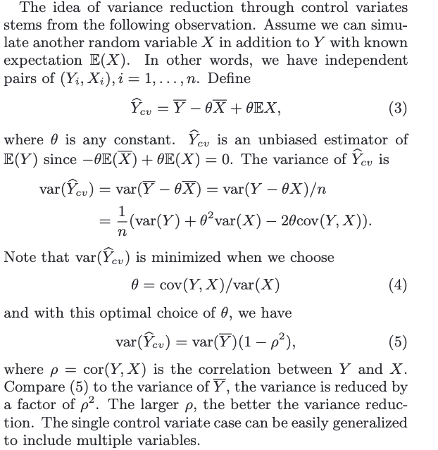
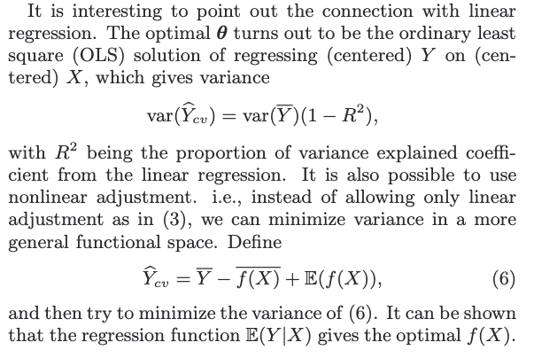
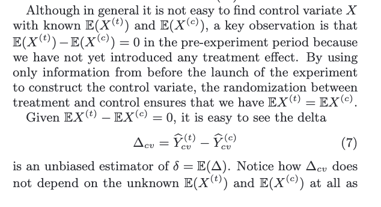
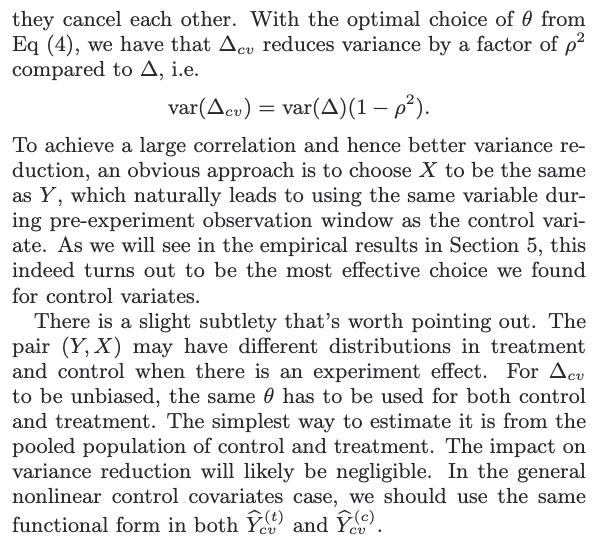

# What is CUPED?

CUPED is a well-established variance reduction technique for experiments (paper)[https://www.exp-platform.com/Documents/2013-02-CUPED-ImprovingSensitivityOfControlledExperiments.pdf]

Unlike methods like outlier removal or winsorization, it doesn’t sacrifice any data integrity.

It can be used together with winsorization, which enhances its effectiveness.

It requires pre-experimentation data - which we generally have in Bunsen.

For a rather unpredictable event like ad clicks, we get ~5% reduction in standard deviation (which is ~10% reduction in variance, and experiment run time). For something like sessions, that 5% can increase to something like 30%.

# Predicted uncertainty is not uncertainty. 

So the variance in your experiment metric should only take into account the unpredictable part of your measurement. If you predict that:
- guv A will have 5 sessions during the experiment, and 
- guv B will have 20 sessions,

And when you actually measure the sessions, you get:
- guv A has 4 sessions (-1 from prediction)
- guv B has 21 sessions (+1 from prediction),

Then the variance, or the uncertainty, in your measurement can be calculated on the residuals of your predictions, rather than on the measurements themselves. This gives var([-1, +1]), rather than var([4, 21]), which is a great reduction.

[notebook](https://drive.google.com/file/d/1YYSY9IgZzkp8q9U2ujPc2wuSRVtlgcqq/view?usp=drive_link)

[presentation](https://docs.google.com/presentation/d/1_ae5aQ12v0ykqCLF3JB3urdgHeZuwags/edit#slide=id.p1)

# Control Variates

(from paper)

# Control Variates in online experiments

**The difficulty of applying it boils down to finding a control variate $X$ that is highly correlated with $Y$ and at the same time has known $E(X)$.**

# Control Variates vs Stratification

These are two techniques that both utilize covariates to achieve variance reduction. The stratification approach uses the covariates to construct strata while the control variates approach uses them as regression variables.

The former uses discrete (or discretized) covariates, whereas control variates seem more naturally to be continuous variables.

Control Variates is an extension of stratification, where the covariate can be an indicator variable showing the belonging of a sample to a stratum.

While these two techniques are well connected mathematically, they provide different insights into understanding why and how to achieve variance reduction. The stratification formulation has a nice analogy with mixture models, where each stratum is one component of the mixture model. Stratification is equivalent to separating samples according to their component memberships, effectively removing the between-component variance and achieving a reduced variance. A better covariate is hence the one that can better classify the samples and align with their underlying structure. On the other hand, the control variates formulation quantifies the amount of variance reduction as a function of the correlation between the covariates and the variable itself. It is mathematically simpler and more elegant. Clearly, a better covariate should be the one with larger (absolute) correlation.

**CUPED IN PRACTICE**

A simple yet effective way to implement CUPED is to use the same variable from the pre-experiment period as the covariate. You need to have pre-experiment data (have not appliet treatment), not good when you work with new users.

The more correlated covariate with the target the larger variance reduction.

Across a large class of metrics, our results consistently showed that using the same variable from the pre-experiment period as the covariate tends to give the best variance reduction. In addition, the lengths of the pre-experiment and the experiment periods also play a role. Given the same pre-experiment period, extending the length of the experiment does not necessarily improve the varianc reduction rate. On the other hand, a longer pre-period tends to give a higher reduction for the same experiment period.
