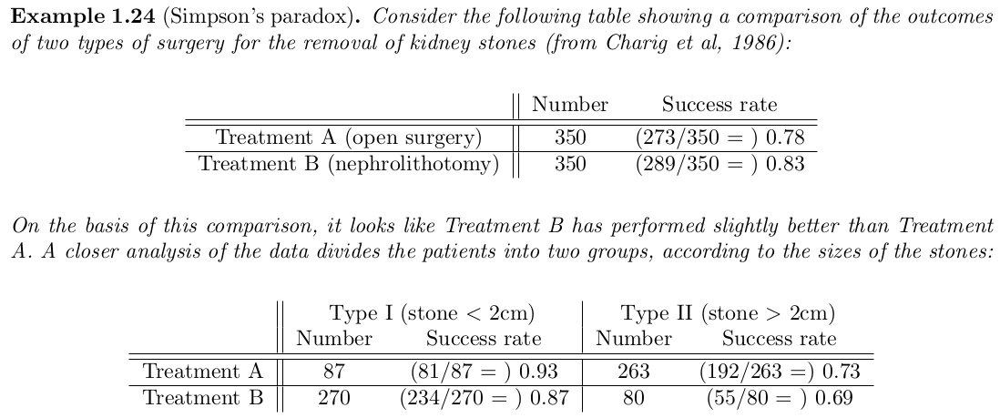

Notes on Oxford [lectures]() and solutions/answers to all problems from this [book](). 

# Buzzwords
Sample space, events, probability measure. Sampling with or without replacement. Conditional probability = partition of sample space, law of total probability/total expectation, Bayes’ Theorem. Independence.

Discrete radom variablers, pmf = probability mass function, Marginal and conditional distributions, first and second order linear difference equations (fibonacci), random walk, Gambler's ruin.

probability generating function, variaance covariance

cts random variables, cdf, pdf

Random sample, sums of independent random variables. Markov’s inequality, Chebyshev’s inequality, Weak Law of Large Numbers.

 - Eulers's formula (Riemann zeta function expressed with prime numbers) has probabilistic proof

 # Chapter 1. Events and probability

 Set of all possible outcomes $\Omega$ is called the *sample* space. S subset of $\Omega$ is called an *event*. 

 For events $A$ and $B$ we can do set operations:
 - $A ∪ B$ means at least one of the two occurs
 - $A ∩ B$ means both occur
 - $A - B$ means $A$ occurs but $B$ does not

 We assign probabilities $P(A)$ to events.

 Counting. Number of permutations of $n$ distinct elements is $n! ~ 2π n^{n+ 0.5} e^{−n}$ 

Binomial coefficient ${N\choose k} = \frac{N!}{(N-k)! k!}$.

Binomial theorem expands $(x+y)^n = = (x + y)(x + y) · · · (x + y)$. Proof by counting.

Bijectionargument in counting problems

**Example**
How many distinct non-negative intger-valued solutions of the equation $x_1 +... x_m = n$ are there?

${n+m-1\choose m-1}$ - use sticks argument

**Lemma. Vandermonde’s identity** ${m+n\choose k} = \sum_j^k {m\choose j}{n\choose k-j}$

Use Breaking things down argument

Countable sets are those which you can label (i.e. map to the integer space), Uncountable sets cannot be labelled like $\R$

**Definition 1.5**. A probability space is a triple $(Ω, F, P)$ where
1. $Ω$ is the sample space,
2. $F$ is a collection of subsets of $Ω$, called **events**, satisfying axioms **F1 –F3** below,
3. $P$ is a probability measure, which is a function $P : F → [0, 1]$ satisfying axioms **P1 –P3** below.

**The axioms of probability**

$F$ is a collection of subsets of Ω, with:
- F1 : ∅ ∈ $F$. empty event is in $F$
- F2 : If $A ∈ F$, then also $A^{c} ∈ F$. An event and its complementary are both in $F$
- F3 : If {Ai , i ∈ I} is a finite or countably infinite collection of members of $F$, then $∪A_i ∈ F$. $F$ has the notion of **closure**.

$P$ is a function from $F$ to $\R$, with:
- P1 : For all $A ∈ F, P(A) ≥ 0$.
- P2 : $P(Ω) = 1$. All events have probability 1.
- P3 : If {Ai , i ∈ I} is a finite $P$ or countably infinite collection of members of $F$, and $A_i ∩ A_j = ∅$ for $i != j$, then $P(∪A_i ) = \sum P(A_i) $ **Distributivity** of union over intersection.

**P3** would not be true if it was just for pairwise sets. The above is stronger!

**Theorem 1.9**. Suppose that $(Ω, F, P)$ is a probability space and that $A, B ∈ F$. Then
1. $P (A^c ) = 1 − P (A)$;
2. If $A ⊆ B$ then $P(A) ≤ P (B)$.

**Definition 1.11.** Let $(Ω, F, P)$ be a probability space. If $A, B ∈ F$ and $P(B) > 0$ then the **conditional probability** of $A$ given $B$ is

$P(A|B) = \frac{P(A ∩ B)}{P(B)}$

Probability space is a powerful thing. You have all the axioms above to be true!

**Lemma** If $(Ω, F, P)$, then for any event $B$, if you swap $P(A) with Q(A) = P(A|B)$ then $(Ω, F, Q)$ is a probability space too! That is if you condition your probability space on certain event you still have all the axioms.

**Independece** Events $A$ and $B$ are independent if $P(A ∩ B) = P(A)P(B)$.

A family of events is independend if $P(∩ A_i) = \prod P(A_i)$

PAIRWISE INDEPENDENT DOES NOT IMPLY INDEPENDENCE.

$A$ and $B$ independent imply $A$ and $B^c$ are independent.

**Theorem 1.20 (The law of total probability)**. Suppose $\{B1 , B2 , . . .\}$ is a partition of $Ω$ by sets from $F$, such that $P(B_i ) > 0$ for all $i ≥ 1$. Then for any $A ∈ F$,

$P(A) = \sum_{i≥1} P(A|B_i)P(B_i)$.

(partition theorem)

**Bayes theorem = Conditional probability + law of total probability**

$P(A|B) = \dfrac{P(B|A)P(A)}{P(B)} = \dfrac{P(B|A)P(A)}{\sum P(B|A_i)P(A_i)}$ 

Simpson’s paradox

## Problems

Solutions to  **1.11** from the book.

Q1. Condition on first event and do linear differencing equation. Homogeneous and particular solution.

$p_n = 1/6 + 2/3 p_{n-1}$. Can use indeuction too.

Note this is a binomial distribution and we compute probability we have even outcome. Can expend $(1+x)^{n} + (1-n)^n$

Q2. No. Finate spaces should be power of two.

Q3. By induction. Use union operation is associative $P(A \cup B) = P(A) + P(B) - P(A \cap B)$

Q4. By Q3 and $P(A_1 ∪ A_2 ∪ . . . ∪ A_n) = 1 − P ((A_1 ∪ A_2 ∪ . . . ∪ A_n)^{c} ) = 1 − P(A_1^{c} ∩ . . . ∩ A_n^{c})$

Q5. Example of pairwise independence (3 events) that does not imply independence of all 3 events $P(A \cap B \cap C) \neq P(A)P(B)P(C)$.

Q6. Conditional probability + Bayes. 79/140, 40/61

Q7. 3 spades sequences/all sequences $= \dfrac{13.12.11}{13.12.50}$ 

Q8. Binomial distribution and expand Stirling.

Q9. Contidional probability + Binomial disribution + Vandermonde’s identity

Q10. Skip physics

Q11. Law of total probability (parititon theorem). They want to get the eight element so can do manually with iteration. I don't see easy way to solve this difference equation by hand?

#TODO Q12. Extra hard, did not solve it. [stack](https://math.stackexchange.com/questions/3277206/prove-0-1234567891011-is-a-normal-number), [normal numbers](https://en.wikipedia.org/wiki/Normal_number), [Champernowne constant](https://en.wikipedia.org/wiki/Champernowne_constant)

Q13. Conditional probability + algebra iteration... Goal is to get differencing equation in each variable e.g. $f(c_{n+1},c_n,c_{n-1}) = 0$

Q14. a) Inclusion-exclusion principle.
b) $e^{-1}, 1-e^{-1}$

Q15. Condition on k cards match. Then use incllusion exclusion principle.

Q16. Conditional probability on when 8:45 and 9:00 trains come. $\dfrac{e^{-1}}{2}+\dfrac{e^{-2}}{4}+\dfrac{e^{-4}}{4}$

Q17.

Q18

Q19. $n=6$