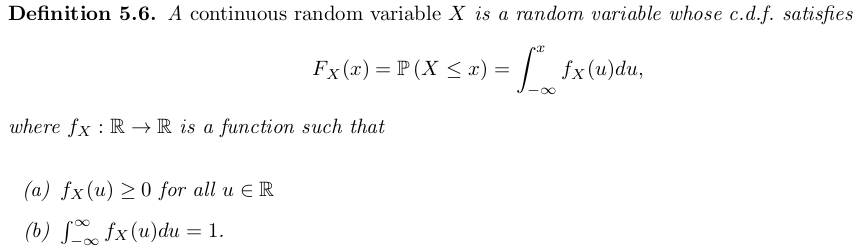
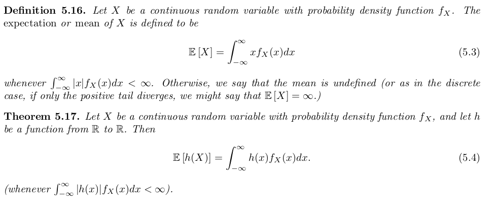
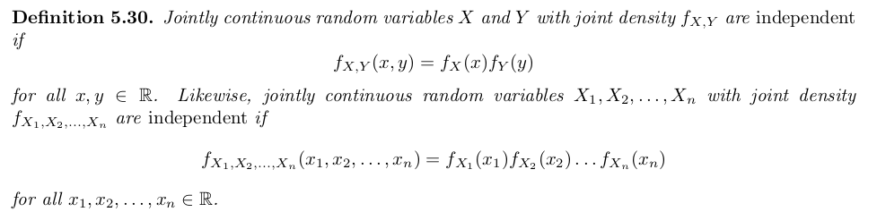
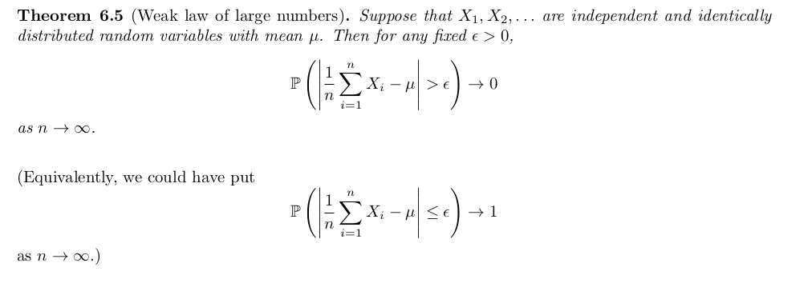
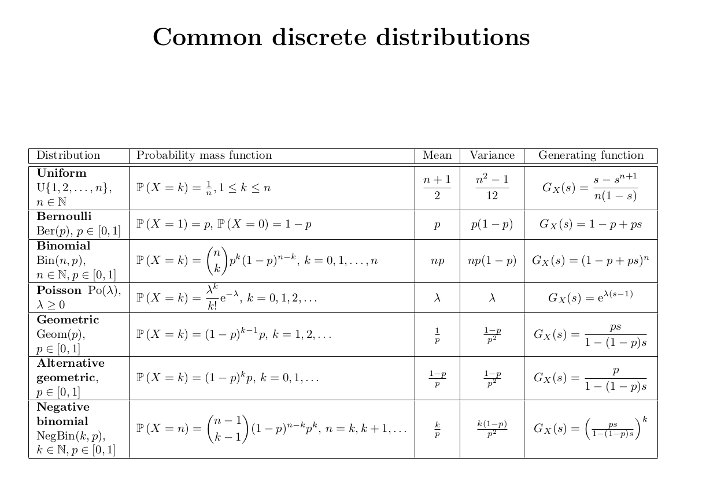
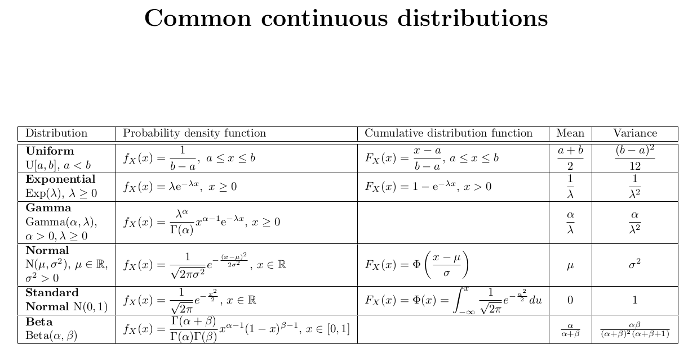

Notes on Oxford [lectures]() and solutions/answers to all problems from this [book](). 

# Buzzwords
Sample space, events, probability measure. Sampling with or without replacement. Conditional probability = partition of sample space, law of total probability/total expectation, Bayes’ Theorem. Independence.

variance, covariance, zero covariance does not imply independence, in normal distributions zero covariance = independence

Discrete radom variablers, pmf = probability mass function, Marginal and conditional distributions, first and second order linear difference equations (fibonacci), random walk, Gambler's ruin.

Poisson interpretation: The number of occurrences during a time interval of length $\lambda$ is a Poisson-distributed random variable with expected value $\lambda$.

Po $(\lambda)$ is approximation of Bin $(n,\dfrac{\lambda}{n})$ for large $n$, derive from pmf of binomial.

Poisson limit therem, law of rare events, poisson approximation of binomial (less computationally expensive),
exponential distribution is the poisson discrete equivalent

negative binomial is sum of geometric distributions, binomial is sum of bernoulli distributions

$gamma(\sum_{i}a_i,b)$ is sum of gamma distributions $gamma(a_i,b)$

sum of $n$ exponential distributions $Exp(\lambda)$ is $Gamma(n,\lambda)$

probability generating function, branching processes, solution to probability of extinction $s = G(s)$, random sum formula $G_N(G_X(s)) = G_S(s)$ where $S = X_1 + X_2 + ... + X_n$, $X_i ~ X$ iid and independent from $N$. use it to prove $E(S) = E(N)E(X)$ (alternatively use total law of expectation) . This solves problems with stopping times too.

use pgfs to compute $P(X mod 2 = 0)$, hint $G(1), G(-1)$. 

cts random variables, cdf, pdf

pdf has similar properties as pmf but is NOT a probability.

sample any cdf from uniform samples. $F_{X}^{-1}(U)$

$E[X] = \int_{0}^{\infty}P(X>x)$, need $X$ to be non-negative random variable. Prove that using swap integrands (Tonelli's theorem).

Random sample, sums of independent random variables. Markov’s inequality, Chebyshev’s inequality, Weak Law of Large Numbers.

[mixture distributions](https://actuarialmodelingtopics.wordpress.com/2017/10/02/examples-of-mixtures/) good for bayesian modelling

 - Eulers's formula (Riemann zeta function expressed with prime numbers) has cool probabilistic proof. Check sheet 2 last problem.

$P(\text{break stick into n pieces and have polygon}) = P(\text{all pieces are less than } \dfrac{1}{2}) = 1 - P(\text{all points lie in one semi circle}) = 1- \dfrac{n}{2^{n-1}}$

# Chapter 1. Events and probability

 Set of all possible outcomes $\Omega$ is called the *sample* space. S subset of $\Omega$ is called an *event*. 

 For events $A$ and $B$ we can do set operations:
 - $A ∪ B$ means at least one of the two occurs
 - $A ∩ B$ means both occur
 - $A - B$ means $A$ occurs but $B$ does not

 We assign probabilities $P(A)$ to events.

 Counting. Number of permutations of $n$ distinct elements is $n! ~ 2π n^{n+ 0.5} e^{−n}$ 

Binomial coefficient ${N\choose k} = \frac{N!}{(N-k)! k!}$.

Binomial theorem expands $(x+y)^n = = (x + y)(x + y) · · · (x + y)$. Proof by counting.

Bijectionargument in counting problems

**Example**
How many distinct non-negative intger-valued solutions of the equation $x_1 +... x_m = n$ are there?

${n+m-1\choose m-1}$ - use sticks argument

**Lemma. Vandermonde’s identity** ${m+n\choose k} = \sum_j^k {m\choose j}{n\choose k-j}$

Use Breaking things down argument

Countable sets are those which you can label (i.e. map to the integer space), Uncountable sets cannot be labelled like $\R$

**Definition 1.5**. A probability space is a triple $(Ω, F, P)$ where
1. $Ω$ is the sample space,
2. $F$ is a collection of subsets of $Ω$, called **events**, satisfying axioms **F1 –F3** below,
3. $P$ is a probability measure, which is a function $P : F → [0, 1]$ satisfying axioms **P1 –P3** below.

**The axioms of probability**

$F$ is a collection of subsets of Ω, with:
- F1 : ∅ ∈ $F$. empty event is in $F$
- F2 : If $A ∈ F$, then also $A^{c} ∈ F$. An event and its complementary are both in $F$
- F3 : If {Ai , i ∈ I} is a finite or countably infinite collection of members of $F$, then $∪A_i ∈ F$. $F$ has the notion of **closure**.

$P$ is a function from $F$ to $\R$, with:
- P1 : For all $A ∈ F, P(A) ≥ 0$.
- P2 : $P(Ω) = 1$. All events have probability 1.
- P3 : If {Ai , i ∈ I} is a finite $P$ or countably infinite collection of members of $F$, and $A_i ∩ A_j = ∅$ for $i != j$, then $P(∪A_i ) = \sum P(A_i) $ **Distributivity** of union over intersection.

**P3** would not be true if it was just for pairwise sets. The above is stronger!

**Theorem 1.9**. Suppose that $(Ω, F, P)$ is a probability space and that $A, B ∈ F$. Then
1. $P (A^c ) = 1 − P (A)$;
2. If $A ⊆ B$ then $P(A) ≤ P (B)$.

**Definition 1.11.** Let $(Ω, F, P)$ be a probability space. If $A, B ∈ F$ and $P(B) > 0$ then the **conditional probability** of $A$ given $B$ is

$P(A|B) = \frac{P(A ∩ B)}{P(B)}$

Probability space is a powerful thing. You have all the axioms above to be true!

**Lemma** If $(Ω, F, P)$, then for any event $B$, if you swap $P(A) with Q(A) = P(A|B)$ then $(Ω, F, Q)$ is a probability space too! That is if you condition your probability space on certain event you still have all the axioms.

**Independece** Events $A$ and $B$ are independent if $P(A ∩ B) = P(A)P(B)$.

A family of events is independend if $P(∩ A_i) = \prod P(A_i)$

PAIRWISE INDEPENDENT DOES NOT IMPLY INDEPENDENCE.

$A$ and $B$ independent imply $A$ and $B^c$ are independent.

**Theorem 1.20 (The law of total probability)**. Suppose $\{B1 , B2 , . . .\}$ is a partition of $Ω$ by sets from $F$, such that $P(B_i ) > 0$ for all $i ≥ 1$. Then for any $A ∈ F$,

$P(A) = \sum_{i≥1} P(A|B_i)P(B_i)$.

(partition theorem)

**Bayes theorem = Conditional probability + law of total probability**

$P(A|B) = \dfrac{P(B|A)P(A)}{P(B)} = \dfrac{P(B|A)P(A)}{\sum P(B|A_i)P(A_i)}$ 

Simpson’s paradox

## Problems

Solutions to  **1.11** from the book.

Q1. Condition on first event and do linear differencing equation. Homogeneous and particular solution.

$p_n = 1/6 + 2/3 p_{n-1}$. Can use indeuction too.

Note this is a binomial distribution and we compute probability we have even outcome. Can expend $(1+x)^{n} + (1-n)^n$

Q2. No. Finate spaces should be power of two.

Q3. By induction. Use union operation is associative $P(A \cup B) = P(A) + P(B) - P(A \cap B)$

Q4. By Q3 and $P(A_1 ∪ A_2 ∪ . . . ∪ A_n) = 1 − P ((A_1 ∪ A_2 ∪ . . . ∪ A_n)^{c} ) = 1 − P(A_1^{c} ∩ . . . ∩ A_n^{c})$

Q5. Example of pairwise independence (3 events) that does not imply independence of all 3 events $P(A \cap B \cap C) \neq P(A)P(B)P(C)$.

Q6. Conditional probability + Bayes. 79/140, 40/61

Q7. 3 spades sequences/all sequences $= \dfrac{13.12.11}{13.12.50}$ 

Q8. Binomial distribution and expand Stirling.

Q9. Contidional probability + Binomial disribution + Vandermonde’s identity

Q10. Skip physics

Q11. Law of total probability (parititon theorem). They want to get the eight element so can do manually with iteration. I don't see easy way to solve this difference equation by hand?

#TODO Q12. Extra hard, did not solve it. [stack](https://math.stackexchange.com/questions/3277206/prove-0-1234567891011-is-a-normal-number), [normal numbers](https://en.wikipedia.org/wiki/Normal_number), [Champernowne constant](https://en.wikipedia.org/wiki/Champernowne_constant)

Q13. Conditional probability + algebra iteration... Goal is to get differencing equation in each variable e.g. $f(c_{n+1},c_n,c_{n-1}) = 0$

Q14. a) Inclusion-exclusion principle.
b) $e^{-1}, 1-e^{-1}$

Q15. Condition on k cards match. Then use incllusion exclusion principle.

Q16. Conditional probability on when 8:45 and 9:00 trains come. $\dfrac{e^{-1}}{2}+\dfrac{e^{-2}}{4}+\dfrac{e^{-4}}{4}$

Q17. #TODO

Q18 #TODO

Q19. $n=6$

# Chapter 2. Discrete random variables

Encode information about an outcome using numbers

Definition 2.1. A **discrete random variable** X on a probability space $(Ω, F, P)$ is a function $X : Ω → R$
such that

- (a) $\{ω ∈ Ω : X(ω) = x\} ∈ F$ for each $x ∈ R$,
- (b) $ImX := \{X(ω) : ω ∈ Ω\}$ is a **finite** or **countable subset** of $R$.

(a) says $\{ω ∈ Ω : X(ω) = x\} = \{X = x\}$ lives in $F$, that is it is an event and we can assign probability.

(b) is the definition of discrete.

Definition 2.3. A probability mass function (pmf) of a random variable is $p_{X}(x) = \P(X = x)$ s.t.:

- $p_X(x) ≥ 0$ for all $x$,
- $\sum p_X(x) = 1$

Classic discrete distributions:
- Bernoulli
- Binomial
- Geometric
- Poisson

**Definition 2.6** The expectation (or expected value or mean) of $X$ is

$E[X] = \sum_{x∈ImX} xP(X = x)$
provided that $\sum_{x∈ImX}|x|P (X = x) < inf$, otherwise it does not exist. We require **absolutely convergent** series sum.

The expectation of $X$ is the ‘average’ value which $X$ takes.

**Theorem.** $E[f(X)] = \sum_{x∈ImX} f(x)P(X = x)$

**Linearity of expectation**:
- $E[aX + b] = aE[X] + b$
- $E[X+Y] = E[X] + E[Y]$

**Definition 2.11.** For a discrete random variable $X$, the variance of $X$ is defined by:

$var(X) = E[(X − E[X])^2] = E[X^2] - (E[X])^2$, provided that this quantity exists.

Variance gives size of fluctuations around the expectation.

$var(Y) = var(aX + b) = a^2var(X)$

**Theorem 2.14** (Law of total expectation = Partition theorem for expectations).

$E[X] = \sum_{B} E[X|B]P(B)$

Joint pmf is $p_{X,Y}(x,y) = P(X=x,Y=y) = P(\{X=x\} \cap \{Y=y\})$

Marginal distribution exists for joint distribution and is just integrating/summing out one of the variables $p_{X}(x) = \sum_{y} p_{X,Y}(x,y)$

**Theorem 2.23** If $X$ and $Y$ are independent, then $E[XY] = E[X]E[Y]$. Reverse is NOT true.

**Definition** $cov (X,Y) = E[(X − E[X])(Y − E[Y])] = E[XY] - E[X]E[Y]$.

**i.i.d. = independent and identically distributed**

# Problems

Solution from chapter 2.6 in book.

Q1. $f(x) = \dfrac{x!}{(x-k)!}$

Q2. $\dfrac{r}{p}$

Q3. Discrete RV with zero variance then, the RV is eqaul to the mean. In cts RV, $X=E[X]$ almost surely (degenerate distribution).

Q4. $\alpha < -1$ need convergence, $c = 1/\zeta(-\alpha)$ Rieman zeta function

Q5. Lack of memory proerty of Geometric distribution. *Kvot bilo bilo*.

Q6. 
1. Proof by visualization.
2. $3(\dfrac{2}{3})^{k}$
3. coupun collection problem, linearity of exp. $3*(1+1/2+1/3)$

Q7. harmonic series $log(n)$

Q8. #TODO

Q9. Expected tosses till see $n$ consecutive heads $\dfrac{1-p^n}{p^n(1-p)}$. 
Write it using Markov chain state technique and goal is to compute $e_0$, with boundary condition $e_{H..HH} = e_n = 0$
To solve it you need to take difference of consecutive equations and do telescoping sum like idea.

Q10. #TODO

# Chapter 3. Difeerence equations and random walks

**Theorem 3.3** The general solution $(u_n)_{n>=0}$ to a difference equation:

$\sum_{j=0}^{k} a_{j}u_{n+j} = f(n)$

can be written as $u_n = v_n + w_n$ where:

- $v_n$ is a particular solution to the equation (resembles $f(n)$)
- $w_n$ solves the homogeneous equation $\sum_{j=0}^{k}a_{j}w_{n+j} = 0$

To solve the homogeneous equation when you have $k>1$ you need to get the auxilary equation - substitute in the homogenous equat $u_n = x^{n}$ and the roots of it gives you the general form of the solution to the homogeneous equation. For $k=2$ it looks like: $w_n = A_1 x_{1}^{n} + A_2 x_{2}^{n}$

If $x_1=x_2$, then try $w_n = (A + Bn)x_{1}^{n}$

To solve the particular equation try solutions similar to $f(n)$ if it fails try the next most complicated thing. 

**Gamblers ruin:**

$u_n = pu_{n+1} + qu_{n-1}$, where $u_n = P(bankruptcy)$ if gambler has $n$ money. Boundary conditions: $u_0 = 1, u_M = 0$.

This is second order difference equation. If you remove the boundary $M$ you need to take limits $\lim_{M->inf}u_n^{(M)} = P(\text{hit 0 before )M}$.

$P(ever hit 0)$ is $\lim_{M->inf}u_n^{(M)}$. To prove that formally you need to use that for an **increasing** set of events $A_1 ⊆ A_2 ⊆ A_3 ⊆ ... ⊆ A_M ...$ you have $P(\cup A_k) = lim_{k->inf} P(A_k)$. 

Gamblers ruin for expectation $e_n =$ number of steps to hit absorbing stage. 

$e_n = p(1+e_{n+1}) + q(1+e_{n-1})$, with bc $e_0 = e_M = 0$

# Problems

Solution to problems from Chapter 10.5

Q1. $P(two iid random walks end in the same position)$ can  be expressed using two expressions. Think about the two walks separately and combined as in one walk.

Q2. Gamblers ruin with different parameters.

Q3. Condition on first step and use gamblers ruin solution for $n = 1,-1$. $\dfrac{1}{N}$

Q4. Skipped, to do property need to take limit as $M->inf$ and define $a_n^{M}$

#TODO finish questions, might need to read chapter. It is more comprehensive than the lecture notes

# Chapter 4 Probability generating functions

The probability generating function of a discrete random variable is a power series representation of its pmf. It is defined only for discrete random variables.

$G_X(s) = E[s^{X}] = \sum_{k} s^kP(X = k)$

where $s\in \R$ such that the expectation exists.

**Theorem 4.2**. The distribution of $X$ is uniquely determined by its probability generating function, $G_X$ .

The $k$th derivative of $G$ evaluated at zero gives $P(X = k)$.

**Theorem 4.3** If $X$ and $Y$ are independent, then $G_{X+Y}(s) = G_X(s)G_Y(s)$

Use the above two theorems to prove that sum of $n$ independent Bernoulli random variables is a Binomial random variable.

Sum of $n$ iid Poisson rvs is Poisson rv with parameter = sum of parameters.

**Calculate moments** by taking derivative of the pgf and evaluate at $s = 1$

**Theorem 4.8.** Let $X_1 , X_2 , ...$ be i.i.d. non-negative integer-valued random variables with p.g.f. $G_X (s)$.
Let $N$ be another non-negative integer-valued random variable, independent of $X_1, X_2 ,...$ and with p.g.f. $G_N(s)$. Then the p.g.f. of $\sum_{i=1}^{N} X_i$ is $G_N(G_X(s))$.

This chain trick appears in branching processes. Start with one individual which gives birth to many children. In generation $n$ each individual in the population gives children. The pgf of total number of individuals in generation $n+1$ satisfies $G_{n+1}(s) = G(G_n(s))$ Where $G$ is the pgf of random variable giving number of children for 1 individual. By induction you can express $G_{n+1}(s)$ as nested $G(s)$ n times.

**Extintion probability.**

$s = G(s)$ is solution to probability of extinction!

$q = \sum_{k}q^k P(X=k) = G(q)$, where we condition on the number of children of the first individual.

This equation always have solution at 1. However you cannot solve it for $q$.

You need to go this way: $q = P(\cup_{n} \{X_n = 0\}) = lim_{n->inf} P(X_n = 0) = lim_{n->inf}G_n(0)$ using the fact about increasing sequences of events.

It turns out that the question of whether the branching process inevitably dies out is determined by the mean number of children of a single individual. Then we find that there is a positive probability of survival of the process for ever if and only if $µ > 1$. (Theorem 4.15 proves it)

# Problems

Problems from Chapter 4.5 from the book

Q1. $P(X = k) = u_{k-1}-u_kS

Q2. $\dfrac{1}{6^7}({13\choose 6} - 49)$, need to count number of ways you can sum 7 number and equal to 14 then subtract when any of the numbers is greater than 6 (could be 7 or 8 only, sum 6 numbers is minimum 6).

Q3. Geometric distribution with $p=1/3$. Get pgf of geo + some arithmetic.

probability of winning are sum of geometric series. Mean durtion of game is 3.

Q4. Sum of $N$ **alternative** geometric distributions. 

Q5.

Q6. eavluate pgf at smart points [trick](https://math.stackexchange.com/questions/458549/probability-that-number-of-heads-flipped-is-divisible-by-3)

# Chapter 5. Continuous random variables

Recall that random variable is a function which maps $\Omega$ the outcome space to $\R$. Discrete random variables have $Im(X)$ to be countable set.

**Definition 5.2.** The cumulative distribution function (**cdf**) of a random variable $X$ is the function $F_X : \R → [0, 1]$ defined by
$F_X(x) = P(X \leq x)$.

$F_X$ is non-decreasing.

CTS random variable:

**WARNING: $f_X(x)$ IS NOT A PROBABILITY.**

For cts random variable $P(X = x) = 0$ for any $x \in \R$

Independece in cts random variables is defined through the pdf:

But can be defined through cdf too.

$var(X + Y) = var(X) + var(Y) + 2cov(X,Y)$

**NB** Standard normal random variables $X$ and $Y$ are independent if and only if their covariance is 0. This is a nice property of normal random variables which
is not true for general random variables, as we have already observed in the discrete case.

# Problems

Answers on problems from chapter 5.8 in the book.

Q1. $E(X) = 0$ (substitution + symmetry), $var(X) = 2c^{-2}$ - integration by parts + substitution.

Q2. for $w \in \N$ for Poisson $X$ we have $P(X \geq w) = 1 - \dfrac{\Gamma(w,\lambda)}{\Gamma(w)}$, [see](https://math.stackexchange.com/questions/467341/question-about-connection-between-poisson-and-gamma-distributions)

The number of occurrences before time λ is at least w if and only if the waiting time until the wth occurrence is less than λ.

Q3. Skipped

Q4. [trick](https://math.stackexchange.com/questions/1248334/p-d-f-of-the-absolute-value-of-a-normally-distributed-variable)
$P(|X| \leq x) = P(X \leq x) - P(X \leq -x)$

$E(Y) = \sqrt{\dfrac{2}{\pi}}$

$var(Y) =  1 - \dfrac{2}{\pi}$, integrate by parts, use pdf integrates to 1

Q5. shows how to sample uniform distribution

Q6. sample any other distribution from uniform distribution

Q7. Integration question ,need to swap integrands (use Tonelli's theorem)[trick](https://math.stackexchange.com/questions/1690740/prove-that-ex-int-0-infty-pxx-dx-int-0-infty-1-f-xx)

Q8. skipped, basic principles

Q9. use indicator function?

Q10. cdf is $1- e^{-\dfrac{y+2}{1-y}}$, take derivative to find pdf

Q11. integrate $arctan(x)$ from zero to inf to get the constant, $(2/\pi)arctan(x)$

Q12. need to define pdf of the angle theta and the distance from center needle to the strips. (can simulate $\pi$ from this problem.)
[wiki](https://en.wikipedia.org/wiki/Buffon%27s_needle_problem)

Q13. $P(\text{break stick into n pieces and have polygon}) = P(\text{all pieces are less than} \dfrac{1}{2}) = 1 - P(\text{all points lie in one semi circle}) = 1- \dfrac{n}{2^{n-1}}$

Q14. cdf is $\dfrac{y}{3+y}$

# Chapter 6. Random samples and the weak law of large numbers

**Definition 6.1.** Let $X_1,X_2 , ... , X_n$ denote i.i.d. random variables. Then these random variables are
said to constitute a random sample of size $n$ from the distribution.

Let $X_1,X_2 , ... , X_n$ denote i.i.d. random variables with mean $\mu$ and variance $\sigma^2$. Then $X_n = \sum_{i=1}^{n}X_i/n$ has $E(X_n)= \mu$ and $var(X_n) = \dfrac{\sigma^2}{n}$.

Theorem 6.6. [Markov's inequality](https://en.wikipedia.org/wiki/Markov%27s_inequality) gives upper bound for a random variable to be larger than certain threshhold.

Theorem 6.7. [Chebyshev's inequality](https://en.wikipedia.org/wiki/Chebyshev%27s_inequality) tells you how far from the mean a random variable can deviate.

# Distributions

# Problem sheets answers

**Sheet 1**

Q1. $\dfrac{11!}{2!}, 2\dfrac{10!}{2!}, \dfrac{6!}{2!}$

Q2. $(100!)^{2}$

Q3. $\dfrac{1}{6^9}$

Q4. ${k\choose r}$, then condition on largest element.

Q5. basic set theory holds for probability of events

Q6. a) $P(B \cup C \cap A^{c})$. b)141

Q7. a) 23, $\dfrac{365...(365-n+1)}{365^n}$
b) $1 - (\dfrac{364}{365})^{n}$

Q8. Inclusion exclusion principle
$P(\text{no coorect hook}) = P(\cup_{i=1}^{n} A_{i}) = 1 - \dfrac{1}{2!} + \dfrac{1}{3!} ...$

number of arrangements of no correct hook = 
$n! \times P(\text{no correct hooks})$

d) $P(\text{exactly r correct hooks}) = \dfrac{\text{arrangements with exacly r correct}}{\text{all arrangements}} = \dfrac{{n\choose r}(n-r)!\sum_{k}^{n-r}\frac{(-1)^k}{k}}{n!}$

Remark. probability no correct hooks converges to $1-e^{-1}$

**Sheet 2**
Q1. Example that pairwice independence does not imply independence

Q2. $\dfrac{95}{95+2 \times 99.5} ~ 32%$

Q3. 
- a) $\dfrac{m}{m+n}$
- b) $\dfrac{m}{m+n}\dfrac{m-1}{(m+n-1)} + \dfrac{n}{m+n}\dfrac{m}{m+n-1}$
- c) Bayes from a) and b)

Q4 Use Bayes. Clarification: $p$ proportion are conservative, $1-p$
are liberal.

Q5. 
- a) ${26\choose 13}\dfrac{1}{2^{26}}$

- b) ${26\choose 13}^2$ $/$ ${52\choose 26}$

Second is bigger. Intution is that in a) you reset every time, and in b) you are pulled towards balance.

Q6. Euler's formula for Riemann's zeta function.
- a) $\dfrac{1}{k^{s}}$
- b) directly from definition $P(AB) = P(A)P(B)$, but for infinite number of events (pairwise dependence is not enough) 
- c) if an integer is not divisibel by any prime number it muist be 1!

**Sheet 3**

Q1. $np$

Q2. proof by visualization

Q3. 
- a) $(1-p)^k$
- b) memoryless propery of geometric distribution

Q4. Complete th exponent and use sum of pmf is 1.

Q5. 
- a) for large $n$ binomial becomes poisson
- b) $e^{-\lambda}$

Q6. 6

Q7. Coupon collector problem.
- a) $\dfrac{n-1}{n}$, geometric($\dfrac{n-1}{n}$)

- b) Geo($\dfrac{n-k+1}{n}$)

- c) harmonic series

**Sheet 4**

Q1. $\dfrac{n+1}{2}, \dfrac{(n+1)(4n+1)}{12}$

Q2. zero covariance does not imply independence

Q3. 
- a) independent so can just multiply
- b) sum of poisson independen is poisson (derive from pgf)
- c) binomial with $p = \dfrac{\lambda}{\lambda + \mu}$
- use c

Q4.
- bayes, in numerator $P(X=k,Y=n+1-k)$
- b) $(1-p)^{2k}(2p-p^2)$, use $p_k = p_{\ge k} - p_{\ge k+

Q5. 
- $n\times e^{-\lambda}$
- $P(Bin(m,p) = k)$, sum of binomial times poisson which turns out to be $Po(\lambda p)$

Q6. from axioms?

Q7. first and second order difference equations. solvable using particular and homogeneous solutions. For particular solutions - strategy try next most complex thing. 

**Sheet 5**

Q1. $2q_n+p_n = 1, q_n = \dfrac{p_{n-1}+q_{n-1}}{2}$ $\dfrac{1}{3}$ first order recurence equation.

Q2. 19

Q3. 
- a) $n$
- b) $\dfrac{n+1}{2n}$
- c) $\dfrac{M}{2}$, $e_n = n(M-n)$

Q4.
- a) sum of geometric series
- b) Take derivatives and evaluate at 1 $E(X) = p'_{X}(1) = \dfrac{1}{p}$.
$var(X) = \dfrac{1-p}{p^2}$

Q5.
- a) condition on first two throws, second order recurence.
- b) last 3 tosses are fixed, $\dfrac{1}{8}r_{n-3}$
- c) take derivative of probability generating function
- d) hmmmm #TODO, maybe need two probabilities $p_n, q_n$ and use trick like in Q1?

Q6. 
- a) $\dfrac{N(N-1)}{2}$, need to use $e_1$ from Q3.
- b) always need to go the whole way around, by symmetry the answer is $\dfrac{1}{N-1}$

**Sheet 6**

Q1.
- a) $s^a$
- b) $s^n p_{Y}(s^m)$

Q2.
- a) negative binomial - number of trials up to and including the $k$-th success.
- b) negative binomial is sum of geometric distributions! $p_{Geo}(s)^m = (\dfrac{ps}{1-(1-p)s})^m$

Q3.
- a) law of total expectation, or use Theorem 4.8 $G_Z(s)=G_N(G_X(s))$ and play around with pgf derivatives evaluated at 1.
- b) $\lambda p$
- c) no, $E[Z]$ is not longer $E[N]E[X_1]$, your proof in a) using law of total expecation uses the independence

Q4. $\dfrac{G_X(-1)+1}{2}$

Q5. $G(s) = 1/12 + 2s/3 + s^2/4$, $G(G(s))$, $P(extinction after 2 minutes)=G(G(0))$ 

Q6.
- a) $2p$, $G(s) = ps^2+1-p$
- b) $\dfrac{1-p}{p}$
- c) #TODO, maybe need to revisit notes, or look Miro's solution

**Sheet 7**

Q1. pictures of distributions

Q2. check if the integral of these functions exists

Q3.
- a) $\dfrac{1}{2}$, $\dfrac{1}{12}$
- b) $\dfrac{a}{b}$

Q4.
- a) $e^{-\lambda x}$
- b) $e^{-\lambda a} - e^{-\lambda b}$
- c) Bayes theorem + a) memoryless property of exponential distribution
- d) take arcsin and use that $X$ is exponential
- e) exponential, with lower rate
- f) **exponential distribution is the continuous version of the geometric distribution**, capped exp is geometric. [proof](https://math.stackexchange.com/questions/2087662/proving-that-the-discrete-exponential-distribution-is-geometric-distribution)

Q5.
substract mean, divide by std to get standard normal
- a) 0.454
- b) 0.921 - 0.454
- c) $0.921^20 + 20 \times 0.921^19 \times(1-0.921)$

Q6.
- dont need pdf to get expecation and variance [see](https://math.stackexchange.com/questions/2473968/radius-of-a-circle-w-uniform-distribution)
- to get pdf just take derivate of cdf, $\sqrt\dfrac{x}{\pi}$

Q7.
- a) $F_X(X)$ is uniform distribution, just go through definition $F_X(F_{X}^{-1}(x)) = x$
- b) $F_X(x)$ - gi>ves a way to generate $X$ from uniform distribution $U$
- c) thats exponential distribution, get the cdf, find its inverse and apply b)

**Sheet 8**

Q1. Integrate, choose constants which would make the integrals equal to 1.
for independence check with marginal distributions $f_{X,Y}(x,y) = f_{X}(x)f_{Y}(y)$

Q2
- a) $P(min(X_i)>t) = \prod_{i}P(X_i>t) ~ Exp(\sum_{i}\lambda_{i})$
- b) treat using indicator variable $\sum_{i}P(T_i > 1) = \sum_{i}e^{-\lambda_{i}}$
- c) $P(M < median) = 0.5$

Q3. integrate $x^2$ from 0 to 1. Area under the shaded region..

Q4. chebyshev

Q5. chebyshev

Q6. 
- a) $\dfrac{1}{4}$, $\dfrac{3}{16}$
- b) 0 when $|i-j| > 1$, $\dfrac{1}{16}$ otherwise
- c) use b, $\dfrac{n}{4}$,  $\dfrac{7n}{16}$
- d)  $\dfrac{n}{4}$,  $\dfrac{3n}{16}$

Q7 .WLLN