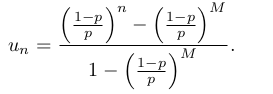
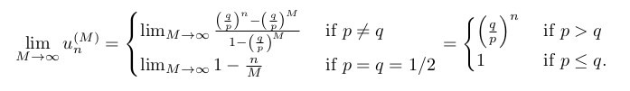

Notes on Oxford [lectures]() and solutions/answers to all problems from this [book](). 

# Buzzwords
Sample space, events, probability measure. Sampling with or without replacement. Conditional probability = partition of sample space, law of total probability/total expectation, Bayes’ Theorem. Independence.

Discrete radom variablers, pmf = probability mass function, Marginal and conditional distributions, first and second order linear difference equations (fibonacci), random walk, Gambler's ruin.

probability generating function, variaance covariance

cts random variables, cdf, pdf

Random sample, sums of independent random variables. Markov’s inequality, Chebyshev’s inequality, Weak Law of Large Numbers.

 - Eulers's formula (Riemann zeta function expressed with prime numbers) has probabilistic proof

# Chapter 1. Events and probability

 Set of all possible outcomes $\Omega$ is called the *sample* space. S subset of $\Omega$ is called an *event*. 

 For events $A$ and $B$ we can do set operations:
 - $A ∪ B$ means at least one of the two occurs
 - $A ∩ B$ means both occur
 - $A - B$ means $A$ occurs but $B$ does not

 We assign probabilities $P(A)$ to events.

 Counting. Number of permutations of $n$ distinct elements is $n! ~ 2π n^{n+ 0.5} e^{−n}$ 

Binomial coefficient ${N\choose k} = \frac{N!}{(N-k)! k!}$.

Binomial theorem expands $(x+y)^n = = (x + y)(x + y) · · · (x + y)$. Proof by counting.

Bijectionargument in counting problems

**Example**
How many distinct non-negative intger-valued solutions of the equation $x_1 +... x_m = n$ are there?

${n+m-1\choose m-1}$ - use sticks argument

**Lemma. Vandermonde’s identity** ${m+n\choose k} = \sum_j^k {m\choose j}{n\choose k-j}$

Use Breaking things down argument

Countable sets are those which you can label (i.e. map to the integer space), Uncountable sets cannot be labelled like $\R$

**Definition 1.5**. A probability space is a triple $(Ω, F, P)$ where
1. $Ω$ is the sample space,
2. $F$ is a collection of subsets of $Ω$, called **events**, satisfying axioms **F1 –F3** below,
3. $P$ is a probability measure, which is a function $P : F → [0, 1]$ satisfying axioms **P1 –P3** below.

**The axioms of probability**

$F$ is a collection of subsets of Ω, with:
- F1 : ∅ ∈ $F$. empty event is in $F$
- F2 : If $A ∈ F$, then also $A^{c} ∈ F$. An event and its complementary are both in $F$
- F3 : If {Ai , i ∈ I} is a finite or countably infinite collection of members of $F$, then $∪A_i ∈ F$. $F$ has the notion of **closure**.

$P$ is a function from $F$ to $\R$, with:
- P1 : For all $A ∈ F, P(A) ≥ 0$.
- P2 : $P(Ω) = 1$. All events have probability 1.
- P3 : If {Ai , i ∈ I} is a finite $P$ or countably infinite collection of members of $F$, and $A_i ∩ A_j = ∅$ for $i != j$, then $P(∪A_i ) = \sum P(A_i) $ **Distributivity** of union over intersection.

**P3** would not be true if it was just for pairwise sets. The above is stronger!

**Theorem 1.9**. Suppose that $(Ω, F, P)$ is a probability space and that $A, B ∈ F$. Then
1. $P (A^c ) = 1 − P (A)$;
2. If $A ⊆ B$ then $P(A) ≤ P (B)$.

**Definition 1.11.** Let $(Ω, F, P)$ be a probability space. If $A, B ∈ F$ and $P(B) > 0$ then the **conditional probability** of $A$ given $B$ is

$P(A|B) = \frac{P(A ∩ B)}{P(B)}$

Probability space is a powerful thing. You have all the axioms above to be true!

**Lemma** If $(Ω, F, P)$, then for any event $B$, if you swap $P(A) with Q(A) = P(A|B)$ then $(Ω, F, Q)$ is a probability space too! That is if you condition your probability space on certain event you still have all the axioms.

**Independece** Events $A$ and $B$ are independent if $P(A ∩ B) = P(A)P(B)$.

A family of events is independend if $P(∩ A_i) = \prod P(A_i)$

PAIRWISE INDEPENDENT DOES NOT IMPLY INDEPENDENCE.

$A$ and $B$ independent imply $A$ and $B^c$ are independent.

**Theorem 1.20 (The law of total probability)**. Suppose $\{B1 , B2 , . . .\}$ is a partition of $Ω$ by sets from $F$, such that $P(B_i ) > 0$ for all $i ≥ 1$. Then for any $A ∈ F$,

$P(A) = \sum_{i≥1} P(A|B_i)P(B_i)$.

(partition theorem)

**Bayes theorem = Conditional probability + law of total probability**

$P(A|B) = \dfrac{P(B|A)P(A)}{P(B)} = \dfrac{P(B|A)P(A)}{\sum P(B|A_i)P(A_i)}$ 

Simpson’s paradox

## Problems

Solutions to  **1.11** from the book.

Q1. Condition on first event and do linear differencing equation. Homogeneous and particular solution.

$p_n = 1/6 + 2/3 p_{n-1}$. Can use indeuction too.

Note this is a binomial distribution and we compute probability we have even outcome. Can expend $(1+x)^{n} + (1-n)^n$

Q2. No. Finate spaces should be power of two.

Q3. By induction. Use union operation is associative $P(A \cup B) = P(A) + P(B) - P(A \cap B)$

Q4. By Q3 and $P(A_1 ∪ A_2 ∪ . . . ∪ A_n) = 1 − P ((A_1 ∪ A_2 ∪ . . . ∪ A_n)^{c} ) = 1 − P(A_1^{c} ∩ . . . ∩ A_n^{c})$

Q5. Example of pairwise independence (3 events) that does not imply independence of all 3 events $P(A \cap B \cap C) \neq P(A)P(B)P(C)$.

Q6. Conditional probability + Bayes. 79/140, 40/61

Q7. 3 spades sequences/all sequences $= \dfrac{13.12.11}{13.12.50}$ 

Q8. Binomial distribution and expand Stirling.

Q9. Contidional probability + Binomial disribution + Vandermonde’s identity

Q10. Skip physics

Q11. Law of total probability (parititon theorem). They want to get the eight element so can do manually with iteration. I don't see easy way to solve this difference equation by hand?

#TODO Q12. Extra hard, did not solve it. [stack](https://math.stackexchange.com/questions/3277206/prove-0-1234567891011-is-a-normal-number), [normal numbers](https://en.wikipedia.org/wiki/Normal_number), [Champernowne constant](https://en.wikipedia.org/wiki/Champernowne_constant)

Q13. Conditional probability + algebra iteration... Goal is to get differencing equation in each variable e.g. $f(c_{n+1},c_n,c_{n-1}) = 0$

Q14. a) Inclusion-exclusion principle.
b) $e^{-1}, 1-e^{-1}$

Q15. Condition on k cards match. Then use incllusion exclusion principle.

Q16. Conditional probability on when 8:45 and 9:00 trains come. $\dfrac{e^{-1}}{2}+\dfrac{e^{-2}}{4}+\dfrac{e^{-4}}{4}$

Q17. #TODO

Q18 #TODO

Q19. $n=6$

# Chapter 2. Discrete random variables

Encode information about an outcome using numbers

Definition 2.1. A **discrete random variable** X on a probability space $(Ω, F, P)$ is a function $X : Ω → R$
such that

- (a) $\{ω ∈ Ω : X(ω) = x\} ∈ F$ for each $x ∈ R$,
- (b) $ImX := \{X(ω) : ω ∈ Ω\}$ is a **finite** or **countable subset** of $R$.

(a) says $\{ω ∈ Ω : X(ω) = x\} = \{X = x\}$ lives in $F$, that is it is an event and we can assign probability.

(b) is the definition of discrete.

Definition 2.3. A probability mass function (pmf) of a random variable is $p_{X}(x) = \P(X = x)$ s.t.:

- $p_X(x) ≥ 0$ for all $x$,
- $\sum p_X(x) = 1$

Classic discrete distributions:
- Bernoulli
- Binomial
- Geometric
- Poisson

**Definition 2.6** The expectation (or expected value or mean) of $X$ is

$\E[X] = \sum_{x∈ImX} xP(X = x)$
provided that $\sum_{x∈ImX}|x|P (X = x) < inf$, otherwise it does not exist. We require **absolutely convergent** series sum.

The expectation of $X$ is the ‘average’ value which $X$ takes.

**Theorem.** $\E[f(X)] = \sum_{x∈ImX} f(x)P(X = x)$

**Linearity of expectation**:
- $\E[aX + b] = a\E[X] + b$
- $\E[X+Y] = \E[X] + \E[Y]$

**Definition 2.11.** For a discrete random variable $X$, the variance of $X$ is defined by:

$var(X) = E[(X − E[X])^2] = E[X^2] - (E[X])^2$, provided that this quantity exists.

Variance gives size of fluctuations around the expectation.

$var(Y) = var(aX + b) = a^2var(X)$

**Theorem 2.14** (Law of total expectation = Partition theorem for expectations).

$E[X] = \sum_{B} E[X|B]P(B)$

Joint pmf is $p_{X,Y}(x,y) = \P(X=x,Y=y) = \P(\{X=x\} \cap \{Y=y\})$

Marginal distribution exists for joint distribution and is just integrating/summing out one of the variables $p_{X}(x) = \sum_{y} p_{X,Y}(x,y)$

**Theorem 2.23** If $X$ and $Y$ are independent, then $E[XY] = E[X]E[Y]$. Reverse is NOT true.

**Definition** $cov (X,Y) = E[(X − E[X])(Y − E[Y])] = E[XY] - E[X]E[Y]$.

**i.i.d. = independent and identically distributed**

# Problems

Solution from chapter 2.6 in book.

Q1. $f(x) = \dfrac{x!}{(x-k)!}$

Q2. $\dfrac{r}{p}$

Q3. Discrete RV with zero variance then, the RV is eqaul to the mean. In cts RV, $X=E[X]$ almost surely (degenerate distribution).

Q4. $\alpha < -1$ need convergence, $c = 1/\zeta(-\alpha)$ Rieman zeta function

Q5. Lack of memory proerty of Geometric distribution. *Kvot bilo bilo*.

Q6. 
1. Proof by visualization.
2. $3(\dfrac{2}{3})^{k}$
3. coupun collection problem, linearity of exp. $3*(1+1/2+1/3)$

Q7. harmonic series $log(n)$

Q8. #TODO

Q9. Expected tosses till see $n$ consecutive heads $\dfrac{1-p^n}{p^n(1-p)}$. 
Write it using Markov chain state technique and goal is to compute $e_0$, with boundary condition $e_{H..HH} = e_n = 0$
To solve it you need to take difference of consecutive equations and do telescoping sum like idea.

Q10. #TODO

# Chapter 3. Difeerence equations and random walks

**Theorem 3.3** The general solution $(u_n)_{n>=0}$ to a difference equation:

$\sum_{j=0}^{k} a_{j}u_{n+j} = f(n)$

can be written as $u_n = v_n + w_n$ where:

- $v_n$ is a particular solution to the equation (resembles $f(n)$)
- $w_n$ solves the homogeneous equation $\sum_{j=0}^{k}a_{j}w_{n+j} = 0$

To solve the homogeneous equation when you have $k>1$ you need to get the auxilary equation - substitute in the homogenous equat $u_n = x^{n}$ and the roots of it gives you the general form of the solution to the homogeneous equation. For $k=2$ it looks like: $w_n = A_1 x_{1}^{n} + A_2 x_{2}^{n}$

If $x_1=x_2$, then try $w_n = (A + Bn)x_{1}^{n}$

To solve the particular equation try solutions similar to $f(n)$ if it fails try the next most complicated thing. 

**Gamblers ruin:**

$u_n = pu_{n+1} + qu_{n-1}$, where $u_n = P(bankruptcy)$ if gambler has $n$ money. Boundary conditions: $u_0 = 1, u_M = 0$.

This is second order difference equation. If you remove the boundary $M$ you need to take limits $\lim_{M->inf}u_n^{(M)} = P(\text{hit 0 before )M}$.

$P(ever hit 0)$ is $\lim_{M->inf}u_n^{(M)}$. To prove that formally you need to use that for an **increasing** set of events $A_1 ⊆ A_2 ⊆ A_3 ⊆ ... ⊆ A_M ...$ you have $P(\cup A_k) = lim_{k->inf} P(A_k)$. 

Gamblers ruin for expectation $e_n =$ number of steps to hit absorbing stage. 

$e_n = p(1+e_{n+1}) + q(1+e_{n-1})$, with bc $e_0 = e_M = 0$

# Problems

Solution to problems from Chapter 10.5

Q1. $P(two iid random walks end in the same position)$ can  be expressed using two expressions. Think about the two walks separately and combined as in one walk.

Q2. Gamblers ruin with different parameters.

Q3. Condition on first step and use gamblers ruin solution for $n = 1,-1$. $\dfrac{1}{N}$

Q4. Skipped, to do property need to take limit as $M->inf$ and define $a_n^{M}$

#TODO finish questions, might need to read chapter. It is more comprehensive than the lecture notes

# Chapter 4 Probability generating functions

The probability generating function of a discrete random variable is a power series representation of its pmf. It is defined only for discrete random variables.

$G_X(s) = \E[s^{X}] = \sum s^kP(X = k)$

where $s\in \R$ such that the expectation exists.

**Theorem 4.2**. The distribution of $X$ is uniquely determined by its probability generating function, $G_X$ .

The $k$th derivative of $G$ evaluated at zero gives $P(X = k)$.

**Theorem 4.3** If $X$ and $Y$ are independent, then $G_{X+Y}(s) = G_X(s)G_Y(s)$

Use the above two theorems to prove that sum of $n$ independent Bernoulli random variables is a Binomial random variable.

Sum of $n$ iid Poisson rvs is Poisson rv with parameter = sum of parameters.

**Calculate moments** by taking derivative of the pgf and evaluate at $s = 1$

**Theorem 4.8.** Let $X_1 , X_2 , ...$ be i.i.d. non-negative integer-valued random variables with p.g.f. $G_X (s)$.
Let $N$ be another non-negative integer-valued random variable, independent of $X_1, X_2 ,...$ and with p.g.f. $G_N(s)$. Then the p.g.f. of $\sum_{i=1}^{N} X_i$ is $G_N(G_X(s))$.

This chain trick appears in branching processes. Start with one individual which gives birth to many children. In generation $n$ each individual in the population gives children. The pgf of total number of individuals in generation $n+1$ satisfies $G_{n+1}(s) = G(G_n(s))$ Where $G$ is the pgf of random variable giving number of children for 1 individual. By induction you can express $G_{n+1}(s)$ as nested $G(s)$ n times.

**Extintion probability.**

$q = \sum_{k}q^k P(X=k) = G(q)$, where we condition on the number of children of the first individual.

This equation always have solution at 1. However you cannot solve it for $q$.

You need to go this way: $q = P(\cup_{n} \{X_n = 0\}) = lim_{n->inf} P(X_n = 0) = lim_{n->inf}G_n(0)$ using the fact about increasing sequences of events.

It turns out that the question of whether the branching process inevitably dies out is determined by the mean number of children of a single individual. Then we find that there is a positive probability of survival of the process for ever if and only if $µ > 1$. (Theorem 4.15 proves it)