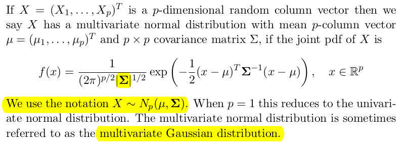
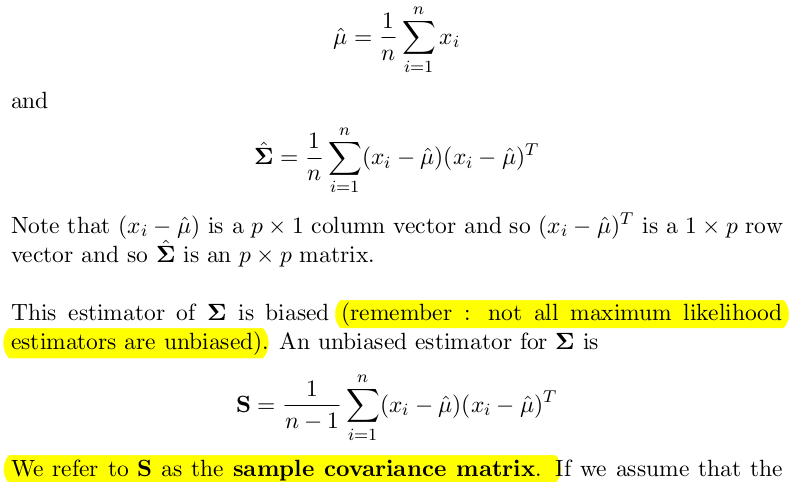
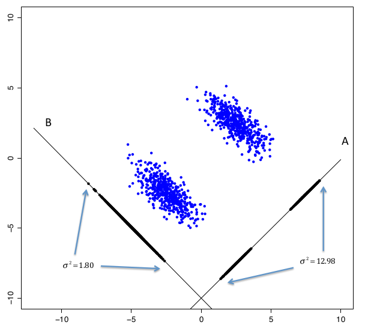
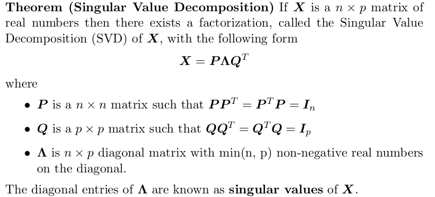
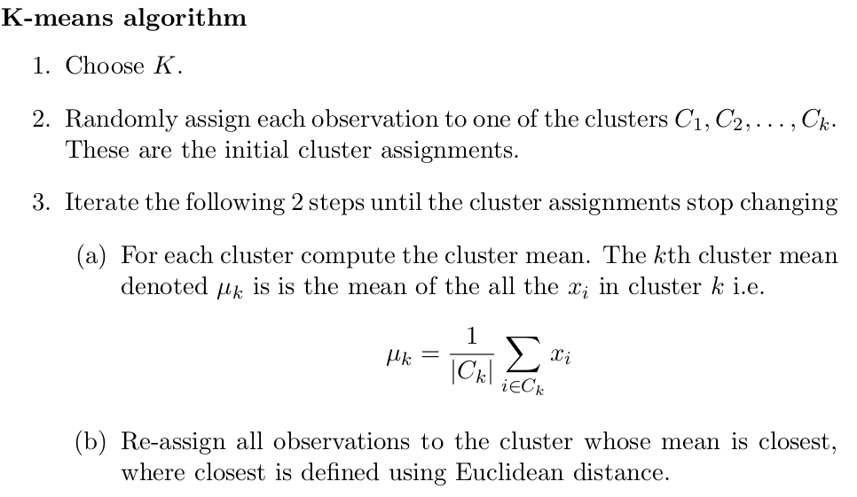
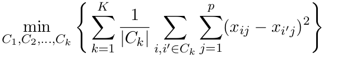
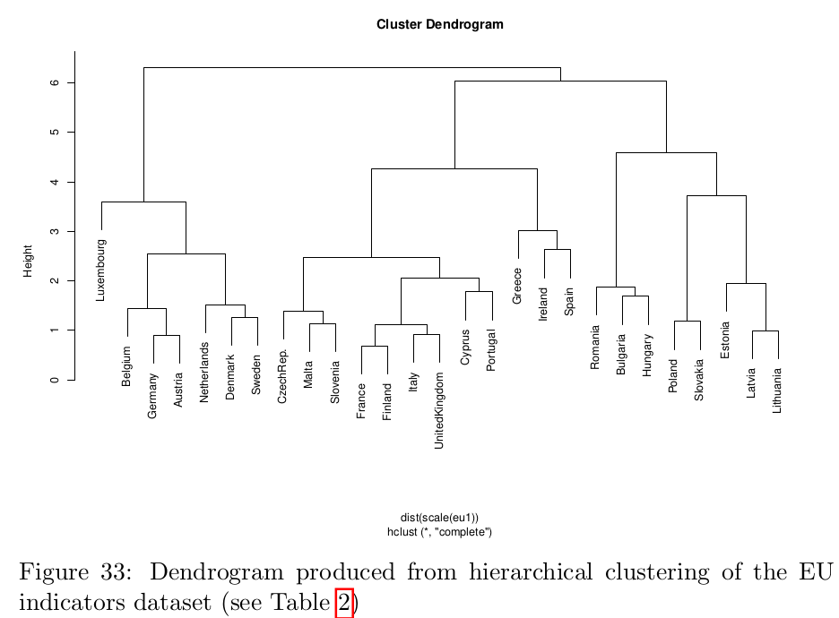

# Buzzwords

random sample = iid = independent and identically distributed

sum of normal distributions is normal

sum of jointly normal distributions is normal

$var(aX + b) = a^{2}var(X)$

unbiased estimator (sample variance) divides by $n-1$ to have unbiased estimator of the TRUE variance

MLE = maximum likelihod estimator 

likelihood function $L(\theta|x_1.. x_n)$

If you parametrize $p = \dfrac{1}{\theta}$ in Geometric distribution and find MLE for $\theta$ you will have unbiased MLE! The MLE for $p$ is not unbiased (its overestimating)

# Introduction. Random samples. Summary Statistics, MLE

Probability: in probability we start with a probability model $P$, and we deduce properties of $P$.

E.g. Imagine flipping a coin 5 times. Assuming that flips are fair and independent, what is the probability of getting 2 heads?

Statistics: in statistics we have data, which we regard as having been generated from some unknown probability model $P$. We want to be able to say some useful things about $P$.

**Definition.** A random sample of size $n$ is a set of random variables $X_1 , . . . , X_n$ which are independent and identically distributed (i.i.d.).

often you will compute the joint pmf of $X_1,...,X_n$. This joint pmf gives you the probability you observe the sample data $x_1,...,x_n$,

In probability we assume that parameters $λ$ and $µ$ in our two examples are known. In statistics we wish to estimate $λ$ and $µ$ from data.
- What is the best way to estimate them? And what does “best” mean?
- For a given method, how precise is the estimation?

**Sample mean** and **Sample variance**, **sample standard deviation**

Denominator in sample variance is $n-1$, so that the sample variance will be what is called an **unbiased** estimator of the population variance. If we divide by $n$ our sample variance would be underestimating the TRUE variance on average. **We need to divide by the degrees of freedom, not the number of samples!** [stack](https://stats.stackexchange.com/questions/406327/degrees-of-freedom-in-sample-variance)
_
Given observations $x_1,...,x_n$ we can compute the observed values $x$ and $s^2$ .

We use sample mean, variance, standard deviation to estimate the TRUE unknown mean, variance, standard deviation.

**MLE = Maximum Likelihood Estimation**
Maximum likelihood estimation is a general method for estimating unknown parameters from data.

**Definition.** Let $X_1,...,X_n$ have joint p.d.f./p.m.$f(x; θ)$. Given observed values $x_1,...,x_n$ of the **likelihood** of $θ$ is the function:
$L(θ) = f (x; θ)$

$L(\theta)$ is the joint pmf, pdf of the observed data and is regarded as a function of $\theta$ for fixed **$x$**.

Definition. The maximum likelihood estimate (MLE) is the value $\hat{\theta}$ that maximizes the likelihood $L(\theta)$ (or log-likelihood).

The idea of maximum likelihood is to estimate the parameter $\theta$ that gives the greates likelihood to the obsrvations $x_1,...,x_n$.

Estimator:
- A rule for constructing an estimate.
- A function of the random variables $X$ involved in the random sample.
- Itself a random variable.
Estimate:
- The numerical value of the estimator for the particular data set.
- The value of the function evaluated at the data $x_1,...,x_n$.

# Parameter estimation

**Definition.** A **statistic** is any function $T(X)$ of $X_1,...,X_n$ that does not depend on $\theta$.

**Definition.** An **estimator** of $θ$ is any statistic $T(X)$ that we might use to estimate $θ$.

**Definition.** $T(x)$ is the **estimate** of $θ$ obtained via $T$ from observed values $x$.

We can choose between estimators by studying their properties. A good estimator should take values close to the TRUE parameter $θ$.

**Definition.** An estimator $T=T(X)$ is **unbiased** for $\theta$ if $E(T) = \theta$. This means that “on average” $T$ is correct.

**Definition.** The mean squared error (MSE) of an estimator $T$ is defined by $MSE(T) = E[(T − θ)^2].$

**Definition.** The bias $b(T)$ of $T$ is defined by $b(T) = E(T) − θ$.

MSE is a measure of the **“distance”** between $T$ and the true parameter $θ$

However $MSE(T)$ and $b(T)$ may depend on $\theta$.

Note $MSE(T) = var(T) + b(T)^2$ (bias variance trade-off)

So an estimator with small MSE needs to have small variance and small bias.

MLEs are usually asymptotically unbiased, and have MSE decreasing like $1/n$ for large $n$.

**USE MSE(T)** to compare different estimators for $\theta$.

# Accuracy of estimation: Confidence Intervals

A crucial aspect of statistics is not just to estimate a quantity of interest, but to assess how accurate or precise that estimate is. One approach is to find an interval, called a confidence interval (CI) within which we think the true parameter falls.

**Definition.** If $a(X)$ and $b(X)$ are two statistics, and $0 < α < 1$, the interval $(a(X), b(X))$ is called a confidence interval for $θ$ with confidence level $1 − α$ if, for all $θ$:

$P(a(X) < θ < b(X)) = 1 − α$

The interval $(a(x), b(x))$ is called an interval estimate and the random interval $(a(X), b(X))$ is called an interval estimator.

Note: $a(X)$ and $b(X)$ do **not** depend on $θ$.

We want small intervals and $P(a(X) < \theta < b(X))$ to be large.

By the same argument as before, if $X_1 , . . . , X_n ∼ N(µ, σ_{0}^{2})$ with $σ_{0}^{2}$ known, then a level $1 − α$ confidence interval for $µ$ is

$(\bar{X}-\dfrac{z_{\alpha/2} \sigma_{0}}{\sqrt{n}}, \bar{X}+\dfrac{z_{\alpha/2} \sigma_{0}}{\sqrt{n}})$

The more data I have the smaller interval I get!

if variance is unknown use **SAMPLE VARIANCE** (division by $n-1$).

**Interpretation of a Confidence Interval**

- The parameter $\theta$ is fixed but unknown.
- If we imagine repeating our experiment then we’d get new data, **$x'$**
say, and hence we’d get a new confidence interval $a(x'), b(x')$. If we did this repeatedly we would “catch” the true parameter value about $95\%$ of the time, for a $95\%$ confidence interval: i.e. about 95% of our intervals would contain $θ$.
- The confidence level is a coverage probability, the probability that the random confidence interval $a(X), b(X)$ covers the true θ. (It’s a random interval because the endpoints $a(X), b(X)$ are random variables.)

You always get confidence interval estimates. You cannot say $(523,3313)$ is 95\% confidence interval. It either does or does not contain the TRUE parameter $\theta$. You cant say which as $\theta$ is unknown.

**Confidence Intervals using the CLT**

(estimate ± 2 estimated std errors)is an approximate 95% CI
(estimate ± 3 estimated std errors)is an approximate 99.8% CI.

**Example.** Estimating the TRUE variance and stadard deviation of the sample population.

- Let $X_1,...,X_n ∼ N(\mu, \sigma^{2})$ be iid. Then $\hat{\mu} = \bar{X}$ and estimate of the variance is $var(\hat{mu}) = \dfrac{\sigma^{2}}{n}$ and standard deviation $SE(\hat{\mu}) = \dfrac{\sigma}{\sqrt(n)}$

The variance and SE of an estimator $\hat{\mu}$ might themself depend on anothe paramater. We need to plug in $\hat{\sigma}$ with the Maximum likelihood estimator (divides by $n$) or other estimate (sample variance divides by $n-1$ and is **unbiased**).

**Given a radnom normally distributerd sample, when constructing  a confidence interval you should use the sample variance. If you use the MLE to estimate the $\sigma$ you will underestimate the variance and your CI would be shrinked**

$\hat{\mu} \pm z_{\alpha/2}\dfrac{\hat{\sigma}}{\sqrt{n}}$

# Linear Regression

Suppose we measure two variables in the same population:
- $x$: the **explanatory variable, predictor, feature, input**
- $y$: the **response variable, output**

A linear regression model for the dependence of $y$ on $x$ is:

$y_{i} = \alpha + \beta x_{i} + \epsilon_{i}$

where:
- $x_1,...,x_n, y_1...,y_n$ are known constants (data points)
- $\epsilon_1,..., \epsilon_{n}$ are i.i.d. $N(0,\sigma^{2})$ "random errors"
- $α, β$ are unknown parameters.
The “random errors” represent random scatter of the points $(x_i, y_i)$ about the line $y = α + βx$, we do not expect these points to lie on a perfect straight line.

**Note: a linear relationship like this does not necessarily imply that $x$ causes $y$.**

**Goal: estimate $\alpha$ and $\beta$**

$Y_i ~ N(\alpha+\beta x_i,\sigma^{2})$

Maximize the likelihood $L(\alpha,\beta|x_i,y_i)$. Same as minimizing the square error $S(\alpha,\beta) = \sum_{i=1}^{n}(y_i-\alpha-\beta x_i)^2$!

Vectorized linear regression problem: Estimate $\beta$ for $\bf{y} = \bf{X}\beta + \epsilon$ (intercept is included as a col of ones)

Vectorized solution $\hat{\beta} = (X^{T}X)^{-1}X^{T}y$ it is an unbiased estimator!

95\% CI for the true parameter $\beta$ is $(\hat{\beta} \pm 1.96 SE(\beta))$

The standard deviation of the true parameter $SE(\beta)$ is usually unknown and we need to estimate it.

$var(\beta) = X^{T}X var(y) = X^{T}X \sigma^{2}$

You can use the The MLE: $\hat{\sigma}^{2} = \dfrac{1}{n}\sum(y_i-x_i\beta)$ to get 95\% CI: $(\hat{\beta} \pm z_{\alpha/2}SE(\beta))$ 

A better approach is to estimate $\sigma^{2}$ using $\dfrac{1}{n-p-1}\sum(y_i-x_i\beta)$ because this is an unbiased estimator (on average you are correct) and to base the confidence interval on a chi square-distribution rather than a normal distribution. (t-distribution in univariate case $x_i$ is one dimensional and p = 1, division by $n-2$ in this case)

[example](https://stats.stackexchange.com/questions/29981/should-confidence-intervals-for-linear-regression-coefficients-be-based-on-the-n)

# Assessing model fit

Having fitted a model = estimated the parameters $\beta$.

Having fitted a model, we should consider how well it fits the data. A model is normally an approximation to reality: is the approximation sufficiently good that the model is useful?

**Definition.** The i-th fitted value is $\hat{y_i} = x_{i}\hat{\beta}$

The i-th residual is $e_{i} = y_{i}-\hat{y_{i}}$

The RSS (residual sum of squares) is $RSS = \sum e_{i}$

The RSE (residual standard error) is $RSE = \sqrt{\dfrac{RSS}{n-p}}$ (this is an estimate of the standard deviation $\sigma$).

**Potential problem: non-linearity**

A **residual plot** is a useful graphical tool for identifying non-linearity: for simple linear regression we can plot the residuals $e_i$ against the fitted values $\hat{y_{i}}$ . Ideally the plot will show no pattern. The existence of a pattern may indicate a problem with some aspect of
the linear model.

**Potential problem: non-constant variance of errors**

Non-constant variance is also called **heteroscedasticity**.
Can see funnel-type shape in the residual plot.

How might we deal with non-constant variance of the errors?
- One possibility is to transform the response Y using a transformation such as $log(Y)$ or $\sqrt{Y}$ (which shrinks larger responses more), leading to a reduction in heteroscedasticity.
- If you know how variances behave for $Y_i$ and think $var(Y_i)=var(\epsilon_i) = \sigma^{2}/w_{i}$ you can take the approach called weighted least squares minimizing $\sum_{i=1}^{n}w_i(y_i-x_i\beta)$

**Potential problem: outliers**

An outlier is a point for which $y_{i}$ is far from the value $\hat{y_i}$ predicted by the model.

If we believe an outlier is due to an error in data collection, then one solution is to simply remove the observation from the data and re-fit the model. However, an outlier may instead indicate a problem with the model, e.g. a nonlinear relationship between $Y$ and $x$, so care must be taken.

studentized residuals = standardized residuals greater than 3 is signal for outlier

**Potential problem: high leverage points**

(Trailstone group interview...)

Outliers are observations for which the response $y_i$ is unusual given the value of $x_i$. 

On the other hand, observations with high leverage have an unusual value of $x_i$ .

**Definition** the leverage of the ith observation is $h_{i}$ where

$h_{i} = \dfrac{1}{n} + \dfrac{(x_i - \bar{x})^{2}}{\sum (x_j-\bar{x})^{2}}

Take-away: Points with high residuals pull the regression line towards them more than points with lower residuals (the more $\hat{y_i}$ are wrong the more the line goes towards them)

Points with unusual value of $x_i$ far from the mean pull ht regression line a lot too. These are called high leverage points.

Why does this matter? We should be concerned if the regression line is heavily affected by just a couple of points, because any problems with these points might invalidate the entire fit. Hence it is important to identify high leverage observations.

# Data Analysis

Linear regression is an example of supervised learning $Y ~ X$.

In unsupervised learning you have only $X$. In this case you want to answer questions:

1. Can we find a way to visualize the data that is informative?
2. Can we compress the dataset without losing any relevant information?
3. Can we find separate subgroups (or clusters) of observations that de-
scribe the structure of the dataset?

Unsupervised learning can be more challenging than supervised learning,
since the goal is more subjective than prediction of a response variable.

Exploratory data analysis is unsupervised learning.

data matrix = design matrix

First step in modelling - EDA

Inter Quartile Range (IQR) - the difference between the 1st and 3rd quartiles. This is a measure of ‘spread’ within the dataset.

Box plot.

Pair plots

3D interactive plots

**Simulation** is a technique for generating pseudo-random values that have a particular distribution.

# The Multivariate Normal Distribution

Given a sample of $n$ observations $N_{p}(\mu,\Sigma)$, the MLE-s are:

# PCA

Principal components analysis (PCA) finds a low-dimensional representation of the data that captures as much of the information in the dataset as possible.

PCA key points:
- each component coming from PCA is a linear combination of the variables
- each components looks for maximum varaibility in the data

**components choose a good way to choose a projection that separates the two clusters**

PCA is maximization problem. Tofind componene $\alpha_{1}$:

$max \alpha_{1}^{T}S\alpha_{1}$ subject to $|\alpha_{1}| = 1$ 

We try to maximize the sample variance of the first component. Solve this using Lagrange Multipliers.

Using vector calculus you will get:
- $\alpha_{1}$ is the eigen vector  with largest eigen value $\lambda_{1} = \alpha_{1}^{T}S\alpha_{1}$

The way PCA algo work is by doing an **eigendecomposition** of the sample variance matrix $S = VDV^{T}$, where $D$ is diagonal matrix with the eighen values and $V$ is orthonormal/orthogonal $VV^{T} = I$ and $V$ has the eigenvectors of $S$

**Plotting**

If we define $Z$ to be an $n × p$ matrix containing the transformed data, such
that $Z_{ij}$ is the value of the $j$th principal component for the $i$th observation

$\bf{Z} = \bf{XV}$

We can then plot the columns of Z against each other to visualize the data as
represented by those pairs of principal components. The matrix Z is known
as the scores matrix.

**Biplots** shows pair of PC-s how they cluster the data. It uses the data projection
on the principal components.

The **total amount of variance** in the original data matrix X is the sum of
the diagonal entries in $S$.

It is common practice to plot the decreasing sequence of eigenvalues to visualize ths structure in the dataset. Such plots are sometimes refered to as **eigenspectrum plots** or **variance scree plots**, and usually they are scaled so each bar is percentage of the total variance.

**Question**

Apply PCA to raw data or to transformed data?

The first principal component maximises the variance of a linear combination of variables. If the variables have very different levels of variability then maximizing the projection with the largest variance may tend to dominate the first principal component.

For this reason, it can sometimes make sense to **standardize** the variables before PCA

This can be achieved by applying PCA to the sample correlation matrix R, rather than the sample covariance matrix S.

It can be shown (see Exercises) that the PCA components derived from using S are not the same as those derived from using R, and knowledge of one of these sets of components does not enable the other set to be derived.

## PCA via SVD

Express design matrix $X$ using SVD and rewrite $S=\dfrac{1}{n-1}X^{T}X$.

You can win on computation time if $n << p$.

Calculating the eigendecomposition of $XX^{T}$ scales like $O(n^3)$ which
is much less than the eigendecomposition of $X^{T}X$ which scales like $O(p^3)$.

## PCA as minimizing reconstruction error

There is another way to derive principal components analysis that uses the
idea that we might try to find the low-dimensional approximation that is as
close as possible to the original data.

**data compression**

# Clustering

PCA provides low dimensional represeantaion of the data and show groupings of observations when visualized. It does not provide **labelling**.

**Clustering** refers to a very broad set of techniques for finding subgroups,
or clusters, in a dataset.

**K-means**

To perform $K$-means clustering we must first decide upon the number of
clusters $K$. The algorithm will assign each observation to excatly one of the
$K$ clusters.

Goals:
- minimize **within** distance between points in same cluster
- maximize distance between observations from different clusters

K-means algo explicitly tackles the first goal by finding a local minimum. Finiding global minimum would require goind through all partitions of $n$ elements in $k$ 
subsets which is factoriel like (Stirling numbers).

The two goals above are actually equivalent [see](https://stats.stackexchange.com/questions/158210/k-means-why-minimizing-wcss-is-maximizing-distance-between-clusters)

K means objective function:

**Multiple starts**

The algorithm does not always give the same solution since the start point is random.

$K = n$ is **overfitting**

**Hierarchical clustering**

Dendrograms can be used to cluster observations into a discrete number of
clusters or groups

Different ways to create a hierarchy. Here we consider **agglomerative** clustering approache.

1. Begin with $n$ observations and a measure of all the $n \choose 2$ pairwise dissimilarities, denoted $d_{ij}$ for $i,j ∈ (1, . . . , n)$. These dissimilarities
can be represented in a lower diagonal matrix, denoted $D^{(n)}$.

2. For $i = n, n - 1, . . . , 2$
- (a) Find the pair of clusters with the smallest dissimilarity. Fuse
these two clusters.
- (b) Compute the new dissimilarity matrix between the new fused cluster and all other $i-1$ remaining clusters and create an updated matrix of dissimilarities $D^{(n−1)}$ .

Distance betwwen two clusters:

**single linkage** = minimum (closest) distance betwwen elements from the two clusters

**complete linkage** = maximum ...

**group average** = $\dfrac{|G1|}{|G2|} \sum \sum d_{ij}$

# Problem Sheets

**Sheet 1**

Q1. Proove that $S^2 = \dfrac{1}{n-1} \sum(X_i - \bar{X})^2$ is unbiased estimator of the TRUE variance $\sigma^{2}$

Q2.
Given data $X_{1} .. X{n}$

i) - $Binomial(r,\theta)$ MLE with known $r$ : $\dfrac{\bar{X}}{r}$

ii) Mle negative binomial (different representaion) $\dfrac{r}{r+\bar{x}}$

iii) $\dfrac{r}{\bar{x}}$

Q3. 

i) $P(MM) = P(MM|I)P(I) + P(MM|NON)P(NON) = \theta\2 + (1-\theta)\4$

ii) $\dfrac{n_1+n_2-n_3}{n_1+n_2+n_3}$

Q4. 

i) mgf to prove normality, $var(aX + b) = a^{2}var(X)$

ii) ..

iii) $\Phi(c) - \Phi(-c)$

Q5. $N(\sum_{i=1}^{n}a_{i}\mu_{i}, \sum_{i=1}^{n}a_{i}^{2}\sigma_{i}^{2})$

Proof $X_{1}+X_{2}$ is normal using moment generating functions

**Sheet 2**

Q1. $\hat{p} = \dfrac{1}{\bar(x)}$

If you parametrize $p = \dfrac{1}{\theta}$ in Geometric distribution and find MLE for $\theta$ you will have unbiased MLE! The MLE for $p$ is not unbiased (its overestimating)

Q2. maximize likelihood

Q3. $\hat{p} = \dfrac{\sum x_i}{\sum v_i]$

Q5.

a) $\dfrac{n}{143.5-nlog(\alpha)}$

b)

i) by definition of distribution - just maximize the likelihood

ii) integrate the pdf from y to inf

iii rewrite the modulus (open it up to use ii) 

**Sheet 3**

Q1. $ (\bar{X}-\dfrac{z_{0.025}}{\sqrt(n)},\bar{X}-\dfrac{z_{-0.025}}{\sqrt(n)})$  $(2\times 1.96)^2$

Q2. 

i) $p(1-p)$

ii) $(\bar{x}\pm z_{0,025}\sqrt{(\hat{p}(1-\hat{p}))}/\sqrt{n})$

iii) (0.48,0.76) neshto takova

Q3. use 95\% CI $(\bar{x}\pm \dfrac{z_{0.025}}{\sqrt{n}} \sigma$

where $\sigma = \sqrt{\hat{theta}}$ using the MLE of Theta (poisson MLE)

Q4.

MLE is $max(X_i)$, then use $P(Max < x) = P(X<x)^n$

Q5.

a) straight

b) mean

c) $L ~ N(\mu,\sigma^2)$, $R ~ N(\mu,\sigma^2)$ but are dependent! Need to compute the bivariate normal distribution.