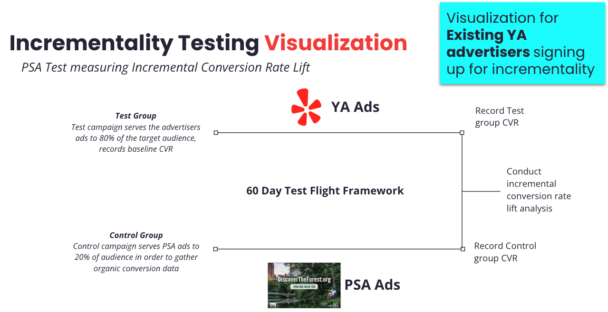
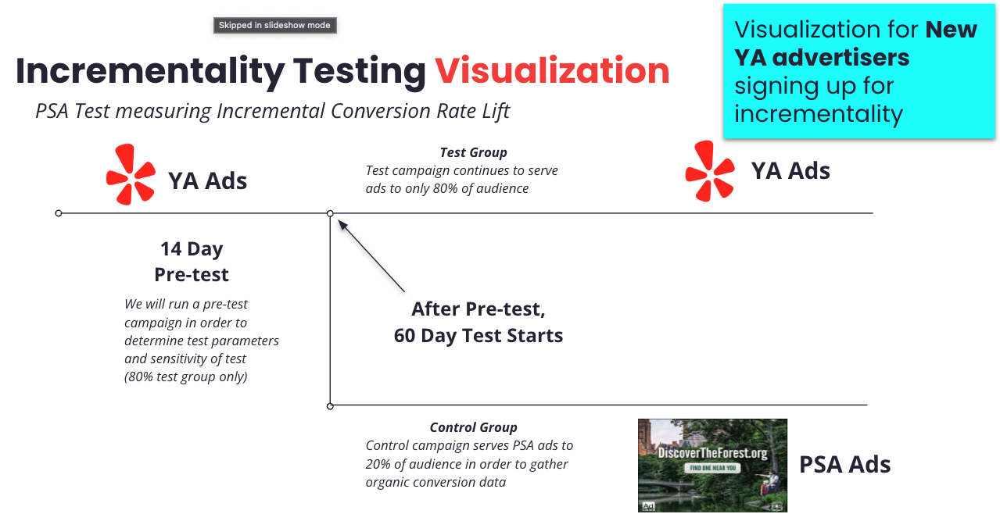

YA (Yelp Audiences) =  Yelp’s new advertising platform. (July 2021)
This is one of Yelp's Ads products and connects advertisers with customers based on Yelp search activity, nomatter where they spend their time online.

Example when you are browsing through BTV, you see google ads, which are recommendations based on the search you made.

YA allows advertisers to show Yelp users ads **off**-Yelp, target based on the users’ **on**-Yelp behavior and interests.

# What is YA?
Yelp Audiences is the only way us and for our  advertisers to target Yelp's high-intent users off-platform and across the web.
For example if you search for Italian food on Yelp you can see ads with Italian restaurants when you browse off Yelp on websites such as the New York Times. In essence, YA is our product to show ads to our users across the whole internet and not only on Yelp.

YA has two main advantages:
- expands the sizes of the targeted users we can show ads to, because we can reach them everywhere in the Internet.
- expands the space of our advertisers. There are some advertisers which need not necessarily have onsite stores who can become our clients. VISA works completely online and is one of our bigger YA clients.

So YA connects advertisers with customers based on their Yelp search activity, no matter where the users spend their time online. The way we connect users and ads on third party website like the New York Times is through TTD.

1. We pitch YA to a client, say Sams club.  Sams club wants to target our users that are interested in groceries, the "grocery audience".
2. Say we are going to charge Sam's club $4 CPM for their campaign. 
3. Our user audience data is synced to the TradeDesk, so they know what users are in the grocery audience and they have the advertising identifiers needed to show them ads.  TTD works with a bunch of other websites that have space to show ads: CNN, ESPN, etc. 
3.  TTD charges Yelp a CPM to use their platform, say $1.  So for every $4 Sam's club gives Yelp, Yelp keeps $3 and passes $1 along to TTD to show the impressions.  
Yelp's value add is that we know what users are interested in groceries.  TTD's value add is that they have all the infra set up to show impressions to these users on a bunch of external websites.

# Revenue growth

Approx. 7M (2020) → 17M (2021) → 31M (2022) -> 50m (2023 target)

43M users targetted in 2022

# How does YA work?

 Yelp Audiences allows brand marketers to reach consumers off of the Yelp platform based on behaviors and purchasing intent displayed on Yelp. We can segment our audience based on things like search terms, category interest and leads. 

**Project history**:
1. Topic: "Inventory" estimation, and impact of IDFA and Cookie changes (don't know what is that)
2. Topic: General YA analysis
    - YA User Engagement and YA Campaign Performance Analysis
    - Exploring YA and Core Ads synergy (TLDR no synergy between the two, two products are orthogonal)
3. Topic: Ongoing Projects that need some level of support
    - YA on Demand
    - YA Incrementality

# How we make money?
- We pitch YA to a client, say Sams club.  Sams club wants to target our users that are interested in groceries, the "grocery audience".
- Sam's club gives Yelp money according to some pay structure we have set up.  Generally this is in terms of "CPM": cost per thousand impressions.  So say we are going to charge Sam's club $4 CPM for their campaign. 
- Our user audience data is synced to the third party: TradeDesk or "TTD", so they know what users are in the grocery audience and they have the advertising identifiers needed to show them ads.  TTD works with a bunch of other websites that have space to show ads: CNN, ESPN, etc. 
- TTD charges Yelp a CPM to use their platform, say $2.  So for every $4 Sam's club gives Yelp, Yelp keeps $2 and passes $2 along to TTD to show the impressions.  Yelp's value add is that we know what users are interested in groceries.  TTD's value add is that they have all the infra set up to show impressions to these users on a bunch of external websites.

# YA performance and user engagement

Goal: Identify levers to improve campaign performance, the right audiences to target, and improve overall YA performance.  (make more money from Ya)

performarnce does not refer to computing performance

With a lookalike targeting approach, it was hypothesized that we could expand the advertiser's audience while also controlling for some relevance. Tradeoff between **relevance** and **reach**

**Key findings**
- Clicks and conversions are front-loaded: most happen on the same day that a user saw their first impression for the YA campaign.
- Impressions are also front-loaded, and most users see only 1 impression for each campaign.  TTD seems to prioritize reaching new users over showing more impressions to already-reached users.
- CTR drops off on each additional impression a users sees after their first for each campaign. We should prioritize reach over repeated impressions if optimizing CTR or CPA is the goal, but this limits inventory.  
- Yelp power users get served more YA impressions but are less likely to click and click-through-convert after seeing an impression.  
- Among less frequent users, users with any Yelp connection are more likely to convert on YA.
- Mobile users convert better than WWW users.

**Key Metric**: Impression to Conversion Rate (ICR)
- Defined to be YA conversions / YA impressions
- Can be defined at the user or campaign level
- The primary goal of a campaign is usually conversions and we get charged to show each impression, so ICR makes sense to try to optimize.  (It’s generally inversely proportional to CPA)

# POC - User Engagement Score

**Idea**: Implement something similar to the pCTR (predicted CTR) model but simpler.  Predict the ICR for each guv, select the top guvs based on this prediction.  Add only the “top N” guvs to a given audience.  

**Impact**: This would allow us to make this trade-off: Estimated performance boost of up to +X% impression-to-conversion rate (CPA) if we’re willing to cut the audience size by a factor of Y%.

**Features (predictors) ideas:**
- Overall Yelp usage: pages viewed, searches done.
- High level user category metrics (ie. services dominant vs RFN dominant).
- The user’s primary platform.
- Is the user logged in or logged out.
- On-Yelp conversion rate, or even just “do they have any on-Yelp conversion”
- For measuring engagement for a specific audience/category: the user’s “intent share” in the relevant category, as measured by counting up their intent actions for the category and normalizing by their total intent actions.

# YA on Demand

This is a tool which returns custom user audiences so that they can be targeted off-Yelp through Yelp Audiences. Renders a query agoinst our redshift datastores, filters studd and returns data.

# YA Incrementality

Incrementality is the lift or increase in a desired outcome (visits in this case) provided by a media investment.

Incrementality (Lift) = Exposed group visit rate  /  Control group visit rate

**Business Problem + Sizing**

YA clients want irrefutable evidence that YA adds value to the consumer journey and are not just coincidental, especially when conversions are dominantly view-through-conversion. The goal of offering incrementality tests is to demonstrate that YA campaigns add value to advertisers by showing a stats-sig conversion lift of the test group(exposed to YA ads) from the control group(not exposed to YA ads). We estimate that the incrementality test can potentially unlock $500K ARR opportunities.

It is a **defensive product** for when our clients want to leave us from YA.

The goal of our YA Incrementality Test is to show a statistically-significant conversion lift between a test group and a control group.

**Current concerns:**
- p-value is always stattistcally significant for all campaigns
- PSA conversions (control group) are too low and it looks like all onversions are incremental...
    - run power analysis only once we have enough conversions
    - have more impression in the control group

# Yelp Audiences Adjustment Factor Project

This is my first project.

TTD gives us inflated forecasted number of impressions. 

# YA Enhancing Reports Project

# **TL;DR**
1. There is a directional signal (but not stat-sig) that higher engaged users on-Yelp have higher CTR off-Yelp in YA.
2. We observe weekly seasonality in the number of targeted users and view-through conversions.
3. Before the Christmas holiday period in Dec 2022, we serve more impressions and get more clicks than after-holiday period in Jan 2023.
4. Mobile users have higher CTR than web users on YA.
5. Females have higher CTR than males on YA.
6. YA CTR across states does not vary.

**Implications:**

1. Higher engaged users have higher CTR, which suggests that engagement may be a key driver of click-through behavior.
2. There may be certain days of the week when user behavior is more predictable, and these patterns may affect ad view-through performance. Fourier time-based features can ne useful factors of view-through behavior.
3. The holiday season is a peak period for the business, and the audience's interests and behavior shift after the holiday period, resulting in a decrease in impressions and clicks.
4. The user experience and design of your app on mobile devices may be more optimized for click-through behavior than on the web.
6. Most clients in YA are online businesses and are not location dependent.

# YA Inventory

When do you need YA inventory?

Sellers request YA inventory + audience size when preparing for a sales pitch. 

CS/SA owns pulling inventory. Consumer success and solution analysts.

Pull inventory through TTD.

The inventory will inform reps of how many impressions & spend is available for a specific audience and region. 

# Questions

Metrics?