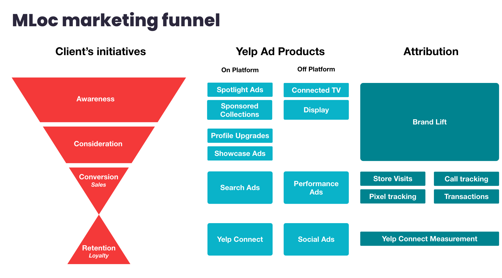

How does Yelp make money?

- lets other businesses put ads on their website
- gives review data to businesses and helps them make a better marketing strategy

[10 Online Marketing Metrics](https://medium.com/swlh/10-online-marketing-metrics-you-need-to-be-measuring-5d9202a8d53e)

- total visits (to any part of your website, e.g. landing page for a pay-per-click campaign)
- new sessions (how many new and recurring users you have)
- channel-specific traffic, traffic based on their point of origin
 - direct (visited site firectly)
 - referrals (include external links from other sites)
 - organic (visited after a search)
 - Bounce rate: shows you what percentage of visitors leave your website before further exploring your website
 - total conversions
 - leads to close ratio (a "lead" is a contact already determined to be a prospective customer)
 - customer retention rate
 - customer value (to find your average customer value, you have to take into account all sales the average customer will initiate over the course of your relationship)
 - cost per lead (to calculate your cost per lead, take a look at the average monthly cost of your chosen campaign and compare it to the total number of leads you generated with that specific channel over the same period)
 - Projected Return on Investment

For example, if you pay $50 per lead and close 50 percent of your leads, you’ll pay $100 for each successful new customer. If your average customer value is more than $100 in this example, you’ve generated a profit and your marketing campaign can be considered a success.For example, if you pay $50 per lead and close 50 percent of your leads, you’ll pay $100 for each successful new customer. If your average customer value is more than $100 in this example, you’ve generated a profit and your marketing campaign can be 

# MLoc welcome deck

Yelp's biggest asset are "Consumers with high 

Yelp clients:
- consumers (app users)
- businesses (local and multi-local biz)

Yelp audiences is one of the current Yelp Ad Products.

The funnel is the consumer experience (users)

Yelp for businesses has 3 ingredients for success:
- reporting
- attribution (what money each marketing campaign made me money, connecting the dots between our ads and conversions, ROI measurement)
    - YSV (Yelp store visit) is able to measure the number of times user visit a client locations attributable to Yelp ads
- acquisition (making it easier to purchase and advertise on Yelp)